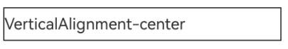

# Drawing and Displaying Complex Text (C/C++)
<!--Kit: ArkGraphics 2D-->
<!--Subsystem: Graphics-->
<!--Owner: @oh_wangxk; @gmiao522; @Lem0nC-->
<!--Designer: @liumingxiang-->
<!--Tester: @yhl0101-->
<!--Adviser: @ge-yafang-->
When drawing text, you can select a proper font, size, and color to draw and display simple text. In addition, you can set other styles, languages, and paragraphs to draw complex text.

Complex text drawing involves the following scenarios:

- Multi-language text drawing and display

- Multi-line text drawing and display

- Diversified text drawing and display

- Copying, Drawing, and Displaying Styles


## Multi-language text drawing and display

Multi-language support is the basis for global applications. Multi-language text drawing needs to support character sets of different languages and their unique display requirements, for example, right-to-left languages (for example, Arabic) or vertical text (for example, Chinese). You need to understand the rendering features of different languages to ensure that the text is correctly displayed.

In the scenario where multi-language text is used, the **locale** field in the TextStyle text style is specified to implement the function. The value of the locale field can be used to preferentially match the corresponding font, and the process of traversing the list to match the font is skipped. In this way, the matching time and memory usage are reduced.

### Available APIs

| API Definition| Description| 
| -------- | -------- |
| void OH_Drawing_SetTypographyTextLocale(OH_Drawing_TypographyStyle\* style, const char\* locale) | Sets the locale for a typography style.| 


### How to Develop

For details about the canvas object, see [Obtaining the Canvas and Displaying the Drawing Result] (canvas-get-result-draw-c.md).

```c++
// Create a TypographyStyle, which is required when creating a TypographyCreate.
OH_Drawing_TypographyStyle *typoStyle = OH_Drawing_CreateTypographyStyle();
// Set the text alignment mode to center.
OH_Drawing_SetTypographyTextAlign(typoStyle, TEXT_ALIGN_CENTER);
// Set locale to Chinese. 
OH_Drawing_SetTypographyTextLocale(typoStyle, "zh-Hans");  

// Set the text color, size, and weight. If TextStyle is not set, the default TextStyle in TypographyStyle is used.
OH_Drawing_TextStyle *txtStyle = OH_Drawing_CreateTextStyle();
OH_Drawing_SetTextStyleColor(txtStyle, OH_Drawing_ColorSetArgb(0xFF, 0x00, 0x00, 0x00));
OH_Drawing_SetTextStyleFontSize(txtStyle, 100);
OH_Drawing_SetTextStyleFontWeight(txtStyle, FONT_WEIGHT_400);

// Create a FontCollection object. FontCollection is used to manage the font matching logic.
OH_Drawing_FontCollection *fc = OH_Drawing_CreateSharedFontCollection();
// Use FontCollection and TypographyStyle to create TypographyCreate. TypographyCreate is used to create Typography.
OH_Drawing_TypographyCreate *handler = OH_Drawing_CreateTypographyHandler(typoStyle, fc);

// Add the created TextStyle to the handler.
OH_Drawing_TypographyHandlerPushTextStyle(handler, txtStyle);
// Set the text content and add the text to the handler.
const char *text = "Hello, Chinese\n";
OH_Drawing_TypographyHandlerAddText(handler, text);  

// Use the handler to create Typography.
OH_Drawing_Typography *typography = OH_Drawing_CreateTypography(handler);
// Set the layout width.
double layoutWidth = 1310;
OH_Drawing_TypographyLayout(typography, layoutWidth);
// Set the start position for drawing the text on the canvas.
double position[2] = {0, 1140};
// Draw the text on the canvas.
OH_Drawing_TypographyPaint(typography, canvas, position[0], position[1]);

// Release the memory.
OH_Drawing_DestroyTypographyStyle(typoStyle);
OH_Drawing_DestroyTextStyle(txtStyle);
OH_Drawing_DestroyFontCollection(fc);
OH_Drawing_DestroyTypographyHandler(handler);
OH_Drawing_DestroyTypography(typography);
```


### Effect


## Multi-line text drawing and display

Multi-line text is more complex than single-line text. For multi-line text, you need to set the text typesetting, word break policy, text alignment mode, and maximum number of lines by setting the paragraph style.


### Available APIs

| API Definition| Description| 
| -------- | -------- |
| void OH_Drawing_SetTypographyTextAlign(OH_Drawing_TypographyStyle\* style, int align) | Sets the text alignment mode.| 
| void OH_Drawing_SetTypographyTextWordBreakType(OH_Drawing_TypographyStyle\* style, int wordBreakType) | Sets the word break type.| 
| void OH_Drawing_SetTypographyTextMaxLines(OH_Drawing_TypographyStyle\* style, int lineNumber) | Sets the maximum number of lines in the text.| 


### How to Develop

```c++
// Set the typesetting width.
double layoutWidth = 800;
// Create a FontCollection. The FontCollection is used to manage the font matching logic.
OH_Drawing_FontCollection *fc = OH_Drawing_CreateSharedFontCollection();

// Set the text color, size, and weight. If TextStyle is not set, the default TextStyle in TypographyStyle is used.
OH_Drawing_TextStyle *txtStyle = OH_Drawing_CreateTextStyle();
OH_Drawing_SetTextStyleColor(txtStyle, OH_Drawing_ColorSetArgb(0xFF, 0x00, 0x00, 0x00));
OH_Drawing_SetTextStyleFontSize(txtStyle, 50);
OH_Drawing_SetTextStyleFontWeight(txtStyle, FONT_WEIGHT_400);
// When the word break strategy is WORD_BREAK_TYPE_BREAK_HYPHEN, you need to set the language preference for the paragraph. The paragraph will be displayed with different word break effects in different language preferences.
// OH_Drawing_SetTextStyleLocale(txtStyle, "en-gb");

// Set the text content.
const char *text =
    "Nunc quis augue viverra, venenatis arcu eu, gravida odio. Integer posuere nisi quis ex pretium, a dapibus "
    "nisl gravida. Mauris lacinia accumsan enim, non tempus ligula. Mauris iaculis dui eu nisi tristique, in porta "
    "urna varius. Orci varius natoque penatibus et magnis dis parturient montes, nascetur ridiculus mus. Mauris "
    "congue nibh mi, vel ultrices ex volutpat et. Aliquam consectetur odio in libero tristique, a mattis ex "
    "mollis. Praesent et nisl iaculis, facilisis metus nec, faucibus lacus. Duis nec dolor at nibh eleifend "
    "tempus. Nunc et enim interdum, commodo eros ac, pretium sapien. Pellentesque laoreet orci a nunc pharetra "
    "pharetra.";


// Create a TypographyStyle object with the word break strategy set to BREAK_ALL.
OH_Drawing_TypographyStyle *typoStyle = OH_Drawing_CreateTypographyStyle();
// Set the text alignment mode to center.
OH_Drawing_SetTypographyTextAlign(typoStyle, TEXT_ALIGN_CENTER);
// Set the word break strategy to WORD_BREAK_TYPE_BREAK_ALL.
OH_Drawing_SetTypographyTextWordBreakType(typoStyle, WORD_BREAK_TYPE_BREAK_ALL);
// Set the maximum number of lines to 10. If the number of lines exceeds 10, the excess lines are not displayed.
OH_Drawing_SetTypographyTextMaxLines(typoStyle, 10);

// Use the created FontCollection and TypographyStyle objects to create a TypographyCreate object. The TypographyCreate object is used to create a Typography object.
OH_Drawing_TypographyCreate *handler = OH_Drawing_CreateTypographyHandler(typoStyle, fc);
// Add the created TextStyle object to the handler.
OH_Drawing_TypographyHandlerPushTextStyle(handler, txtStyle);
// Add the text to the handler.
OH_Drawing_TypographyHandlerAddText(handler, text);

OH_Drawing_Typography *typography = OH_Drawing_CreateTypography(handler);
OH_Drawing_TypographyLayout(typography, layoutWidth);
// Set the start position for drawing the text on the canvas.
double positionBreakAll[2] = {0, 0};
// Draw the text on the canvas.
OH_Drawing_TypographyPaint(typography, canvas, positionBreakAll[0], positionBreakAll[1]);

// Create a TypographyStyle object with the word break strategy set to BREAK_WORD.
// OH_Drawing_TypographyStyle *typoStyle = OH_Drawing_CreateTypographyStyle();
// OH_Drawing_SetTypographyTextAlign(typoStyle, TEXT_ALIGN_CENTER);
// OH_Drawing_SetTypographyTextWordBreakType(typoStyle, WORD_BREAK_TYPE_BREAK_WORD);
// OH_Drawing_TypographyCreate *handler = OH_Drawing_CreateTypographyHandler(typoStyle, fc);
// OH_Drawing_TypographyHandlerPushTextStyle(handler, txtStyle);
// OH_Drawing_TypographyHandlerAddText(handler, text);
// OH_Drawing_Typography *typography = OH_Drawing_CreateTypography(handler);
// OH_Drawing_TypographyLayout(typography, layoutWidth);
// double positionBreakWord[2] = {0, 100};
// OH_Drawing_TypographyPaint(typography, canvas, positionBreakWord[0], positionBreakWord[1]);

// Create a TypographyStyle object with the word break strategy set to BREAK_HYPHEN.
// OH_Drawing_TypographyStyle *typoStyle = OH_Drawing_CreateTypographyStyle();
// OH_Drawing_SetTypographyTextStyle(typoStyle, txtStyle);
// OH_Drawing_SetTypographyTextAlign(typoStyle, TEXT_ALIGN_LEFT);
// OH_Drawing_SetTypographyTextWordBreakType(typoStyle, WORD_BREAK_TYPE_BREAK_HYPHEN);
// OH_Drawing_TypographyCreate *handler = OH_Drawing_CreateTypographyHandler(typoStyle, fc);
// OH_Drawing_TypographyHandlerPushTextStyle(handler, txtStyle);
// OH_Drawing_TypographyHandlerAddText(handler, text);
// OH_Drawing_Typography *typography = OH_Drawing_CreateTypography(handler);
// OH_Drawing_TypographyLayout(typography, layoutWidth);
// double positionBreakWord[2] = {0, 100};
// OH_Drawing_TypographyPaint(typography, canvas, positionBreakWord[0], positionBreakWord[1]);

// Release the memory.
OH_Drawing_DestroyFontCollection(fc);
OH_Drawing_DestroyTextStyle(txtStyle);
OH_Drawing_DestroyTypographyStyle(typoStyle);
OH_Drawing_DestroyTypographyHandler(handler);
OH_Drawing_DestroyTypography(typography);
```


### Effect

| BREAK_ALL | BREAK_WORD | 
| -------- | -------- |
|  |  | 

| BREAK_HYPHEN (locale: not set)| BREAK_HYPHEN(locale: en-gb)| BREAK_HYPHEN(locale: en-us)| 
| -------- | -------- |-------- |
|  |  |  |

## Multi-style Text Drawing and Display

In addition to basic text and typesetting attributes, developers may need to set different drawing styles or capabilities for different text designs in applications to highlight the unique performance or style of the corresponding text. In this case, you can use multiple drawing styles to render text.

Currently, the following multi-style drawing and drawing styles are supported:

- **Decoration line style drawing**: Texts are decorated by using different line styles, making the texts more prominent and expressive.

- **Font feature drawing**: The appearance of the text is changed by changing the font, including the thickness and italic features, to enhance the readability and aesthetics of the text.

- **Variable font drawing**: Provides the capability of flexibly adjusting the text on different display environments and devices to meet more refined visual effects.

- **Text shadow drawing**: Shadows are added around the text to improve the layering and three-dimensionality of the text, making the text more attractive.

- **Placeholder drawing**: You can use this feature to keep the text layout stable when the text content is not determined, so that the text display is smoother and more natural.

- **Automatic spacing drawing**: You can use this feature to automatically add extra spacing in some character layout switching places to improve the reading experience.

- **Gradient drawing**: You can use this feature to provide gradient color effects for text to enhance the text expressiveness.

- **Vertical alignment**: You can use this feature to adjust the vertical layout position of text to improve the layout quality.

- **Superscript and subscript**: You can use this feature to process any character into a superscript or subscript to more accurately express the meaning of the text.

- **High-contrast text drawing**: You can use this feature to enhance the contrast effect of text by changing the color of dark text to black and light text to white.

- **Line height adjustment**: The vertical spacing between text lines can be changed to make the line spacing looser or tighter, significantly improving the vertical truncation problem of text and improving readability.

- **Line spacing adjustment**: The effect of adjusting the line height can be achieved by adjusting the line spacing, optimizing the reading experience.

### Decoration Line

**Decoration line** refers to the decorative lines added above, below, or in the middle of the text. Currently, the overline, underline, and strikethrough are supported.

You can add text decoration lines to improve the visual effect and readability of text.

To use a decoration line, you need to initialize the decoration line style object and add it to the text style so that the decoration line takes effect during text drawing.


| API Definition| Description| 
| -------- | -------- |
| void OH_Drawing_SetTextStyleDecoration(OH_Drawing_TextStyle\* style, int decoration) | Sets the decoration line type in a specified text style. Only one decoration line type can be set. If multiple decoration line types need to be set, use OH_Drawing_AddTextStyleDecoration.| 
| void OH_Drawing_SetTextStyleDecorationStyle(OH_Drawing_TextStyle\* style, int decorationStyle) | Sets the decoration style for a text style.| 
| void OH_Drawing_SetTextStyleDecorationColor(OH_Drawing_TextStyle\* style, uint32_t color) | Sets the decoration color for a text style.| 


The following shows an example and the effect:

```c++
// Create a TypographyStyle object. The object is required for creating Typography.
OH_Drawing_TypographyStyle *typoStyle = OH_Drawing_CreateTypographyStyle();
// Set the text alignment mode to center.
OH_Drawing_SetTypographyTextAlign(typoStyle, TEXT_ALIGN_CENTER);
// Set the text content.
const char *text = "Hello World Drawing\n";

// Set the text color, size, and weight. If TextStyle is not set, the default TextStyle in TypographyStyle is used.
OH_Drawing_TextStyle *txtStyleWithDeco = OH_Drawing_CreateTextStyle();
OH_Drawing_SetTextStyleColor(txtStyleWithDeco, OH_Drawing_ColorSetArgb(0xFF, 0x00, 0x00, 0x00));
OH_Drawing_SetTextStyleFontSize(txtStyleWithDeco, 100);
OH_Drawing_SetTextStyleFontWeight(txtStyleWithDeco, FONT_WEIGHT_400);
// Set the decoration line to LINE_THROUGH.
OH_Drawing_SetTextStyleDecoration(txtStyleWithDeco, TEXT_DECORATION_LINE_THROUGH);
// Set the decoration line style to WAVY.
OH_Drawing_SetTextStyleDecorationStyle(txtStyleWithDeco, TEXT_DECORATION_STYLE_WAVY);
// Set the decoration line color.
OH_Drawing_SetTextStyleDecorationColor(txtStyleWithDeco, OH_Drawing_ColorSetArgb(0xFF, 0x6F, 0xFF, 0xFF));

// Create a TextStyle without a decoration line for comparison.
OH_Drawing_TextStyle *txtStyleNoDeco = OH_Drawing_CreateTextStyle();
// Set the text color, size, and weight. If TextStyle is not set, the default TextStyle in TypographyStyle is used.
OH_Drawing_SetTextStyleColor(txtStyleNoDeco, OH_Drawing_ColorSetArgb(0xFF, 0x00, 0x00, 0x00));
OH_Drawing_SetTextStyleFontSize(txtStyleNoDeco, 100);
OH_Drawing_SetTextStyleFontWeight(txtStyleNoDeco, FONT_WEIGHT_400);

// Create a FontCollection object to manage the font matching logic.
OH_Drawing_FontCollection *fc = OH_Drawing_CreateSharedFontCollection();
// Use FontCollection and TypographyStyle to create TypographyCreate. TypographyCreate is used to create Typography.
OH_Drawing_TypographyCreate *handler = OH_Drawing_CreateTypographyHandler(typoStyle, fc);

// Add a text style with a decoration line.
OH_Drawing_TypographyHandlerPushTextStyle(handler, txtStyleWithDeco);
// Add the text to the handler.
OH_Drawing_TypographyHandlerAddText(handler, text);

// Add a text style without a decoration line.
OH_Drawing_TypographyHandlerPushTextStyle(handler, txtStyleNoDeco);
// Add the text to the handler.
OH_Drawing_TypographyHandlerAddText(handler, text);

OH_Drawing_Typography *typography = OH_Drawing_CreateTypography(handler);
// Set the layout width.
double layoutWidth = 1310;
OH_Drawing_TypographyLayout(typography, layoutWidth);
// Set the start position for drawing the text on the canvas.
double position[2] = {0, 1140};
// Draw the text on the canvas.
OH_Drawing_TypographyPaint(typography, canvas, position[0], position[1]);

// Release the memory.
OH_Drawing_DestroyTypographyStyle(typoStyle);
OH_Drawing_DestroyTextStyle(txtStyleWithDeco);
OH_Drawing_DestroyTextStyle(txtStyleNoDeco);
OH_Drawing_DestroyFontCollection(fc);
OH_Drawing_DestroyTypographyHandler(handler);
OH_Drawing_DestroyTypography(typography);
```


### Font Features

**Font features** are used to process font features (such as bold, italic, and font variants) during text rendering. Font features enable fonts to display different effects in different typesetting scenarios, enhancing the expressiveness of text and making it more suitable for design and reading.

Common **font features** include liga, frac, and case, which require the corresponding TTF files to be supported.


| API Definition| Description| 
| -------- | -------- |
| void OH_Drawing_TextStyleAddFontFeature(OH_Drawing_TextStyle\* style, const char\* tag, int value) | Adds a font feature for a text style.| 


The following shows an example and the effect:


```c++
// Create a TypographyStyle, which is required when creating a TypographyCreate.
OH_Drawing_TypographyStyle *typoStyle = OH_Drawing_CreateTypographyStyle();
// Set the text alignment mode to center.
OH_Drawing_SetTypographyTextAlign(typoStyle, TEXT_ALIGN_CENTER);
// Set the text content.
const char *text = "1/2 1/3 1/4\n";

// Set the text color, size, and weight. If TextStyle is not set, the text cannot be drawn.
OH_Drawing_TextStyle *txtStyleWithFeature = OH_Drawing_CreateTextStyle();
OH_Drawing_SetTextStyleColor(txtStyleWithFeature, OH_Drawing_ColorSetArgb(0xFF, 0x00, 0x00, 0x00));
OH_Drawing_SetTextStyleFontSize(txtStyleWithFeature, 100);
OH_Drawing_SetTextStyleFontWeight(txtStyleWithFeature, FONT_WEIGHT_900);
// Enable the frac font feature. This feature replaces slashed numbers with ordinary (diagonal) fractions.
OH_Drawing_TextStyleAddFontFeature(txtStyleWithFeature, "frac", 1);

// Create a TextStyle without font features for comparison.
OH_Drawing_TextStyle *txtStyleNoFeature = OH_Drawing_CreateTextStyle();
// Set the text color, size, and weight. If TextStyle is not set, the text cannot be drawn.
OH_Drawing_SetTextStyleColor(txtStyleNoFeature, OH_Drawing_ColorSetArgb(0xFF, 0x00, 0x00, 0x00));
OH_Drawing_SetTextStyleFontSize(txtStyleNoFeature, 100);
OH_Drawing_SetTextStyleFontWeight(txtStyleNoFeature, FONT_WEIGHT_900);

// Create a FontCollection object to manage the font matching logic.
OH_Drawing_FontCollection *fc = OH_Drawing_CreateSharedFontCollection();
// Use FontCollection and TypographyStyle to create TypographyCreate. TypographyCreate is used to create Typography.
OH_Drawing_TypographyCreate *handler = OH_Drawing_CreateTypographyHandler(typoStyle, fc);

// Add a text style with font features.
OH_Drawing_TypographyHandlerPushTextStyle(handler, txtStyleWithFeature);
// Add the text to the handler.
OH_Drawing_TypographyHandlerAddText(handler, text);
// Display the TextStyle object.
OH_Drawing_TypographyHandlerPopTextStyle(handler);

// Add a text style without font features.
OH_Drawing_TypographyHandlerPushTextStyle(handler, txtStyleNoFeature);
// Add the text to the handler.
OH_Drawing_TypographyHandlerAddText(handler, text);
// Display the TextStyle object.
OH_Drawing_TypographyHandlerPopTextStyle(handler);

OH_Drawing_Typography *typography = OH_Drawing_CreateTypography(handler);
// Set the layout width.
double layoutWidth = 1310;
OH_Drawing_TypographyLayout(typography, layoutWidth);
// Set the start position for drawing the text on the canvas.
double position[2] = {0, 1140};
// Draw the text on the canvas.
OH_Drawing_TypographyPaint(typography, canvas, position[0], position[1]);

// Release the memory.
OH_Drawing_DestroyTypographyStyle(typoStyle);
OH_Drawing_DestroyTextStyle(txtStyleWithFeature);
OH_Drawing_DestroyTextStyle(txtStyleNoFeature);
OH_Drawing_DestroyFontCollection(fc);
OH_Drawing_DestroyTypographyHandler(handler);
OH_Drawing_DestroyTypography(typography);
```


### Variable Font

**Variable font** is a font format that contains multiple glyph variants in a font file. It allows you to flexibly adjust various attributes of a font (such as the font weight, font width, and italic) in a font file.

Unlike traditional font files (each variant requires an independent file), variable fonts contain multiple variant axes in a font file. Variable fonts can be used to implement smooth transition during text rendering and drawing.


| API Definition| Description| 
| -------- | -------- |
| void OH_Drawing_TextStyleAddFontVariation(OH_Drawing_TextStyle\* style, const char\* axis, const float value) | Adds a font variation. This function takes effect only when the corresponding font file (.ttf file) supports variable adjustment. Otherwise, calling this function does not take effect.| 


The following shows an example and the effect:


```c++
// Create a TypographyStyle. The TypographyStyle is required for creating Typography.
OH_Drawing_TypographyStyle *typoStyle = OH_Drawing_CreateTypographyStyle();
// Set the text alignment mode to center.
OH_Drawing_SetTypographyTextAlign(typoStyle, TEXT_ALIGN_CENTER);
// Set the text content.
const char *text = "Hello World Drawing\n";

OH_Drawing_TextStyle *txtStyleWithVar = OH_Drawing_CreateTextStyle();
// Set the font weight of the variable font. If the font file supports the font weight, you can also set slnt and wdth.
OH_Drawing_TextStyleAddFontVariation(txtStyleWithVar, "wght", 800);
// Set the text color, size, and weight. If TextStyle is not set, the default TextStyle in TypographyStyle is used.
OH_Drawing_SetTextStyleColor(txtStyleWithVar, OH_Drawing_ColorSetArgb(0xFF, 0x00, 0x00, 0x00));
OH_Drawing_SetTextStyleFontSize(txtStyleWithVar, 100);
// The font weight set here does not take effect and will be overwritten by the font weight of the variable font.
OH_Drawing_SetTextStyleFontWeight(txtStyleWithVar, FONT_WEIGHT_400);

// Create a TextStyle without a variable font for comparison.
OH_Drawing_TextStyle *txtStyleNoVar = OH_Drawing_CreateTextStyle();
// Set the text color, size, and weight. If TextStyle is not set, the default TextStyle in TypographyStyle is used.
OH_Drawing_SetTextStyleColor(txtStyleNoVar, OH_Drawing_ColorSetArgb(0xFF, 0x00, 0x00, 0x00));
OH_Drawing_SetTextStyleFontSize(txtStyleNoVar, 100);
OH_Drawing_SetTextStyleFontWeight(txtStyleNoVar, FONT_WEIGHT_400);

// Create a FontCollection. FontCollection is used to manage the font matching logic.
OH_Drawing_FontCollection *fc = OH_Drawing_CreateSharedFontCollection();
// Use FontCollection and TypographyStyle to create TypographyCreate. TypographyCreate is used to create Typography.
OH_Drawing_TypographyCreate *handler = OH_Drawing_CreateTypographyHandler(typoStyle, fc);

// Add the text style with a variable font.
OH_Drawing_TypographyHandlerPushTextStyle(handler, txtStyleWithVar);
// Add text to the handler.
OH_Drawing_TypographyHandlerAddText(handler, text);
// Display the TextStyle object.
OH_Drawing_TypographyHandlerPopTextStyle(handler);

// Add text styles that do not contain variable fonts.
OH_Drawing_TypographyHandlerPushTextStyle(handler, txtStyleNoVar);
// Add text to the handler.
OH_Drawing_TypographyHandlerAddText(handler, text);
// Display the TextStyle object.
OH_Drawing_TypographyHandlerPopTextStyle(handler);

OH_Drawing_Typography *typography = OH_Drawing_CreateTypography(handler);
// Set the layout width.
double layoutWidth = 1310;
OH_Drawing_TypographyLayout(typography, layoutWidth);
// Set the start position for drawing the text on the canvas.
double position[2] = {0, 1140};
// Draw the text on the canvas.
OH_Drawing_TypographyPaint(typography, canvas, position[0], position[1]);

// Release the memory.
OH_Drawing_DestroyTypographyStyle(typoStyle);
OH_Drawing_DestroyTextStyle(txtStyleWithVar);
OH_Drawing_DestroyTextStyle(txtStyleNoVar);
OH_Drawing_DestroyFontCollection(fc);
OH_Drawing_DestroyTypographyHandler(handler);
OH_Drawing_DestroyTypography(typography);
```


### Text shadow

**Text shadow** provides a sense of depth for text, making the text more three-dimensional on the background. It is usually used to improve the visual appeal of text or enhance readability, especially in scenarios with low color contrast.

TextShadow has three attributes: color, point, and blurRadius.

You need to set the shadow effect array in the text style so that the shadow effect takes effect during text drawing.


| API Definition| Description| 
| -------- | -------- |
| OH_Drawing_Point\* OH_Drawing_PointCreate(float x, float y) | Creates an **OH_Drawing_Point** object.| 
| OH_Drawing_TextShadow\* OH_Drawing_CreateTextShadow(void) | Creates an **OH_Drawing_TextShadow** object.| 
| void OH_Drawing_SetTextShadow(OH_Drawing_TextShadow\* shadow, uint32_t color, OH_Drawing_Point\* offset, double blurRadius) | Sets a text shadow.| 
| void OH_Drawing_TextStyleAddShadow(OH_Drawing_TextStyle\* style, const OH_Drawing_TextShadow\* shadow) | Adds a shadow to a text shadow container.| 
| void OH_Drawing_DestroyTextShadow(OH_Drawing_TextShadow\* shadow) | Destroys an **OH_Drawing_TextShadow** object and reclaims the memory occupied by the object.| 


The following shows an example and the effect:


```c++
// Create a TypographyStyle. The TypographyStyle is required for creating Typography.
OH_Drawing_TypographyStyle *typoStyle = OH_Drawing_CreateTypographyStyle();
// Set the text alignment mode to center.
OH_Drawing_SetTypographyTextAlign(typoStyle, TEXT_ALIGN_CENTER);
// Set the text content.
const char *text = "Hello World Drawing\n";

// Set the text color, size, and weight. If TextStyle is not set, the default TextStyle in TypographyStyle is used.
OH_Drawing_TextStyle *txtStyleWithShadow = OH_Drawing_CreateTextStyle();
OH_Drawing_SetTextStyleColor(txtStyleWithShadow, OH_Drawing_ColorSetArgb(0xFF, 0x00, 0x00, 0x00));
OH_Drawing_SetTextStyleFontSize(txtStyleWithShadow, 100);
OH_Drawing_SetTextStyleFontWeight(txtStyleWithShadow, FONT_WEIGHT_400);
// Set the shadow offset.
OH_Drawing_Point *offset = OH_Drawing_PointCreate(1, 1);
OH_Drawing_TextShadow *shadow = OH_Drawing_CreateTextShadow();
// Set the style for TextShadow.
OH_Drawing_SetTextShadow(shadow, OH_Drawing_ColorSetArgb(0xFF, 0x00, 0x00, 0x00), offset, 10);
// Add TextShadow to TextStyle.
OH_Drawing_TextStyleAddShadow(txtStyleWithShadow, shadow);

// Create a TextStyle without shadow for comparison.
OH_Drawing_TextStyle *txtStyleNoShadow = OH_Drawing_CreateTextStyle();
// Set the text color, size, and weight. If TextStyle is not set, the default TextStyle in TypographyStyle is used.
OH_Drawing_SetTextStyleColor(txtStyleNoShadow, OH_Drawing_ColorSetArgb(0xFF, 0x00, 0x00, 0x00));
OH_Drawing_SetTextStyleFontSize(txtStyleNoShadow, 100);
OH_Drawing_SetTextStyleFontWeight(txtStyleNoShadow, FONT_WEIGHT_400);

// Create a FontCollection object to manage the font matching logic.
OH_Drawing_FontCollection *fc = OH_Drawing_CreateSharedFontCollection();
// Use FontCollection and TypographyStyle to create TypographyCreate. TypographyCreate is used to create Typography.
OH_Drawing_TypographyCreate *handler = OH_Drawing_CreateTypographyHandler(typoStyle, fc);

// Add a text style with shadows.
OH_Drawing_TypographyHandlerPushTextStyle(handler, txtStyleWithShadow);
// Add the text to the handler.
OH_Drawing_TypographyHandlerAddText(handler, text);

// Add a text style without shadows.
OH_Drawing_TypographyHandlerPushTextStyle(handler, txtStyleNoShadow);
// Add the text to the handler.
OH_Drawing_TypographyHandlerAddText(handler, text);

OH_Drawing_Typography *typography = OH_Drawing_CreateTypography(handler);
// Set the layout width.
double layoutWidth = 1310;
OH_Drawing_TypographyLayout(typography, layoutWidth);
// Set the start position for drawing the text on the canvas.
double position[2] = {0, 1140};
// Draw the text on the canvas.
OH_Drawing_TypographyPaint(typography, canvas, position[0], position[1]);

// Release the memory.
OH_Drawing_DestroyTypographyStyle(typoStyle);
OH_Drawing_DestroyTextStyle(txtStyleWithShadow);
OH_Drawing_DestroyPoint(offset);
OH_Drawing_DestroyTextShadow(shadow);
OH_Drawing_DestroyTextStyle(txtStyleNoShadow);
OH_Drawing_DestroyFontCollection(fc);
OH_Drawing_DestroyTypographyHandler(handler);
OH_Drawing_DestroyTypography(typography);
```


### Placeholder

Placeholder drawing is used to render placeholders in text.

Placeholders are key to implementing mixed layout of images and text. They are visual elements used to provide or replace a position before the actual image or content is registered.


| API Definition| Description| 
| -------- | -------- |
| void OH_Drawing_TypographyHandlerAddPlaceholder(OH_Drawing_TypographyCreate\* handler, OH_Drawing_PlaceholderSpan\* span) | Adds a placeholder.| 


The following shows an example and the effect:


```c++
// Set the layout width.
double layoutWidth = 1310;
// Create a FontCollection object. FontCollection is used to manage the font matching logic.
OH_Drawing_FontCollection *fc = OH_Drawing_CreateSharedFontCollection();

// Set the text color, size, and weight. If TextStyle is not set, the default TextStyle in TypographyStyle is used.
OH_Drawing_TextStyle *txtStyle = OH_Drawing_CreateTextStyle();
OH_Drawing_SetTextStyleColor(txtStyle, OH_Drawing_ColorSetArgb(0xFF, 0x00, 0x00, 0x00));
OH_Drawing_SetTextStyleFontSize(txtStyle, 100);
OH_Drawing_SetTextStyleFontWeight(txtStyle, FONT_WEIGHT_400);

// Set the text content.
const char *text = "Hello World Drawing\n";

// Create a TypographyStyle object. The TypographyStyle object is required for creating Typography.
OH_Drawing_TypographyStyle *typoStyle = OH_Drawing_CreateTypographyStyle();
// Set the text alignment mode to center.
OH_Drawing_SetTypographyTextAlign(typoStyle, TEXT_ALIGN_CENTER);

// Create a TypographyCreate object using FontCollection and the TypographyStyle object created earlier. The TypographyCreate object is used to create Typography.
OH_Drawing_TypographyCreate *handlerWithPlaceholder = OH_Drawing_CreateTypographyHandler(typoStyle, fc);
// Create a placeholder and initialize its member variables.
OH_Drawing_PlaceholderSpan placeholder;
placeholder.width = 200.0;
placeholder.height = 200.0;
placeholder.alignment = ALIGNMENT_ABOVE_BASELINE; // Baseline alignment policy
placeholder.baseline = TEXT_BASELINE_ALPHABETIC; // Text baseline type
placeholder.baselineOffset = 0.0; // Offset of the text relative to the baseline. This parameter is valid only when the alignment policy is OFFSET_AT_BASELINE.

// Place the placeholder at the beginning.
OH_Drawing_TypographyHandlerAddPlaceholder(handlerWithPlaceholder, &placeholder);

// Add the created TextStyle to the handler.
OH_Drawing_TypographyHandlerPushTextStyle(handlerWithPlaceholder, txtStyle);
// Add the text to the handler.
OH_Drawing_TypographyHandlerAddText(handlerWithPlaceholder, text);

OH_Drawing_Typography *typographyWithPlaceholder = OH_Drawing_CreateTypography(handlerWithPlaceholder);
OH_Drawing_TypographyLayout(typographyWithPlaceholder, layoutWidth);
// Set the start position for drawing the text on the canvas.
double positionBreakAll[2] = {0, 0};
// Draw the text on the canvas.
OH_Drawing_TypographyPaint(typographyWithPlaceholder, canvas, positionBreakAll[0], positionBreakAll[1]);

// Create OH_Drawing_TypographyCreate.
OH_Drawing_TypographyCreate *handlerNoPlaceholder = OH_Drawing_CreateTypographyHandler(typoStyle, fc);
// Add the created TextStyle to the handler.
OH_Drawing_TypographyHandlerPushTextStyle(handlerNoPlaceholder, txtStyle);
// Add the text to the handler.
OH_Drawing_TypographyHandlerAddText(handlerNoPlaceholder, text);

OH_Drawing_Typography *typographyNoPlaceholder = OH_Drawing_CreateTypography(handlerNoPlaceholder);
OH_Drawing_TypographyLayout(typographyNoPlaceholder, layoutWidth);
// Set the start position for drawing the text on the canvas.
double positionBreakWord[2] = {0, 1140};
// Draw the text on the canvas.
OH_Drawing_TypographyPaint(typographyNoPlaceholder, canvas, positionBreakWord[0], positionBreakWord[1]);

// Release the memory.
OH_Drawing_DestroyFontCollection(fc);
OH_Drawing_DestroyTextStyle(txtStyle);
OH_Drawing_DestroyTypographyStyle(typoStyle);
OH_Drawing_DestroyTypographyHandler(handlerWithPlaceholder);
OH_Drawing_DestroyTypographyHandler(handlerNoPlaceholder);
OH_Drawing_DestroyTypography(typographyWithPlaceholder);
OH_Drawing_DestroyTypography(typographyNoPlaceholder);
```


### Automatic spacing

If automatic spacing is enabled, the spacing between CJK (Chinese, Japanese, and Korean) and Western characters (Latin, Cyrillic, and Greek), CJK and digits, CJK and copyright symbols, copyright symbols and digits, and copyright symbols and Western characters is automatically adjusted during text typesetting. For example, in the scenario where Chinese and English are mixed, you can enable automatic spacing to automatically add extra spacing at the place where Chinese and English are switched, improving the reading experience.


| API Definition| Description| 
| -------- | -------- |
| void OH_Drawing_SetTypographyTextAutoSpace(OH_Drawing_TypographyStyle \*style, bool enableAutoSpace) |Sets whether to enable automatic spacing during text typography. This feature is disabled by default. If enabled, automatic spacing applies between CJK (Chinese, Japanese, and Korean) and Western characters (Latin, Cyrillic, and Greek), between CJK and digits, between CJK and copyright symbols, between copyright symbols and digits, and between copyright symbols and Western characters.| 


The following shows an example and the effect:


```c++
// Create a TypographyStyle object. The object is required for creating Typography.
OH_Drawing_TypographyStyle *typoStyle = OH_Drawing_CreateTypographyStyle();
// Enable automatic spacing. The default value is false.
OH_Drawing_SetTypographyTextAutoSpace(typoStyle, true);
// Set the text content.
const char *text = "test test©test© test.";

OH_Drawing_TextStyle *txtStyle = OH_Drawing_CreateTextStyle();
// Set the text color, size, and weight. If TextStyle is not set, the default TextStyle in TypographyStyle is used.
OH_Drawing_SetTextStyleColor(txtStyle, OH_Drawing_ColorSetArgb(0xFF, 0x00, 0x00, 0x00));
OH_Drawing_SetTextStyleFontSize(txtStyle, 100);

// Create a FontCollection object. FontCollection is used to manage the font matching logic.
OH_Drawing_FontCollection *fc = OH_Drawing_CreateSharedFontCollection();
// Use FontCollection and the created TypographyStyle to create TypographyCreate. TypographyCreate is used to create Typography.
OH_Drawing_TypographyCreate *handler = OH_Drawing_CreateTypographyHandler(typoStyle, fc);

// Add the text style to the handler.
OH_Drawing_TypographyHandlerPushTextStyle(handler, txtStyle);
// Add the text to the handler.
OH_Drawing_TypographyHandlerAddText(handler, text);
// Create a paragraph.
OH_Drawing_Typography *typography = OH_Drawing_CreateTypography(handler);
// Set the layout width.
double layoutWidth = 1310;
// Typeset the paragraph based on the typesetting width.
OH_Drawing_TypographyLayout(typography, layoutWidth);
// Set the start position for drawing the text on the canvas.
double position[2] = {0, 1140};
// Draw the text on the canvas.
OH_Drawing_TypographyPaint(typography, canvas, position[0], position[1]);

// Release the memory.
OH_Drawing_DestroyTypographyStyle(typoStyle);
OH_Drawing_DestroyTextStyle(txtStyle);
OH_Drawing_DestroyFontCollection(fc);
OH_Drawing_DestroyTypographyHandler(handler);
OH_Drawing_DestroyTypography(typography);
```

| Setting Paragraph Styles (Automatic Spacing)| Effect| 
| -------- | -------- |
| Automatic spacing disabled| | 
| Automatic spacing enabled| | 

### Gradients

**Gradient** is a visual effect widely used in text design. It creates a smooth transition from one color to another by applying different colors to different parts of the text. You can use a shader to implement the gradient effect. For details about shaders, please refer to complex-drawing-effect-c.md# Shader Effects.


| API Definition| Description| 
| -------- | -------- |
| void OH_Drawing_SetTextStyleForegroundBrush(OH_Drawing_TextStyle\* style, OH_Drawing_Brush* foregroundBrush) | Adds a foreground brush, and attaches the gradient shader attributes to the foreground brush.| 


The following shows an example and the effect.
```c++
OH_Drawing_TypographyStyle *typoStyle = OH_Drawing_CreateTypographyStyle();
OH_Drawing_TextStyle *txtStyle = OH_Drawing_CreateTextStyle();
// Set the text size.
OH_Drawing_SetTextStyleFontSize(txtStyle, 100);
// Create a shader object and set the color, start point, and end point.
OH_Drawing_Point *startPt = OH_Drawing_PointCreate(0, 0);
OH_Drawing_Point *endPt = OH_Drawing_PointCreate(900, 900);
uint32_t colors[] = {0xFFFFFF00, 0xFFFF0000, 0xFF0000FF};
float pos[] = {0.0f, 0.5f, 1.0f};
OH_Drawing_ShaderEffect *colorShaderEffect =
    OH_Drawing_ShaderEffectCreateLinearGradient(startPt, endPt, colors, pos, 3, OH_Drawing_TileMode::CLAMP);
// Create a brush object and add the shader to the brush.
OH_Drawing_Brush* brush = OH_Drawing_BrushCreate();
OH_Drawing_BrushSetShaderEffect(brush, colorShaderEffect);
//Add the brush to the text style.
OH_Drawing_SetTextStyleForegroundBrush(txtStyle, brush);
//Create a layout object and draw the text.
OH_Drawing_FontCollection *fc = OH_Drawing_CreateSharedFontCollection();
OH_Drawing_TypographyCreate *handler = OH_Drawing_CreateTypographyHandler(typoStyle, fc);
OH_Drawing_TypographyHandlerPushTextStyle(handler, txtStyle);
const char *text = "Hello World";
OH_Drawing_TypographyHandlerAddText(handler, text);
OH_Drawing_Typography *typography = OH_Drawing_CreateTypography(handler);
OH_Drawing_TypographyLayout(typography, 1000);
OH_Drawing_TypographyPaint(typography, canvas, 0, 0);

//Release the object.
OH_Drawing_DestroyFontCollection(fc);
OH_Drawing_ShaderEffectDestroy(colorShaderEffect);
OH_Drawing_BrushDestroy(brush);
OH_Drawing_DestroyTextStyle(txtStyle);
OH_Drawing_DestroyTypographyStyle(typoStyle);
OH_Drawing_DestroyTypographyHandler(handler);
OH_Drawing_DestroyTypography(typography);
```


### Vertical alignment

**Vertical alignment** is used to adjust the vertical layout position of text in a line. When line height scaling is enabled or text in different font sizes is mixed in a line, vertical alignment can be enabled to implement top alignment, center alignment, bottom alignment, or baseline alignment (default).

| API Definition| Description| 
| -------- | -------- |
| void OH_Drawing_SetTypographyVerticalAlignment(OH_Drawing_TypographyStyle* style, OH_Drawing_TextVerticalAlignment align) | Sets the vertical layout mode of text.| 

The following shows an example and the effect:
```c++
OH_Drawing_TypographyStyle *typoStyle = OH_Drawing_CreateTypographyStyle();
OH_Drawing_TextStyle *txtStyle = OH_Drawing_CreateTextStyle();
// Set the vertical alignment mode.
OH_Drawing_SetTypographyVerticalAlignment(typoStyle, OH_Drawing_TextVerticalAlignment::TEXT_VERTICAL_ALIGNMENT_CENTER);
// Set the text size.
OH_Drawing_SetTextStyleFontSize(txtStyle, 30);
// Set the text color.
OH_Drawing_SetTextStyleColor(txtStyle, OH_Drawing_ColorSetArgb(0xFF, 0x00, 0x00, 0x00));
// Create a layout object and draw it.
OH_Drawing_FontCollection *fc = OH_Drawing_CreateSharedFontCollection();
OH_Drawing_TypographyCreate *handler = OH_Drawing_CreateTypographyHandler(typoStyle, fc);
OH_Drawing_TypographyHandlerPushTextStyle(handler, txtStyle);
const char *text = "VerticalAlignment-center";
OH_Drawing_TypographyHandlerAddText(handler, text);
OH_Drawing_Typography *typography = OH_Drawing_CreateTypography(handler);
OH_Drawing_TypographyLayout(typography, 1000);
OH_Drawing_TypographyPaint(typography, canvas, 0, 0);

//Release the object.
OH_Drawing_DestroyFontCollection(fc);
OH_Drawing_DestroyTextStyle(txtStyle);
OH_Drawing_DestroyTypographyStyle(typoStyle);
OH_Drawing_DestroyTypographyHandler(handler);
OH_Drawing_DestroyTypography(typography);
```

The following figure shows the effect. (The black box is only used to display the text drawing area and is not drawn actually.)


### Superscript and Subscript

**Superscript and subscript** can be used to format text as superscript or subscript. This feature is usually used in mathematical formulas and chemical formulas.

| API Definition| Description| 
| -------- | -------- |
| void OH_Drawing_SetTextStyleBadgeType(OH_Drawing_TextStyle* style, OH_Drawing_TextBadgeType textBadgeType) | Enables the superscript and subscript style.| 

The following shows an example and the effect:
```c++
OH_Drawing_TypographyStyle *typoStyle = OH_Drawing_CreateTypographyStyle();
OH_Drawing_TextStyle *txtStyle = OH_Drawing_CreateTextStyle();
OH_Drawing_TextStyle *badgeTxtStyle = OH_Drawing_CreateTextStyle();
// Set the text size.
OH_Drawing_SetTextStyleFontSize(txtStyle, 30);
OH_Drawing_SetTextStyleFontSize(badgeTxtStyle, 30);
// Set the text color.
OH_Drawing_SetTextStyleColor(txtStyle, OH_Drawing_ColorSetArgb(0xFF, 0x00, 0x00, 0x00));
OH_Drawing_SetTextStyleColor(badgeTxtStyle, OH_Drawing_ColorSetArgb(0xFF, 0x00, 0x00, 0x00));
// Enable superscript.
OH_Drawing_SetTextStyleBadgeType(badgeTxtStyle, OH_Drawing_TextBadgeType::TEXT_SUPERSCRIPT);
// Create a layout object and draw the text.
OH_Drawing_FontCollection *fc = OH_Drawing_CreateSharedFontCollection();
OH_Drawing_TypographyCreate *handler = OH_Drawing_CreateTypographyHandler(typoStyle, fc);
OH_Drawing_TypographyHandlerPushTextStyle(handler, txtStyle);
const char *text = "Mass-energy equivalence: E=mc";
OH_Drawing_TypographyHandlerAddText(handler, text);
OH_Drawing_TypographyHandlerPushTextStyle(handler, badgeTxtStyle);
const char *badgeText = "2";
OH_Drawing_TypographyHandlerAddText(handler, badgeText);
OH_Drawing_Typography *typography = OH_Drawing_CreateTypography(handler);
OH_Drawing_TypographyLayout(typography, 1000);
OH_Drawing_TypographyPaint(typography, canvas, 0, 0);

//Release the object.
OH_Drawing_DestroyFontCollection(fc);
OH_Drawing_DestroyTextStyle(txtStyle);
OH_Drawing_DestroyTextStyle(badgeTxtStyle);
OH_Drawing_DestroyTypographyStyle(typoStyle);
OH_Drawing_DestroyTypographyHandler(handler);
OH_Drawing_DestroyTypography(typography);
```


### High contrast ratio

High contrast can change dark text to black and light text to white. You can enable or disable high contrast text rendering for your app, or follow the high contrast text configuration in the system settings.


| API Definition| Description| 
| -------- | -------- |
| void OH_Drawing_SetTextHighContrast(OH_Drawing_TextHighContrast action) | Sets the high contrast mode for text rendering. For details about the mode, see [OH_Drawing_TextHighContrast](../reference/apis-arkgraphics2d/capi-drawing-text-global-h.md#oh_drawing_texthighcontrast).| 


The following shows an example and the effect:


```c++
// Enable the high contrast mode for text rendering of the app. The priority of this mode is higher than that of the high contrast text configuration in the system settings.
OH_Drawing_SetTextHighContrast(TEXT_APP_ENABLE_HIGH_CONTRAST);
// Create a TypographyStyle object. The TypographyStyle object is required when you create Typography.
OH_Drawing_TypographyStyle *typoStyle = OH_Drawing_CreateTypographyStyle();

// Set the text color and size. If TextStyle is not set, the default TextStyle in TypographyStyle is used.
OH_Drawing_TextStyle *txtStyle = OH_Drawing_CreateTextStyle();
OH_Drawing_SetTextStyleColor(txtStyle, OH_Drawing_ColorSetArgb(0xFF, 0x6F, 0xFF, 0xFF));
OH_Drawing_SetTextStyleFontSize(txtStyle, 100);

// Create a FontCollection object to manage the font matching logic.
OH_Drawing_FontCollection *fc = OH_Drawing_CreateSharedFontCollection();
// Use the FontCollection object and the TypographyStyle object created earlier to create a TypographyCreate object.
OH_Drawing_TypographyCreate *handler = OH_Drawing_CreateTypographyHandler(typoStyle, fc);

// Add the created TextStyle to the handler.
OH_Drawing_TypographyHandlerPushTextStyle(handler, txtStyle);
// Set the text content and add the text to the handler.
const char *text = "Hello World Drawing\n";
OH_Drawing_TypographyHandlerAddText(handler, text);  

OH_Drawing_Typography *typography = OH_Drawing_CreateTypography(handler);
OH_Drawing_TypographyLayout(typography, 1250);
// Draw the text on the canvas.
OH_Drawing_TypographyPaint(typography, canvas, 10, 800);

// Release the memory.
OH_Drawing_DestroyTypographyStyle(typoStyle);
OH_Drawing_DestroyTextStyle(txtStyle);
OH_Drawing_DestroyFontCollection(fc);
OH_Drawing_DestroyTypographyHandler(handler);
OH_Drawing_DestroyTypography(typography);
```

| High Contrast| Effect| 
| -------- | -------- |
| Without high contrast| | 
| With high contrast| | 

### Adjusting the Row Height

Adjusting the row height can change the vertical spacing between text rows. The row spacing becomes looser or tighter, which can significantly improve the vertical truncation of text and make the text easier to read.

Currently, the row height can be adjusted in two ways: setting the upper and lower limits of the row height and using the row height scaling coefficient.

**Adjusting the row height (method 1)**

From API version 21 onwards, the upper and lower limits of the row height can be set for text rows.

| API Definition| Description| 
| -------- | -------- |
| [OH_Drawing_ErrorCode OH_Drawing_SetTextStyleAttributeDouble(OH_Drawing_TextStyle* style, OH_Drawing_TextStyleAttributeId id, double value)](../reference/apis-arkgraphics2d/capi-drawing-text-typography-h.md#oh_drawing_settextstyleattributedouble) | Pass the ID OH_Drawing_TextStyleAttributeId::TEXT_STYLE_ATTR_D_LINE_HEIGHT_MAXIMUM to set the upper limit of the row height.|
| [OH_Drawing_ErrorCode OH_Drawing_SetTextStyleAttributeDouble(OH_Drawing_TextStyle* style, OH_Drawing_TextStyleAttributeId id, double value)](../reference/apis-arkgraphics2d/capi-drawing-text-typography-h.md#oh_drawing_settextstyleattributedouble) | Pass the ID OH_Drawing_TextStyleAttributeId::TEXT_STYLE_ATTR_D_LINE_HEIGHT_MINIMUM to set the minimum line height.|

The following shows an example and the effect.
```c++
OH_Drawing_TypographyStyle *typoStyle = OH_Drawing_CreateTypographyStyle();
OH_Drawing_TextStyle *txtStyle = OH_Drawing_CreateTextStyle();
// Set the text size.
OH_Drawing_SetTextStyleFontSize(txtStyle, 50);
// Set the text color.
OH_Drawing_SetTextStyleColor(txtStyle, OH_Drawing_ColorSetArgb(0xFF, 0x00, 0x00, 0x00));
// Set the upper limit of the line height.
OH_Drawing_SetTextStyleAttributeDouble(txtStyle, OH_Drawing_TextStyleAttributeId::TEXT_STYLE_ATTR_D_LINE_HEIGHT_MAXIMUM, 65);
// Set the minimum line height.
OH_Drawing_SetTextStyleAttributeDouble(txtStyle, OH_Drawing_TextStyleAttributeId::TEXT_STYLE_ATTR_D_LINE_HEIGHT_MINIMUM, 65);
//Create a layout object and draw the text.
OH_Drawing_FontCollection *fc = OH_Drawing_CreateSharedFontCollection();
OH_Drawing_TypographyCreate *handler = OH_Drawing_CreateTypographyHandler(typoStyle, fc);
OH_Drawing_TypographyHandlerPushTextStyle(handler, txtStyle);
const char *text = "Hello World!";
OH_Drawing_TypographyHandlerAddText(handler, badgeText);
OH_Drawing_Typography *typography = OH_Drawing_CreateTypography(handler);
OH_Drawing_TypographyLayout(typography, 1000);
OH_Drawing_TypographyPaint(typography, canvas, 0, 0);

//Release the object.
OH_Drawing_DestroyFontCollection(fc);
OH_Drawing_DestroyTextStyle(txtStyle);
OH_Drawing_DestroyTextStyle(badgeTxtStyle);
OH_Drawing_DestroyTypographyStyle(typoStyle);
OH_Drawing_DestroyTypographyHandler(handler);
OH_Drawing_DestroyTypography(typography);
```

The effect is as follows:

| Maximum line height| Minimum line height| Effect (The black box is only used to display the text drawing area and is not drawn.)|
| -------- | -------- | -------- |
| 65 | 65 |  |
| 200 | 200 |  |

**Adjusting the Row Height (Method 2)**

Sets the scale factor of the line height.

| API Definition| Description| 
| -------- | -------- |
| [void OH_Drawing_SetTextStyleFontHeight(OH_Drawing_TextStyle* style, double fontHeight)](../reference/apis-arkgraphics2d/capi-drawing-text-typography-h.md#oh_drawing_settextstylefontheight) | Enables row height scaling.|
| [OH_Drawing_ErrorCode OH_Drawing_SetTextStyleAttributeInt(OH_Drawing_TextStyle* style, OH_Drawing_TextStyleAttributeId id)](../reference/apis-arkgraphics2d/capi-drawing-text-typography-h.md#oh_drawing_settextstyleattributeint) | Pass the ID OH_Drawing_TextStyleAttributeId::TEXT_STYLE_ATTR_I_LINE_HEIGHT_STYLE to enable the line height scaling style.|

The following shows an example and the effect.
```c++
OH_Drawing_TypographyStyle *typoStyle = OH_Drawing_CreateTypographyStyle();
OH_Drawing_TextStyle *txtStyle = OH_Drawing_CreateTextStyle();
// Set the text size.
OH_Drawing_SetTextStyleFontSize(txtStyle, 50);
// Set the text color.
OH_Drawing_SetTextStyleColor(txtStyle, OH_Drawing_ColorSetArgb(0xFF, 0x00, 0x00, 0x00));
// Set the line height scaling coefficient.
OH_Drawing_SetTextStyleFontHeight(txtStyle, 1.5);
// Set the line height scaling style (1 indicates that the line height scaling uses the font height as the scaling base).
OH_Drawing_SetTextStyleAttributeInt(txtStyle, OH_Drawing_TextStyleAttributeId::TEXT_STYLE_ATTR_I_LINE_HEIGHT_STYLE, 1);
//Create a layout object and draw the text.
OH_Drawing_FontCollection *fc = OH_Drawing_CreateSharedFontCollection();
OH_Drawing_TypographyCreate *handler = OH_Drawing_CreateTypographyHandler(typoStyle, fc);
OH_Drawing_TypographyHandlerPushTextStyle(handler, txtStyle);
const char *text = "Hello World!";
OH_Drawing_TypographyHandlerAddText(handler, badgeText);
OH_Drawing_Typography *typography = OH_Drawing_CreateTypography(handler);
OH_Drawing_TypographyLayout(typography, 1000);
OH_Drawing_TypographyPaint(typography, canvas, 0, 0);

//Release the object.
OH_Drawing_DestroyFontCollection(fc);
OH_Drawing_DestroyTextStyle(txtStyle);
OH_Drawing_DestroyTextStyle(badgeTxtStyle);
OH_Drawing_DestroyTypographyStyle(typoStyle);
OH_Drawing_DestroyTypographyHandler(handler);
OH_Drawing_DestroyTypography(typography);
```

The effect is as follows:

| Line Height Scaling| The following figure shows the effect. (The black box is only used to display the text drawing area and is not drawn.)|
| -------- | -------- |
| TEXT_LINE_HEIGHT_BY_FONT_SIZE |  |
| TEXT_LINE_HEIGHT_BY_FONT_HEIGHT |  |


### Line Spacing Adjustment

In API version 21 and later versions, you can set the line spacing to improve the reading experience.

| API Definition| Description| 
| -------- | -------- |
| [OH_Drawing_ErrorCode OH_Drawing_SetTypographyStyleAttributeDouble(OH_Drawing_TypographyStyle* style, OH_Drawing_TypographyStyleAttributeId id, double value)](../reference/apis-arkgraphics2d/capi-drawing-text-typography-h.md#oh_drawing_settypographystyleattributedouble) | Pass the ID OH_Drawing_TypographyStyleAttributeId::TYPOGRAPHY_STYLE_ATTR_D_LINE_SPACING to set the line spacing.|

The following shows an example and the effect.
```c++
OH_Drawing_TypographyStyle *typoStyle = OH_Drawing_CreateTypographyStyle();
// Set the row spacing.
OH_Drawing_SetTypographyStyleAttributeDouble(typoStyle, OH_Drawing_TypographyStyleAttributeId::TYPOGRAPHY_STYLE_ATTR_D_LINE_SPACING, 100);
// Disable the paragraph ascent and descent.
OH_Drawing_TypographyTextSetHeightBehavior(typoStyle, OH_Drawing_TextHeightBehavior::TEXT_HEIGHT_DISABLE_ALL);
OH_Drawing_TextStyle *txtStyle = OH_Drawing_CreateTextStyle();
// Set the text size.
OH_Drawing_SetTextStyleFontSize(txtStyle, 50);
// Set the text color.
OH_Drawing_SetTextStyleColor(txtStyle, OH_Drawing_ColorSetArgb(0xFF, 0x00, 0x00, 0x00));
// Create a layout object and draw it.
OH_Drawing_FontCollection *fc = OH_Drawing_CreateSharedFontCollection();
OH_Drawing_TypographyCreate *handler = OH_Drawing_CreateTypographyHandler(typoStyle, fc);
OH_Drawing_TypographyHandlerPushTextStyle(handler, txtStyle);
const char *text = "Hello World!";
OH_Drawing_TypographyHandlerAddText(handler, badgeText);
OH_Drawing_Typography *typography = OH_Drawing_CreateTypography(handler);
OH_Drawing_TypographyLayout(typography, 200);
OH_Drawing_TypographyPaint(typography, canvas, 0, 0);

//Release the object.
OH_Drawing_DestroyFontCollection(fc);
OH_Drawing_DestroyTextStyle(txtStyle);
OH_Drawing_DestroyTextStyle(badgeTxtStyle);
OH_Drawing_DestroyTypographyStyle(typoStyle);
OH_Drawing_DestroyTypographyHandler(handler);
OH_Drawing_DestroyTypography(typography);
```

The effect is as follows.

| Rising and falling part switch| Effect (The black box only shows the text drawing area and is not drawn.)|
| -------- | -------- |
| TEXT_HEIGHT_DISABLE_ALL |  |
| TEXT_HEIGHT_ALL |  |


## Copying, Drawing, and Displaying Styles
You can copy text styles, paragraph styles, and shadow styles to quickly apply the styles to different texts.

| API Definition| Description| 
| -------- | -------- |
| OH_Drawing_TypographyStyle\* OH_Drawing_CopyTypographyStyle(OH_Drawing_TypographyStyle\* style) | Creates a copy of an existing paragraph style object.| 
| OH_Drawing_TextStyle* OH_Drawing_CopyTextStyle(OH_Drawing_TextStyle* style) | Creates a copy of an existing text style object.| 
| OH_Drawing_TextShadow* OH_Drawing_CopyTextShadow(OH_Drawing_TextShadow* shadow) | Creates a copy of an existing text shadow object.| 

The following shows an example and the effect:

```c++
// Create a TypographyStyle. The following code is required for creating Typography:
OH_Drawing_TypographyStyle *typoStyle = OH_Drawing_CreateTypographyStyle();
// Configure the paragraph style, including enabling automatic spacing, setting the maximum number of lines, ellipsis style, ellipsis text, and alignment mode.
// Enable automatic spacing.
OH_Drawing_SetTypographyTextAutoSpace(typoStyle, true);
// Set the maximum number of lines in a paragraph to 3.
OH_Drawing_SetTypographyTextMaxLines(typoStyle, 3);
// Set the ellipsis mode to end ellipsis.
OH_Drawing_SetTypographyTextEllipsisModal(typoStyle, ELLIPSIS_MODAL_TAIL);
// Set the ellipsis text.
OH_Drawing_SetTypographyTextEllipsis(typoStyle, "...");
// Set the alignment mode to center.
OH_Drawing_SetTypographyTextAlign(typoStyle, TEXT_ALIGN_CENTER);

OH_Drawing_TextStyle *txtStyle = OH_Drawing_CreateTextStyle();
// Set the text color, size, and weight. If TextStyle is not set, the default TextStyle in TypographyStyle is used.
OH_Drawing_SetTextStyleColor(txtStyle, OH_Drawing_ColorSetArgb(0xFF, 0x00, 0x00, 0x00));
OH_Drawing_SetTextStyleFontSize(txtStyle, 100);
// Set the text decoration line.
// Add an underline.
OH_Drawing_SetTextStyleDecoration(txtStyle, TEXT_DECORATION_UNDERLINE);
// Set the decoration line style to wavy.
OH_Drawing_SetTextStyleDecorationStyle(txtStyle, ARKUI_TEXT_DECORATION_STYLE_WAVY);
// Set the underline width.
OH_Drawing_SetTextStyleDecorationThicknessScale(txtStyle, 1);
// Set the underline color to blue.
OH_Drawing_SetTextStyleDecorationColor(txtStyle, OH_Drawing_ColorSetArgb(0xFF, 0x00, 0x00, 0xFF)); 

// Set the shadow color, offset, and blur radius.
// Create a shadow object.
OH_Drawing_TextShadow *shadow = OH_Drawing_CreateTextShadow();
// Set the shadow offset.
OH_Drawing_Point *offset = OH_Drawing_PointCreate(5, 5);
// Define the shadow blur radius.
double blurRadius = 4;
OH_Drawing_SetTextShadow(shadow, OH_Drawing_ColorSetArgb(0xFF, 0xFF, 0x00, 0xFF), offset, blurRadius);

// Copy the shadow object.
OH_Drawing_TextShadow *shadowCopy = OH_Drawing_CopyTextShadow(shadow);
// Add the copied shadow to the text style.
OH_Drawing_TextStyleAddShadow(txtStyle, shadowCopy);

// Create a FontCollection object. The FontCollection object is used to manage the font matching logic.
OH_Drawing_FontCollection *fc = OH_Drawing_CreateSharedFontCollection();

// Use FontCollection and the created TypographyStyle to create TypographyCreate. TypographyCreate is used to create Typography.
OH_Drawing_TypographyCreate *handler = OH_Drawing_CreateTypographyHandler(typoStyle, fc);
// Add the text style of paragraph 1 to the handler.
OH_Drawing_TypographyHandlerPushTextStyle(handler, txtStyle);
// Add the text of paragraph 1 to the handler.
const char *text = "The text style, paragraph style, and text shadow of the copied text will be exactly the same as those of the original text.";
OH_Drawing_TypographyHandlerAddText(handler, text);
// Create paragraph 1 and format it according to the paragraph width.
OH_Drawing_Typography *typography = OH_Drawing_CreateTypography(handler);
double layoutWidth = 1200;
OH_Drawing_TypographyLayout(typography, layoutWidth);
// Draw the text of paragraph 1 on the canvas.
double position[2] = {0, 500.0};
OH_Drawing_TypographyPaint(typography, canvas, position[0], position[1]);

// Generate the text of paragraph 2. The text style and paragraph style are copied from paragraph 1.
// Copy the text style.
OH_Drawing_TextStyle *textStyleCopy = OH_Drawing_CopyTextStyle(txtStyle);
// Copy the paragraph style.
OH_Drawing_TypographyStyle *typographyStyleCopy = OH_Drawing_CopyTypographyStyle(typoStyle);

// Use the copied style to create paragraph 2. You can check whether paragraph 1 and paragraph 2 have the same drawing effect.
OH_Drawing_TypographyCreate *handlerCopy = OH_Drawing_CreateTypographyHandler(typographyStyleCopy, fc);
OH_Drawing_TypographyHandlerPushTextStyle(handlerCopy, textStyleCopy);
OH_Drawing_TypographyHandlerAddText(handlerCopy, text);
OH_Drawing_Typography *typographyCopy = OH_Drawing_CreateTypography(handlerCopy);
OH_Drawing_TypographyLayout(typographyCopy, layoutWidth);
// Draw the text of paragraph 2 on the canvas.
double positionCopy[2] = {0, 1200.0};
OH_Drawing_TypographyPaint(typographyCopy, canvas, positionCopy[0], positionCopy[1]);

// Release the memory.
OH_Drawing_DestroyFontCollection(fc);
OH_Drawing_DestroyTypographyStyle(typoStyle);
OH_Drawing_DestroyTextStyle(txtStyle);
OH_Drawing_DestroyTypographyHandler(handler);
OH_Drawing_DestroyTypography(typography);
// Release the memory of the copied paragraph style.
OH_Drawing_DestroyTypographyStyle(typographyStyleCopy);
// Release the memory of the copied text style.
OH_Drawing_DestroyTextStyle(textStyleCopy);
OH_Drawing_DestroyTypographyHandler(handlerCopy);
OH_Drawing_DestroyTypography(typographyCopy);
```
	

