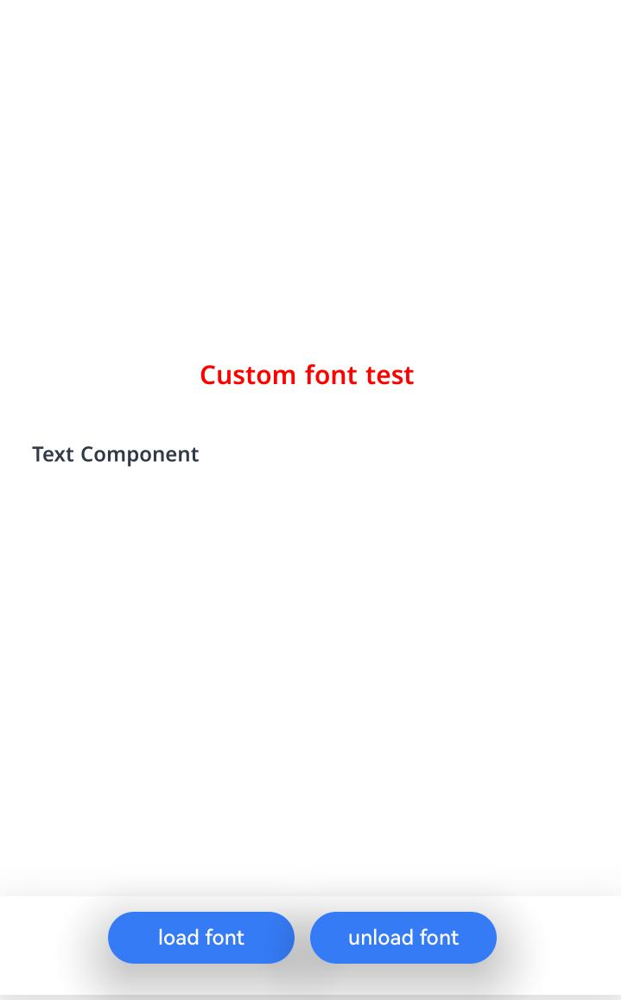
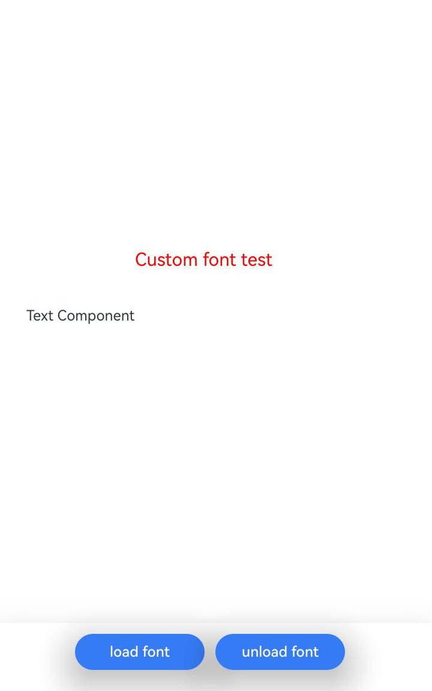

# Registering and Using Custom Fonts (ArkTS)
<!--Kit: ArkGraphics 2D-->
<!--Subsystem: Graphics-->
<!--Owner: @oh_wangxk; @gmiao522; @Lem0nC-->
<!--Designer: @liumingxiang-->
<!--Tester: @yhl0101-->
<!--Adviser: @ge-yafang-->
## Overview

Custom fonts are created or selected by developers based on app requirements. They are usually used to implement specific text styles or meet unique design requirements. When an app needs to use specific text styles and character sets, you can register and use custom fonts for text rendering.

## Implementation Process

**Registering custom fonts** is to register font files (such as TTF and OTF files) from app resources to the system so that the app can use these fonts for text rendering. The registration process is to register font files with the system font library through the font management API so that the font files can be called in the app.

**Using custom fonts** is to explicitly specify the registered custom fonts for text rendering in the app. You can select a specific text style (such as normal, bold, and italic) as required and apply it to UI elements, text controls, or other text display areas to meet design requirements and provide visual effect consistency.


## Available APIs

The following table lists the common APIs for registering and using custom fonts. For details about the APIs, see @ohos.graphics.text (../reference/apis-arkgraphics2d/js-apis-graphics-text.md).

| API| Description| 
| -------- | -------- |
| loadFontSync(name: string, path: string \| Resource): void | Registers a custom font with the file path specified by name. This API is synchronous.<br>**Note:**<br>Ensure that the custom font has been registered before being used. In scenarios where performance is not strictly required, you are advised to use the synchronous API.| 
| loadFont(name: string, path: string \| Resource): Promise&lt;void&gt; | Registers a font with the specified alias and file path. This API uses a promise for asynchronous callback. This API is supported since API version 14.| 
| unloadFontSync(name: string): void | Synchronously deregisters the font of a specified alias. This API is supported since API version 20.|
| unloadFont(name: string): Promise\<void\> | Deregisters the font of a specified alias in asynchronous mode using a promise. This API is supported since API version 20.|

## How to Develop

1. Import the required module.

   ```ts
   import { NodeController, FrameNode, RenderNode, DrawContext } from '@kit.ArkUI'
   import { UIContext } from '@kit.ArkUI'
   import { text } from '@kit.ArkGraphics2D'
   ```

2. Register a custom font. You can use either of the following methods:

   ```ts
   // Register the customized font.
   let fontCollection = text.FontCollection.getGlobalInstance()
   // Method 1: /system/fonts/myFontFile.ttf is only an example path. Replace it with the actual path.
   fontCollection.loadFontSync('myFamilyName0', 'file:///system/fonts/myFontFile.ttf')
   
   // Method 2: Ensure that the custom font file myFontFile.ttf is stored in the entry/src/main/resources/rawfile directory of the application project.
   fontCollection.loadFontSync('myFamilyName1',$rawfile('myFontFile.ttf'))
   ```

3. Use the custom font.

   ```ts
   // Enter the font family name passed when registering the custom font.
   let myFontFamily: Array<string> = ["myFamilyName0"]
   // Set the text style.
   let myTextStyle: text.TextStyle = {
     color: { alpha: 255, red: 255, green: 0, blue: 0 },
     fontSize: 100,
     // Add the custom font to the text style.
     fontFamilies: myFontFamily
   };
   ```

4. Create a paragraph style and use the font manager instance to construct a ParagraphBuilder instance.

   ```ts
   // Create a paragraph style object to set the typesetting style.
   let myParagraphStyle: text.ParagraphStyle = {textStyle: myTextStyle}
   // Create a paragraph generator.
   let paragraphBuilder: text.ParagraphBuilder = new text.ParagraphBuilder(myParagraphStyle, fontCollection);
   ```

5. Generate a paragraph.

   ```ts
   // Set the text style in the paragraph generator.
   paragraphBuilder.pushStyle(myTextStyle);
   // Set the text content in the paragraph generator.
   paragraphBuilder.addText("Custom font test");
   // Generate a paragraph through the paragraph generator.
   let paragraph = paragraphBuilder.build();
   ```

6. If you need to release a custom font, use the unloadFontSync API.

   ```ts
   // Unregister the custom font.
   fontCollection.unloadFontSync(familyName)
   // Refresh the node that uses the font collection after the font is unregistered.
   newNode.invalidate()
   ```

## Complete Sample Code

The following uses custom font registration method 1 as an example to draw the text Custom font test.

Ensure that the custom font file has been placed in the correct path on the device.

```ts
// Index.ets
import { NodeController, FrameNode, RenderNode, DrawContext } from '@kit.ArkUI'
import { UIContext } from '@kit.ArkUI'
import { text } from '@kit.ArkGraphics2D'

// Obtain the global font set instance.
let fontCollection = text.FontCollection.getGlobalInstance() // Obtain the global font collection of ArkUI.
const familyName = "myFamilyName"

// Create a custom rendering node class to draw text.
class MyRenderNode extends RenderNode {
  async draw(context: DrawContext) {
    // Create a canvas object.
    const canvas = context.canvas
    // Use a custom font.
    let myFontFamily: Array<string> = [familyName] // If a custom font has been registered, enter the font family name of the custom font.
    // Set the text style.
    let myTextStyle: text.TextStyle = {
      color: {
        alpha: 255,
        red: 255,
        green: 0,
        blue: 0
      },
      fontSize: 30,
      // Add the custom font to the text style.
      fontFamilies: myFontFamily
    };
    // Create a paragraph style object to set the typesetting style.
    let myParagraphStyle: text.ParagraphStyle = {
      textStyle: myTextStyle,
      align: 3,
      wordBreak: text.WordBreak.NORMAL
    };
    // Create a paragraph generator.
    let ParagraphGraphBuilder = new text.ParagraphBuilder(myParagraphStyle, fontCollection)
    // Set the text style in the paragraph generator.
    ParagraphGraphBuilder.pushStyle(myTextStyle);
    // Set the text content in the paragraph generator.
    ParagraphGraphBuilder.addText("Custom font test");
    // Generate a paragraph through the paragraph generator.
    let paragraph = ParagraphGraphBuilder.build();
    // Set the paragraph width to 1000 px.
    paragraph.layoutSync(1000);
    paragraph.paint(canvas, 0, 400);
  }
}

// Create and initialize a rendering node instance.
const newNode = new MyRenderNode();
// Set the position and size of the rendering node.
newNode.frame = {
  x: 0,
  y: 0,
  width: 400,
  height: 600
};


class MyNodeController extends NodeController {
  private rootNode: FrameNode | null = null;

  makeNode(uiContext: UIContext): FrameNode {
    this.rootNode = new FrameNode(uiContext)
    if (this.rootNode == null) {
      return this.rootNode
    }
    const renderNode = this.rootNode.getRenderNode()
    if (renderNode != null) {
      renderNode.frame = {
        x: 0,
        y: 0,
        width: 300,
        height: 50
      }
      renderNode.pivot = { x: 0, y: 0 }
    }
    return this.rootNode
  }

  addNode(node: RenderNode): void {
    if (this.rootNode == null) {
      return
    }
    const renderNode = this.rootNode.getRenderNode()
    if (renderNode != null) {
      renderNode.appendChild(node)
    }
  }

  clearNodes(): void {
    if (this.rootNode == null) {
      return
    }
    const renderNode = this.rootNode.getRenderNode()
    if (renderNode != null) {
      renderNode.clearChildren()
    }
  }
}

@Entry
@Component
struct RenderTest {
  private myNodeController: MyNodeController = new MyNodeController()

  build() {
    Column() {
      Row() {
        //If the fontCollection of getGlobalInstance is used to register a font, the component using the corresponding family name is automatically refreshed.
        Text("Text Component")
          .fontFamily(familyName)
        NodeContainer(this.myNodeController)
          .height('100%')
          .onAppear(() => {
            this.myNodeController.clearNodes()
            this.myNodeController.addNode(newNode)
          })
      }
      .height('90%')
      .backgroundColor(Color.White)

      Row() {
        Button("load font")
          .fontSize('16fp')
          .fontWeight(500)
          .margin({ bottom: 24, right: 12 })
          .onClick(() => {
            // Register the customized font.
            fontCollection.loadFontSync(familyName, 'file:///system/fonts/NotoSansMalayalamUI-SemiBold.ttf')
            // Refresh the node that uses the font collection after the registration.
            newNode.invalidate()
          })
          .width('30%')
          .height(40)
          .shadow(ShadowStyle.OUTER_DEFAULT_LG)
        Button("unload font")
          .fontSize('16fp')
          .fontWeight(500)
          .margin({ bottom: 24, right: 12 })
          .onClick(() => {
            // Deregister a custom font.
            fontCollection.unloadFontSync(familyName)
            // Refresh the node that uses the font collection after the deregistration.
            newNode.invalidate()
          })
          .width('30%')
          .height(40)
          .shadow(ShadowStyle.OUTER_DEFAULT_LG)
      }
      .width('100%')
      .justifyContent(FlexAlign.Center) // Center the child elements in the current row container along the main axis.
      .shadow(ShadowStyle.OUTER_DEFAULT_SM) // Set the outer shadow effect of the row container.
      .alignItems(VerticalAlign.Bottom) // Align the child elements in the current row container along the cross axis (vertical direction) to the bottom.
      .layoutWeight(1) // Set the layout weight of the current row in the parent column container to 1.
    }
  }
}
```

## Effect



