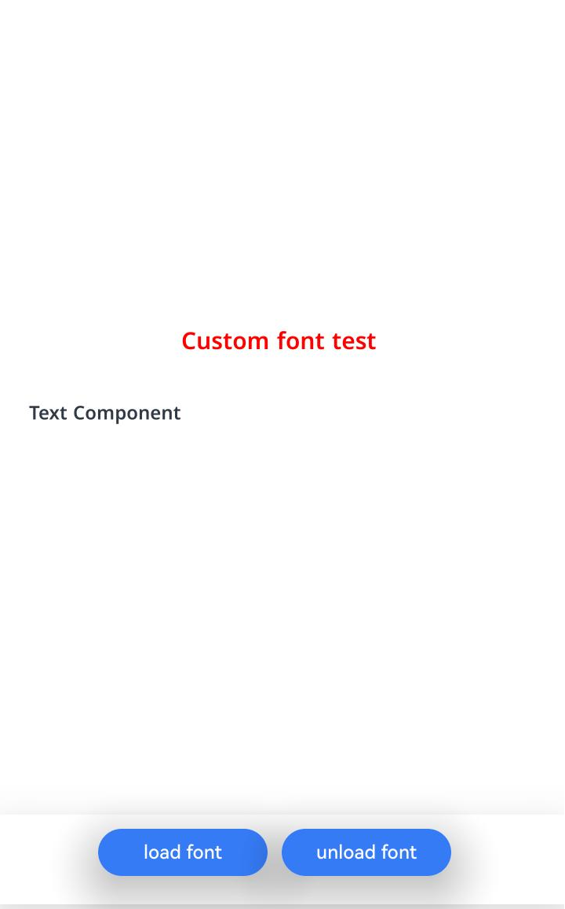
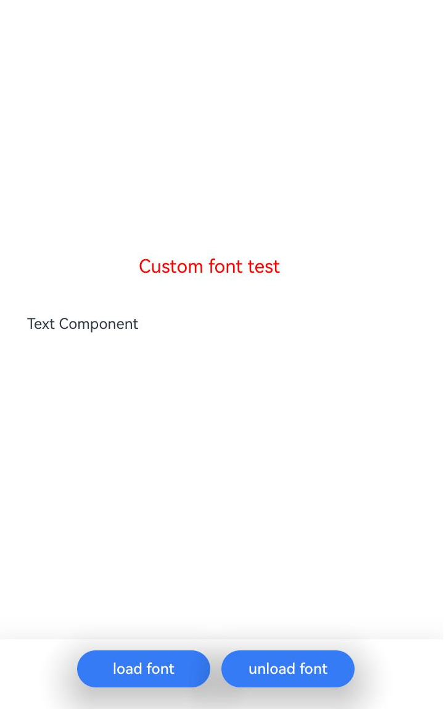

# Registering and Using Custom Fonts (ArkTS)
<!--Kit: ArkGraphics 2D-->
<!--Subsystem: Graphics-->
<!--Owner: @oh_wangxk; @gmiao522; @Lem0nC-->
<!--Designer: @liumingxiang-->
<!--Tester: @yhl0101-->
<!--Adviser: @ge-yafang-->
## Overview

Custom fonts are fonts created or selected by developers based on application requirements. They are usually used to implement specific text styles or fulfill distinct design goals. To render specific text styles and characters, applications can register and use custom fonts.

## Workflow

**Registering custom fonts** is to register font files (such as .ttf and .otf files) from application resources to the system so that applications can use these fonts for text rendering. The registration process is to register font files with the system font library through the font management API so that the font files can be called in the application.

**Using custom fonts** is to explicitly specify registered custom fonts for text rendering in an application. You can select a specific text style (such as regular, bold, and italic) as required and apply it to UI elements, text controls, or other text display areas to meet design requirements and provide consistent visual effect.


## Available APIs

The following table lists the APIs for registering and using theme fonts. For details, see [@ohos.graphics.text (Text)](../reference/apis-arkgraphics2d/js-apis-graphics-text.md).

| API| Description| 
| -------- | -------- |
| loadFontSync(name: string, path: string \| Resource): void | Registers a font from a file in the specified path. This API returns the result synchronously.<br>**NOTE**<br>Ensure that the custom font has been registered. If performance is not a critical concern, you are advised to use the synchronous API.| 
| loadFont(name: string, path: string \| Resource): Promise&lt;void&gt; | Registers a font based on the specified name and file path. This API uses a promise to return the result. This API is supported since API version 14.| 
| unloadFontSync(name: string): void | Unregisters a font based on the specified name. This API is synchronous. This API is supported since API version 20.|
| unloadFont(name: string): Promise\<void\> | Unregisters a font based on the specified name. This API uses a promise to return the result. This API is supported since API version 20.|

## How to Develop

1. Import the required module.

   <!-- @[arkts_custom_font_include](https://gitcode.com/openharmony/applications_app_samples/blob/master/code/DocsSample/ArkGraphics2D/TextEngine/CustomFont/entry/src/main/ets/pages/Index.ets) -->
   
   ``` TypeScript
   import { NodeController, FrameNode, RenderNode, DrawContext } from '@kit.ArkUI'
   import { UIContext } from '@kit.ArkUI'
   import { text } from '@kit.ArkGraphics2D'
   ```

2. Register a custom font. You can use either of the following methods:

   <!-- @[arkts_custom_font_step2](https://gitcode.com/openharmony/applications_app_samples/blob/master/code/DocsSample/ArkGraphics2D/TextEngine/CustomFont/entry/src/main/ets/pages/Index.ets) -->
   
   ``` TypeScript
   // Register the custom font.
   // Method 1: /system/fonts/NotoSansMalayalamUI-SemiBold.ttf is only an example. Replace the file path with the actual one.
   fontCollection.loadFontSync(familyName, 'file:///system/fonts/NotoSansMalayalamUI-SemiBold.ttf')
   // Method 2: Ensure that the custom font file myFontFile.ttf is stored in the entry/src/main/resources/rawfile directory of your application project.
   // fontCollection.loadFontSync(familyName, $rawfile('myFontFile.ttf'))
   ```

3. Use the custom font.

   <!-- @[arkts_custom_font_step3](https://gitcode.com/openharmony/applications_app_samples/blob/master/code/DocsSample/ArkGraphics2D/TextEngine/CustomFont/entry/src/main/ets/pages/Index.ets) -->
   
   ``` TypeScript
   // Use the custom font.
   let myFontFamily: Array<string> = [familyName] // If a custom font has been registered, enter the font family name of the custom font.
   // Set the text style.
   let myTextStyle: text.TextStyle = {
     color: {
       alpha: 255,
       red: 255,
       green: 0,
       blue: 0
     },
     fontSize: 30,
     // Add the custom font to the text style.
     fontFamilies: myFontFamily
   };
   ```

4. Create a paragraph style and use the font manager instance to construct a **ParagraphBuilder** instance.

   <!-- @[arkts_custom_font_step4](https://gitcode.com/openharmony/applications_app_samples/blob/master/code/DocsSample/ArkGraphics2D/TextEngine/CustomFont/entry/src/main/ets/pages/Index.ets) -->
   
   ``` TypeScript
   // Create a paragraph style object to set the typography style.
   let myParagraphStyle: text.ParagraphStyle = {
     textStyle: myTextStyle,
     align: 3,
     wordBreak: text.WordBreak.NORMAL
   };
   // Create a paragraph generator.
   let paragraphBuilder = new text.ParagraphBuilder(myParagraphStyle, fontCollection)
   ```

5. Build a paragraph.

   <!-- @[arkts_custom_font_step5](https://gitcode.com/openharmony/applications_app_samples/blob/master/code/DocsSample/ArkGraphics2D/TextEngine/CustomFont/entry/src/main/ets/pages/Index.ets) -->
   
   ``` TypeScript
   // Set the text style in the paragraph generator.
   paragraphBuilder.pushStyle(myTextStyle);
   // Set the text content in the paragraph generator.
   paragraphBuilder.addText("Custom font test");
   // Generate a paragraph using the paragraph generator.
   let paragraph = paragraphBuilder.build();
   ```

6. To release a custom font, call the **unloadFontSync** API.

   <!-- @[arkts_custom_font_step6](https://gitcode.com/openharmony/applications_app_samples/blob/master/code/DocsSample/ArkGraphics2D/TextEngine/CustomFont/entry/src/main/ets/pages/Index.ets) -->
   
   ``` TypeScript
   // Unregister the custom font.
   fontCollection.unloadFontSync(familyName)
   // Refresh the node that uses fontCollection after the unregistration.
   newNode.invalidate()
   ```

## Effect



