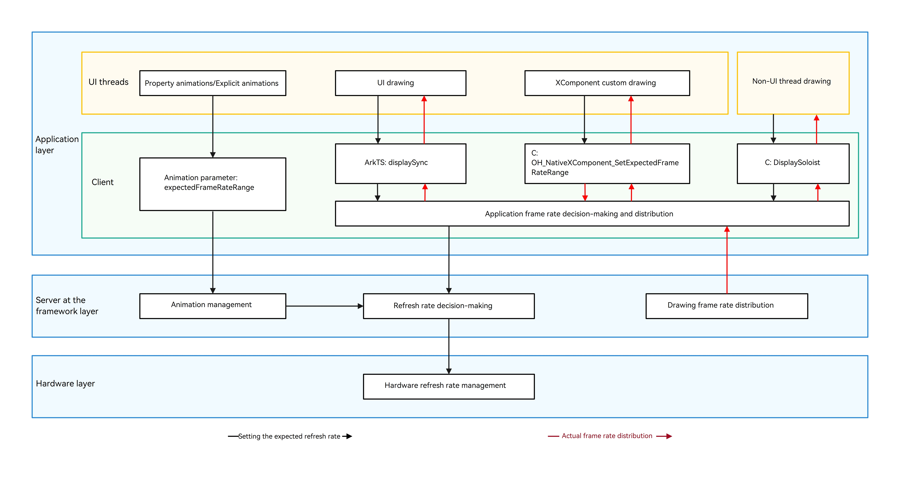

# Introduction to Variable Frame Rates
<!--Kit: ArkGraphics 2D-->
<!--Subsystem: Graphics-->
<!--Owner: @hudi33-->
<!--Designer: @hudi33-->
<!--Tester: @zhaoxiaoguang2-->
<!--Adviser: @ge-yafang-->

Nowadays, low-temperature polycrystalline oxide (LTPO) screens are widely used. This type of screen supports switching between frame rates at multiple levels.

For fast-changing content, such as shooting games and interactive animations, a high frame rate is required. It ensures smooth images while causing a high power consumption.

For slow-changing content, such as game halls and clock update animations, a low frame rate is used. It consumes less power and does not cause frame freezing.

The variable frame rate capability enables you to achieve a balance between performance experience and power consumption on devices with the LTPO screens.

OpenHarmony supports this capability. You can use the variable frame rate APIs to develop related services.

## Use Scenarios
The variable frame rate capability allows you to specify the frame rate in different scenarios. Typical use scenarios are as follows:
- Configure the frame rate parameter for property animations or explicit animations. For details, see [Requesting Frame Rates for Animations](displaysync-animation.md).
- Request an independent frame rate for UI components. For details, see [Requesting Frame Rates for UI Components](displaysync-ui.md).
- Request an independent frame rate for custom content (such as gaming) through the **XComponent** on the native side. For details, see [Requesting Frame Rates for Custom Content](displaysync-xcomponent.md).
- Request an independent frame rate for drawing of non-UI threads through NativeVsync on the native side. For details, see [NativeDisplaySoloist Development (C/C++)](displaysoloist-native-guidelines.md).

## Working Principles
The variable frame rate provides the basic frame rate configuration for animation components, **XComponent**, and UI components.
After a valid expected frame rate is set, the system collects the configured frame rate and divides the frequency on the rendering pipeline.

As shown in the preceding figure, multiple UIs (animation components, UI drawing, XComponent self-drawing, and non-UI thread drawing) at the application layer can be connected to the frame rate control system through the corresponding variable frame rate APIs (expectedFrameRateRange, displaySync, OH_NativeXComponent_SetExpectedFrameRateRange, and DisplaySoloist). The frame control system collects the expected drawing frame rate set by the UI and participates in the decision-making of the entire system refresh rate at the framework layer. The server distributes the drawing frame rate based on the determined refresh rate result and transfers the drawing frame rate to various UIs at the application layer level by level. In addition, the hardware layer adjusts its refresh rate based on the overall decision to ensure synchronization.

## Constraints

The actual frame rate may be different from the expected one configured. It is limited by the system power consumption and hardware capability of the screen refresh rate.

## Samples

The following sample is provided to help you better understand how to develop the frame rate feature:

- [DisplaySync Hierarchical Management (ArkTS, API version 12)](https://gitcode.com/openharmony/applications_app_samples/tree/master/code/BasicFeature/Graphics/DisplaySync)
