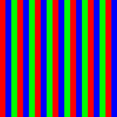
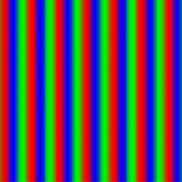
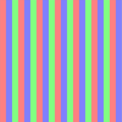
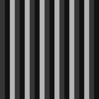
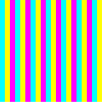

# Adding Image Effects (C/C++)

<!--Kit: ArkGraphics 2D-->
<!--Subsystem: Multimedia-->
<!--Owner: @hanamaru-->
<!--Designer: @chensiyi_CE-->
<!--Tester: @zhaoxiaoguang2-->
<!--Adviser: @ge-yafang-->

## When to Use

When processing images offline, you can configure various image effects to achieve different visual presentations, such as setting image blur intensity, adjusting brightness and grayscale, and applying color inversion.

Image effects are primarily configured based on filters.

## Available APIs

Common APIs for setting image effects via filters are listed below. For detailed usage and parameters, see [effect_filter](../reference/apis-arkgraphics2d/capi-effect-filter-h.md).

| API| Description|
| -------- | -------- |
| EffectErrorCode OH_Filter_CreateEffect(OH_PixelmapNative\* pixelmap, OH_Filter\*\* filter)| Creates a filter object based on the pixelmap object.|
| EffectErrorCode OH_Filter_Blur(OH_Filter\* filter, float radius)| Creates a blur effect and adds it to the filter.|
| EffectErrorCode OH_Filter_Brighten(OH_Filter\* filter, float brightness) | Creates a brightening effect and adds it to the filter.|
| EffectErrorCode OH_Filter_GrayScale(OH_Filter\* filter) | Creates a grayscale effect and adds it to the filter.|
| EffectErrorCode OH_Filter_Invert(OH_Filter\* filter) | Creates a color inversion effect and adds it to the filter.|
| EffectErrorCode OH_Filter_GetEffectPixelMap(OH_Filter\* filter, OH_PixelmapNative\*\* pixelmap) | Obtains the pixelmap object generated after filter processing.|
| EffectErrorCode OH_Filter_Release(OH_Filter\* filter) | Releases the filter object.|

## How to Develop
1. Add the following link libraries to **src/main/cpp/CMakeLists.txt** in your Native project.

   ``` C++
   target_link_libraries(entry PUBLIC libnative_drawing.so)
   target_link_libraries(entry PUBLIC libhilog_ndk.z.so)
   target_link_libraries(entry PUBLIC libnative_effect.so)
   target_link_libraries(entry PUBLIC libpixelmap.so)
   ```

2. Import the required header files.

   ``` C++
   #include "multimedia/image_framework/image/pixelmap_native.h"
   #include "native_effect/effect_filter.h"
   ```

3. Create an **OH_PixelmapNative** object.

   A filter requires a PixelMap object (**OH_PixelmapNative**) defined by the image framework. You can create a custom PixelMap via **OH_PixelmapNative_CreatePixelMap()**, or import an external PixelMap via **OH_PixelmapNative_ConvertPixelmapNativeFromNapi()**.
   
   This section describes how to create an **OH_PixelmapNative** object via **OH_PixelmapNative_CreatePixelMap()**. This function accepts four parameters: buffer for image pixel data (initializes PixelMap pixels), buffer length, PixelMap format (including width, height, color type, alpha type, etc.), and the **OH_PixelmapNative** object (used as an output parameter).

   ``` C++
   // The image width and height are 600 and 400, respectively.
   uint32_t width = 600;
   uint32_t height = 400;
   const uint16_t RGBA_MIN = 0x00;
   const uint16_t RGBA_MAX = 0xFF;
   const uint16_t RGBA_SIZE = 4;
   // Byte length. Each RGBA_8888 pixel occupies four bytes.
   size_t bufferSize = width * height * RGBA_SIZE;
   uint8_t *pixels = new uint8_t[bufferSize];
   for (uint32_t i = 0; i < width * height; ++i) {
        // Traverse and edit each pixel to form red-green-blue stripes.
        uint32_t n = i / 20 % 3;
        pixels[i * RGBA_SIZE] = RGBA_MIN; // Red channel.
        pixels[i * RGBA_SIZE + 1] = RGBA_MIN; // +1 indicates the green channel.
        pixels[i * RGBA_SIZE + 2] = RGBA_MIN; // +2 indicates the blue channel.
        pixels[i * RGBA_SIZE + 3] = RGBA_MAX; // +3 indicates the alpha channel.
        if (n == 0) {
            pixels[i * RGBA_SIZE] = RGBA_MAX; // Assign value to the red channel, displaying red.
        } else if (n == 1) {
            pixels[i * RGBA_SIZE + 1] = RGBA_MAX; // +1 indicates assignment to the green channel, with other channels set to 0, displaying green.
        } else {
            pixels[i * RGBA_SIZE + 2] = RGBA_MAX; // +2 indicates assignment to the blue channel, with other channels set to 0, displaying blue.
        }
   }
   // Set the PixelMap format (width, height, color type, and alpha type).
   OH_Pixelmap_InitializationOptions *createOps = nullptr;
   OH_PixelmapInitializationOptions_Create(&createOps);
   OH_PixelmapInitializationOptions_SetWidth(createOps, width);
   OH_PixelmapInitializationOptions_SetHeight(createOps, height);
   OH_PixelmapInitializationOptions_SetPixelFormat(createOps, PIXEL_FORMAT_RGBA_8888);
   OH_PixelmapInitializationOptions_SetAlphaType(createOps, PIXELMAP_ALPHA_TYPE_UNKNOWN);
   // Create an OH_PixelmapNative object.
   OH_PixelmapNative *pixelMapNative = nullptr;
   OH_PixelmapNative_CreatePixelmap(pixels, bufferSize, createOps, &pixelMapNative);
   ```

4. Initialize an **OH_Filter** object using **OH_Filter_CreateEffect()** based on the **OH_PixelmapNative** object created above.

   ``` C++
   OH_Filter *filter = nullptr;
   EffectErrorCode errCodeCreate = OH_Filter_CreateEffect(pixelMapNative, &filter);
   ```

5. Add different image effects to the filter as required.
    - Add blur effect via **OH_Filter_Blur()**.
        
      ``` C++
      float radius = 20.0; // Blur radius
      EffectErrorCode errCodeEffect = OH_Filter_Blur(filter, radius);
      ```

    - Add brightening effect via **OH_Filter_Brighten()**.
    
      ``` C++
      float brightness = 0.5; //Brightening degree (0 to 1)
      EffectErrorCode errCodeEffect = OH_Filter_Brighten(filter, brightness);
      ```

    - Add grayscale effect via **OH_Filter_GrayScale()**.
    
      ``` C++
      EffectErrorCode errCodeEffect = OH_Filter_GrayScale(filter);
      ```

    - Add color inversion effect via **OH_Filter_Invert()**.

      ``` C++
      EffectErrorCode errCodeEffect = OH_Filter_Invert(filter);
      ```

6. Obtain the **OH_PixelmapNative** object after filter processing.

   ``` C++
   OH_PixelmapNative* filterResult = nullptr;
   EffectErrorCode errCodeResult = OH_Filter_GetEffectPixelMap(filter, &filterResult);
   ```

7. Release the **OH_Filter** object via **OH_Filter_Release()** when no longer needed.

   ``` C++
   EffectErrorCode errCodeRelease = OH_Filter_Release(filter);
   ```

   The following table lists the effects.
   | Image Processing| Effect|
   | -------- | -------- |
   | Original image|  |
   | Blur effect added| |
   | Brightening effect added| |
   | Grayscale effect added|  |
   | Color inversion added|  |
