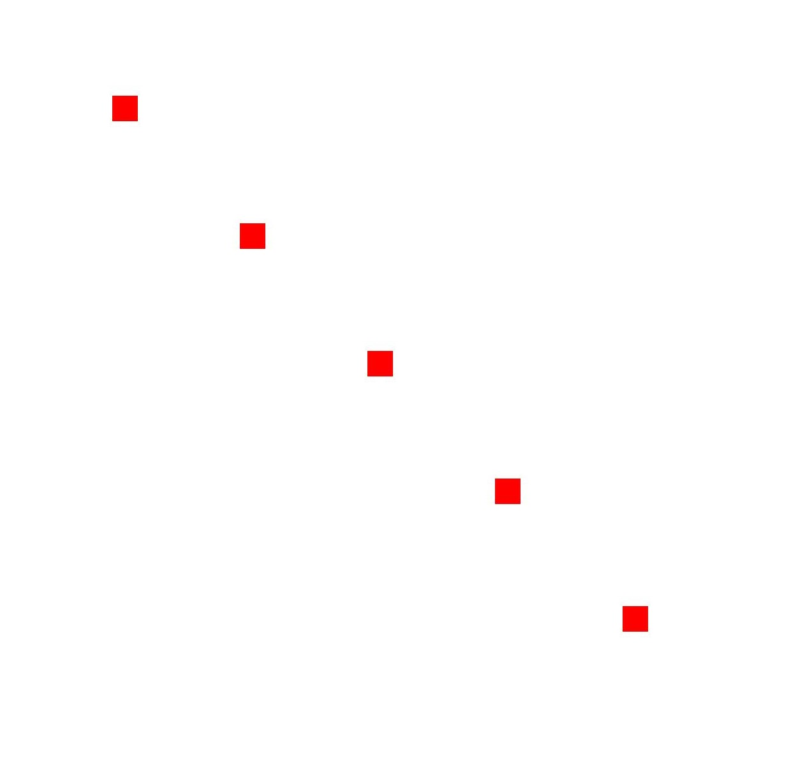
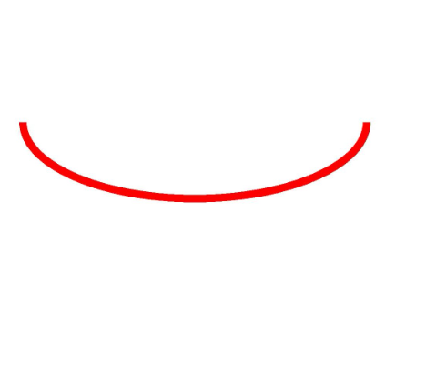
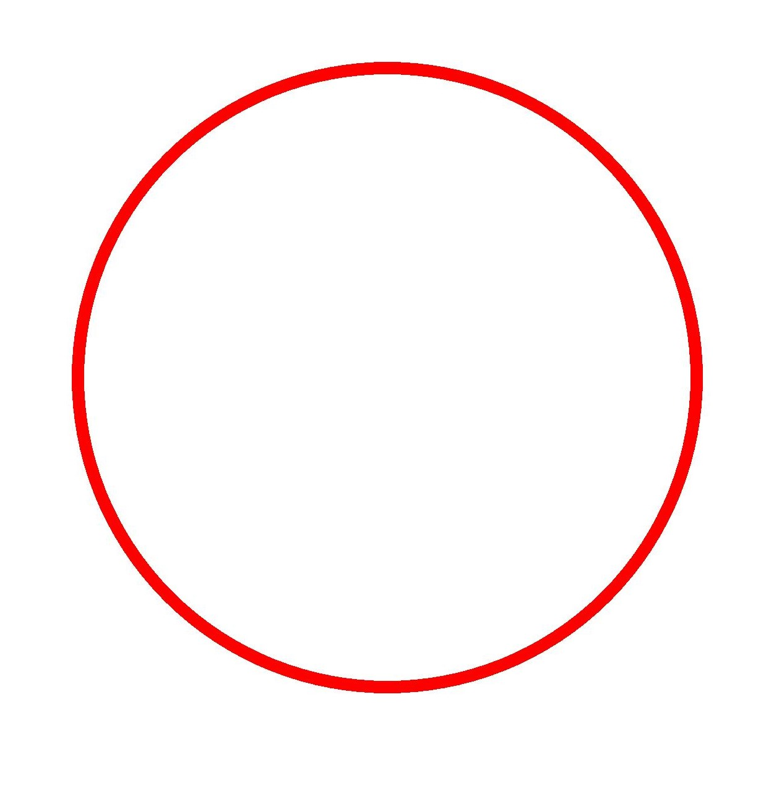
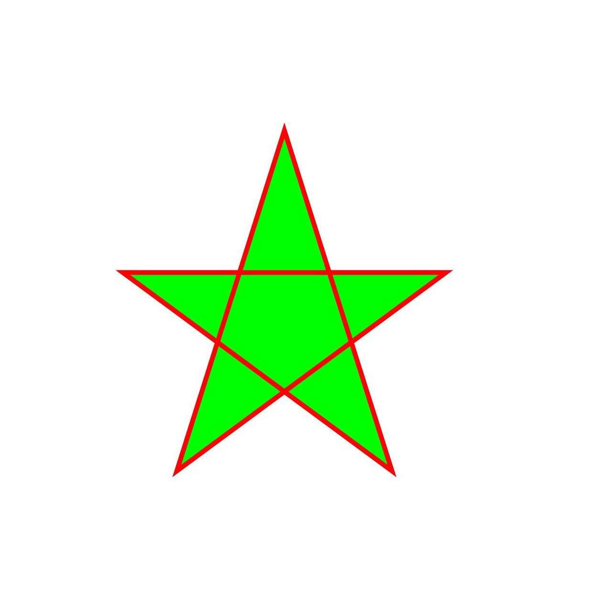
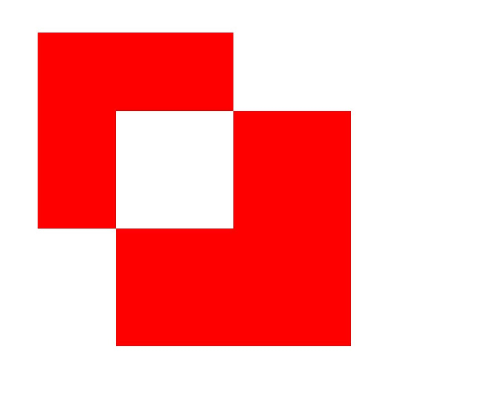
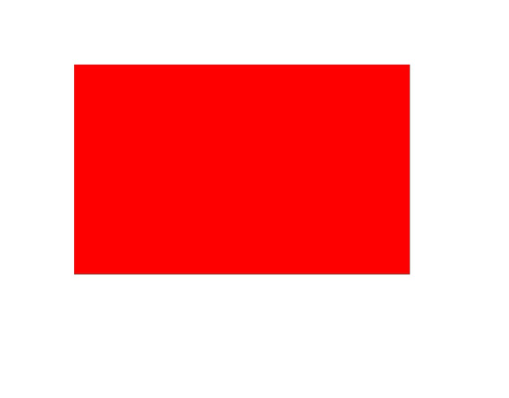
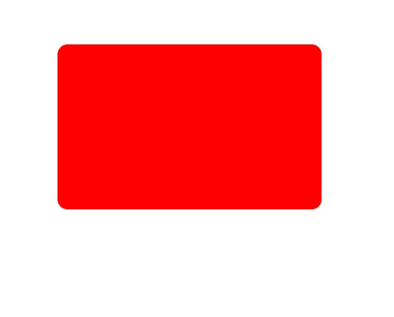

# Drawing Geometric Shapes (ArkTS)
<!--Kit: ArkGraphics 2D-->
<!--Subsystem: Graphic-->
<!--Owner: @hangmengxin-->
<!--Designer: @wangyanglan-->
<!--Tester: @nobuggers-->
<!--Adviser: @ge-yafang-->


## Overview

The following geometric shapes can be drawn:

- Point

- Arc

- Circle

- Path

- Region

- Rectangle

- Rounded rectangle

Most geometric shapes can be drawn using a pen or brush. Points can only be drawn using a pen.


## Available APIs

The following table lists the APIs for drawing geometric shapes. For details, see [drawing.Canvas](../reference/apis-arkgraphics2d/arkts-apis-graphics-drawing-Canvas.md).

| API| Description|
| -------- | -------- |
| drawPoint(x: number, y: number): void | Draws a point.|
| drawArc(arc: common2D.Rect, startAngle: number, sweepAngle: number): void | Draws an arc.|
| drawCircle(x: number, y: number, radius: number): void | Draws a circle.|
| drawPath(path: Path): void | Draws a path.|
| drawRegion(region: Region): void | Draws a region.|
| drawRect(left: number, top: number, right: number, bottom: number): void | Draws a rectangle.|
| drawRoundRect(roundRect: RoundRect): void | Draws a rounded rectangle.|


## Drawing Points

Points can only be drawn on the canvas using a pen. You can use the **drawPoint()** API to draw points. The API takes two parameters, which are the X coordinate and Y coordinate of the point to be drawn.

A simple example is as follows:

<!-- @[arkts_graphics_draw_point](https://gitcode.com/openharmony/applications_app_samples/blob/master/code/DocsSample/ArkGraphics2D/Drawing/ArkTSGraphicsDraw/entry/src/main/ets/drawing/pages/ShapeDrawing.ets) -->

``` TypeScript
// Set the pen.
let pen = new drawing.Pen();
// Set the color.
pen.setColor(0xFF, 0xFF, 0x00, 0x00);
// Set the stroke width.
pen.setStrokeWidth(40);
// Set the stroke effect of the pen.
canvas.attachPen(pen);
// Draw five points.
canvas.drawPoint(VALUE_200, VALUE_200);
canvas.drawPoint(VALUE_400, VALUE_400);
canvas.drawPoint(VALUE_600, VALUE_600);
canvas.drawPoint(VALUE_800, VALUE_800);
canvas.drawPoint(VALUE_1000, VALUE_1000);
// Remove the stroke effect.
canvas.detachPen();
```

The effect is as follows:




## Drawing an Arc

You can use a pen or brush to draw an arc on the canvas by calling **drawArc()**.

To draw an arc, you need a rectangle ([common2D.Rect](../reference/apis-arkgraphics2d/js-apis-graphics-common2D.md#rect)) and two parameters, **startAngle** and **sweepAngle**. The rectangle is used as the outline of the arc.

The following is an example of drawing an arc using a pen:

<!-- @[arkts_graphics_draw_arc](https://gitcode.com/openharmony/applications_app_samples/blob/master/code/DocsSample/ArkGraphics2D/Drawing/ArkTSGraphicsDraw/entry/src/main/ets/drawing/pages/ShapeDrawing.ets) -->

``` TypeScript
// Create a pen object.
let pen = new drawing.Pen();
// Set the color.
pen.setColor({
  alpha: 0xFF,
  red: 0xFF,
  green: 0x00,
  blue: 0x00
});
// Set the stroke width.
pen.setStrokeWidth(20);
// Set the stroke effect of the pen.
canvas.attachPen(pen);
// Create a rectangle object.
const rect: common2D.Rect = {
  left: VALUE_100,
  top: VALUE_200,
  right: VALUE_1000,
  bottom: VALUE_600
};
// Draw a rectangle.
canvas.drawArc(rect, 0, 180);
// Remove the stroke effect.
canvas.detachPen();
```

The effect is as follows:




## Drawing a Circle

You can use the pen or brush to draw a circle on the canvas by calling **drawCircle()**.

To draw a circle, you need the X and Y coordinates of the center point and the radius of the circle.

The following is an example of drawing a circle using a pen:
<!-- @[arkts_graphics_draw_circle](https://gitcode.com/openharmony/applications_app_samples/blob/master/code/DocsSample/ArkGraphics2D/Drawing/ArkTSGraphicsDraw/entry/src/main/ets/drawing/pages/ShapeDrawing.ets) -->

``` TypeScript
// Create a pen object.
let pen = new drawing.Pen();
// Set the color.
pen.setColor({
  alpha: 0xFF,
  red: 0xFF,
  green: 0x00,
  blue: 0x00
});
// Set the stroke width.
pen.setStrokeWidth(20);
// Set the stroke effect of the pen.
canvas.attachPen(pen);
// Draw a circle.
canvas.drawCircle(VALUE_630, VALUE_630, VALUE_500);
// Remove the stroke effect.
canvas.detachPen();
```

The effect is as follows:




## Drawing a Path

You can use a pen or brush to draw a path on the canvas. The path can be used to draw a straight line, arc, or Bezier curve, or form other complex shapes through path combination.

The following describes the APIs and implementation of drawing a path. For details about the usage and parameters, see [Path](../reference/apis-arkgraphics2d/arkts-apis-graphics-drawing-Path.md). The common APIs are as follows:

1. **new drawing.Path()**: creates a path object.

2. **moveTo()**: sets the start point of the path.

3. **lineTo()**: draws a line segment from the start point or the last point of the path (if the path is empty, the start point (0, 0) is used) to the target point.

The following is an example of drawing a five-pointed star using a pen and a brush:

<!-- @[arkts_graphics_draw_path](https://gitcode.com/openharmony/applications_app_samples/blob/master/code/DocsSample/ArkGraphics2D/Drawing/ArkTSGraphicsDraw/entry/src/main/ets/drawing/pages/ShapeDrawing.ets) -->

``` TypeScript
let height_ = VALUE_1800;
let width_ = VALUE_1800;
let len = height_ / 4;
let aX = width_ / 3;
let aY = height_ / 6;
let dX = aX - len * Math.sin(18.0);
let dY = aY + len * Math.cos(18.0);
let cX = aX + len * Math.sin(18.0);
let cY = dY;
let bX = aX + (len / 2.0);
let bY = aY + Math.sqrt((cX - dX) * (cX - dX) + (len / 2.0) * (len / 2.0));
let eX = aX - (len / 2.0);
let eY = bY;

// Create a path object and use the APIs to construct a pentagram.
let path = new drawing.Path();
// Specify the start point of the path.
path.moveTo(aX, aY);
// Draw a line segment from the last point of a path to the target point.
path.lineTo(bX, bY);
path.lineTo(cX, cY);
path.lineTo(dX, dY);
path.lineTo(eX, eY);
// Close the path. Now the path is drawn.
path.close();

// Create a pen object.
let pen = new drawing.Pen();
// Set anti-aliasing.
pen.setAntiAlias(true);
// Set the stroke color.
pen.setColor(0xFF, 0xFF, 0x00, 0x00);
// Set the stroke width.
pen.setStrokeWidth(10.0);
// Set the stroke effect of the pen.
canvas.attachPen(pen);
// Create a brush object.
let brush = new drawing.Brush();
// Set the fill color.
brush.setColor(0xFF, 0x00, 0xFF, 0x00);
// Set the brush fill effect.
canvas.attachBrush(brush);
// Draw a path.
canvas.drawPath(path);
// Remove the fill effect.
canvas.detachBrush();
// Remove the stroke effect.
canvas.detachPen();
```

The effect is as follows:




## Drawing a Region

A region is not a specific shape. You can set it to a specified rectangle or path, or combine two regions. You can use a pen or brush to draw a region. For details about the API, see [Region](../reference/apis-arkgraphics2d/arkts-apis-graphics-drawing-Region.md).

You can call **setRect()** and **setPath()** to set the rectangle region and path region, respectively.

The following is an example of drawing a rectangle region using a brush:

<!-- @[arkts_graphics_draw_region](https://gitcode.com/openharmony/applications_app_samples/blob/master/code/DocsSample/ArkGraphics2D/Drawing/ArkTSGraphicsDraw/entry/src/main/ets/drawing/pages/ShapeDrawing.ets) -->

``` TypeScript
// Create a brush object.
let brush = new drawing.Brush();
// Set the color.
brush.setColor(0xFF, 0xFF, 0x00, 0x00);
// Set the brush fill effect.
canvas.attachBrush(brush);
// Create region 1 in the upper left corner.
let region1 = new drawing.Region();
region1.setRect(VALUE_100, VALUE_100, VALUE_600, VALUE_600);
// Create region 2 in the lower right corner.
let region2 = new drawing.Region();
region2.setRect(VALUE_300, VALUE_300, VALUE_900, VALUE_900);
// Combine the two regions in XOR mode.
region1.op(region2, drawing.RegionOp.XOR);
// Draw a region.
canvas.drawRegion(region1);
// Remove the fill effect.
canvas.detachBrush();
```

The effect is as follows:




## Drawing a Rectangle

You can use a pen or brush to draw a rectangle on the canvas. Use **drawRect()** to draw a rectangle. The API needs to pass four floating points, which indicate the coordinates of the left, top, right, and bottom positions of the rectangle. The four coordinates form a rectangle.

The following is an example of drawing a five-pointed star using a pen and a brush:

<!-- @[arkts_graphics_draw_rect](https://gitcode.com/openharmony/applications_app_samples/blob/master/code/DocsSample/ArkGraphics2D/Drawing/ArkTSGraphicsDraw/entry/src/main/ets/drawing/pages/ShapeDrawing.ets) -->

``` TypeScript
// Create a brush object.
let brush = new drawing.Brush();
// Set the color.
brush.setColor(0xFF, 0xFF, 0x00, 0x00);
// Set the brush fill effect.
canvas.attachBrush(brush);
// Draw a rectangle.
canvas.drawRect(VALUE_200, VALUE_200, VALUE_1000, VALUE_700);
// Remove the fill effect.
canvas.detachBrush();
```

The effect is as follows:




## Drawing a Rounded Rectangle

You can use a pen or brush to draw a rounded rectangle on the canvas. Use **drawRoundRect()** to draw a rounded rectangle. The API takes the **roundRect** parameter, indicating the rounded rectangle object.

The **new drawing.RoundRect()** API is used to construct a rounded rectangle object. The constructor takes three parameters, which are as follows:

- **common2D.Rect** (rectangle object). A rounded rectangle is formed by cutting the rounded corners of the rectangle.

- Radius of the rounded corner on the X axis.

- Radius of the rounded corner on the Y axis.

The following is an example of drawing a rounded rectangle using a brush:

<!-- @[arkts_graphics_draw_round_rect](https://gitcode.com/openharmony/applications_app_samples/blob/master/code/DocsSample/ArkGraphics2D/Drawing/ArkTSGraphicsDraw/entry/src/main/ets/drawing/pages/ShapeDrawing.ets) -->

``` TypeScript
// Create a brush object.
let brush = new drawing.Brush();
// Set the color.
brush.setColor(0xFF, 0xFF, 0x00, 0x00);
// Set the brush fill effect.
canvas.attachBrush(brush);
// Create a rectangle object.
let rect: common2D.Rect = {
  left: VALUE_200,
  top: VALUE_200,
  right: VALUE_1000,
  bottom: VALUE_700
};
console.info('rect:', rect.right);
// Create a rounded rectangle object.
let rrect = new drawing.RoundRect(rect, 30, 30);
// Draw a rounded rectangle.
canvas.drawRoundRect(rrect);
// Remove the fill effect.
canvas.detachBrush();
```

The effect is as follows:



<!--RP1-->
## Samples

The following samples are provided to help you better understand how to use the **Drawing** APIs (ArkTS) for development:

- [ArkTSGraphicsDraw (API20)](https://gitcode.com/openharmony/applications_app_samples/tree/master/code/DocsSample/ArkGraphics2D/Drawing/ArkTSGraphicsDraw)
<!--RP1End-->
