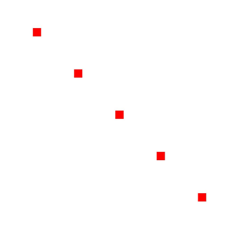
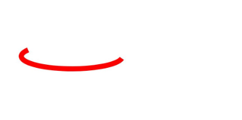
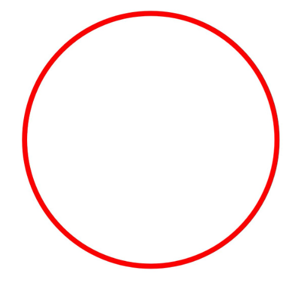
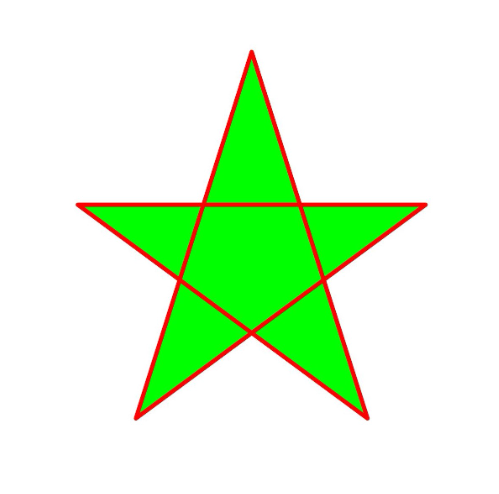
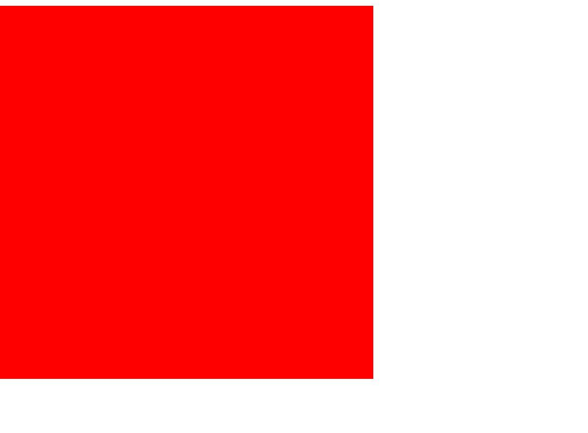
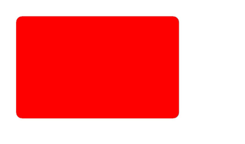

# Drawing Geometric Shapes (C/C++)
<!--Kit: ArkGraphics 2D-->
<!--Subsystem: Graphic-->
<!--Owner: @hangmengxin-->
<!--Designer: @wangyanglan-->
<!--Tester: @nobuggers-->
<!--Adviser: @ge-yafang-->


## Overview

Geometric shapes that can be drawn currently include:

- Point

- Arc

- Circle

- Path

- Region

- Box

- Rounded rectangle

Most geometric shapes can be drawn using a brush or a paintbrush. Points can be drawn only using a brush.


## Available APIs

The following table lists the common APIs for drawing geometric shapes. For details about the APIs and parameters, see [drawing_canvas.h](../reference/apis-arkgraphics2d/capi-drawing-canvas-h.md).

| API| Description|
| -------- | -------- |
| OH_Drawing_Point\* OH_Drawing_PointCreate (float x, float y) | Creates an **OH_Drawing_Point** object.|
| OH_Drawing_ErrorCode OH_Drawing_CanvasDrawPoint (OH_Drawing_Canvas \*canvas, const OH_Drawing_Point2D \*point) | Draws a point.|
| OH_Drawing_Rect\* OH_Drawing_RectCreate (float left, float top, float right, float bottom) | Creates an **OH_Drawing_Rect** object.|
| void OH_Drawing_CanvasDrawArc (OH_Drawing_Canvas\*, const OH_Drawing_Rect\*, float startAngle, float sweepAngle) | Draws an arc.|
| void OH_Drawing_CanvasDrawCircle (OH_Drawing_Canvas\*, const OH_Drawing_Point\*, float radius) | Draws a circle.|
| OH_Drawing_Path\* OH_Drawing_PathCreate (void) | Creates an **OH_Drawing_Path** object.|
| void OH_Drawing_CanvasDrawPath (OH_Drawing_Canvas\*, const OH_Drawing_Path\*) | Draws a path.|
| OH_Drawing_Region\* OH_Drawing_RegionCreate (void) | Creates a region object.|
| void OH_Drawing_CanvasDrawRegion (OH_Drawing_Canvas\*, const OH_Drawing_Region\*) | Draws a region.|
| void OH_Drawing_CanvasDrawRect (OH_Drawing_Canvas\*, const OH_Drawing_Rect\*) | Draws a rectangle.|
| OH_Drawing_RoundRect\* OH_Drawing_RoundRectCreate (const OH_Drawing_Rect\*, float xRad, float yRad) | Creates an **OH_Drawing_RoundRect** object.|
| void OH_Drawing_CanvasDrawRoundRect (OH_Drawing_Canvas\*, const OH_Drawing_RoundRect\*) | Draws a rounded rectangle.|


## Drawing Points

A point can be drawn only on the canvas based on the paint. You can use the OH_Drawing_CanvasDrawPoint() API to draw a point. The API accepts two parameters: canvas object and pointer to the point to be drawn. Ensure that the canvas has been created or obtained. For details, see Obtaining a Canvas and Displaying the Drawing Result (C/C++) (canvas-get-result-draw-c.md).

A simple example is as follows:

```c++
// sample_graphics.cpp
// Create a paint object.
OH_Drawing_Pen* pen = OH_Drawing_PenCreate();
// Set the paint color.
OH_Drawing_PenSetColor(pen, OH_Drawing_ColorSetArgb(0xFF, 0xFF, 0x00, 0x00));
// Set the brush line width to 40.
OH_Drawing_PenSetWidth(pen, 40);
// Set the paint for the canvas.
OH_Drawing_CanvasAttachPen(canvas, pen);
// Draw five points.
AdaptationUtil* adaptationUtil = AdaptationUtil::GetInstance();
OH_Drawing_Point2D point1 = {200, 200};
OH_Drawing_CanvasDrawPoint(canvas, &point1);
OH_Drawing_Point2D point2 = {400, 400};
OH_Drawing_CanvasDrawPoint(canvas, &point2);
OH_Drawing_Point2D point3 = {600, 600};
OH_Drawing_CanvasDrawPoint(canvas, &point3);
OH_Drawing_Point2D point4 = {800, 800};
OH_Drawing_CanvasDrawPoint(canvas, &point4);
OH_Drawing_Point2D point5 = {1000, 1000};
OH_Drawing_CanvasDrawPoint(canvas, &point5);
// Remove the brush from the canvas.
OH_Drawing_CanvasDetachPen(canvas);
// Destroy objects.
OH_Drawing_PenDestroy(pen);
```
<!-- [ndk_graphics_draw_point](https://gitcode.com/openharmony/applications_app_samples/blob/master/code/DocsSample/Drawing/NDKGraphicsDraw/entry/src/main/cpp/samples/sample_graphics.cpp) -->


The effect is as follows:





## Drawing an Arc

You can draw an arc on the canvas using a paint or brush by calling OH_Drawing_CanvasDrawArc(). The API requires four parameters:

- Canvas object. Ensure that the canvas has been created or obtained. For details, see Obtaining a Canvas and Displaying the Drawing Result (C/C++). (canvas-get-result-draw-c.md)

- A rectangle, which is used as the outline of the arc.

- A floating-point parameter, which indicates the start angle of the arc.

- Another floating-point parameter, which indicates the scanning angle of the arc.

The following is a simple example for drawing an arc using a paint:

```c++
// sample_graphics.cpp
// Create a paint object.
OH_Drawing_Pen* pen = OH_Drawing_PenCreate();
// Set the stroke color of the paint.
OH_Drawing_PenSetColor(pen, OH_Drawing_ColorSetArgb(0xFF, 0xFF, 0x00, 0x00));
// Set the paint line width to 20.
OH_Drawing_PenSetWidth(pen, 20);
// Set the paint of the canvas.
OH_Drawing_CanvasAttachPen(canvas, pen);
// Create a rectangle object. The upper left corner coordinates are (100, 200) and the lower right corner coordinates are (500, 300).
OH_Drawing_Rect* rect = OH_Drawing_RectCreate(100, 200, 500, 300);
// Draw an arc based on the rectangle object. The angle is 10°, and the scan angle is 200°.
OH_Drawing_CanvasDrawArc(canvas, rect, 10, 200);
// Remove the paint from the canvas.
OH_Drawing_CanvasDetachPen(canvas);
// Destroy objects.
OH_Drawing_PenDestroy(pen);
OH_Drawing_RectDestroy(rect);
```
<!-- [ndk_graphics_draw_arc](https://gitcode.com/openharmony/applications_app_samples/blob/master/code/DocsSample/Drawing/NDKGraphicsDraw/entry/src/main/cpp/samples/sample_graphics.cpp) -->

The effect is as follows:




## Drawing a Circle

You can use the paint or brush to draw a circle on the canvas. The OH_Drawing_CanvasDrawCircle() API is used to draw a circle. The API requires three parameters, which are described as follows:

- Canvas object. Ensure that the canvas has been created or obtained. For details, see Obtaining a Canvas and Displaying the Drawing Result (C/C++) (canvas-get-result-draw-c.md).

- Pointer to the center point of the circle. The circle is drawn with this point as the center.

- Floating-point parameter, indicating the radius of the circle.

The following is a simple example of drawing a circle using the paint:

```c++
// sample_graphics.cpp
// Create a paint object.
OH_Drawing_Pen* pen = OH_Drawing_PenCreate();
// Set the stroke color of the paint.
OH_Drawing_PenSetColor(pen, OH_Drawing_ColorSetArgb(0xFF, 0xFF, 0x00, 0x00));
// Set the brush line width to 20.
OH_Drawing_PenSetWidth(pen, 20);
// Set the paint of the canvas.
OH_Drawing_CanvasAttachPen(canvas, pen);
// Create the center point of the circle.
OH_Drawing_Point *point = OH_Drawing_PointCreate(700, 700);
// Draw a circle on the canvas based on the center point and radius.
OH_Drawing_CanvasDrawCircle(canvas, point, 600);
// Remove the brush from the canvas.
OH_Drawing_CanvasDetachPen(canvas);
// Destroy objects.
OH_Drawing_PenDestroy(pen);
OH_Drawing_PointDestroy(point);
```
<!-- [ndk_graphics_draw_circle](https://gitcode.com/openharmony/applications_app_samples/blob/master/code/DocsSample/Drawing/NDKGraphicsDraw/entry/src/main/cpp/samples/sample_graphics.cpp) -->

The effect is as follows:




## Draw a route.

You can use a brush or a paint to draw a path on the canvas. The path can be used to draw a straight line, an arc, a Bezier curve, or other complex shapes.

[drawing_path](../reference/apis-arkgraphics2d/capi-drawing-path-h.md) describes the APIs and implementation of drawing a path. The common APIs are as follows:

1. Use the OH_Drawing_PathCreate() API to create a path object.

2. Use the OH_Drawing_PathMoveTo() API to set the start point of a custom path.

3. Use the OH_Drawing_PathLineTo() API to add a line segment from the start point or the last point of the path (if the path is empty, the default value is (0,0)) to the target point.

The following uses a brush and a paint to draw a five-pointed star as an example:

```c++
// sample_graphics.cpp
// Create a paint object.
OH_Drawing_Pen* pen = OH_Drawing_PenCreate();
// Set the stroke color of the paint.
OH_Drawing_PenSetColor(pen, OH_Drawing_ColorSetArgb(0xFF, 0xFF, 0x00, 0x00));
// Set the brush line width to 10.
OH_Drawing_PenSetWidth(pen, 10);
// Set the corner style of the brush.
OH_Drawing_PenSetJoin(pen, LINE_ROUND_JOIN);
// Set the brush on the canvas.
OH_Drawing_CanvasAttachPen(canvas, pen);
// Create a brush. In this example, the closed path is filled with color, so a brush is required.
OH_Drawing_Brush *brush = OH_Drawing_BrushCreate();
OH_Drawing_BrushSetColor(brush, OH_Drawing_ColorSetArgb(0xFF, 0x00, 0xFF, 0x00));
// Set the brush on the canvas.
OH_Drawing_CanvasAttachBrush(canvas, brush);
int len = 551;
float aX = 630;
float aY = 551;
float dX = aX - len * std::sin(18.0f);
float dY = aY + len * std::cos(18.0f);
float cX = aX + len * std::sin(18.0f);
float cY = dY;
float bX = aX + (len / 2.0);
float bY = aY + std::sqrt((cX - dX) * (cX - dX) + (len / 2.0) * (len / 2.0));
float eX = aX - (len / 2.0);
float eY = bY;
// Create a path.
OH_Drawing_Path* path = OH_Drawing_PathCreate();
// Go to the start point.
OH_Drawing_PathMoveTo(path, aX, aY);
// Draw a line.
OH_Drawing_PathLineTo(path, bX, bY);
OH_Drawing_PathLineTo(path, cX, cY);
OH_Drawing_PathLineTo(path, dX, dY);
OH_Drawing_PathLineTo(path, eX, eY);
// Close the line to form a five-pointed star.
OH_Drawing_PathClose(path);
// Draw a closed path.
OH_Drawing_CanvasDrawPath(canvas, path);
// Remove the brush and brush from the canvas.
OH_Drawing_CanvasDetachPen(canvas);
OH_Drawing_CanvasDetachBrush(canvas);
// Destroy objects.
OH_Drawing_PenDestroy(pen);
OH_Drawing_BrushDestroy(brush);
OH_Drawing_PathDestroy(path);
```
<!-- [ndk_graphics_draw_path](https://gitcode.com/openharmony/applications_app_samples/blob/master/code/DocsSample/Drawing/NDKGraphicsDraw/entry/src/main/cpp/samples/sample_graphics.cpp) -->

The effect is as follows:




## Viewport rectangle

A region is not a specific shape. It can be set to a specified rectangle or path, or two regions can be combined. You can use a brush or paintbrush to draw a region on the canvas. For details about the APIs, see [drawing_region.h](../reference/apis-arkgraphics2d/capi-drawing-region-h.md).

Currently, the rectangle region and path region can be set by calling OH_Drawing_RegionSetRect() and OH_Drawing_RegionSetPath(), respectively.

The following example demonstrates how to use a brush to draw a combined region of rectangles:

```c++
// sample_graphics.cpp
// Create a brush object.
OH_Drawing_Brush* brush = OH_Drawing_BrushCreate();
// Set the fill color of the brush.
OH_Drawing_BrushSetColor(brush, OH_Drawing_ColorSetArgb(0xFF, 0xFF, 0x00, 0x00));
// Set the brush of the canvas.
OH_Drawing_CanvasAttachBrush(canvas, brush);
// Rectangle region 1.
OH_Drawing_Region *region1 = OH_Drawing_RegionCreate();
OH_Drawing_Rect *rect1 = OH_Drawing_RectCreate(100, 100, 600, 600);
OH_Drawing_RegionSetRect(region1, rect1);
// Rectangle region 2.
OH_Drawing_Region *region2 = OH_Drawing_RegionCreate();
OH_Drawing_Rect *rect2 = OH_Drawing_RectCreate(300, 300, 900, 900);
OH_Drawing_RegionSetRect(region2, rect2);
// Combining two rectangles
OH_Drawing_RegionOp(region1, region2, OH_Drawing_RegionOpMode::REGION_OP_MODE_XOR);
OH_Drawing_CanvasDrawRegion(canvas, region1);
// Remove the brush from the canvas.
OH_Drawing_CanvasDetachBrush(canvas);
// Destroying objects
OH_Drawing_BrushDestroy(brush);
OH_Drawing_RegionDestroy(region1);
OH_Drawing_RegionDestroy(region2);
OH_Drawing_RectDestroy(rect1);
OH_Drawing_RectDestroy(rect2);
```
<!-- [ndk_graphics_draw_region](https://gitcode.com/openharmony/applications_app_samples/blob/master/code/DocsSample/Drawing/NDKGraphicsDraw/entry/src/main/cpp/samples/sample_graphics.cpp) -->

The effect is as follows:


## Draws a rectangle.

You can use a pen or brush to draw a rectangle on the canvas. Use the OH_Drawing_RectCreate() API to create a rectangle. The API needs to pass four floating points to indicate the coordinates of the left, top, right, and bottom of the rectangle. The four coordinates form a rectangle.

A simple example is as follows:

```c++
// sample_graphics.cpp
// Create a brush object.
OH_Drawing_Brush *brush = OH_Drawing_BrushCreate();
// Set the fill color of the brush.
OH_Drawing_BrushSetColor(brush, 0xffff0000);
// Set the brush of the canvas.
OH_Drawing_CanvasAttachBrush(canvas, brush);
OH_Drawing_Rect* rect = OH_Drawing_RectCreate(0, 0, 800, 800);
// Draw a rectangle.
OH_Drawing_CanvasDrawRect(canvas, rect);
// Remove the brush from the canvas.
OH_Drawing_CanvasDetachBrush(canvas);
// Destroying objects
OH_Drawing_BrushDestroy(brush);
OH_Drawing_RectDestroy(rect);
```
<!-- [ndk_graphics_draw_rect](https://gitcode.com/openharmony/applications_app_samples/blob/master/code/DocsSample/Drawing/NDKGraphicsDraw/entry/src/main/cpp/samples/sample_graphics.cpp) -->

The effect is as follows:




## Drawing a Rounded Rectangle

You can use a brush or a paint to draw a rounded rectangle on the canvas. Use the OH_Drawing_RoundRectCreate() API to create a rounded rectangle. The API needs to pass three parameters, as follows:

- Pointer to the OH_Drawing_Rect rectangle object, which is used to draw a rounded rectangle.

- A floating-point parameter, indicating the radius of the rounded rectangle on the x axis.

- A floating-point parameter, indicating the radius of the rounded rectangle on the y axis.

A simple example is as follows:

```c++
// sample_graphics.cpp
// Create a brush object.
OH_Drawing_Brush *brush = OH_Drawing_BrushCreate();
// Set the fill color of the brush.
OH_Drawing_BrushSetColor(brush, 0xffff0000);
// Set the brush of the canvas.
OH_Drawing_CanvasAttachBrush(canvas, brush);
// Create a rectangle.
OH_Drawing_Rect* rect = OH_Drawing_RectCreate(100, 100, 900, 600);
// Create a rounded rectangle.
OH_Drawing_RoundRect* roundRect = OH_Drawing_RoundRectCreate(rect, 30, 30);
// Draw a rounded rectangle.
OH_Drawing_CanvasDrawRoundRect(canvas, roundRect);
// Remove the brush from the canvas.
OH_Drawing_CanvasDetachBrush(canvas);
// Destroying objects
OH_Drawing_BrushDestroy(brush);
OH_Drawing_RectDestroy(rect);
OH_Drawing_RoundRectDestroy(roundRect);
```
<!-- [ndk_graphics_draw_round_rect](https://gitcode.com/openharmony/applications_app_samples/blob/master/code/DocsSample/Drawing/NDKGraphicsDraw/entry/src/main/cpp/samples/sample_graphics.cpp) -->


The effect is as follows:




<!--RP1-->
## Samples

The following samples can be used as references for Drawing (C/C++):

- [NDKGraphicsDraw (API14)](https://gitcode.com/openharmony/applications_app_samples/tree/master/code/DocsSample/Drawing/NDKGraphicsDraw)
<!--RP1End-->
