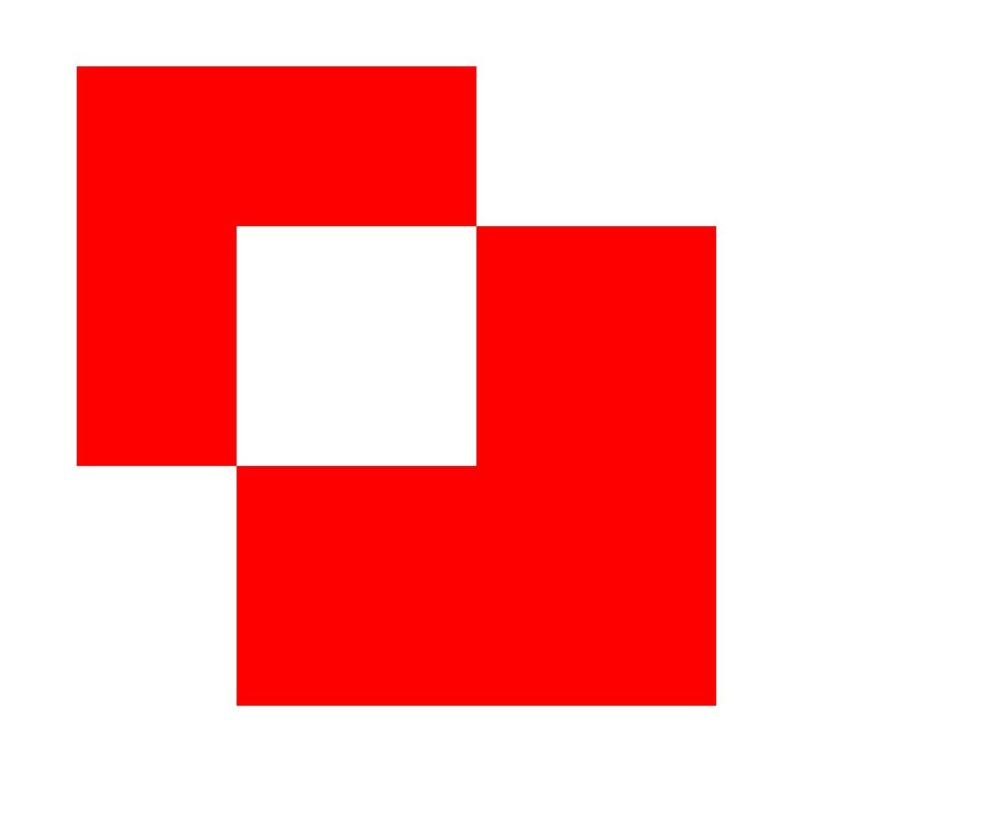

# Drawing Geometric Shapes (C/C++)
<!--Kit: ArkGraphics 2D-->
<!--Subsystem: Graphic-->
<!--Owner: @hangmengxin-->
<!--Designer: @wangyanglan-->
<!--Tester: @nobuggers-->
<!--Adviser: @ge-yafang-->


## Overview

The following geometric shapes can be drawn:

- Point

- Arc

- Circle

- Path

- Region

- Rectangle

- Rounded rectangle

Most geometric shapes can be drawn using a pen or brush. Points can only be drawn using a pen.


## Available APIs

The following table lists the APIs for drawing geometric shapes. For details, see [drawing_canvas.h](../reference/apis-arkgraphics2d/capi-drawing-canvas-h.md).

| API| Description|
| -------- | -------- |
| OH_Drawing_Point\* OH_Drawing_PointCreate (float x, float y) | Creates a coordinate point object.|
| OH_Drawing_ErrorCode OH_Drawing_CanvasDrawPoint (OH_Drawing_Canvas \*canvas, const OH_Drawing_Point2D \*point) | Draws a point.|
| OH_Drawing_Rect\* OH_Drawing_RectCreate (float left, float top, float right, float bottom) | Creates a rectangle object.|
| void OH_Drawing_CanvasDrawArc (OH_Drawing_Canvas\*, const OH_Drawing_Rect\*, float startAngle, float sweepAngle) | Draws an arc.|
| void OH_Drawing_CanvasDrawCircle (OH_Drawing_Canvas\*, const OH_Drawing_Point\*, float radius) | Draws a circle.|
| OH_Drawing_Path\* OH_Drawing_PathCreate (void) | Creates a path object.|
| void OH_Drawing_CanvasDrawPath (OH_Drawing_Canvas\*, const OH_Drawing_Path\*) | Draws a path.|
| OH_Drawing_Region\* OH_Drawing_RegionCreate (void) | Creates a region object.|
| void OH_Drawing_CanvasDrawRegion (OH_Drawing_Canvas\*, const OH_Drawing_Region\*) | Draws a region.|
| void OH_Drawing_CanvasDrawRect (OH_Drawing_Canvas\*, const OH_Drawing_Rect\*) | Draws a rectangle.|
| OH_Drawing_RoundRect\* OH_Drawing_RoundRectCreate (const OH_Drawing_Rect\*, float xRad, float yRad) | Creates a rounded rectangle object.|
| void OH_Drawing_CanvasDrawRoundRect (OH_Drawing_Canvas\*, const OH_Drawing_RoundRect\*) | Draws a rounded rectangle.|


## Drawing Points

Points can only be drawn on the canvas using a pen. You can use the **OH_Drawing_CanvasDrawPoint()** API to draw points. This API takes two parameters: (1) **Canvas** object, which must be created or obtained. For details, see [Obtaining a Canvas and Displaying Drawing Results (C/C++)](canvas-get-result-draw-c.md); (2) pointer to the point to be drawn.

A simple example is as follows:

<!-- @[ndk_graphics_draw_point](https://gitcode.com/openharmony/applications_app_samples/blob/master/code/DocsSample/ArkGraphics2D/Drawing/NDKGraphicsDraw/entry/src/main/cpp/samples/sample_graphics.cpp) -->

``` C++
// Create a pen object.
OH_Drawing_Pen* pen = OH_Drawing_PenCreate();
// Set the pen color.
OH_Drawing_PenSetColor(pen, OH_Drawing_ColorSetArgb(RGBA_MAX, RGBA_MAX, RGBA_MIN, RGBA_MIN));
// Set the pen width to 40.
OH_Drawing_PenSetWidth(pen, 40);
// Set the pen of the canvas.
OH_Drawing_CanvasAttachPen(canvas, pen);
// Draw five points.
AdaptationUtil* adaptationUtil = AdaptationUtil::GetInstance();
OH_Drawing_Point2D point1 = {value200_, value200_};
OH_Drawing_CanvasDrawPoint(canvas, &point1);
OH_Drawing_Point2D point2 = {value400_, value400_};
OH_Drawing_CanvasDrawPoint(canvas, &point2);
OH_Drawing_Point2D point3 = {value600_, value600_};
OH_Drawing_CanvasDrawPoint(canvas, &point3);
OH_Drawing_Point2D point4 = {value800_, value800_};
OH_Drawing_CanvasDrawPoint(canvas, &point4);
OH_Drawing_Point2D point5 = {value1000_, value1000_};
OH_Drawing_CanvasDrawPoint(canvas, &point5);
// Remove the pen from the canvas.
OH_Drawing_CanvasDetachPen(canvas);
// Destroy objects.
OH_Drawing_PenDestroy(pen);
```


The effect is as follows:


## Drawing an Arc

You can use a pen or brush to draw an arc on the canvas by calling **OH_Drawing_CanvasDrawArc()**. The following four parameters need to be passed to use the API:

- A **Canvas** object. Ensure that the canvas has been created or obtained. For details, see [Obtaining a Canvas and Displaying Drawing Results (C/C++)](canvas-get-result-draw-c.md).

- A rectangle object. The arc is drawn based on the outline of the rectangle.

- A floating point parameter, indicating the start angle of the arc.

- Another floating point parameter, indicating the sweep angle of the arc.

The following is an example of drawing an arc using a pen:

<!-- @[ndk_graphics_draw_arc](https://gitcode.com/openharmony/applications_app_samples/blob/master/code/DocsSample/ArkGraphics2D/Drawing/NDKGraphicsDraw/entry/src/main/cpp/samples/sample_graphics.cpp) -->

``` C++
// Create a pen object.
OH_Drawing_Pen* pen = OH_Drawing_PenCreate();
// Set the stroke color of the pen.
OH_Drawing_PenSetColor(pen, OH_Drawing_ColorSetArgb(RGBA_MAX, RGBA_MAX, RGBA_MIN, RGBA_MIN));
// Set the pen width to 20.
OH_Drawing_PenSetWidth(pen, 20);
// Set the pen of the canvas.
OH_Drawing_CanvasAttachPen(canvas, pen);
// Create a rectangle object. The upper left corner coordinates are (100, 200) and the lower right corner coordinates are (500, 300).
OH_Drawing_Rect* rect = OH_Drawing_RectCreate(100, 200, 500, 300);
// Draw an arc based on the rectangle object. The start angle is 10°, and the sweep angle is 200°.
OH_Drawing_CanvasDrawArc(canvas, rect, 10, 200);
// Remove the pen from the canvas.
OH_Drawing_CanvasDetachPen(canvas);
// Destroy objects.
OH_Drawing_PenDestroy(pen);
OH_Drawing_RectDestroy(rect);
```

The effect is as follows:


## Drawing a Circle

You can use the pen or brush to draw a circle on the canvas by calling **OH_Drawing_CanvasDrawCircle()**. The following three parameters need to be passed to use the API:

- A **Canvas** object. Ensure that the canvas has been created or obtained. For details, see [Obtaining a Canvas and Displaying Drawing Results (C/C++)](canvas-get-result-draw-c.md).

- A pointer to the center point object. The circle is drawn with the center point as the center.

- A floating point parameter, indicating the radius of the circle.

The following is an example of drawing a circle using a pen:

<!-- @[ndk_graphics_draw_circle](https://gitcode.com/openharmony/applications_app_samples/blob/master/code/DocsSample/ArkGraphics2D/Drawing/NDKGraphicsDraw/entry/src/main/cpp/samples/sample_graphics.cpp) -->

``` C++
// Create a pen object.
OH_Drawing_Pen* pen = OH_Drawing_PenCreate();
// Set the stroke color of the pen.
OH_Drawing_PenSetColor(pen, OH_Drawing_ColorSetArgb(RGBA_MAX, RGBA_MAX, RGBA_MIN, RGBA_MIN));
// Set the pen width to 20.
OH_Drawing_PenSetWidth(pen, 20);
// Set the pen of the canvas.
OH_Drawing_CanvasAttachPen(canvas, pen);
// Create the center point.
OH_Drawing_Point *point = OH_Drawing_PointCreate(value700_, value700_);
// Draw a circle on the canvas based on the center point and radius.
OH_Drawing_CanvasDrawCircle(canvas, point, value600_);
// Remove the pen from the canvas.
OH_Drawing_CanvasDetachPen(canvas);
// Destroy objects.
OH_Drawing_PenDestroy(pen);
OH_Drawing_PointDestroy(point);
```

The effect is as follows:


## Drawing a Path

You can use a pen or brush to draw a path on the canvas. The path can be used to draw a straight line, arc, or Bezier curve, or form other complex shapes through path combination.

The following describes the APIs and implementation of drawing a path. For details about the usage and parameters, see [drawing_path](../reference/apis-arkgraphics2d/capi-drawing-path-h.md). The common APIs are as follows:

1. **OH_Drawing_PathCreate()**: creates a path object.

2. **OH_Drawing_PathMoveTo()**: sets the start point of the path.

3. **OH_Drawing_PathLineTo()**: draws a line segment from the start point or the last point of the path (if the path is empty, the start point (0, 0) is used) to the target point.

The following is an example of drawing a five-pointed star using a pen and a brush:

<!-- @[ndk_graphics_draw_path](https://gitcode.com/openharmony/applications_app_samples/blob/master/code/DocsSample/ArkGraphics2D/Drawing/NDKGraphicsDraw/entry/src/main/cpp/samples/sample_graphics.cpp) -->

``` C++
// Create a pen object.
OH_Drawing_Pen* pen = OH_Drawing_PenCreate();
// Set the stroke color of the pen.
OH_Drawing_PenSetColor(pen, OH_Drawing_ColorSetArgb(RGBA_MAX, RGBA_MAX, RGBA_MIN, RGBA_MIN));
// Set the pen width to 10.
OH_Drawing_PenSetWidth(pen, 10);
// Set the pen join style.
OH_Drawing_PenSetJoin(pen, LINE_ROUND_JOIN);
// Set the pen of the canvas.
OH_Drawing_CanvasAttachPen(canvas, pen);
//Create a brush. In this example, the closed path is filled with color, so a brush is required.
OH_Drawing_Brush *brush = OH_Drawing_BrushCreate();
OH_Drawing_BrushSetColor(brush, OH_Drawing_ColorSetArgb(RGBA_MAX, RGBA_MIN, RGBA_MAX, RGBA_MIN));
// Set the brush of the canvas.
OH_Drawing_CanvasAttachBrush(canvas, brush);
int len = value551_;
float aX = value630_;
float aY = value551_;
float dX = aX - len * std::sin(18.0f);
float dY = aY + len * std::cos(18.0f);
float cX = aX + len * std::sin(18.0f);
float cY = dY;
float bX = aX + (len / 2.0);
float bY = aY + std::sqrt((cX - dX) * (cX - dX) + (len / 2.0) * (len / 2.0));
float eX = aX - (len / 2.0);
float eY = bY;
// Create a path.
OH_Drawing_Path* path = OH_Drawing_PathCreate();
// Go to the start point.
OH_Drawing_PathMoveTo(path, aX, aY);
// Draw a line.
OH_Drawing_PathLineTo(path, bX, bY);
OH_Drawing_PathLineTo(path, cX, cY);
OH_Drawing_PathLineTo(path, dX, dY);
OH_Drawing_PathLineTo(path, eX, eY);
// Close the line to form a five-point star.
OH_Drawing_PathClose(path);
// Draw a closed path.
OH_Drawing_CanvasDrawPath(canvas, path);
// Remove the pen and brush from the canvas.
OH_Drawing_CanvasDetachPen(canvas);
OH_Drawing_CanvasDetachBrush(canvas);
// Destroy objects.
OH_Drawing_PenDestroy(pen);
OH_Drawing_BrushDestroy(brush);
OH_Drawing_PathDestroy(path);
```

The effect is as follows:


## Drawing a Region

A region is not a specific shape. You can set it to a specified rectangle or path, or combine two regions. You can use a pen or brush to draw a region on the canvas. For details about the APIs, see [drawing_region.h](../reference/apis-arkgraphics2d/capi-drawing-region-h.md).

You can call **OH_Drawing_RegionSetRect()** and **OH_Drawing_RegionSetPath()** to set the rectangle region and path region, respectively.

The following is an example of drawing a rectangle region using a brush:

<!-- @[ndk_graphics_draw_region](https://gitcode.com/openharmony/applications_app_samples/blob/master/code/DocsSample/ArkGraphics2D/Drawing/NDKGraphicsDraw/entry/src/main/cpp/samples/sample_graphics.cpp) -->

``` C++
// Create a brush object.
OH_Drawing_Brush* brush = OH_Drawing_BrushCreate();
// Set the fill color of the brush.
OH_Drawing_BrushSetColor(brush, OH_Drawing_ColorSetArgb(RGBA_MAX, RGBA_MAX, RGBA_MIN, RGBA_MIN));
// Set the brush of the canvas.
OH_Drawing_CanvasAttachBrush(canvas, brush);
// Rectangle region 1.
OH_Drawing_Region *region1 = OH_Drawing_RegionCreate();
OH_Drawing_Rect *rect1 = OH_Drawing_RectCreate(value100_, value100_, value600_, value600_);
OH_Drawing_RegionSetRect(region1, rect1);
// Rectangle region 2.
OH_Drawing_Region *region2 = OH_Drawing_RegionCreate();
OH_Drawing_Rect *rect2 = OH_Drawing_RectCreate(value300_, value300_, value900_, value900_);
OH_Drawing_RegionSetRect(region2, rect2);
// Combination of two rectangle regions.
OH_Drawing_RegionOp(region1, region2, OH_Drawing_RegionOpMode::REGION_OP_MODE_XOR);
OH_Drawing_CanvasDrawRegion(canvas, region1);
// Remove the brush from the canvas.
OH_Drawing_CanvasDetachBrush(canvas);
// Destroy objects.
OH_Drawing_BrushDestroy(brush);
OH_Drawing_RegionDestroy(region1);
OH_Drawing_RegionDestroy(region2);
OH_Drawing_RectDestroy(rect1);
OH_Drawing_RectDestroy(rect2);
```

The effect is as follows:




## Drawing a Rectangle

You can use a pen or brush to draw a rectangle on the canvas. Use **OH_Drawing_RectCreate()** to create a rectangle. The API needs to pass four floating points, which indicate the coordinates of the left, top, right, and bottom positions of the rectangle. The four coordinates form a rectangle.

A simple example is as follows:

<!-- @[ndk_graphics_draw_rect](https://gitcode.com/openharmony/applications_app_samples/blob/master/code/DocsSample/ArkGraphics2D/Drawing/NDKGraphicsDraw/entry/src/main/cpp/samples/sample_graphics.cpp) -->

``` C++
// Create a brush object.
OH_Drawing_Brush *brush = OH_Drawing_BrushCreate();
// Set the fill color of the brush.
OH_Drawing_BrushSetColor(brush, 0xffff0000);
// Set the brush of the canvas.
OH_Drawing_CanvasAttachBrush(canvas, brush);
OH_Drawing_Rect* rect = OH_Drawing_RectCreate(0, 0, value800_, value800_);
// Draw a rectangle.
OH_Drawing_CanvasDrawRect(canvas, rect);
// Remove the brush from the canvas.
OH_Drawing_CanvasDetachBrush(canvas);
// Destroy objects.
OH_Drawing_BrushDestroy(brush);
OH_Drawing_RectDestroy(rect);
```

The effect is as follows:


## Drawing a Rounded Rectangle

You can use a pen or brush to draw a rounded rectangle on the canvas. Use **OH_Drawing_RoundRectCreate()** to create a rounded rectangle. The following three parameters need to be passed to use the API:

- Pointer to the **OH_Drawing_Rect** rectangle object, which is used to draw the rounded rectangle.

- A floating-point parameter, indicating the radius of the rounded rectangle on the X axis.

- Another floating-point parameter, indicating the radius of the rounded rectangle on the Y axis.

A simple example is as follows:

<!-- @[ndk_graphics_draw_round_rect](https://gitcode.com/openharmony/applications_app_samples/blob/master/code/DocsSample/ArkGraphics2D/Drawing/NDKGraphicsDraw/entry/src/main/cpp/samples/sample_graphics.cpp) -->

``` C++
// Create a brush object.
OH_Drawing_Brush *brush = OH_Drawing_BrushCreate();
// Set the fill color of the brush.
OH_Drawing_BrushSetColor(brush, 0xffff0000);
// Set the brush of the canvas.
OH_Drawing_CanvasAttachBrush(canvas, brush);
// Create a rectangle.
OH_Drawing_Rect* rect = OH_Drawing_RectCreate(value100_, value100_, value900_, value600_);
// Create a rounded rectangle.
OH_Drawing_RoundRect* roundRect = OH_Drawing_RoundRectCreate(rect, 30, 30);
// Draw a rounded rectangle.
OH_Drawing_CanvasDrawRoundRect(canvas, roundRect);
// Remove the brush from the canvas.
OH_Drawing_CanvasDetachBrush(canvas);
// Destroy objects.
OH_Drawing_BrushDestroy(brush);
OH_Drawing_RectDestroy(rect);
OH_Drawing_RoundRectDestroy(roundRect);
```


The effect is as follows:


<!--RP1-->
## Samples

The following samples are provided to help you better understand how to use the **Drawing** APIs (C/C++) for development:

- [NDKGraphicsDraw (API20)](https://gitcode.com/openharmony/applications_app_samples/tree/master/code/DocsSample/ArkGraphics2D/Drawing/NDKGraphicsDraw)
<!--RP1End-->
