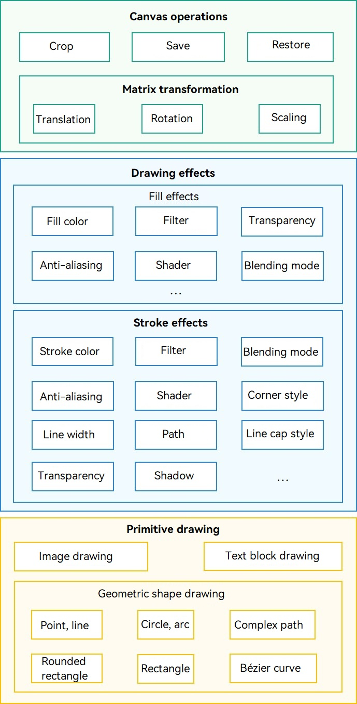
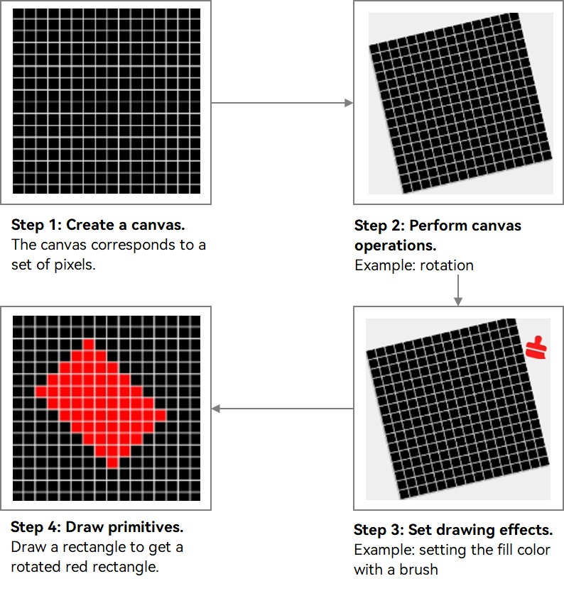

# Overview of Graphics Drawing and Display

<!--Kit: ArkGraphics 2D-->
<!--Subsystem: Graphics-->
<!--Owner: @hangmengxin-->
<!--Designer: @wangyanglan-->
<!--Tester: @nobuggers-->
<!--Adviser: @ge-yafang-->

## Overview

During application development, you often need to draw different elements. Typically, you can use ArkUI components to draw the desired elements or effects. However, sometimes these components cannot meet the needs for custom graphics or effects. In such cases, you can turn to the Drawing module for flexible custom drawing. In addition, ArkUI components can be directly displayed on the screen, while Drawing focuses more on drawing and requires other modules to display the drawing results on the screen.

## Drawing Capabilities and Workflow

**Figure 1** Main capabilities of graphics drawing

ArkGraphics 2D provides a series of flexible and diversified graphics drawing APIs based on the 2D image rendering engine. The APIs are classified into canvas operations, drawing effects, and primitive drawing. The preceding figure shows the key capabilities supported by each part. More capabilities may be supported in the future. For details, see the corresponding API reference.

Canvas operations, drawing effects, and primitive drawing are also key steps and processes for implementing graphics drawing. For details, see the following figure.

**Figure 2** Workflow of graphics drawing

The 2D graphics drawing process is similar to the actual drawing process. The preceding figure uses the drawing of a rotated red filled rectangle as an example to describe the graphics drawing workflow. The procedure is as follows:

1. **(Mandatory) Create a canvas**: The canvas is the carrier of graphics drawing and is the most critical part. Before drawing graphics, you need to create a canvas to ensure that the graphics can be carried and then perform subsequent settings and operations.

2. **(Optional) Perform canvas operations**: After a canvas is created, you can perform operations on the canvas, such as clipping, rotation, and scaling. This step is optional. You can perform canvas operations as needed.

3. **(Optional) Set the drawing effect**: The drawing effect is implemented through the brush and pen. The pen is used for the outline of the graphics, and the brush is used for the internal area of the graphics. You can use brushes and pens to implement various fill and stroke effects. You can set related effects based on the specific UI effect and requirements. If no drawing effect is set, the default drawing effect is used.

4. **(Mandatory) Draw primitives**: The last step of drawing graphics is to draw primitives. No matter how complex the graphics are, they are different combinations of basic primitives. ArkGraphics 2D supports the drawing of multiple primitives. After creating a canvas and completing related operations and settings, you can select the corresponding primitives to complete the drawing process.

## Displaying the Drawing Result

The preceding content describes the main drawing capabilities and workflow of ArkGraphics 2D based on the 2D image rendering engine. After drawing is complete based on the canvas, you need to display the drawing result on the screen to implement the visible graphical UI content on the screen.

The drawing display modes are as follows:

1. Displaying on the screen through [RenderNode](../reference/apis-arkui/js-apis-arkui-renderNode.md) (ArkTS): Obtain the canvas through **RenderNode**, draw the canvas, and display the drawing result on the screen through **RenderNode**. For details, see [Obtaining a Canvas and Displaying Drawing Results (ArkTS)](canvas-get-result-draw-arkts.md#obtaining-a-canvas-that-can-be-directly-displayed).

2. Displaying the drawing result on the screen through XComponent (C/C++): Create a canvas, draw the canvas, copy the drawing result to the buffer, and display the drawing result on the screen through XComponent. For details, see [Obtaining a Canvas and Displaying Drawing Results (C/C++)](canvas-get-result-draw-c.md#obtaining-a-canvas-that-can-be-directly-displayed).

## Relationship with the Canvas Component

The [Canvas component](../reference/apis-arkui/arkui-ts/ts-components-canvas-canvas.md) also has the self-drawing capability. There are two sets of APIs: [CanvasRenderingContext2D](../reference/apis-arkui/arkui-ts/ts-canvasrenderingcontext2d.md)/[OffscreenCanvasRenderingContext2D](../reference/apis-arkui/arkui-ts/ts-offscreencanvasrenderingcontext2d.md) and [DrawingRenderingContext](../reference/apis-arkui/arkui-ts/ts-drawingrenderingcontext.md). The content drawn by the two sets of drawing APIs can be displayed on the bound Canvas component.

**CanvasRenderingContext2D** encapsulates the native Drawing APIs of ArkGraphics 2D based on the W3C standard, which facilitates the reuse of the drawing logic of web applications. Therefore, **CanvasRenderingContext2D** is applicable to scenarios such as web applications and games, prototyping, data visualization, online drawing boards, teaching tools, and creative applications.

The bottom layer of the [Canvas component](../reference/apis-arkui/arkui-ts/ts-components-canvas-canvas.md) also uses the [Native Drawing](../reference/apis-arkgraphics2d/capi-drawing.md) API to implement the drawing function. The drawing capabilities of the two are the same. However, due to the multi-layer encapsulation implementation, the Canvas component is not as close to the hardware as the [Native Drawing Canvas](../reference/apis-arkgraphics2d/capi-drawing-canvas-h.md). Therefore, in scenarios with high performance requirements, complex drawing, and strong hardware dependency, such as professional graphics processing software, desktop or mobile applications, using the Canvas component for drawing may cause performance problems such as frame freezing and frame loss. In this case, you can use the self-drawing capability of the **Native Drawing** APIs to ensure the drawing performance of the application.

## Constraints

The unit used during graphics drawing is pixel (px).

<!--RP1--><!--RP1End-->
