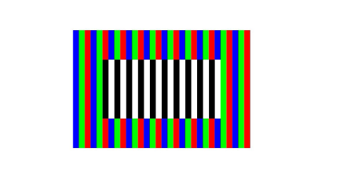

# Drawing Images (ArkTS)

<!--Kit: ArkGraphics 2D-->
<!--Subsystem: Graphics-->
<!--Owner: @hangmengxin-->
<!--Designer: @wangyanglan-->
<!--Tester: @nobuggers-->
<!--Adviser: @ge-yafang-->

A bitmap is a data structure used to store and represent images in memory. It is a collection of uncompressed pixels. Images in formats such as JPEG and PNG are compressed, and are different from bitmaps. If you want to draw a JPEG or PNG image on the screen, you need to decode the image into a bitmap first. For details, see the image decoding section in [Image Kit](../media/image/image-overview.md).


Currently, bitmap drawing in Drawing (ArkTS) depends on PixelMap, which can be used to read or write image data and obtain image information. For details about the APIs, see [PixelMap](../reference/apis-image-kit/arkts-apis-image-PixelMap.md).


1. Create a **PixelMap** instance.

   You can use multiple APIs to create a PixelMap. The following uses createPixelMapSync() as an example. For details about more creation modes and APIs, see @ohos.multimedia.image (Image Processing).

   <!-- @[arkts_graphics_draw_image](https://gitcode.com/openharmony/applications_app_samples/blob/master/code/DocsSample/ArkGraphics2D/Drawing/ArkTSGraphicsDraw/entry/src/main/ets/drawing/pages/PixelMapDrawing.ets) -->
   
   ``` TypeScript
   // Image width and height
   let width = 600;
   let height = 400;
   // Byte length. Each pixel of RGBA_8888 occupies four bytes.
   let byteLength = width * height * 4;
   const color: ArrayBuffer = new ArrayBuffer(byteLength);
   let bufferArr = new Uint8Array(color);
   for (let i = 0; i < bufferArr.length; i += 4) {
     // Traverse and edit each pixel to form red, green, and blue stripes.
     bufferArr[i] = 0x00;
     bufferArr[i+1] = 0x00;
     bufferArr[i+2] = 0x00;
     bufferArr[i+3] = 0xFF;
     let n = Math.floor(i / 80) % 3;
     if (n == 0) {
       bufferArr[i] = 0xFF;
     } else if (n == 1) {
       bufferArr[i+1] = 0xFF;
     } else {
       bufferArr[i+2] = 0xFF;
     }
   }
   // Set pixel attributes.
   let opts: image.InitializationOptions =
     { editable: true, pixelFormat: image.PixelMapFormat.RGBA_8888, size: { height: height, width: width } };
   // Create a PixelMap instance.
   pixelMap = image.createPixelMapSync(color, opts);
   ```

2. (Optional) Edit pixels in the PixelMap. If no pixel needs to be edited, skip this step.

   Several APIs are available to edit pixels in a PixelMap. The following uses writePixelsSync() as an example. For details about other methods and APIs, please refer to [PixelMap](../reference/apis-image-kit/arkts-apis-image-PixelMap.md).

   <!-- @[arkts_graphics_draw_edit_pixel](https://gitcode.com/openharmony/applications_app_samples/blob/master/code/DocsSample/ArkGraphics2D/Drawing/ArkTSGraphicsDraw/entry/src/main/ets/drawing/pages/PixelMapDrawing.ets) -->
   
   ``` TypeScript
   // Set the width and height of the editing area.
   let innerWidth = 400;
   let innerHeight = 200;
   // Set the byte length of the editing area. Each pixel in RGBA_8888 occupies four bytes.
   let innerByteLength = innerWidth * innerHeight * 4;
   const innerColor: ArrayBuffer = new ArrayBuffer(innerByteLength);
   let innerBufferArr = new Uint8Array(innerColor);
   for (let i = 0; i < innerBufferArr.length; i += 4) {
     // Set the pixels in the editing area to black and white stripes.
     let n = Math.floor(i / 80) % 2;
     if (n == 0) {
       innerBufferArr[i] = 0x00;
       innerBufferArr[i+1] = 0x00;
       innerBufferArr[i+2] = 0x00;
     } else {
       innerBufferArr[i] = 0xFF;
       innerBufferArr[i+1] = 0xFF;
       innerBufferArr[i+2] = 0xFF;
     }
     innerBufferArr[i+3] = 0xFF;
   }
   // Set the pixels, width, height, and offset of the editing area.
   const area: image.PositionArea = {
     pixels: innerColor,
     offset: 0,
     stride: innerWidth * 4,
     region: { size: { height: innerHeight, width: innerWidth }, x: 100, y: 100 }
   };
   // Edit the bitmap to form black and white stripes in the middle.
   pixelMap.writePixelsSync(area);
   //To display the entire image, change the start point of the drawing to (0, 0).
   canvas.drawImage(pixelMap, 0, 0);
   ```

3. Draw the PixelMap.

   You need to use the Canva APIs to draw the bitmap. The following uses drawImage() as an example. For details about more methods and APIs, see [drawing.Canvas](../reference/apis-arkgraphics2d/arkts-apis-graphics-drawing-Canvas.md).

   The drawImage() function accepts four parameters. The first parameter is the PixelMap created above, the second parameter is the x-coordinate of the upper left corner of the image to be drawn, the third parameter is the y-coordinate of the upper left corner, and the fourth parameter is the sampling option object. By default, the original sampling option object constructed without any parameter is used.

   <!-- @[arkts_graphics_draw_image_pixel_map](https://gitcode.com/openharmony/applications_app_samples/blob/master/code/DocsSample/ArkGraphics2D/Drawing/ArkTSGraphicsDraw/entry/src/main/ets/drawing/pages/PixelMapDrawing.ets) -->
   
   ``` TypeScript
   //To display the entire image, change the start point of the drawing to (0, 0).
   canvas.drawImage(pixelMap, 0, 0);
   ```

   The drawing effect is as follows:

   

<!--RP1-->
## Samples

The following samples can be used for reference when developing Drawing (ArkTS):

- [ArkTSGraphicsDraw (API20)](https://gitcode.com/openharmony/applications_app_samples/tree/master/code/DocsSample/ArkGraphics2D/Drawing/ArkTSGraphicsDraw)
<!--RP1End-->
