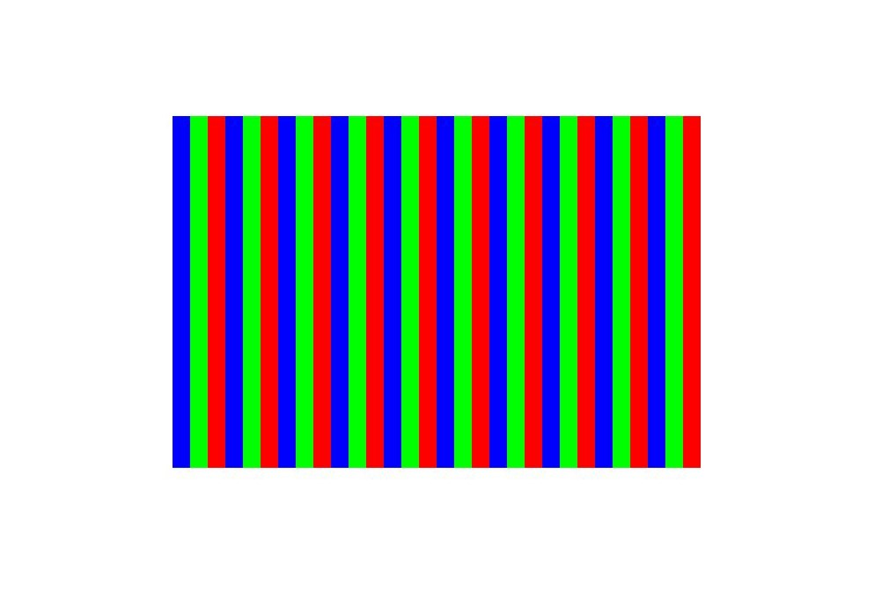

# Drawing Images (C/C++)

<!--Kit: ArkGraphics 2D-->
<!--Subsystem: Graphics-->
<!--Owner: @hangmengxin-->
<!--Designer: @wangyanglan-->
<!--Tester: @nobuggers-->
<!--Adviser: @ge-yafang-->

A pixel map is a data structure used to store and represent images in memory. It is an uncompressed collection of pixels. Images in formats such as JPEG or PNG are compressed, which are different from pixel maps. If you need to draw JPEG or PNG images on the screen, decode them into the pixel map format first. For details about image decoding, see [Introduction to Image Kit](../media/image/image-overview.md).


Drawing pixel maps using the **Drawing** APIs (C/C++) depends on the **PixelMap** module, which can read or write image data and obtain image information. For details about the **PixelMap** APIs, see [drawing_pixel_map.h](../reference/apis-arkgraphics2d/capi-drawing-pixel-map-h.md).


You can create a **PixelMap** instance using multiple APIs. The following uses **OH_Drawing_PixelMapGetFromOhPixelMapNative()** as an example.


1. Add link libraries.

   Add the following link libraries to **src/main/cpp/CMakeLists.txt** of the Native project.

   ```c++
   target_link_libraries(entry PUBLIC libnative_drawing.so)
   target_link_libraries(entry PUBLIC libhilog_ndk.z.so)
   target_link_libraries(entry PUBLIC libpixelmap.so)
   ```

2. Import the required header files.

   <!-- @[ndk_graphics_draw_include_pixelmap_native](https://gitcode.com/openharmony/applications_app_samples/blob/master/code/DocsSample/ArkGraphics2D/Drawing/NDKGraphicsDraw/entry/src/main/cpp/samples/sample_graphics.cpp) -->
   
   ``` C++
   #include <multimedia/image_framework/image/pixelmap_native.h>
   ```

3. Create an **OH_PixelmapNative** object.

   The pixel map needs to be obtained from the **OH_PixelmapNative** object defined by the image framework. Therefore, you need to create **OH_PixelmapNative** by calling **OH_PixelmapNative_CreatePixelmap()**. This function takes four parameters: (1) buffer of the image pixel data, which is used to initialize the pixels of **PixelMap**; (2) buffer size; (3) pixel map format, including the width, height, color type, and alpha type; (4) **OH_PixelmapNative** object, which is used as an output parameter.

   <!-- @[ndk_graphics_draw_image_pixel_map](https://gitcode.com/openharmony/applications_app_samples/blob/master/code/DocsSample/ArkGraphics2D/Drawing/NDKGraphicsDraw/entry/src/main/cpp/samples/sample_graphics.cpp) -->
   
   ``` C++
   // The image width x height is 600 x 400.
   uint32_t width = 600;
   uint32_t height = 400;
   // Byte length. Each RGBA_8888 pixel occupies 4 bytes.
   size_t bufferSize = width * height * 4;
   uint8_t *pixels = new uint8_t[bufferSize];
   for (uint32_t i = 0; i < width * height; ++i) {
       // Traverse and edit each pixel to form red, green, and blue stripes.
       uint32_t n = i / 20 % 3;
       pixels[i * RGBA_SIZE] = RGBA_MIN; // Red channel.
       pixels[i * RGBA_SIZE + 1] = RGBA_MIN; // Green channel.
       pixels[i * RGBA_SIZE + 2] = RGBA_MIN; // Blue channel.
       pixels[i * RGBA_SIZE + 3] = 0xFF; // Opacity channel.
       if (n == 0) {
           pixels[i * RGBA_SIZE] = 0xFF; // Assign a value to the red channel. The color is displayed in red.
       } else if (n == 1) {
           pixels[i * RGBA_SIZE + 1] = 0xFF; // Assign a value to the green channel while keeping other channels at 0. The color is displayed in green.
       } else {
           pixels[i * RGBA_SIZE + 2] = 0xFF; // Assign a value to the blue channel while keeping other channels at 0. The color is displayed in blue.
       }
   }
   // Set the pixel map format (length, width, color type, and alpha type).
   OH_Pixelmap_InitializationOptions *createOps = nullptr;
   OH_PixelmapInitializationOptions_Create(&createOps);
   OH_PixelmapInitializationOptions_SetWidth(createOps, width);
   OH_PixelmapInitializationOptions_SetHeight(createOps, height);
   OH_PixelmapInitializationOptions_SetPixelFormat(createOps, PIXEL_FORMAT_RGBA_8888);
   OH_PixelmapInitializationOptions_SetAlphaType(createOps, PIXELMAP_ALPHA_TYPE_UNKNOWN);
   // Create an OH_PixelmapNative object.
   OH_PixelmapNative *pixelMapNative = nullptr;
   OH_PixelmapNative_CreatePixelmap(pixels, bufferSize, createOps, &pixelMapNative);
   ```

4. Create a **PixelMap** instance.

   Obtain **PixelMap** from **OH_PixelmapNative** by calling the **OH_Drawing_PixelMapGetFromOhPixelMapNative()** function.

   <!-- @[ndk_graphics_draw_create_pixel_map](https://gitcode.com/openharmony/applications_app_samples/blob/master/code/DocsSample/ArkGraphics2D/Drawing/NDKGraphicsDraw/entry/src/main/cpp/samples/sample_graphics.cpp) -->
   
   ``` C++
   OH_Drawing_PixelMap *pixelMap = OH_Drawing_PixelMapGetFromOhPixelMapNative(pixelMapNative);
   ```

5. Draw the pixel map.

   Use **OH_Drawing_CanvasDrawPixelMapRect()** to draw the pixel map. The function takes five parameters: (1) canvas; (2) **PixelMap** object; (3) cropping area of the pixels in the pixel map; (4) area displayed on the canvas; (5) sampling option object.

   The sampling option object (**OH_Drawing_SamplingOptions**) indicates the specific method of sampling from the original pixel data (that is, the pixel map) to generate new pixel values. For details, see [drawing_sampling_options.h](../reference/apis-arkgraphics2d/capi-drawing-sampling-options-h.md).

   <!-- @[ndk_graphics_draw_image_to_canvas](https://gitcode.com/openharmony/applications_app_samples/blob/master/code/DocsSample/ArkGraphics2D/Drawing/NDKGraphicsDraw/entry/src/main/cpp/samples/sample_graphics.cpp) -->
   
   ``` C++
   // Cropping area of the pixels in the pixel map.
   OH_Drawing_Rect *src = OH_Drawing_RectCreate(0, 0, 600, 400);
   // Area displayed on the canvas.
   OH_Drawing_Rect *dst = OH_Drawing_RectCreate(value200_, value200_, value800_, value600_);
   // Sampling option object.
   OH_Drawing_SamplingOptions* samplingOptions = OH_Drawing_SamplingOptionsCreate(
       OH_Drawing_FilterMode::FILTER_MODE_LINEAR, OH_Drawing_MipmapMode::MIPMAP_MODE_LINEAR);
   // Draw the pixel map.
   OH_Drawing_CanvasDrawPixelMapRect(canvas, pixelMap, src, dst, samplingOptions);
   ```

6. Release related objects after the drawing is complete.

   <!-- @[ndk_graphics_draw_release_pixelmap](https://gitcode.com/openharmony/applications_app_samples/blob/master/code/DocsSample/ArkGraphics2D/Drawing/NDKGraphicsDraw/entry/src/main/cpp/samples/sample_graphics.cpp) -->
   
   ``` C++
   OH_PixelmapNative_Release(pixelMapNative);
   delete[] pixels;
   ```

   The drawing effect is as follows:

   

<!--RP1-->
## Samples

The following samples are provided to help you better understand how to use the **Drawing** APIs (C/C++) for development:

- [NDKGraphicsDraw (API20)](https://gitcode.com/openharmony/applications_app_samples/tree/master/code/DocsSample/ArkGraphics2D/Drawing/NDKGraphicsDraw)
<!--RP1End-->
