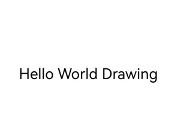

# Drawing and Displaying Simple Text (C/C++)
<!--Kit: ArkGraphics 2D-->
<!--Subsystem: Graphics-->
<!--Owner: @oh_wangxk; @gmiao522; @Lem0nC-->
<!--Designer: @liumingxiang-->
<!--Tester: @yhl0101-->
<!--Adviser: @ge-yafang-->

## Scenario Introduction

On a simple user interface, only a few lines of static text may need to be displayed, such as text on labels, buttons, menu items, or status bars. In this case, you only need to select a proper font, size, and color to complete rendering.


## Available APIs

| API Definition| Description| 
| -------- | -------- |
| OH_Drawing_TextStyle\* OH_Drawing_CreateTextStyle(void) | Creates an **OH_Drawing_TextStyle** object.| 
| void OH_Drawing_SetTextStyleFontSize(OH_Drawing_TextStyle\* style, double fontSize) | Sets the font size for a text style.| 
| void OH_Drawing_SetTextStyleFontWeight(OH_Drawing_TextStyle\* style, int fontWeight) | Sets the font weight for a text style. Currently, only the default system font supports font weight adjustment. For other fonts, if the weight is less than semi-bold, there is no variation in stroke thickness. If the weight is greater than or equal to semi-bold, it might result in a fake bold effect.| 


## How to Develop

For details about the canvas object, see canvas-get-result-draw-c.md.

```c++
// Create a TypographyStyle object.
OH_Drawing_TypographyStyle *typoStyle = OH_Drawing_CreateTypographyStyle();
// Set the text alignment mode to center.
OH_Drawing_SetTypographyTextAlign(typoStyle, TEXT_ALIGN_CENTER);

// Set the text color, size, and weight. If TextStyle is not set, the default TextStyle in TypographyStyle is used.
OH_Drawing_TextStyle *txtStyle = OH_Drawing_CreateTextStyle();
OH_Drawing_SetTextStyleColor(txtStyle, OH_Drawing_ColorSetArgb(0xFF, 0x00, 0x00, 0x00));
OH_Drawing_SetTextStyleFontSize(txtStyle, 60);
OH_Drawing_SetTextStyleFontWeight(txtStyle, FONT_WEIGHT_400);

// Create a FontCollection object. FontCollection is used to manage the font matching logic.
OH_Drawing_FontCollection *fc = OH_Drawing_CreateSharedFontCollection();
// Use FontCollection and TypographyStyle to create TypographyCreate. TypographyCreate is used to create Typography.
OH_Drawing_TypographyCreate *handler = OH_Drawing_CreateTypographyHandler(typoStyle, fc);

// Add the created TextStyle to the handler.
OH_Drawing_TypographyHandlerPushTextStyle(handler, txtStyle);
// Set the text content and add the text to the handler.
const char *text = "Hello World Drawing\n";
// You can use OH_Drawing_TypographyHandlerAddEncodedText to add texts in different encodings.
// OH_Drawing_TypographyHandlerAddText supports only texts in UTF-8 encoding.
OH_Drawing_TypographyHandlerAddText(handler, text);  

OH_Drawing_Typography *typography = OH_Drawing_CreateTypography(handler);
// Set the typography width.
double layoutWidth = 1310;
OH_Drawing_TypographyLayout(typography, layoutWidth);
// Set the start position for drawing the text on the canvas.
double position[2] = {0, 1140};
// Draw the text on the canvas.
OH_Drawing_TypographyPaint(typography, canvas, position[0], position[1]);

// Release the memory.
OH_Drawing_DestroyTypographyStyle(typoStyle);
OH_Drawing_DestroyTextStyle(txtStyle);
OH_Drawing_DestroyFontCollection(fc);
OH_Drawing_DestroyTypographyHandler(handler);
OH_Drawing_DestroyTypography(typography);
```


## Effect


