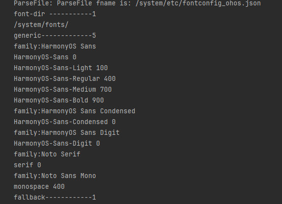
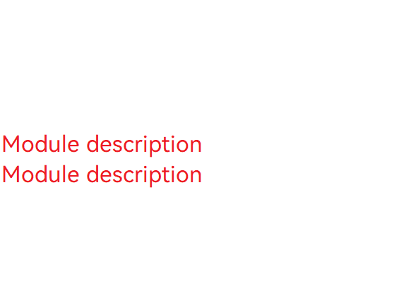

# Obtaining and Using System Fonts (ArkTS)
<!--Kit: ArkGraphics 2D-->
<!--Subsystem: Graphics-->
<!--Owner: @oh_wangxk; @gmiao522; @Lem0nC-->
<!--Designer: @liumingxiang-->
<!--Tester: @yhl0101-->
<!--Adviser: @ge-yafang-->
## Overview

System fonts are preset fonts of the operating system. They are used to display text when no custom font is specified, ensuring the readability and consistency of the text.

System fonts are used when an application does not register custom fonts or does not explicitly specify the text style. There are multiple system fonts. You can obtain the configuration information about system fonts and switch and use system fonts based on the font family name in the information.

Currently, system fonts cannot be disabled in ArkTS, but can be disabled in native code.

## Available APIs

The following describes the common APIs and structs related to system fonts. The external APIs in ArkTS are provided by ArkUI. For details about the APIs, see [@ohos.font](../reference/apis-arkui/js-apis-font.md).

| API| Description| 
| -------- | -------- |
| getUIFontConfig() : UIFontConfig | Obtains the system font configuration.| 

## Obtaining System Font Information

1. Import the required module.

   ```ts
   import { font } from '@kit.ArkUI'
   ```

2. Obtain the system font information.

   ```ts
   @Entry
   @Component
   struct FontExample {
     build() {
       Column() {
         Button("getUIFontConfig")
           .width('60%')
           .height('6%')
           .margin(50)
           .onClick(()=>{
             let fontConfig = font.getUIFontConfig();
           })
       }.width('100%')
     }
   }
   ```

3. Print the font information in logs after obtaining the system font information.
   <!-- @[arkts_system_font_info](https://gitcode.com/openharmony/applications_app_samples/blob/master/code/DocsSample/graphic/ArkGraphics2D/SystemFontInfoGet/entry/src/main/ets/pages/Index.ets) -->
   
   ``` TypeScript
   let fontConfig = font.getUIFontConfig();
   console.info('sysFontMfg::font-dir -----------' + String(fontConfig.fontDir.length));
   for (let i = 0; i < fontConfig.fontDir.length; i++) {
     console.info(fontConfig.fontDir[i]);
   }
   console.info('sysFontMfg::generic-------------' + String(fontConfig.generic.length));
   for (let i = 0; i < fontConfig.generic.length; i++) {
     console.info('sysFontMfg::family:' + fontConfig.generic[i].family);
     for (let j = 0; j < fontConfig.generic[i].alias.length; j++) {
       console.info(fontConfig.generic[i].alias[j].name + ' ' + fontConfig.generic[i].alias[j].weight);
     }
   }
   console.info('sysFontMfg::fallback------------' + String(fontConfig.fallbackGroups.length));
   for (let i = 0; i < fontConfig.fallbackGroups.length; i++) {
     console.info('sysFontMfg::fontSetName:' + fontConfig.fallbackGroups[i].fontSetName);
     for (let j = 0; j < fontConfig.fallbackGroups[i].fallback.length; j++) {
       console.info('sysFontMfg::language:' + fontConfig.fallbackGroups[i].fallback[j].language + ' family:' +
         fontConfig.fallbackGroups[i].fallback[j].family);
     }
   }
   ```
   
  The following figure shows some system font configuration information of the application device system. The configuration information varies according to devices.

  

## Using or Switching System Fonts

There are multiple system fonts. You can obtain the configuration information about system fonts and switch and use system fonts based on the font family name (**fontFamilies** in **TextStyle**).

If no font is specified, the default system font "HarmonyOS Sans" is used to display text.
1. Import the required module.

   ```ts
   import { text } from '@kit.ArkGraphics2D';
   ```

2. Create **TextStyle1** and set **fontFamilies** to **HarmonyOS Sans SC**, which is the default Chinese font.
   <!-- @[arkts_use_and_change_system_font_step1](https://gitcode.com/openharmony/applications_app_samples/blob/master/code/DocsSample/graphic/ArkGraphics2D/SystemFontInfoGet/entry/src/main/ets/pages/Index.ets) -->
   
   ``` TypeScript
   let textStyle1: text.TextStyle = {
     color: { alpha: 255, red: 255, green: 0, blue: 0 },
     fontSize: 100,
     fontFamilies: ['HarmonyOS Sans SC']
   };
   ```

3. Create **TextStyle2** and set **fontFamilies** to **HarmonyOS Sans TC** (to compare the difference in the same text typeface).
   <!-- @[arkts_use_and_change_system_font_step2](https://gitcode.com/openharmony/applications_app_samples/blob/master/code/DocsSample/graphic/ArkGraphics2D/SystemFontInfoGet/entry/src/main/ets/pages/Index.ets) -->
   
   ``` TypeScript
   let textStyle2: text.TextStyle = {
     color: { alpha: 255, red: 255, green: 0, blue: 0 },
     fontSize: 100,
     fontFamilies: ['HarmonyOS Sans TC']
   };
   ```

4. Create a paragraph generator.
   <!-- @[arkts_use_and_change_system_font_step3](https://gitcode.com/openharmony/applications_app_samples/blob/master/code/DocsSample/graphic/ArkGraphics2D/SystemFontInfoGet/entry/src/main/ets/pages/Index.ets) -->
   
   ``` TypeScript
   // Create a paragraph style object to set the typography style.
   let myParagraphStyle: text.ParagraphStyle = {
     textStyle: textStyle1,
     align: 3,
     wordBreak: text.WordBreak.NORMAL
   };
   // Obtain the global font set instance.
   let fontCollection = text.FontCollection.getGlobalInstance(); // Obtain the ArkUI global FC.
   // Create a paragraph generator.
   let ParagraphGraphBuilder = new text.ParagraphBuilder(myParagraphStyle, fontCollection);
   ```

5. Add **textStyle1** and **textStyle2** to the paragraph style and add the text.
   <!-- @[arkts_use_and_change_system_font_step4](https://gitcode.com/openharmony/applications_app_samples/blob/master/code/DocsSample/graphic/ArkGraphics2D/SystemFontInfoGet/entry/src/main/ets/pages/Index.ets) -->
   
   ``` TypeScript
   let str:string = 'Module description\n';
   // Add the first text style and the corresponding text content.
   ParagraphGraphBuilder.pushStyle(textStyle1);
   ParagraphGraphBuilder.addText(str);
   // Add the second text style and the corresponding text content.
   ParagraphGraphBuilder.pushStyle(textStyle2);
   ParagraphGraphBuilder.addText(str);
   ```

6. Generate a paragraph for future drawing.

   ```ts
   let paragraph = paragraphBuilder.build()
   ```

The following figure shows the effect.


