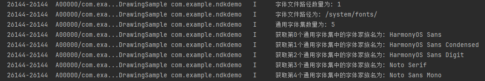

# Obtaining and Using System Fonts (C/C++)
<!--Kit: ArkGraphics 2D-->
<!--Subsystem: Graphics-->
<!--Owner: @oh_wangxk; @gmiao522; @Lem0nC-->
<!--Designer: @liumingxiang-->
<!--Tester: @yhl0101-->
<!--Adviser: @ge-yafang-->

## Scenario Introduction

System fonts are preset fonts of the operating system. They are used to display text when no custom font is specified, ensuring the readability and consistency of the text. The default system font is HarmonyOS Sans.

**Using system fonts** is applicable when an application does not register custom fonts or does not explicitly specify text styles. In this case, the system uses the default system font. In addition, there are multiple system fonts. You can obtain the configuration information about system fonts and switch and use system fonts based on the font family name in the information.

**Disabling system fonts** is applicable when you want to ensure that only custom fonts are used in an application and are not affected by the default fonts of the operating system. If the custom font does not exist, the system font is not disabled, and the system automatically falls back to the default font. By disabling system fonts, you can prevent the font from falling back to the default system font in any scenario, ensuring that text rendering meets the design expectation and unifying the visual style of the application.


## Available APIs

The following table lists the common APIs and structures related to system fonts. For details about the APIs, see [Drawing](../reference/apis-arkgraphics2d/capi-drawing.md).

| Name| Description| 
| -------- | -------- |
| OH_Drawing_FontConfigInfo\* OH_Drawing_GetSystemFontConfigInfo(OH_Drawing_FontConfigInfoErrorCode\*) | Obtains the configuration information about system fonts. The OH_Drawing_FontConfigInfo structure is returned.| 
| void OH_Drawing_DestroySystemFontConfigInfo(OH_Drawing_FontConfigInfo\*) | Reclaims the memory occupied by the system font configuration.| 
| OH_Drawing_FontCollection\* OH_Drawing_CreateSharedFontCollection(void) | Creates an OH_Drawing_FontCollection object that can be shared.| 
| OH_Drawing_TextStyle\* OH_Drawing_CreateTextStyle(void) | Creates a pointer to the OH_Drawing_TextStyle object to set the text style.| 
| OH_Drawing_SetTextStyleFontFamilies (OH_Drawing_TextStyle \*, int, const char \*fontFamilies[]) | Sets the font families for a text style.| 
| void OH_Drawing_DisableFontCollectionSystemFont(OH_Drawing_FontCollection\* fontCollection) | Disables the system fonts.| 

| Structure Name| Description| 
| -------- | -------- |
| OH_Drawing_FontConfigInfo | Describes the information about a system font configuration.| 
| OH_Drawing_FontGenericInfo | Describes the information about generic fonts supported by the system.| 
| OH_Drawing_FontFallbackGroup | Describes the information about a font fallback group.| 


## Obtaining System Font Information

1. Add the following lib to the `src/main/cpp/CMakeLists.txt` file of the project:
   ```c++
   libnative_drawing.so
   ```

2. Import the required header files.

   ```c++
   #include <native_drawing/drawing_font_collection.h>
   #include <native_drawing/drawing_text_typography.h>
   #include <native_drawing/drawing_register_font.h>
   #include <hilog/log.h>
   ```

3. Obtains the system font configuration information. You can determine whether the information is successfully obtained based on the returned status code. For details about the status code and its meaning, see [OH_Drawing_FontConfigInfoErrorCode](../reference/apis-arkgraphics2d/capi-drawing-text-typography-h.md#oh_drawing_fontconfiginfoerrorcode).

   <!-- @[custom_font_c_print_system_font_metrics_step1](https://gitcode.com/openharmony/applications_app_samples/blob/master/code/DocsSample/graphic/NDKGraphics2D/NDKThemFontAndCustomFontText/entry/src/main/cpp/samples/sample_bitmap.cpp) -->
   
   ``` C++
   OH_Drawing_FontConfigInfoErrorCode fontConfigInfoErrorCode; // Used to receive the error code.
   OH_Drawing_FontConfigInfo* fontConfigInfo = OH_Drawing_GetSystemFontConfigInfo(&fontConfigInfoErrorCode);
   if(fontConfigInfoErrorCode != SUCCESS_FONT_CONFIG_INFO) {
       OH_LOG_Print (LOG_APP, LOG_ERROR, LOG_DOMAIN, "PrintSysFontMetrics", "Failed to obtain the system information. The error code is %{public}d");
   }
   ```

4. [OH_Drawing_FontConfigInfo](../reference/apis-arkgraphics2d/capi-drawing-oh-drawing-fontconfiginfo.md) contains the following information:

   - Number of system font file paths.

   - Number of generic font sets.

   - Number of font fallbacks.

   - Double pointer to the system font file paths.

   - Common font set list. For details, see [OH_Drawing_FontGenericInfo](../reference/apis-arkgraphics2d/capi-drawing-oh-drawing-fontgenericinfo.md).

   - Backup font set list. For details, see [OH_Drawing_FontFallbackGroup](../reference/apis-arkgraphics2d/capi-drawing-oh-drawing-fontfallbackgroup.md).

   The following example shows how to obtain some specific configuration information about system fonts:

   <!-- @[custom_font_c_print_system_font_metrics_step2](https://gitcode.com/openharmony/applications_app_samples/blob/master/code/DocsSample/graphic/NDKGraphics2D/NDKThemFontAndCustomFontText/entry/src/main/cpp/samples/sample_bitmap.cpp) -->
   
   ``` C++
   // Example for obtaining system font configuration information
   if (fontConfigInfo != nullptr) {
       // Obtain the number of font file paths and print logs.
       size_t fontDirCount = fontConfigInfo->fontDirSize;
       OH_LOG_Print (LOG_APP, LOG_INFO, LOG_DOMAIN, "PrintSysFontMetrics", "The number of font file paths is: %{public}zu\n", fontDirCount);
       // Iterate through the font file path list and print logs.
       for (size_t i = 0; i < fontDirCount; ++i) {
           OH_LOG_Print (LOG_APP, LOG_INFO, LOG_DOMAIN, "PrintSysFontMetrics", "The font file path is: %{public}s\n",
                        fontConfigInfo->fontDirSet[i]);
       }
       // Obtain the number of common font sets and print logs.
       size_t genericCount = fontConfigInfo->fontGenericInfoSize;
       OH_LOG_Print (LOG_APP, LOG_INFO, LOG_DOMAIN, "PrintSysFontMetrics", "The number of generic font families is: %{public}zu\n", genericCount);
       // Iterate through the font family names (for example, HarmonyOS Sans) in each common font set and print logs.
       for (size_t i = 0; i < genericCount; ++i) {
           OH_Drawing_FontGenericInfo &genericInfo = fontConfigInfo->fontGenericInfoSet[i];
           OH_LOG_Print(LOG_APP, LOG_INFO, LOG_DOMAIN, "PrintSysFontMetrics",
                        "Obtain the font family name of the %{public}s", i, genericInfo.familyName) in the %{public}zu generic font family;
       }
   }
   ```

   The following log example displays display system font configuration information. The configuration information varies depending on the device.

   

5. If the system font configuration information is no longer required, release the memory occupied by the configuration information.

   ```c++
   OH_Drawing_DestroySystemFontConfigInfo(fontConfigInfo);
   ```


## Using or Switching System Fonts

You can obtain the system font configuration information and then switch and use the system font based on the font family name.

If no font is specified, the default system font HarmonyOS Sans is used to display text.

1. Add the following lib to the `src/main/cpp/CMakeLists.txt` file of the project:
   ```c++
   libnative_drawing.so
   ```

2. Import the required header files.

   ```c++
   #include <native_drawing/drawing_font_collection.h>
   #include <native_drawing/drawing_text_typography.h>
   #include <native_drawing/drawing_register_font.h>
   #include <hilog/log.h>
   ```

3. Create a font manager. You are advised to use OH_Drawing_CreateSharedFontCollection to create a shared font set object.

   > **NOTE**
   >
   > Both OH_Drawing_CreateFontCollection and OH_Drawing_CreateSharedFontCollection can be used to create the font manager OH_Drawing_FontCollection object. However, the font set pointer object created by OH_Drawing_CreateFontCollection can be used by only one paragraph generator OH_Drawing_TypographyCreate object and cannot be shared by multiple paragraph generator OH_Drawing_TypographyCreate objects. If the font set object needs to be shared by multiple paragraph generator OH_Drawing_TypographyCreate objects, use OH_Drawing_CreateSharedFontCollection to create a shared font set object.

   ```c++
   OH_Drawing_FontCollection *fontCollection = OH_Drawing_CreateSharedFontCollection();  
   ```

4. Create a text style object OH_Drawing_TextStyle to set the text style.

   ```c++
   OH_Drawing_TextStyle* textStyle = OH_Drawing_CreateTextStyle();
   ```

5. Obtain system font information. Obtain the font family name of the system font and set the system font in the text style.
   <!-- @[custom_font_c_print_system_font_metrics_step3](https://gitcode.com/openharmony/applications_app_samples/blob/master/code/DocsSample/graphic/NDKGraphics2D/NDKThemFontAndCustomFontText/entry/src/main/cpp/samples/sample_bitmap.cpp) -->
   
   ``` C++
   //Case 1: Set the system font to HarmonyOS Sans Condensed.
   const char *myFontFamilies[] = {"HarmonyOS Sans Condensed"};
   OH_Drawing_SetTextStyleFontFamilies(textStyle, 1, myFontFamilies);
   
   //Case 2: Do not set the system font. The default system font HarmonyOS Sans is used.
   // const char* myFontFamilies[] = {"HarmonyOS Sans Condensed"};
   // OH_Drawing_SetTextStyleFontFamilies(textStyle, 1, myFontFamilies);
   ```

6. Generate the final paragraph text to implement final text drawing and display.

   <!-- @[custom_font_c_print_system_font_metrics_step3](https://gitcode.com/openharmony/applications_app_samples/blob/master/code/DocsSample/graphic/NDKGraphics2D/NDKThemFontAndCustomFontText/entry/src/main/cpp/samples/sample_bitmap.cpp) -->
   
   ``` C++
   //Case 1: Set the system font to HarmonyOS Sans Condensed.
   const char *myFontFamilies[] = {"HarmonyOS Sans Condensed"};
   OH_Drawing_SetTextStyleFontFamilies(textStyle, 1, myFontFamilies);
   
   //Case 2: Do not set the system font. The default system font HarmonyOS Sans is used.
   // const char* myFontFamilies[] = {"HarmonyOS Sans Condensed"};
   // OH_Drawing_SetTextStyleFontFamilies(textStyle, 1, myFontFamilies);
   ```


## Disabling the System Font

If the custom font does not exist, the system font is not disabled. The system automatically falls back to the default font. By disabling the system font, you can prevent the font from falling back to the default system font in any scenario, ensuring that the text rendering meets the design expectation and unifying the visual style of the application.

In some application scenarios, you may want to use only custom fonts to ensure font consistency or provide a more personalized user experience. In this case, you can disable the system font to ensure that the application uses only the registered custom font instead of the system font.

> **NOTE**
>
> After disabling the system font, ensure that the custom font is registered. Otherwise, the text cannot be properly displayed.

1. Ensure that the custom font has been successfully registered to ensure that the text can be properly displayed after the system font is disabled. For details, see [Registering and Using Custom Fonts](custom-font-c.md).

2. Add the following lib to the `src/main/cpp/CMakeLists.txt` file of the project.
   ```c++
   libnative_drawing.so
   ```

3. Import the header files related to dependencies.

   ```c++
   #include <native_drawing/drawing_font_collection.h>
   #include <native_drawing/drawing_text_typography.h>
   #include <native_drawing/drawing_register_font.h>
   #include <hilog/log.h>
   ```

4. Create a font manager. You are advised to use OH_Drawing_CreateSharedFontCollection to create a shareable font set object.

   ```c++
   OH_Drawing_FontCollection *fontCollection = OH_Drawing_CreateSharedFontCollection();  
   ```

5. Disables the system fonts.

   ```c++
   OH_Drawing_DisableFontCollectionSystemFont(fontCollection);
   ```

6. Creates a text style object and uses the custom font that has been successfully registered.

   > **NOTE**
   >
   > If no font is set, the system font is used by default. If the system font is disabled and no custom font is set, the text cannot be displayed properly.

   <!-- @[custom_font_c_disable_system_font_text_step1](https://gitcode.com/openharmony/applications_app_samples/blob/master/code/DocsSample/graphic/NDKGraphics2D/NDKThemFontAndCustomFontText/entry/src/main/cpp/samples/sample_bitmap.cpp) -->
   
   ``` C++
   OH_Drawing_TextStyle *textStyle = OH_Drawing_CreateTextStyle();
   // After the system font is disabled, the following situations occur:
   // Situation 1: If a custom font is used, the text is displayed properly.
   // This path is the path of the custom font file to be registered on the application device. Ensure that the custom font file is correctly placed in this path.
   // When using the custom font, you need to use the font family name.
   const char* fontFamily = "HarmonyOS_Sans"; 
   const char* fontPath = "/system/fonts/HarmonyOS_Sans.ttf"; 
   // Return value 0: success; 1: file not found; 2: file opening failure; 3: file reading failure; 4: file search failure; 5: file size obtaining failure; 9: file damage
   int errorCode = OH_Drawing_RegisterFont(fontCollection, fontFamily, fontPath);
   DRAWING_LOGI("errorCode = %{public}d", errorCode);
   const char *myFontFamilies[] = {"HarmonyOS_Sans"}; // Ensure that the custom font has been successfully registered and enter the font family name of the custom font.
   OH_Drawing_SetTextStyleFontFamilies(textStyle, 1, myFontFamilies);
   
   // Situation 2: If the system font is used, the text cannot be displayed.
   // const char *myFontFamilies[] = {"HarmonyOS_Sans"};
   // OH_Drawing_SetTextStyleFontFamilies(textStyle, 1, myFontFamilies);
   
   // Situation 3: If no font is set, the system default font is used by default. However, the system font has been disabled. As a result, the text cannot be displayed.
   // const char *myFontFamilies[] = {"HarmonyOS_Sans"};
   // OH_Drawing_SetTextStyleFontFamilies(textStyle, 1, myFontFamilies);
   ```

7. Generates the final paragraph text to implement the final text drawing and display.

   <!-- @[custom_font_c_disable_system_font_text_step2](https://gitcode.com/openharmony/applications_app_samples/blob/master/code/DocsSample/graphic/NDKGraphics2D/NDKThemFontAndCustomFontText/entry/src/main/cpp/samples/sample_bitmap.cpp) -->
   
   ``` C++
   //Set other text styles.
   OH_Drawing_SetTextStyleColor(textStyle, OH_Drawing_ColorSetArgb(0xFF, 0x00, 0x00, 0x00));
   // Set the font size to 30.0.
   OH_Drawing_SetTextStyleFontSize(textStyle, 30.0);
   //Create a paragraph style object to set the typesetting style.
   OH_Drawing_TypographyStyle *typographyStyle = OH_Drawing_CreateTypographyStyle();
   OH_Drawing_SetTypographyTextAlign(typographyStyle, TEXT_ALIGN_LEFT); //Set the paragraph style to left alignment.
   //Create a paragraph generator.
   OH_Drawing_TypographyCreate *handler = OH_Drawing_CreateTypographyHandler(typographyStyle, fontCollection);
   //Set the text style in the paragraph generator.
   OH_Drawing_TypographyHandlerPushTextStyle(handler, textStyle);
   //Set the text content in the paragraph generator.
   const char *text = "Hello World.\nThe preceding text uses the custom font.";
   OH_Drawing_TypographyHandlerAddText(handler, text);
   // Generate a paragraph through the paragraph generator.
   OH_Drawing_Typography *typography = OH_Drawing_CreateTypography(handler);
       
   // Set the maximum width.
   double maxWidth = width_;
   OH_Drawing_TypographyLayout(typography, maxWidth);
   // Draw the text on the canvas (width_/5.0,height_/2.0).
   OH_Drawing_TypographyPaint(typography, cCanvas_, width_ / 5.0, height_ / 2.0);
   ```
