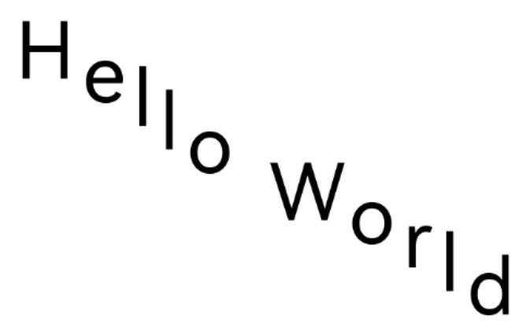

# Drawing and Displaying Custom Text (C/C++)
<!--Kit: ArkGraphics 2D-->
<!--Subsystem: Graphics-->
<!--Owner: @oh_wangxk; @KejiePeng-->
<!--Designer: @liumingxiang-->
<!--Tester: @yhl0101-->
<!--Adviser: @ge-yafang-->

In complex text typesetting scenarios, if the standard text components provided by the system cannot meet specific visual or interaction requirements, you can use the underlying text drawing capability provided by ArkGraphics 2D to directly control the canvas and text style to implement refined control over the text appearance and layout. This capability applies to scenarios that require highly customized text rendering effects, such as artistic fonts, complex rich text orchestration, or special dynamic text effects.

As a core component of the graphics system, the font engine is responsible for converting character codes into visual glyphs and accurately calculating the layout and position of each glyph, providing underlying support for custom text drawing. Through the text measurement API, you can obtain the accurate size of the text, which is the basis for precise layout (such as center display).

## Text shaping

### Overview
Text shaping is a key capability provided by the font engine. It allows developers to directly obtain the underlying glyph information (such as width and direction measurement information) of the text without going through the default text typesetting process. This enables developers to implement completely customized typesetting logic, drawing operations, and line break policies based on the raw data.

This capability applies to the following scenarios:

- Custom rich text rendering: For example, in applications such as social media and news clients, image-text mixed typesetting and multi-style text mixed display need to be implemented.

- Cross-platform consistent typesetting requirements: Ensure that the text is displayed with consistent visual effects on different platforms or devices.

- Refined typesetting management: For example, implement artistic typesetting and dynamic text layout, which are difficult to achieve using standard text components.

### Available APIs

The following table lists the common APIs used in text shaping. For details about the APIs, see [drawing_text_typography.h](../reference/apis-arkgraphics2d/capi-drawing-text-typography-h.md) and [drawing_text_blob.h](../reference/apis-arkgraphics2d/capi-drawing-text-blob-h.md).

| API| Description| 
| -------- | -------- |
| OH_Drawing_LineTypography* OH_Drawing_CreateLineTypography(OH_Drawing_TypographyCreate* handler) | Creates a pointer to the OH_Drawing_LineTypography object, which stores the text content and style and can be used to calculate the layout information of a single line.| 
| OH_Drawing_TextLine* OH_Drawing_LineTypographyCreateLine(OH_Drawing_LineTypography* lineTypography,size_t startIndex, size_t count) | Creates a pointer to the OH_Drawing_TextLine object based on the text content in the specified range.| 
| OH_Drawing_Array* OH_Drawing_TextLineGetGlyphRuns(OH_Drawing_TextLine* line) | Obtains the array of glyph runs in a text line object.| 
| OH_Drawing_Array* OH_Drawing_GetRunGlyphs(OH_Drawing_Run* run, int64_t start, int64_t length) | Obtains an array of glyphs within the specified range of a run.| 
| OH_Drawing_Font* OH_Drawing_GetRunFont(OH_Drawing_Run* run) | Obtains the font object of a run.| 
| OH_Drawing_Array* OH_Drawing_GetRunGlyphAdvances(OH_Drawing_Run* run, uint32_t start, uint32_t length) | Obtains the glyph advance array of a run.| 
| OH_Drawing_TextBlobBuilder* OH_Drawing_TextBlobBuilderCreate(void) | Creates an **OH_Drawing_TextBlobBuilder** object.| 
| OH_Drawing_TextBlob* OH_Drawing_TextBlobBuilderMake(OH_Drawing_TextBlobBuilder* textBlobBuilder) | Makes an **OH_Drawing_TextBlob** object from an **OH_Drawing_TextBlobBuilder**.| 
| void OH_Drawing_CanvasDrawTextBlob(OH_Drawing_Canvas* canvas, const OH_Drawing_TextBlob* textBlob, float x, float y) | Draws a text blob.| 


### How to Develop
Since API version 18, the text shaping result can be obtained. Since API version 20, the text layout direction and text glyph width can be obtained. Sample code:

1. Add the following libraries to the `src/main/cpp/CMakeLists.txt` file of the project.
   ```c++
   libnative_drawing.so
   ```

2. Import the dependency header file.

   ```c++
   #include <native_drawing/drawing_font_collection.h>
   #include <native_drawing/drawing_text_typography.h>
   #include <native_drawing/drawing_text_blob.h>
   #include <native_drawing/drawing_text_line.h>
   #include <native_drawing/drawing_text_run.h>
   #include <native_drawing/drawing_text_lineTypography.h>
   #include <native_drawing/drawing_rect.h>
   #include <native_drawing/drawing_point.h>
   ```

3. Create a paragraph style and use the ParagraphBuilder to generate a paragraph instance.

   ```c++
    // Create a TypographyStyle. It is required when creating TypographyCreate.
    OH_Drawing_TypographyStyle *typoStyle = OH_Drawing_CreateTypographyStyle();
    // Set the text color, size, and weight. If TextStyle is not set, the default TextStyle in TypographyStyle is used.
    OH_Drawing_TextStyle *txtStyle = OH_Drawing_CreateTextStyle();
    OH_Drawing_SetTextStyleFontSize(txtStyle, 100);

    // Create a FontCollection object to manage font matching logic.
    OH_Drawing_FontCollection *fc = OH_Drawing_CreateSharedFontCollection();
    // Use the FontCollection object and the TypographyStyle object to create a TypographyCreate object for creating a Typography object.
    OH_Drawing_TypographyCreate *handler = OH_Drawing_CreateTypographyHandler(typoStyle, fc);
   ```

4. Set the text style and add text content.

   ```c++
    // Set the text content and add the text to the handler.
    OH_Drawing_TypographyHandlerPushTextStyle(handler, txtStyle);
    const char *text = "Hello World";
    OH_Drawing_TypographyHandlerAddText(handler, text);
   ```

5. Create a line object. Obtain the shaping result of all texts in a line. 
Use the OH_Drawing_LineTypographyCreateLine() method to create a single line object, and use the OH_Drawing_TextLineGetGlyphRuns() method of the line object to obtain text units with the same style.

   ```c++
    // Create a Typography object through the handler.
    OH_Drawing_LineTypography *lineTypography = OH_Drawing_CreateLineTypography(handler);
    OH_Drawing_TextLine *textLine = OH_Drawing_LineTypographyCreateLine(lineTypography, 0, 11);
    // Obtain the shaping result.
    OH_Drawing_Array *runs = OH_Drawing_TextLineGetGlyphRuns(textLine);
   ```

6. This step is the custom drawing step in the text shaping process. You can call the OH_Drawing_GetRunGlyphs() method to obtain the glyph sequence number corresponding to each character in the text, and then obtain the font object using the OH_Drawing_GetRunFont() method to determine the specific graphic information of each glyph. 
From API version 20 onwards, the new OH_Drawing_GetRunGlyphAdvances() method can return an array that contains the recommended width and height of each glyph during drawing. Based on these precise measurement data, you can freely calculate and define the drawing position of each glyph to implement complex text layout effects, such as custom character spacing, vertical offset, or special typesetting.

   ```c++
   for (int i = 0; i < runsLength; i++) {
        OH_Drawing_Run *run = OH_Drawing_GetRunByIndex(runs, i);
        // Obtain all glyph data.
        OH_Drawing_Array *glyphs = OH_Drawing_GetRunGlyphs(run, 0, 0);
        size_t glyphsLength = OH_Drawing_GetDrawingArraySize(glyphs);
        // Obtain the font of the same drawing unit.
        OH_Drawing_Font *font = OH_Drawing_GetRunFont(run);
        OH_Drawing_Array *advances = OH_Drawing_GetRunGlyphAdvances(run, 0, 0);

        OH_Drawing_TextBlobBuilder *builder = OH_Drawing_TextBlobBuilderCreate();
        OH_Drawing_Rect *rect = OH_Drawing_RectCreate(0, 0, 20, 20);
        const OH_Drawing_RunBuffer *runBuffer =
            OH_Drawing_TextBlobBuilderAllocRunPos(builder, font, glyphsLength, rect);
        
        // Create a glyph buffer and draw glyphs independently through the drawing API.
        int x = 0, y = 0;
        for (int index = 0; index < glyphsLength; index++) {
            uint16_t glyph = OH_Drawing_GetRunGlyphsByIndex(glyphs, index);

            runBuffer->glyphs[index] = glyph;
            runBuffer->pos[index * 2] = x;
            runBuffer->pos[index * 2 + 1] = y;

            OH_Drawing_Point *advance = OH_Drawing_GetRunGlyphAdvanceByIndex(advances, index);
            float glyphX = 0;
            float glyphY = 0;
            OH_Drawing_PointGetX(advance, &glyphX);
            OH_Drawing_PointGetY(advance, &glyphY);
            x += glyphX + 10; // The horizontal spacing between glyphs is 10 px.
            y += glyphY + 30; // The vertical spacing between glyphs is 30 px.
        }
        
        // Draw a series of consecutive glyphs with the same attributes.
        OH_Drawing_TextBlob* textBlob = OH_Drawing_TextBlobBuilderMake(builder);
        OH_Drawing_CanvasDrawTextBlob(cCanvas_, textBlob, 20, 100);
        
        // Release the memory.
        OH_Drawing_TextBlobDestroy(textBlob);
        OH_Drawing_FontDestroy(font);
        OH_Drawing_DestroyRunGlyphAdvances(advances);
        OH_Drawing_DestroyRunGlyphs(glyphs);
   }
   ```
   
7. Releasing memory 
   ```c++
   // Release the memory.
   OH_Drawing_DestroyTypographyStyle(typoStyle);
   OH_Drawing_DestroyTextStyle(txtStyle);
   OH_Drawing_DestroyFontCollection(fc);
   OH_Drawing_DestroyTypographyHandler(handler);
   OH_Drawing_DestroyLineTypography(lineTypography);
   OH_Drawing_DestroyTextLine(textLine);
   OH_Drawing_DestroyRuns(runs);
   ```

### Sample Code

The following is a complete example of text shaping.
<!-- @[complex_text_c_independent_shaping_text](https://gitcode.com/openharmony/applications_app_samples/blob/master/code/DocsSample/graphic/NDKGraphics2D/NDKComplexText1/entry/src/main/cpp/samples/draw_text_impl.cpp) -->

``` C++
// Create a TypographyStyle. This TypographyStyle will be used when creating TypographyCreate.
OH_Drawing_TypographyStyle *typoStyle = OH_Drawing_CreateTypographyStyle();
// Set the text color, size, and weight. If TextStyle is not set, the default TextStyle in TypographyStyle will be used.
OH_Drawing_TextStyle *txtStyle = OH_Drawing_CreateTextStyle();
OH_Drawing_SetTextStyleFontSize(txtStyle, DIV_TEN(width_));

// Create a FontCollection, which is used to manage the font matching logic.
OH_Drawing_FontCollection *fc = OH_Drawing_CreateSharedFontCollection();
// Use FontCollection and the created TypographyStyle to create TypographyCreate. TypographyCreate is used to create Typography.
OH_Drawing_TypographyCreate *handler = OH_Drawing_CreateTypographyHandler(typoStyle, fc);
// Set the text content and add the text to the handler.
OH_Drawing_TypographyHandlerPushTextStyle(handler, txtStyle);
const char *text = "Hello World";
OH_Drawing_TypographyHandlerAddText(handler, text);

// Create a Typography through the handler.
OH_Drawing_LineTypography *lineTypography = OH_Drawing_CreateLineTypography(handler);
// Create a TextLine and obtain characters (0, 11).
OH_Drawing_TextLine *textLine = OH_Drawing_LineTypographyCreateLine(lineTypography, 0, 11);

// Obtain the shaping result.
OH_Drawing_Array *runs = OH_Drawing_TextLineGetGlyphRuns(textLine);
size_t runsLength = OH_Drawing_GetDrawingArraySize(runs);
for (int i = 0; i < runsLength; i++) {
    OH_Drawing_Run *run = OH_Drawing_GetRunByIndex(runs, i);
    // Obtain all glyph data.
    OH_Drawing_Array *glyphs = OH_Drawing_GetRunGlyphs(run, 0, 0);
    size_t glyphsLength = OH_Drawing_GetDrawingArraySize(glyphs);
    // Obtain the font of the same drawing unit.
    OH_Drawing_Font *font = OH_Drawing_GetRunFont(run);
    OH_Drawing_Array *advances = OH_Drawing_GetRunGlyphAdvances(run, 0, 0);

    OH_Drawing_TextBlobBuilder *builder = OH_Drawing_TextBlobBuilderCreate();
    // Create a 20 x 20 rectangle.
    OH_Drawing_Rect *rect = OH_Drawing_RectCreate(0, 0, 20, 20);
    const OH_Drawing_RunBuffer *buffer = OH_Drawing_TextBlobBuilderAllocRunPos(builder, font, glyphsLength, rect);

    // Create a glyph buffer and draw glyphs independently through the drawing API.
    int x = 0;
    int y = 0;
    for (int index = 0; index < glyphsLength; index++) {
        buffer->glyphs[index] = OH_Drawing_GetRunGlyphsByIndex(glyphs, index);
        // Set the glyph position.
        buffer->pos[index * TWO_INT] = x;
        buffer->pos[index * TWO_INT + 1] = y;

        OH_Drawing_Point *advance = OH_Drawing_GetRunGlyphAdvanceByIndex(advances, index);
        float pos = 0;
        OH_Drawing_PointGetX(advance, &pos);
        x += pos + 10; // The horizontal spacing between glyphs is 10 px.
        OH_Drawing_PointGetY(advance, &pos);
        y += pos + 30; // The vertical spacing between glyphs is 30 px.
    }

    // Draw a series of consecutive glyphs with the same attributes.
    OH_Drawing_TextBlob *textBlob = OH_Drawing_TextBlobBuilderMake(builder);
    // Draw the text to the canvas (20, 100).
    OH_Drawing_CanvasDrawTextBlob(cCanvas_, textBlob, 20, 100);

    // Release the memory.
    OH_Drawing_TextBlobDestroy(textBlob);
    OH_Drawing_FontDestroy(font);
    OH_Drawing_DestroyRunGlyphAdvances(advances);
    OH_Drawing_DestroyRunGlyphs(glyphs);
}

// Release the memory.
OH_Drawing_DestroyTypographyStyle(typoStyle);
OH_Drawing_DestroyTextStyle(txtStyle);
OH_Drawing_DestroyFontCollection(fc);
OH_Drawing_DestroyTypographyHandler(handler);
OH_Drawing_DestroyLineTypography(lineTypography);
OH_Drawing_DestroyTextLine(textLine);
OH_Drawing_DestroyRuns(runs);
```

Effect: 

