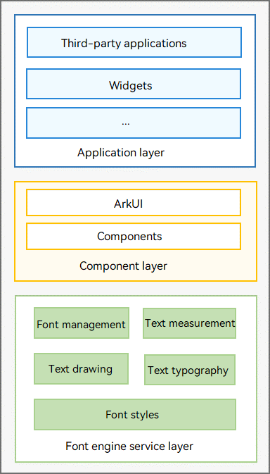

# Introduction to Text Development
<!--Kit: ArkGraphics 2D-->
<!--Subsystem: Graphics-->
<!--Owner: @oh_wangxk; @gmiao522; @Lem0nC-->
<!--Designer: @liumingxiang-->
<!--Tester: @yhl0101-->
<!--Adviser: @ge-yafang-->
During app development and layout, you need to format, measure, draw, and display text elements and content. The font engine development framework provides a series of APIs to support app layout text and font management.

## Capabilities

**Figure 1** Capability structure of the font engine

Currently, the font engine development framework supports shaping, formatting, measuring, and drawing of text elements such as text, emojis, and placeholders in apps.

You can use different ArkTS or C/C++ languages to use the font engine capabilities to implement the corresponding scenarios.

The text-related capabilities are as follows:

- **Font management**: Fonts are essential for text drawing and display. Currently, various font resources can be registered and used. The fonts include theme fonts, custom fonts, and system fonts.

- **Font style**: Before text formatting, you can set various styles for text to enhance the text display effect. The styles include paragraph styles and text styles. For example, paragraph styles can specify the line break policy, text alignment policy, and line height, and text styles can specify the text color, text size, text thickness, and decoration line.

- **Text formatting**: Text shaping, arrangement, and layout based on text styles and text content.

- **Text measurement**: Text drawing and display depend on fonts and accurate text measurement to facilitate proper content layout. Currently, various complex text styles can be measured. You can use related APIs to obtain various measurement information of text, such as the length, height, and number of lines of a text paragraph, whether the text is truncated, and the height, width, and number of characters in each line of text.

- **Text drawing**: Text can be drawn based on the specified start coordinates or path. In addition, overlines, underlines, and strikethroughs in different decoration styles can be drawn.

## Implementation Process

The following figure shows the process of implementing text drawing and measurement. Use the corresponding capability APIs on the ArkTS and native sides.

**Figure 2** Implementation process of text measurement and drawing

