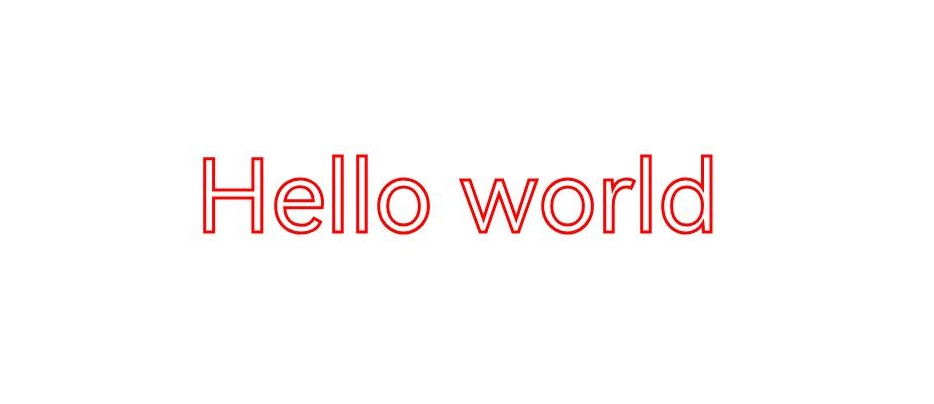

# Drawing TextBlobs (ArkTS)

<!--Kit: ArkGraphics 2D-->
<!--Subsystem: Graphics-->
<!--Owner: @hangmengxin-->
<!--Designer: @wangyanglan-->
<!--Tester: @nobuggers-->
<!--Adviser: @ge-yafang-->

## Overview

A TextBlob is a set of texts. You can draw both a single text and a paragraph by using TextBlobs.

In addition to the basic TextBlob drawing, you can add various drawing effects to texts. Common TextBlob drawing scenarios include [text stroke](#text-stroke) and [text gradient](#text-gradient). For more effects, see [Overview of Drawing Effects](drawing-effect-overview.md).

This topic does not involve text measurement and typography. For details about how to handle text drawing requirements, see [Introduction to Text Development](text-overview.md). This topic describes the typography policies and related usage.

## Basic TextBlob Drawing

The Canvas component draws TextBlobs using **drawTextBlob()**. This function takes three parameters: **TextBlob** object, and X and Y coordinates of the left end point of the text baseline.

For details about the **Canvas** object, see [Obtaining a Canvas and Displaying Drawing Results (ArkTS)](canvas-get-result-draw-arkts.md).

A **TextBlob** object can be created in multiple ways. For details about how to create a block and how to use the API, see [TextBlob](../reference/apis-arkgraphics2d/arkts-apis-graphics-drawing-TextBlob.md).

The following uses the **makeFromString()** API as an example to create a **TextBlob** object. The API takes three parameters:

- String text to be displayed.

- **font** object, which is used to set and obtain various font attributes, such as the font size, text style, font alignment mode, font rendering mode, and font stroke mode. For details about the APIs, see [Font](../reference/apis-arkgraphics2d/arkts-apis-graphics-drawing-Font.md).

- Text encoding mode. The following modes are supported:
  - **TEXT_ENCODING_UTF8**: One byte is used to indicate UTF-8 or ASCII characters.
  - **TEXT_ENCODING_UTF16**: Two bytes are used to indicate most Unicode characters.
  - **TEXT_ENCODING_UTF32**: Four bytes are used to indicate all Unicode characters.
  - **TEXT_ENCODING_GLYPH_ID**: Two bytes are used to indicate the glyph index.

The sample code and effect are as follows:

<!-- @[arkts_graphics_draw_base_text](https://gitcode.com/openharmony/applications_app_samples/blob/master/code/DocsSample/ArkGraphics2D/Drawing/ArkTSGraphicsDraw/entry/src/main/ets/drawing/pages/TextBlockDrawing.ets) -->

``` TypeScript
// Create a font object.
const font = new drawing.Font();
// Set the font size.
font.setSize(100);
// Create a TextBlob object.
const textBlob = drawing.TextBlob.makeFromString('Hello world', font, drawing.TextEncoding.TEXT_ENCODING_UTF8);
// Draw the TextBlob.
canvas.drawTextBlob(textBlob, VALUE_200, VALUE_300);
```


## Text Stroke

Based on the basic TextBlob drawing, you can also use the brush to implement the text stroke effect. For details, see [Stroke Effect](basic-drawing-effect-arkts.md#stroke-effect).

The following uses English and Chinese text strokes as examples.

### English Text Stroke

The following shows the sample code and effect of English text strokes.

<!-- @[arkts_graphics_draw_stroke_text](https://gitcode.com/openharmony/applications_app_samples/blob/master/code/DocsSample/ArkGraphics2D/Drawing/ArkTSGraphicsDraw/entry/src/main/ets/drawing/pages/TextBlockDrawing.ets) -->

``` TypeScript
// Create a pen.
let pen = new drawing.Pen();
// Set anti-aliasing.
pen.setAntiAlias(true);
// Set the stroke width.
pen.setStrokeWidth(3.0);
// Set the stroke color.
pen.setColor(0xFF, 0xFF, 0x00, 0x00);
// Create a font object.
const font = new drawing.Font();
// Set the font size.
font.setSize(100);
// Add the brush stroke effect.
canvas.attachPen(pen);
// Create a TextBlob object.
const textBlob = drawing.TextBlob.makeFromString('Hello world', font, drawing.TextEncoding.TEXT_ENCODING_UTF8);
// Draw the TextBlob.
canvas.drawTextBlob(textBlob, VALUE_200, VALUE_300);
// Remove the stroke effect.
canvas.detachPen();
```



### Chinese Text Stroke

To achieve the stroke effect for Chinese text, first use a pen to outline the strokes, then apply a brush to fill the inner color and eliminate impurities and overlapping areas in the middle of the font.

The following shows the sample code and effect of Chinese text strokes.

<!-- @[arkts_graphics_draw_chinese_stroke_text](https://gitcode.com/openharmony/applications_app_samples/blob/master/code/DocsSample/ArkGraphics2D/Drawing/ArkTSGraphicsDraw/entry/src/main/ets/drawing/pages/TextBlockDrawing.ets) -->

``` TypeScript

// Create a brush.
let brush = new drawing.Brush();
// Create a pen.
let pen = new drawing.Pen();
// Set anti-aliasing.
brush.setAntiAlias(true);
// Set the stroke color.
brush.setColor(0xFF, 0xFF, 0xFF, 0xFF);

pen.setAntiAlias(true);
// Set the stroke width.
pen.setStrokeWidth(3.0);
// Set the stroke color.
pen.setColor(0xFF, 0xFF, 0x00, 0x00);

// Create a font object.
const font = new drawing.Font();
// Set the font size.
font.setSize(100);
// Add the pen stroke effect.
canvas.attachPen(pen);
// Create a TextBlob object.
const textBlob = drawing.TextBlob.makeFromString(STROKE_SAMPLE, font, drawing.TextEncoding.TEXT_ENCODING_UTF8);
// Draw the TextBlob.
canvas.drawTextBlob(textBlob, VALUE_200,  VALUE_300);
// Remove the stroke effect.
canvas.detachPen(); 

canvas.attachBrush(brush);
canvas.drawTextBlob(textBlob, VALUE_200, VALUE_300);
canvas.detachBrush();
```


## Text Gradient

In addition to TextBlob drawing, you can use a shader to implement the gradient effect of text. For more information about shaders, see [Shader Effect](complex-drawing-effect-arkts.md#shader-effect).

The following shows the sample code and effect of adding a linear gradient shader to text.

<!-- @[arkts_graphics_draw_gradient_text](https://gitcode.com/openharmony/applications_app_samples/blob/master/code/DocsSample/ArkGraphics2D/Drawing/ArkTSGraphicsDraw/entry/src/main/ets/drawing/pages/TextBlockDrawing.ets) -->

``` TypeScript
let startPt: common2D.Point = { x: VALUE_100, y: VALUE_100 };
let endPt: common2D.Point = { x: VALUE_900, y: VALUE_900 };
let colors = [0xFFFFFF00, 0xFFFF0000, 0xFF0000FF];
// Create a linear gradient shader.
let shaderEffect = drawing.ShaderEffect.createLinearGradient(startPt, endPt, colors, drawing.TileMode.CLAMP);
// Create a brush.
let brush = new drawing.Brush();
// Set the shader.
brush.setShaderEffect(shaderEffect);
// Add the brush fill effect.
canvas.attachBrush(brush);
// Create a font.
const font = new drawing.Font();
// Set the font size.
font.setSize(VALUE_200);
// Create a TextBlob.
const textBlob = drawing.TextBlob.makeFromString('Hello world', font, drawing.TextEncoding.TEXT_ENCODING_UTF8);
// Draw the TextBlob.
canvas.drawTextBlob(textBlob, VALUE_100, VALUE_300);
// Remove the fill effect.
canvas.detachBrush();
```


## Theme Font

Theme fonts are specialized custom fonts available for use in theme applications. For details about text measurement and typography, see [Using Theme Fonts (ArkTS)](theme-font-arkts.md).

The following shows the sample code and effect for setting the theme font.

<!-- @[arkts_graphics_draw_theme_text](https://gitcode.com/openharmony/applications_app_samples/blob/master/code/DocsSample/ArkGraphics2D/Drawing/ArkTSGraphicsDraw/entry/src/main/ets/drawing/pages/TextBlockDrawing.ets) -->

``` TypeScript
// Create a linear gradient shader.
const font = new drawing.Font();
// Set the text size.
font.setSize(100);
// Set the theme font.
font.setThemeFontFollowed(true);
// Create a TextBlob object.
const textBlob = drawing.TextBlob.makeFromString('Hello World', font, drawing.TextEncoding.TEXT_ENCODING_UTF8);
// Draw the TextBlob.
canvas.drawTextBlob(textBlob, VALUE_200, VALUE_300);
```

| Theme Font Not Followed| Theme Font Followed (For Reference)|
| -------- | -------- |
|  |  |

> **NOTE**
>
> You need to override the **onConfigurationUpdate** function in the application entry file (**EntryAbility.ets** in the default project) to respond to the theme font switching operation, ensuring that the page can be refreshed and take effect in a timely manner after the switching. For details, see [Using Theme Fonts (ArkTS)](theme-font-arkts.md).

## Single-Character Drawing

Single-character drawing is a refined technology for controlling text rendering. Compared with TextBlob drawing, single-character drawing has the following advantages: The font degradation mechanism is used. If a character cannot be displayed in the current font, the system automatically uses the system font to draw the character, improving compatibility with special characters and avoiding character loss. In addition, single-character drawing supports character-by-character configuration of font features (such as ligatures and alternates) to meet complex typography requirements for better user experience. For details about the APIs, see [drawing.Canvas](../reference/apis-arkgraphics2d/arkts-apis-graphics-drawing-Canvas.md#drawsinglecharacter12).

Basic scenario: drawing characters without font features 
In common text rendering scenarios where font features are not required, you can use **drawSingleCharacter** to draw a single character and use **measureSingleCharacter** to measure the width of a single character. The sample code and effect are as follows:

<!-- @[arkts_graphics_draw_single_text](https://gitcode.com/openharmony/applications_app_samples/blob/master/code/DocsSample/ArkGraphics2D/Drawing/ArkTSGraphicsDraw/entry/src/main/ets/drawing/pages/TextBlockDrawing.ets) -->

``` TypeScript
// Create a font object.
const font = new drawing.Font();
// Set the text size.
font.setSize(100);
let startX = 100;
let startY = 100;
let text = ['H', 'e', 'l', 'l', 'o'];
for (let s of text) {
  // Draw a single character.
  canvas.drawSingleCharacter(s, font, startX, startY);
  // Measure the width of a single character.
  let textWidth = font.measureSingleCharacter(s);
  startX += textWidth;
}
```


Advanced scenario: drawing characters with font features 
In text rendering scenarios where font features are required, you can use **drawSingleCharacterWithFeatures** to draw a single character and use **measureSingleCharacterWithFeatures** to measure the width of a single character. The sample code and effect are as follows:

<!-- @[arkts_graphics_draw_feature_text](https://gitcode.com/openharmony/applications_app_samples/blob/master/code/DocsSample/ArkGraphics2D/Drawing/ArkTSGraphicsDraw/entry/src/main/ets/drawing/pages/TextBlockDrawing.ets) -->

``` TypeScript
// Create a font object.
const font = new drawing.Font();
// Set the text size.
font.setSize(100);
let startX = 100;
let startY = 100;
let text = ['a', '2', '+', 'b', '2'];
// Create an array of font feature objects.
let fontFeatures: drawing.FontFeature[] = [{name: 'frac', value: 1}];
for (let s of text) {
  // Draw a single character.
  canvas.drawSingleCharacterWithFeatures(s, font, startX, startY, fontFeatures);
  // Measure the width of a single character.
  let textWidth = font.measureSingleCharacterWithFeatures(s, fontFeatures);
  startX += textWidth;
}
```


> **NOTE**
>
> If `drawSingleCharacterWithFeatures` and `measureSingleCharacter` are used together, or `drawSingleCharacter` and `measureSingleCharacterWithFeatures` are used together, font drawing may overlap.

<!--RP1-->
## Samples

The following samples are provided to help you better understand how to use the **Drawing** APIs (ArkTS) for development:

- [ArkTSGraphicsDraw (API20)](https://gitcode.com/openharmony/applications_app_samples/tree/master/code/DocsSample/ArkGraphics2D/Drawing/ArkTSGraphicsDraw)
<!--RP1End-->
