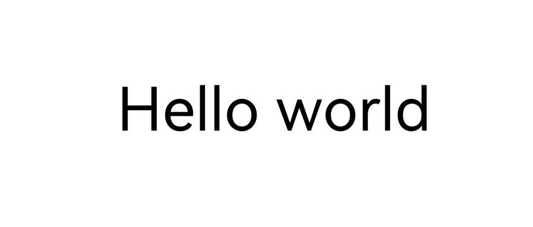
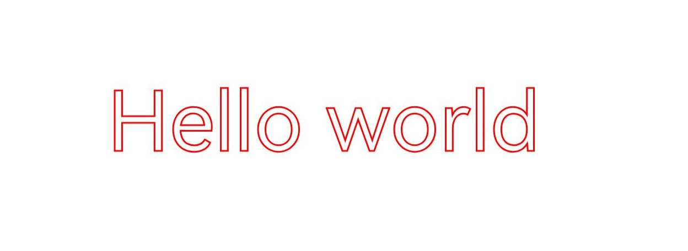
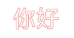
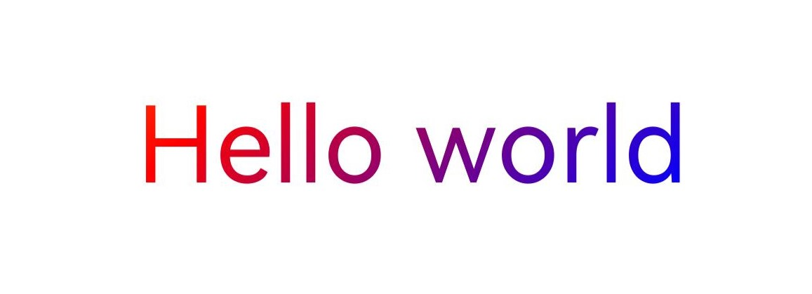
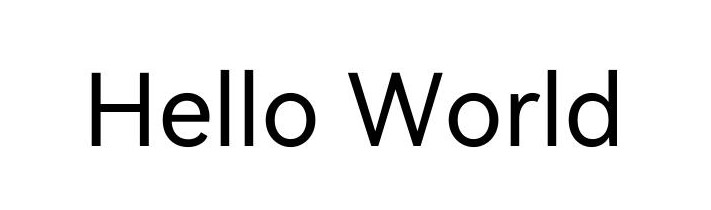
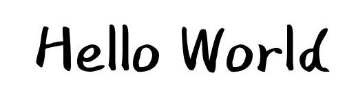
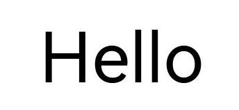

# Drawing TextBlobs (C/C++)

<!--Kit: ArkGraphics 2D-->
<!--Subsystem: Graphics-->
<!--Owner: @hangmengxin-->
<!--Designer: @wangyanglan-->
<!--Tester: @nobuggers-->
<!--Adviser: @ge-yafang-->

## Overview

A TextBlob is a set of texts. You can draw both a single text and a paragraph by using TextBlobs.

In addition to the basic TextBlob drawing, you can add various drawing effects to texts. Common TextBlob drawing scenarios include [text stroke](#text-stroke) and [text gradient](#text-gradient). For more effects, see [Overview of Drawing Effects](drawing-effect-overview.md).

This topic does not involve text measurement and typography. For details about how to handle text drawing requirements, see [Introduction to Text Development](text-overview.md). This topic describes the typography policies and related usage.

## Basic TextBlob Drawing

Use the **OH_Drawing_CanvasDrawTextBlob()** API to draw a TextBlob. The API takes four parameters: **Canvas** object, **TextBlob** object, and X and Y coordinates of the left endpoint of the text baseline.

For details about the **Canvas** object, see [Obtaining a Canvas and Displaying Drawing Results (C/C++)](canvas-get-result-draw-c.md).

A **TextBlob** object can be created in multiple ways. For details about how to create a block, see [drawing_text_blob.h](../reference/apis-arkgraphics2d/capi-drawing-text-blob-h.md).

The following uses the **OH_Drawing_TextBlobCreateFromString()** API as an example to create a **TextBlob** object. The API takes three parameters:

- Text string to be displayed.

- Pointer to the **OH_Drawing_Font** object, which is used to set and obtain various font attributes, such as the font size, text style, font alignment mode, font rendering mode, and font stroke mode. For details about the APIs, see [draw_font](../reference/apis-arkgraphics2d/capi-drawing-font-h.md).

- Text encoding mode.

The following shows the sample code and effect:

<!-- @[ndk_graphics_draw_base_text](https://gitcode.com/openharmony/applications_app_samples/blob/master/code/DocsSample/ArkGraphics2D/Drawing/NDKGraphicsDraw/entry/src/main/cpp/samples/sample_graphics.cpp) -->

``` C++
// Create a font object.
OH_Drawing_Font *font = OH_Drawing_FontCreate();
// Set the font size.
OH_Drawing_FontSetTextSize(font, value100_);
// Text to be drawn.
const char *str = "Hello world";
// Create a TextBlob object.
OH_Drawing_TextBlob *textBlob =
    OH_Drawing_TextBlobCreateFromString(str, font, OH_Drawing_TextEncoding::TEXT_ENCODING_UTF8);
// Draw the TextBlob.
OH_Drawing_CanvasDrawTextBlob(canvas, textBlob, value200_, value800_);
// Release the TextBlob object.
OH_Drawing_TextBlobDestroy(textBlob);
// Release the font object.
OH_Drawing_FontDestroy(font);
```



## Text Stroke

Based on the basic TextBlob drawing, you can also use the brush to implement the text stroke effect. For details, see [Stroke Effect](basic-drawing-effect-c.md#stroke-effect).

The following uses English and Chinese text strokes as examples.

### English Text Stroke

The following shows the sample code and effect of English text strokes.

<!-- @[ndk_graphics_draw_stroke_text](https://gitcode.com/openharmony/applications_app_samples/blob/master/code/DocsSample/ArkGraphics2D/Drawing/NDKGraphicsDraw/entry/src/main/cpp/samples/sample_graphics.cpp) -->

``` C++
// Create a pen.
OH_Drawing_Pen *pen = OH_Drawing_PenCreate();
// Set anti-aliasing.
OH_Drawing_PenSetAntiAlias(pen, true);
// Set the stroke color.
OH_Drawing_PenSetColor(pen, OH_Drawing_ColorSetArgb(RGBA_MAX, RGBA_MAX, RGBA_MIN, RGBA_MIN));
// Set the stroke width to 3.
OH_Drawing_PenSetWidth(pen, 3);
// Set the stroke effect of the pen.
OH_Drawing_CanvasAttachPen(canvas, pen);
// Create a font object.
OH_Drawing_Font *font = OH_Drawing_FontCreate();
// Set the font size.
OH_Drawing_FontSetTextSize(font, value150_);
const char *str = "Hello world";
// Create a TextBlob object.
OH_Drawing_TextBlob *textBlob =
    OH_Drawing_TextBlobCreateFromString(str, font, OH_Drawing_TextEncoding::TEXT_ENCODING_UTF8);
// Draw the TextBlob.
OH_Drawing_CanvasDrawTextBlob(canvas, textBlob, value200_, value800_);
// Remove the stroke effect.
OH_Drawing_CanvasDetachPen(canvas);
// Destroy objects.
OH_Drawing_TextBlobDestroy(textBlob);
OH_Drawing_FontDestroy(font);
OH_Drawing_PenDestroy(pen);
```



### Chinese Text Stroke

To achieve the stroke effect for Chinese text, first use a pen to outline the strokes, then apply a brush to fill the inner color and eliminate impurities and overlapping areas in the middle of the font.

The following shows the sample code and effect of Chinese text strokes.

<!-- @[ndk_graphics_draw_chinese_stroke_text](https://gitcode.com/openharmony/applications_app_samples/blob/master/code/DocsSample/ArkGraphics2D/Drawing/NDKGraphicsDraw/entry/src/main/cpp/samples/sample_graphics.cpp) -->

``` C++
// Create a brush.
OH_Drawing_Brush *brush = OH_Drawing_BrushCreate();
// Create a pen.
OH_Drawing_Pen *pen = OH_Drawing_PenCreate();
// Set anti-aliasing for the brush.
OH_Drawing_BrushSetAntiAlias(brush, true);
// Set the stroke color of the brush.
OH_Drawing_BrushSetColor(brush, OH_Drawing_ColorSetArgb(0xFF, 0xFF, 0xFF, 0xFF));
// Set anti-aliasing for the pen.
OH_Drawing_PenSetAntiAlias(pen, true);
// Set the stroke width to 3.
OH_Drawing_PenSetWidth(pen, 3);
// Set the stroke color of the pen.
OH_Drawing_PenSetColor(pen, OH_Drawing_ColorSetArgb(0xFF, 0xFF, 0x00, 0x00));
// Set the stroke effect of the pen.
OH_Drawing_CanvasAttachPen(canvas, pen);
// Create a font object.
OH_Drawing_Font *font = OH_Drawing_FontCreate();
// Set the font size.
OH_Drawing_FontSetTextSize(font, value150_);
const char *str = "你好";
// Create a TextBlob object.
OH_Drawing_TextBlob *textBlob =
    OH_Drawing_TextBlobCreateFromString(str, font, OH_Drawing_TextEncoding::TEXT_ENCODING_UTF8);
// Draw the TextBlob.
OH_Drawing_CanvasDrawTextBlob(canvas, textBlob, value200_, value800_);
// Remove the stroke effect.
OH_Drawing_CanvasDetachPen(canvas);
// Set the stroke effect of the brush.
OH_Drawing_CanvasAttachBrush(canvas, brush);
OH_Drawing_CanvasDrawTextBlob(canvas, textBlob, value200_, value800_);

// Destroy objects.
OH_Drawing_TextBlobDestroy(textBlob);
OH_Drawing_FontDestroy(font);
OH_Drawing_PenDestroy(pen);
OH_Drawing_BrushDestroy(brush);
```



## Text Gradient

In addition to TextBlob drawing, you can use a shader to implement the gradient effect of text. For more information about shaders, see [Shader Effect](complex-drawing-effect-c.md#shader-effect).

The following shows the sample code and effect of adding a linear gradient shader to text.

<!-- @[ndk_graphics_draw_gradient_text](https://gitcode.com/openharmony/applications_app_samples/blob/master/code/DocsSample/ArkGraphics2D/Drawing/NDKGraphicsDraw/entry/src/main/cpp/samples/sample_graphics.cpp) -->

``` C++
// Start point.
OH_Drawing_Point *startPt = OH_Drawing_PointCreate(value100_, value100_);
// End point.
OH_Drawing_Point *endPt = OH_Drawing_PointCreate(value900_, value900_);
// Color array.
uint32_t colors[] = {0xFFFFFF00, 0xFFFF0000, 0xFF0000FF};
// Relative position array.
float pos[] = {0.0f, 0.5f, 1.0f};
// Create a linear gradient shader effect.
OH_Drawing_ShaderEffect *colorShaderEffect =
    OH_Drawing_ShaderEffectCreateLinearGradient(startPt, endPt, colors, pos, 3, OH_Drawing_TileMode::CLAMP);
// Create a brush object.
OH_Drawing_Brush *brush = OH_Drawing_BrushCreate();
// Set the shader effect based on the brush.
OH_Drawing_BrushSetShaderEffect(brush, colorShaderEffect);
// Set the brush fill effect.
OH_Drawing_CanvasAttachBrush(canvas, brush);
// Create a font object.
OH_Drawing_Font *font = OH_Drawing_FontCreate();
// Set the font size.
OH_Drawing_FontSetTextSize(font, value150_);
const char *str = "Hello world";
// Create a TextBlob object.
OH_Drawing_TextBlob *textBlob =
    OH_Drawing_TextBlobCreateFromString(str, font, OH_Drawing_TextEncoding::TEXT_ENCODING_UTF8);
// Draw the TextBlob.
OH_Drawing_CanvasDrawTextBlob(canvas, textBlob, value200_, value800_);
// Cancel the fill effect.
OH_Drawing_CanvasDetachBrush(canvas);
// Destroy objects.
OH_Drawing_TextBlobDestroy(textBlob);
OH_Drawing_FontDestroy(font);
OH_Drawing_BrushDestroy(brush);
```



## Theme Font

Theme fonts are specialized custom fonts available for use in theme applications. For details about text measurement and typography, see [Using Theme Fonts (C/C++)](theme-font-c.md).

The following shows the sample code and effect for setting the theme font.

<!-- @[ndk_graphics_draw_theme_text](https://gitcode.com/openharmony/applications_app_samples/blob/master/code/DocsSample/ArkGraphics2D/Drawing/NDKGraphicsDraw/entry/src/main/cpp/samples/sample_graphics.cpp) -->

``` C++
// Create a font object.
OH_Drawing_Font *font = OH_Drawing_FontCreate();
// Set the text size.
OH_Drawing_FontSetTextSize(font, value100_);
// Set the theme font.
OH_Drawing_FontSetThemeFontFollowed(font, true);
// Text to be drawn.
const char *str = "Hello World";
// Create a TextBlob object.
OH_Drawing_TextBlob *textBlob =
    OH_Drawing_TextBlobCreateFromString(str, font, OH_Drawing_TextEncoding::TEXT_ENCODING_UTF8);
// Draw the TextBlob.
OH_Drawing_CanvasDrawTextBlob(canvas, textBlob, value200_, value800_);
// Release the TextBlob object.
OH_Drawing_TextBlobDestroy(textBlob);
// Release the font object.
OH_Drawing_FontDestroy(font);
```

| Theme Font Not Followed| Theme Font Followed (For Reference)|
| -------- | -------- |
|  |  |

> **NOTE**
>
> You need to override the **onConfigurationUpdate** function in the application entry file (**EntryAbility.ets** in the default project) to respond to the theme font switching operation, ensuring that the page can be refreshed and take effect in a timely manner after the switching. For details, see [Using Theme Fonts (C/C++)](theme-font-c.md).

## Single-Character Drawing

Single-character drawing is a refined technology for controlling text rendering. Compared with TextBlob drawing, single-character drawing has the following advantages: The font degradation mechanism is used. If a character cannot be displayed in the current font, the system automatically uses the system font to draw the character, improving compatibility with special characters and avoiding character loss. In addition, single-character drawing supports character-by-character configuration of font features (such as ligatures and alternates) to meet complex typography requirements for better user experience. For details about the APIs, see [drawing_canvas.h](../reference/apis-arkgraphics2d/capi-drawing-canvas-h.md#oh_drawing_canvasdrawsinglecharacter).

Basic scenario: drawing characters without font features 
In common text rendering scenarios where font features are not required, you can use **OH_Drawing_CanvasDrawSingleCharacter** to draw a single character and use **OH_Drawing_FontMeasureSingleCharacter** to measure the width of a single character. The sample code and effect are as follows:

<!-- @[ndk_graphics_draw_single_text](https://gitcode.com/openharmony/applications_app_samples/blob/master/code/DocsSample/ArkGraphics2D/Drawing/NDKGraphicsDraw/entry/src/main/cpp/samples/sample_graphics.cpp) -->

``` C++
// Create a font object.
OH_Drawing_Font *font = OH_Drawing_FontCreate();
// Set the text size.
OH_Drawing_FontSetTextSize(font, value100_);
float startX = 100;
float startY = 100;
int strLen = 5;
const char* str = "Hello";
for (int i = 0; i < strLen; ++i) {
    // Draw a single character.
    OH_Drawing_CanvasDrawSingleCharacter(canvas, &str[i], font, startX, startY);
    float textWidth = 0.f;
    // Measure the width of a single character.
    OH_Drawing_FontMeasureSingleCharacter(font, &str[i], &textWidth);
    startX += textWidth;
}
// Release the font object.
OH_Drawing_FontDestroy(font);
```



Advanced scenario: drawing characters with font features 
In text rendering scenarios where font features are required, you can use **OH_Drawing_CanvasDrawSingleCharacterWithFeatures** to draw a single character and use **OH_Drawing_FontMeasureSingleCharacterWithFeatures** to measure the width of a single character. The sample code and effect are as follows:

<!-- @[ndk_graphics_draw_feature_text](https://gitcode.com/openharmony/applications_app_samples/blob/master/code/DocsSample/ArkGraphics2D/Drawing/NDKGraphicsDraw/entry/src/main/cpp/samples/sample_graphics.cpp) -->

``` C++
// Create a font object.
OH_Drawing_Font *font = OH_Drawing_FontCreate();
// Set the text size.
OH_Drawing_FontSetTextSize(font, value100_);
// Create a font feature object.
OH_Drawing_FontFeatures* features = OH_Drawing_FontFeaturesCreate();
OH_Drawing_FontFeaturesAddFeature(features, "frac", 1);
float startX = 100;
float startY = 100;
int strLen = 5;
const char* str = "a2+b2";
for (int i = 0; i < strLen; ++i) {
    // Draw a single character.
    OH_Drawing_CanvasDrawSingleCharacterWithFeatures(canvas, &str[i], font, startX, startY, features);
    float textWidth = 0.f;
    // Measure the width of a single character.
    OH_Drawing_FontMeasureSingleCharacterWithFeatures(font, &str[i], features, &textWidth);
    startX += textWidth;
}
// Release the font feature object.
OH_Drawing_FontFeaturesDestroy(features);
// Release the font object.
OH_Drawing_FontDestroy(font);
```


> **NOTE**
>
> If `OH_Drawing_CanvasDrawSingleCharacterWithFeatures` and `OH_Drawing_FontMeasureSingleCharacter` are used together, or `OH_Drawing_CanvasDrawSingleCharacter` and `OH_Drawing_FontMeasureSingleCharacterWithFeatures` are used together, font drawing may overlap.

<!--RP1-->
## Samples

The following samples are provided to help you better understand how to use the **Drawing** APIs (C/C++) for development:

- [NDKGraphicsDraw (API20)](https://gitcode.com/openharmony/applications_app_samples/tree/master/code/DocsSample/ArkGraphics2D/Drawing/NDKGraphicsDraw)
<!--RP1End-->
<!--no_check-->