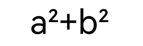

# Drawing TextBlobs (C/C++)

<!--Kit: ArkGraphics 2D-->
<!--Subsystem: Graphics-->
<!--Owner: @hangmengxin-->
<!--Designer: @wangyanglan-->
<!--Tester: @nobuggers-->
<!--Adviser: @ge-yafang-->

## Overview

A TextBlob is a set of texts. You can draw a single text or a large text blob.

In addition to basic text blob drawing, you can also add various drawing effects to texts. Common text blob drawing scenarios include text stroke (see #Text Stroke) and text gradient (see #Text Gradient). For more effects, see Drawing Effects (drawing-effect-overview.md).

This section does not involve text measurement and layout. For details about how to handle text drawing requirements during development, see Text Development Overview (text-overview.md). This document describes the layout policies and usage guide.

## Basic Text Blob Drawing

Use the OH_Drawing_CanvasDrawTextBlob() API to draw a text blob. The API accepts four parameters: canvas object, text blob object, and x and y coordinates of the left end of the text baseline.

For details about the canvas object, see canvas-get-result-draw-c.md.

A text blob object can be created in multiple ways. For details, see [drawing_text_blob.h](../reference/apis-arkgraphics2d/capi-drawing-text-blob-h.md).

The following uses OH_Drawing_TextBlobCreateFromString() as an example to describe how to create a text blob. The API accepts three parameters:

- Text string to be displayed.

- Pointer to the OH_Drawing_Font object. OH_Drawing_Font is used to set and obtain various font attributes, such as the font size, text style, font alignment mode, font rendering mode, and font stroke mode. For details about the API, see [draw_font](../reference/apis-arkgraphics2d/capi-drawing-font-h.md).

- Text encoding mode.

The following figure shows a simple example.

```c++
// sample_graphics.cpp
// Create a font object.
OH_Drawing_Font *font = OH_Drawing_FontCreate();
// Set the font size.
OH_Drawing_FontSetTextSize(font, 100);
// Text to be drawn.
const char *str = "Hello world";
// Create a text block object.
OH_Drawing_TextBlob *textBlob =
    OH_Drawing_TextBlobCreateFromString(str, font, OH_Drawing_TextEncoding::TEXT_ENCODING_UTF8);
// Draw the text block.
OH_Drawing_CanvasDrawTextBlob(canvas, textBlob, 200, 800);
// Release the text block object.
OH_Drawing_TextBlobDestroy(textBlob);
// Release the font object.
OH_Drawing_FontDestroy(font);
```
<!-- [ndk_graphics_draw_base_text](https://gitcode.com/openharmony/applications_app_samples/blob/master/code/DocsSample/Drawing/NDKGraphicsDraw/entry/src/main/cpp/samples/sample_graphics.cpp) -->


## Text Stroke

You can also use a paint object to draw strokes for text. For details about strokes, please refer to basic-drawing-effect-c.md# Stroke.

The following provides examples for drawing strokes for English and Chinese text.

### English Text Stroke

The following figure shows how to draw strokes for English text.

```c++
// sample_graphics.cpp
// Create a pen.
OH_Drawing_Pen *pen = OH_Drawing_PenCreate();
// Enable anti-aliasing.
OH_Drawing_PenSetAntiAlias(pen, true);
// Set the stroke color.
OH_Drawing_PenSetColor(pen, OH_Drawing_ColorSetArgb(0xFF, 0xFF, 0x00, 0x00));
// Set the stroke width to 3.
OH_Drawing_PenSetWidth(pen, 3);
// Set the stroke effect of the paint.
OH_Drawing_CanvasAttachPen(canvas, pen);
// Create a font object.
OH_Drawing_Font *font = OH_Drawing_FontCreate();
// Set the font size.
OH_Drawing_FontSetTextSize(font, 150);
const char *str = "Hello world";
// Create a text block object.
OH_Drawing_TextBlob *textBlob =
    OH_Drawing_TextBlobCreateFromString(str, font, OH_Drawing_TextEncoding::TEXT_ENCODING_UTF8);
// Draw the text block.
OH_Drawing_CanvasDrawTextBlob(canvas, textBlob, 200, 800);
// Remove the stroke effect.
OH_Drawing_CanvasDetachPen(canvas);
// Destroy objects.
OH_Drawing_TextBlobDestroy(textBlob);
OH_Drawing_FontDestroy(font);
OH_Drawing_PenDestroy(pen);
```
<!-- [ndk_graphics_draw_stroke_text](https://gitcode.com/openharmony/applications_app_samples/blob/master/code/DocsSample/Drawing/NDKGraphicsDraw/entry/src/main/cpp/samples/sample_graphics.cpp) -->


### Stroke for Chinese Characters

You need to use the paint to stroke the text, and then call the brush to fill the internal color to remove the impurities and overlapping parts in the middle of the font.

The following is an example of outlining Chinese characters:

```c++
// sample_graphics.cpp
// Create a brush.
OH_Drawing_Brush *brush = OH_Drawing_BrushCreate();
// Create a pen.
OH_Drawing_Pen *pen = OH_Drawing_PenCreate();
// Set anti-aliasing for the brush.
OH_Drawing_BrushSetAntiAlias(brush, true);
// Set the outline color of the brush.
OH_Drawing_BrushSetColor(brush, OH_Drawing_ColorSetArgb(0xFF, 0xFF, 0xFF, 0xFF));
// Set anti-aliasing for the pen.
OH_Drawing_PenSetAntiAlias(pen, true);
// Set the outline width to 3.
OH_Drawing_PenSetWidth(pen, 3);
// Set the outline color of the pen.
OH_Drawing_PenSetColor(pen, OH_Drawing_ColorSetArgb(0xFF, 0xFF, 0x00, 0x00));
// Set the outline effect of the pen.
OH_Drawing_CanvasAttachPen(canvas, pen);
// Create a font object.
OH_Drawing_Font *font = OH_Drawing_FontCreate();
// Set the font size.
OH_Drawing_FontSetTextSize(font, 150);
const char *str = "Hello";
// Create a text block object.
OH_Drawing_TextBlob *textBlob =
    OH_Drawing_TextBlobCreateFromString(str, font, OH_Drawing_TextEncoding::TEXT_ENCODING_UTF8);
// Draw the text block.
OH_Drawing_CanvasDrawTextBlob(canvas, textBlob, 200, 800);
// Remove the outline effect.
OH_Drawing_CanvasDetachPen(canvas);
// Set the outline effect of the brush.
OH_Drawing_CanvasAttachBrush(canvas, brush);
OH_Drawing_CanvasDrawTextBlob(canvas, textBlob, 200, 800);

// Destroy objects.
OH_Drawing_TextBlobDestroy(textBlob);
OH_Drawing_FontDestroy(font);
OH_Drawing_PenDestroy(pen);
OH_Drawing_BrushDestroy(brush);
```
<!-- [ndk_graphics_draw_chinese_stroke_text](https://gitcode.com/openharmony/applications_app_samples/blob/master/code/DocsSample/Drawing/NDKGraphicsDraw/entry/src/main/cpp/samples/sample_graphics.cpp) -->


## Text Gradient

You can create text gradient effects using shaders. For details about shaders, please refer to complex-drawing-effect-c.md# Shader Effects.

The following is a brief example of adding a linear gradient shader effect to text:

```c++
// sample_graphics.cpp
// Start point.
OH_Drawing_Point *startPt = OH_Drawing_PointCreate(100, 100);
// End point.
OH_Drawing_Point *endPt = OH_Drawing_PointCreate(900, 900);
// Color array.
uint32_t colors[] = {0xFFFFFF00, 0xFFFF0000, 0xFF0000FF};
// Relative position array.
float pos[] = {0.0f, 0.5f, 1.0f};
// Create a linear gradient shader effect.
OH_Drawing_ShaderEffect *colorShaderEffect =
    OH_Drawing_ShaderEffectCreateLinearGradient(startPt, endPt, colors, pos, 3, OH_Drawing_TileMode::CLAMP);
// Create a brush object.
OH_Drawing_Brush *brush = OH_Drawing_BrushCreate();
// Set the shader effect based on the brush.
OH_Drawing_BrushSetShaderEffect(brush, colorShaderEffect);
// Set the brush filling effect.
OH_Drawing_CanvasAttachBrush(canvas, brush);
// Create a font object.
OH_Drawing_Font *font = OH_Drawing_FontCreate();
// Set the font size.
OH_Drawing_FontSetTextSize(font, 150);
const char *str = "Hello world";
// Create a text block object.
OH_Drawing_TextBlob *textBlob =
    OH_Drawing_TextBlobCreateFromString(str, font, OH_Drawing_TextEncoding::TEXT_ENCODING_UTF8);
// Draw the text block.
OH_Drawing_CanvasDrawTextBlob(canvas, textBlob, 200, 800);
// Cancel the filling effect.
OH_Drawing_CanvasDetachBrush(canvas);
// Destroy objects.
OH_Drawing_TextBlobDestroy(textBlob);
OH_Drawing_FontDestroy(font);
OH_Drawing_BrushDestroy(brush);
```
<!-- [ndk_graphics_draw_gradient_text](https://gitcode.com/openharmony/applications_app_samples/blob/master/code/DocsSample/Drawing/NDKGraphicsDraw/entry/src/main/cpp/samples/sample_graphics.cpp) -->


## Theme font

Theme fonts refer to the fonts that can be used in the **theme application**. They are a special type of custom fonts. For details about text measurement and layout, see Using Theme Fonts (C/C++).

The sample code and effect of setting the theme font are as follows:

```c++
// sample_graphics.cpp
// Create a font object.
OH_Drawing_Font *font = OH_Drawing_FontCreate();
// Set the text size.
OH_Drawing_FontSetTextSize(font, 100);
// Set the theme font.
OH_Drawing_FontSetThemeFontFollowed(font, true);
// Text to be drawn.
const char *str = "Hello World";
// Create a text block object.
OH_Drawing_TextBlob *textBlob =
    OH_Drawing_TextBlobCreateFromString(str, font, OH_Drawing_TextEncoding::TEXT_ENCODING_UTF8);
// Draw the text block.
OH_Drawing_CanvasDrawTextBlob(canvas, textBlob, 200, 800);
// Release the text block object.
OH_Drawing_TextBlobDestroy(textBlob);
// Release the font object.
OH_Drawing_FontDestroy(font);
```
<!-- [ndk_graphics_draw_theme_text](https://gitcode.com/openharmony/applications_app_samples/blob/master/code/DocsSample/Drawing/NDKGraphicsDraw/entry/src/main/cpp/samples/sample_graphics.cpp) -->

| Effect of not using the theme font| Effect of using the theme font (The display effect varies according to the theme font.)|
| -------- | -------- |
|  |  |

> **Description**
>
> You need to override the onConfigurationUpdate function in the application entry file (EntryAbility.ets in the default project) to respond to the theme font switching operation. Ensure that the page can be refreshed and take effect in a timely manner after the switching. For details, see Using Theme Fonts (C/C++) (theme-font-c.md).

## Single Character Drawing

Single character drawing is a refined control technology for text rendering in graphics rendering. Compared with block drawing, the core advantage of single character drawing is that it can use the font degradation mechanism. When a character cannot be displayed in the current font, the character is automatically degraded to the system font to improve the compatibility with special characters and avoid character loss. In addition, single character drawing supports character-by-character configuration of font features (such as ligatures and alternative glyphs) to meet complex typesetting requirements and enhance user experience. For details about the APIs, see [drawing_canvas.h](../reference/apis-arkgraphics2d/capi-drawing-canvas-h.md#oh_drawing_canvasdrawsinglecharacter).

Basic scenario: drawing characters without font features 
For common text rendering scenarios without font features, you can use OH_Drawing_CanvasDrawSingleCharacter to draw a single character and use OH_Drawing_FontMeasureSingleCharacter to measure the width of a single character. The following is the sample code and effect:

```c++
// sample_graphics.cpp
// Create a font object.
OH_Drawing_Font *font = OH_Drawing_FontCreate();
// Set the text size.
OH_Drawing_FontSetTextSize(font, 100);
float startX = 100;
float startY = 100;
int strLen = 5;
const char* str = "Hello";
for (int i = 0; i < strLen; ++i) {
    // Draw a single character.
    OH_Drawing_CanvasDrawSingleCharacter(canvas, &str[i], font, startX, startY);
    float textWidth = 0.f;
    // Measure the width of a single character.
    OH_Drawing_FontMeasureSingleCharacter(font, &str[i], &textWidth);
    startX += textWidth;
}
// Release the font object.
OH_Drawing_FontDestroy(font);
```
<!-- [ndk_graphics_draw_single_text](https://gitcode.com/openharmony/applications_app_samples/blob/master/code/DocsSample/Drawing/NDKGraphicsDraw/entry/src/main/cpp/samples/sample_graphics.cpp) -->


Advanced Scenario: Drawing Characters with Font Features 
In text rendering scenarios that require font features, you can use OH_Drawing_CanvasDrawSingleCharacterWithFeatures to draw a single character and OH_Drawing_FontMeasureSingleCharacterWithFeatures to measure the width of a single character. The sample code and effect are as follows:

```c++
// sample_graphics.cpp
// Create a font object.
OH_Drawing_Font *font = OH_Drawing_FontCreate();
// Set the text size.
OH_Drawing_FontSetTextSize(font, 100);
// Create a font feature object.
OH_Drawing_FontFeatures* features = OH_Drawing_FontFeaturesCreate();
OH_Drawing_FontFeaturesAddFeature(features, "frac", 1);
float startX = 100;
float startY = 100;
int strLen = 5;
const char* str = "a2+b2";
for (int i = 0; i < strLen; ++i) {
    //Draw a single character.
    OH_Drawing_CanvasDrawSingleCharacterWithFeatures(canvas, &str[i], font, startX, startY, features);
    float textWidth = 0.f;
    //Measure the width of a single character.
    OH_Drawing_FontMeasureSingleCharacterWithFeatures(font, &str[i], features, &textWidth);
    startX += textWidth;
}
//Release the font feature object.
OH_Drawing_FontFeaturesDestroy(features);
//Release the font object.
OH_Drawing_FontDestroy(font);
```
<!-- [ndk_graphics_draw_feature_text](https://gitcode.com/openharmony/applications_app_samples/blob/master/code/DocsSample/Drawing/NDKGraphicsDraw/entry/src/main/cpp/samples/sample_graphics.cpp) -->



> **Description**
>
> If `OH_Drawing_CanvasDrawSingleCharacterWithFeatures` and `OH_Drawing_FontMeasureSingleCharacter` are used together, or `OH_Drawing_CanvasDrawSingleCharacter` and `OH_Drawing_FontMeasureSingleCharacterWithFeatures` are used together, the font drawing may overlap.

<!--RP1-->
## Samples

The following samples can be used as references for Drawing (C/C++):

- [NDKGraphicsDraw (API14)](https://gitcode.com/openharmony/applications_app_samples/tree/master/code/DocsSample/Drawing/NDKGraphicsDraw)
<!--RP1End-->
