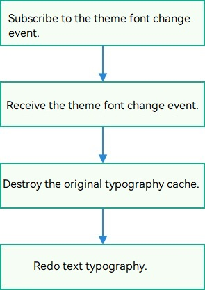

# Using Theme Fonts (ArkTS)
<!--Kit: ArkGraphics 2D-->
<!--Subsystem: Graphics-->
<!--Owner: @oh_wangxk; @gmiao522; @Lem0nC-->
<!--Designer: @liumingxiang-->
<!--Tester: @yhl0101-->
<!--Adviser: @ge-yafang-->
## Overview

Theme fonts are a special type of custom fonts that can be used in **theme apps**. You can call related APIs to enable theme fonts in theme apps.

## Implementation Mechanism

**Figure 1** Switching and using theme fonts



To switch theme fonts, your app must subscribe to the theme font change event. After receiving the font change event, your app must call the page refresh API to switch the theme font. Otherwise, the theme font takes effect only after the app is restarted.


## Available APIs

The following table lists the APIs commonly used for registering and using theme fonts. For details about the APIs, see @ohos.graphics.text (../reference/apis-arkgraphics2d/js-apis-graphics-text.md).

| API| Description| 
| -------- | -------- |
| getGlobalInstance(): FontCollection | Obtains the instance of the global font set of an app.| 


## How to Develop

1. Ensure that a theme font can be successfully applied in the **theme app** of the device system.

2. Import the required modules.

   ```ts
   import { text } from '@kit.ArkGraphics2D';
   ```

3. Use the getGlobalInstance() API to obtain the global font set object. During theme font registration, the system framework transfers only the theme font information to the global font set object.

   ```ts
   let fontCollection = text.FontCollection.getGlobalInstance();
   ```

4. Create a paragraph style and use the font manager instance to construct a paragraph generator ParagraphBuilder instance for generating paragraphs.
   > **NOTE**
   >
   > When setting the input parameters for the paragraph style during paragraph object generation, do not specify the fontFamilies attribute. Otherwise, the specified font is preferentially used instead of the theme font.
   > 
   > If no theme font is set in the **theme application**, the default font of the system is used.

   ```ts
   // Set the text style.
   let myTextStyle: text.TextStyle = {
       color: { alpha: 255, red: 255, green: 0, blue: 0 },
       fontSize: 100,
       // fontFamilies:['Test Font'] // Do not specify fontFamilies. Otherwise, the specified font is used preferentially.
   };
   // Create a paragraph style object to set the typesetting style.
   let myParagraphStyle: text.ParagraphStyle = {textStyle: myTextStyle}
   // Create a paragraph generator.
   let paragraphBuilder: text.ParagraphBuilder = new text.ParagraphBuilder(myParagraphStyle, fontCollection);
   ```

5. Set the text style, add text content, and generate paragraph text for subsequent text drawing and display.

   ```ts
   // Set the text style in the paragraph generator.
   paragraphBuilder.pushStyle(myTextStyle);
   // Set the text content in the paragraph generator.
   paragraphBuilder.addText("Hello World. \nThis is the theme font.");
   // Generate a paragraph through the paragraph generator.
   let paragraph = paragraphBuilder.build();
   ```

6. Create a rendering node and save it to an array. (The sample code here is simplified. An array is used as the container. In actual development, select a proper container based on the application scenario to ensure that nodes can be added and deleted accordingly.)

   ```ts
   // Create a rendering node array.
   const renderNodeMap: Array<RenderNode> = new Array();
   // Create a node controller.
   class MyNodeController extends NodeController {
     private rootNode: FrameNode | null = null;
     makeNode(uiContext: UIContext): FrameNode {
       this.rootNode = new FrameNode(uiContext)
       if (this.rootNode == null) {
         return this.rootNode
       }
       const renderNode = this.rootNode.getRenderNode()
       if (renderNode != null) {
         renderNode.frame = { x: 0, y: 0, width: 300, height: 50 }
         renderNode.pivot = { x: 0, y: 0 }
       }
       return this.rootNode
     }
     addNode(node: RenderNode): void {
       if (this.rootNode == null) {
         return
       }
       const renderNode = this.rootNode.getRenderNode()
       if (renderNode != null) {
         renderNode.appendChild(node)
         // Add the node to the rendering node array.
         renderNodeMap.push(node)
       }
     }
     clearNodes(): void {
       if (this.rootNode == null) {
         return
       }
       const renderNode = this.rootNode.getRenderNode()
       if (renderNode != null) {
         renderNode.clearChildren()
         // Remove the node from the rendering node array.
         renderNodeMap.pop()
       }
     }
   }
   let paragraph = paragraphBuilder.build();
   ```

7. Create a rendering node update function and export the function for other files (such as EntryAbility.ets) to use. The purpose of redrawing the node is to update the font information in the layout. If the font information is not updated, the residual result may be used, which may cause garbled characters.

   ```ts
   // Export the rendering node update function.
   export function updateRenderNodeData() {
     renderNodeMap.forEach((node) => {
       // Trigger node redrawing.
       node.invalidate()
     })
   }
   ```

8. Receive the theme change event in EntryAbility.ets and call the rendering node update function.

   ```ts
   // entry/src/main/ets/entryability/EntryAbility.ets
   export default class EntryAbility extends UIAbility {
       // ...  
       preFontId ="";
       onConfigurationUpdate(newConfig: Configuration):void{
           let fontId = newConfig.fontId;
           if(fontId && fontId !=this.preFontId){
               this.preFontId = fontId;
               updateRenderNodeData();
           }
       }
       // ...
   }
   ```


## Complete Sample Code

The following uses the theme font to draw the text "Hello World. \nThis is the theme font." as an example to provide a complete example and effect diagram.

```ts
// /pages/Index.ets
import { NodeController, FrameNode, RenderNode, DrawContext } from '@kit.ArkUI';
import { UIContext } from '@kit.ArkUI';
import { text } from '@kit.ArkGraphics2D';

// Create a custom rendering node class to draw text.
class MyRenderNode extends RenderNode {
  async draw(context: DrawContext) {
    // Obtain the canvas object.
    const canvas = context.canvas;
    // Set the text style.
    let myTextStyle: text.TextStyle = {
      color: { alpha: 255, red: 255, green: 0, blue: 0 },
      fontSize: 33
    };
    // Create a paragraph style object to set the typesetting style.
    let myParagraphStyle: text.ParagraphStyle = {
      textStyle: myTextStyle,
      align: 3,
      wordBreak:text.WordBreak.NORMAL
    };
    // Obtain the global FontCollection instance of the font manager.
    let fontCollection = text.FontCollection.getGlobalInstance(); // Obtain the global FC of ArkUI.
    // Create a paragraph generator.
    let paragraphGraphBuilder = new text.ParagraphBuilder(myParagraphStyle, fontCollection);
    // Set the text style in the paragraph generator.
    paragraphGraphBuilder.pushStyle(myTextStyle);
    // Set the text content in the paragraph generator.
    paragraphGraphBuilder.addText("Hello World. \nThis is the theme font.");
    // Generate a paragraph through the paragraph generator.
    let paragraph = paragraphGraphBuilder.build();
    // Layout
    paragraph.layoutSync(2500);
    paragraph.paint(canvas, 0, 400);
  }
}
// Create a rendering node array.
const renderNodeMap: Array<RenderNode> = new Array();
// Export the rendering node update function.
export function updateRenderNodeData() {
  renderNodeMap.forEach((node) => {
    // Trigger node redrawing.
    node.invalidate();
  });
}

class MyNodeController extends NodeController {
  private rootNode: FrameNode | null = null;
  makeNode(uiContext: UIContext): FrameNode {
    this.rootNode = new FrameNode(uiContext);
    if (this.rootNode == null) {
      return this.rootNode;
    }
    const renderNode = this.rootNode.getRenderNode();
    if (renderNode != null) {
      renderNode.frame = { x: 0, y: 0, width: 300, height: 50 };
      renderNode.pivot = { x: 0, y: 0 };
    }
    return this.rootNode;
  }
  addNode(node: RenderNode): void {
    if (this.rootNode == null) {
      return;
    }
    const renderNode = this.rootNode.getRenderNode();
    if (renderNode != null) {
      renderNode.appendChild(node);
      // Add the node to the rendering node array.
      renderNodeMap.push(node);
    }
  }
  clearNodes(): void {
    if (this.rootNode == null) {
      return;
    }
    const renderNode = this.rootNode.getRenderNode();
    if (renderNode != null) {
      renderNode.clearChildren();
      // Remove the node from the rendering node array.
      renderNodeMap.pop();
    }
  }
}

// Create a TextRenderNode object.
const textNode = new MyRenderNode();
// Define the pixel format of TextRenderNode.
textNode.frame = {
  x: 0,
  y: 100,
  width: 600,
  height: 800
};
textNode.pivot = { x: 0.2, y: 0.8 };
textNode.scale = { x: 1, y: 1 };

@Entry
@Component
struct RenderTest {
  private myNodeController: MyNodeController = new MyNodeController();
  build() {
    Column() {
      Row() {
        NodeContainer(this.myNodeController)
          .height('100%')
      }
      .height('90%')
      .backgroundColor(Color.White)
      Row(){
        Button("Draw Text")
          .fontSize('16fp')
          .fontWeight(500)
          .margin({ bottom: 24, right: 12 })
          .onClick(() => {
            this.myNodeController.clearNodes();
            this.myNodeController.addNode(textNode);
          })
          .width('50%')
          .height(40)
          .shadow(ShadowStyle.OUTER_DEFAULT_LG)
      }
      .width('100%')
      .justifyContent(FlexAlign.Center) // Center the child elements in the current row container along the main axis.
      .shadow(ShadowStyle.OUTER_DEFAULT_SM) // Set the outer shadow effect of the row container.
      .alignItems(VerticalAlign.Bottom) // Align the child elements in the current row container at the bottom along the cross axis (vertical direction).
      .layoutWeight(1) // Set the layout weight of the current row in the parent column container to 1.
    }
  }
}


```

```ts
// entry/src/main/ets/entryability/EntryAbility.ets
import { AbilityConstant, Configuration, UIAbility, Want } from '@kit.AbilityKit';
import { hilog } from '@kit.PerformanceAnalysisKit';
import { window } from '@kit.ArkUI';
import { updateRenderNodeData } from '../pages/Index';
export default class EntryAbility extends UIAbility {
    // ...  
    preFontId ="";
    onConfigurationUpdate(newConfig: Configuration):void{
        let fontId = newConfig.fontId;
        if(fontId && fontId !=this.preFontId){
            this.preFontId = fontId;
            updateRenderNodeData();
        }
    }
    // ...
}
```

## Effect

The following figures show the text rendering effect after different theme fonts are used in the **theme app**.

The display effect varies according to the theme font.

**Figure 2** Theme font 1


**Figure 3** Theme font 2


