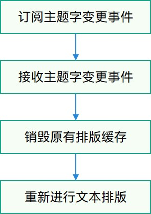
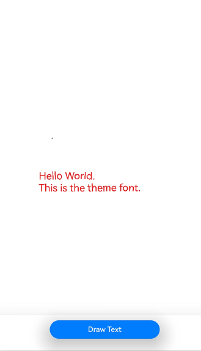
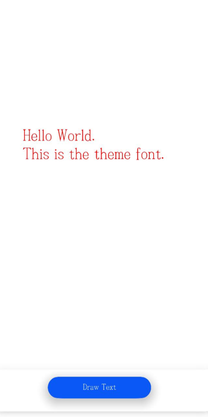

# Using Theme Fonts (ArkTS)
<!--Kit: ArkGraphics 2D-->
<!--Subsystem: Graphics-->
<!--Owner: @oh_wangxk; @gmiao522; @Lem0nC-->
<!--Designer: @liumingxiang-->
<!--Tester: @yhl0101-->
<!--Adviser: @ge-yafang-->
## Overview

Theme fonts are specialized custom fonts available for use in theme applications. You can enable them using specific APIs.

## Implementation Mechanism

**Figure 1** Switching and using theme fonts



For the switching and usage of theme fonts, the application must subscribe to the theme font change event. Upon receiving the event, the application needs to actively trigger a page refresh to enable theme font switching. Otherwise, the theme font changes will only take effect after the application is restarted.


## Available APIs

The following table lists the APIs for registering and using theme fonts. For details, see [@ohos.graphics.text (Text)](../reference/apis-arkgraphics2d/js-apis-graphics-text.md).

| Name| Description| 
| -------- | -------- |
| getGlobalInstance(): FontCollection | Obtains a global font collection instance.| 


## How to Develop

1. Make sure that you can apply a theme font in the theme applications on your device.

2. Import the required module.

   <!-- @[arkts_theme_font_import](https://gitcode.com/openharmony/applications_app_samples/blob/master/code/DocsSample/ArkGraphics2D/TextEngine/ThemeFont/entry/src/main/ets/pages/Index.ets) -->
   
   ``` TypeScript
   import { text } from '@kit.ArkGraphics2D';
   ```

3. Call the **getGlobalInstance()** API to obtain the global font collection object. The system framework only passes theme font information to the global font collection object during theme font registration.

   <!-- @[arkts_theme_font_font_collection](https://gitcode.com/openharmony/applications_app_samples/blob/master/code/DocsSample/ArkGraphics2D/TextEngine/ThemeFont/entry/src/main/ets/pages/Index.ets) -->
   
   ``` TypeScript
   // Obtain the global FontCollection instance of the font manager.
   let fontCollection = text.FontCollection.getGlobalInstance();
   ```

4. Create a paragraph style and use the font manager instance to construct a **ParagraphBuilder** instance for generating paragraphs.
   > **NOTE**
   >
   > When setting the input parameters of the paragraph style for generating a paragraph object, do not specify the **fontFamilies** attribute. Otherwise, the specified font instead of the theme font is used.
   > 
   > If no theme font is set in the theme applications, the default system font is used.

   <!-- @[arkts_theme_font_text_style](https://gitcode.com/openharmony/applications_app_samples/blob/master/code/DocsSample/ArkGraphics2D/TextEngine/ThemeFont/entry/src/main/ets/pages/Index.ets) -->
   
   ``` TypeScript
   // Set the text style.
   let myTextStyle: text.TextStyle = {
     color: { alpha: 255, red: 255, green: 0, blue: 0 },
     fontSize: 33
   };
   // Create a paragraph style object to set the typography style.
   let myParagraphStyle: text.ParagraphStyle = {
     textStyle: myTextStyle,
     align: 3,
     wordBreak:text.WordBreak.NORMAL
   };
   // Create a paragraph generator.
   let paragraphGraphBuilder = new text.ParagraphBuilder(myParagraphStyle, fontCollection);
   ```

5. Set the text style, add text content, and generate paragraph text for subsequent text drawing and display.

   <!-- @[arkts_theme_font_build](https://gitcode.com/openharmony/applications_app_samples/blob/master/code/DocsSample/ArkGraphics2D/TextEngine/ThemeFont/entry/src/main/ets/pages/Index.ets) -->
   
   ``` TypeScript
   // Set the text style in the paragraph generator.
   paragraphGraphBuilder.pushStyle(myTextStyle);
   // Set the text content in the paragraph generator.
   paragraphGraphBuilder.addText("Hello World. \nThis is the theme font.");
   // Generate a paragraph using the paragraph generator.
   let paragraph = paragraphGraphBuilder.build();
   ```

6. Create a render node and save it to an array. (This sample code is simplified and uses an array as the container. During development, you should choose a proper container based on your use case to ensure that the addition and deletion of nodes correspond to each other.)

   <!-- @[arkts_theme_font_create_render_node](https://gitcode.com/openharmony/applications_app_samples/blob/master/code/DocsSample/ArkGraphics2D/TextEngine/ThemeFont/entry/src/main/ets/pages/Index.ets) -->
   
   ``` TypeScript
   // Create a render node array.
   const renderNodeMap: Array<RenderNode> = new Array();
   // Create a node controller.
   class MyNodeController extends NodeController {
     private rootNode: FrameNode | null = null;
     makeNode(uiContext: UIContext): FrameNode {
       this.rootNode = new FrameNode(uiContext);
       if (this.rootNode == null) {
         return this.rootNode;
       }
       const renderNode = this.rootNode.getRenderNode();
       if (renderNode != null) {
         renderNode.frame = { x: 0, y: 0, width: 300, height: 50 };
         renderNode.pivot = { x: 0, y: 0 };
       }
       return this.rootNode;
     }
     addNode(node: RenderNode): void {
       if (this.rootNode == null) {
         return;
       }
       const renderNode = this.rootNode.getRenderNode();
       if (renderNode != null) {
         renderNode.appendChild(node);
         // Add the node to the render node array.
         renderNodeMap.push(node);
       }
     }
     clearNodes(): void {
       if (this.rootNode == null) {
         return;
       }
       const renderNode = this.rootNode.getRenderNode();
       if (renderNode != null) {
         renderNode.clearChildren();
         // Remove the node from the render node array.
         renderNodeMap.pop();
       }
     }
   }
   ```

7. Create and export the render node update function for files (such as EntryAbility.ets) to use. The purpose of redrawing the node is to update the font information in the typography. If the font information is not updated, the residual result may be used, causing garbled characters.

   <!-- @[arkts_theme_font_export_update](https://gitcode.com/openharmony/applications_app_samples/blob/master/code/DocsSample/ArkGraphics2D/TextEngine/ThemeFont/entry/src/main/ets/pages/Index.ets) -->
   
   ``` TypeScript
   // Export the render node update function.
   export function updateRenderNodeData() {
     renderNodeMap.forEach((node) => {
       // Trigger node redrawing.
       node.invalidate();
     });
   }
   ```

8. Receive the theme font change event in EntryAbility.ets and call the render node update function.

   <!-- @[arkts_theme_font_entry_ability](https://gitcode.com/openharmony/applications_app_samples/blob/master/code/DocsSample/ArkGraphics2D/TextEngine/ThemeFont/entry/src/main/ets/entryability/EntryAbility.ets) -->
   
   ``` TypeScript
   import { AbilityConstant, Configuration, UIAbility, Want } from '@kit.AbilityKit';
   import { hilog } from '@kit.PerformanceAnalysisKit';
   import { window } from '@kit.ArkUI';
   import { updateRenderNodeData } from '../pages/Index';
   
   // ...
   
   export default class EntryAbility extends UIAbility {
     preFontId = "";
     // ...
   
     onConfigurationUpdate(newConfig: Configuration): void {
       let fontId = newConfig.fontId;
       if (fontId && fontId !== this.preFontId) {
         this.preFontId = fontId;
         updateRenderNodeData();
         // ...
       }
     }
   }
   ```


## Effect

The following figures show how text is rendered with different theme fonts in a theme application.

The following figures are for reference only.

**Figure 2** Effect of theme font 1



**Figure 3** Effect of theme font 2


