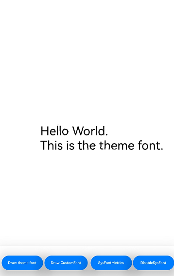
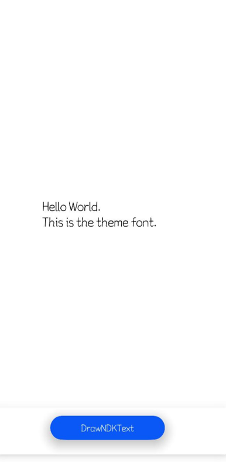

# Using Theme Fonts (C/C++)
<!--Kit: ArkGraphics 2D-->
<!--Subsystem: Graphics-->
<!--Owner: @oh_wangxk; @gmiao522; @Lem0nC-->
<!--Designer: @liumingxiang-->
<!--Tester: @yhl0101-->
<!--Adviser: @ge-yafang-->

## Overview

Theme fonts refer to the fonts that can be used in the **theme application**. They are a special type of custom fonts. You can call related APIs to enable theme fonts in the theme application.


## Implementation Mechanism

**Figure 1** Switching and using theme fonts


To switch theme fonts, your app must subscribe to the theme font change event. After receiving the font change event, your app needs to call the page refresh API to switch the theme font. Otherwise, the theme font takes effect only after the app is restarted. To draw theme fonts, you need to use OH_Drawing_GetFontCollectionGlobalInstance to obtain the global font set object. Only the object returned by this API contains theme font information.

> **NOTE**
>
> The font set object created by OH_Drawing_CreateSharedFontCollection does not contain theme font information and cannot be used to draw theme fonts.


## Available APIs

The following table lists the APIs commonly used to register and use theme fonts. For details about the APIs, see Drawing.

| Name| Description|
| -------- | -------- |
| OH_Drawing_FontCollection\* OH_Drawing_GetFontCollectionGlobalInstance(void) | Obtains the global font set object OH_Drawing_FontCollection.|
| [onConfigurationUpdate()](../reference/apis-ability-kit/js-apis-app-ability-ability.md#abilityonconfigurationupdate) | This API is called when the system configuration is updated.<br>Currently, the theme application provides only ArkTS APIs to release change events. Apps need to process cross-language calls by themselves.|


## How to Develop

1. Ensure that a theme font can be successfully applied in the **theme application** of the device system.

2. Rewrite the onConfigurationUpdate function in the application entry file (EntryAbility.ets in the default project) to respond to fontId changes and adapt to theme font switching and page refreshing.

   ```c++
   // entry/src/main/ets/entryability/EntryAbility.ets
   export default class EntryAbility extends UIAbility {
       // ...  
       preFontId ="";
       onConfigurationUpdate(newConfig: Configuration):void{
           let fontId = newConfig.fontId;
           if(fontId && fontId !=this.preFontId){
               this.preFontId = fontId;
               // Call the C++ code.
           }
       }
       // ...
   };
   ```

   When the system configuration information (newConfig in the example) changes, the onConfigurationUpdate function is automatically triggered. The application can obtain fontId from the configuration information sent by the system and determine whether fontId is the same as the fontId saved locally to identify theme font switching. If fontId is different, update the local fontId and call the C++ code to update the typesetting result.

3. This step and the following steps describe how to use theme fonts on the C++ side. The application can select a calling mode from ArkTS to C++ based on the actual situation. This example is not recommended. For details about cross-language calling, see [Node-API Introduction](../napi/napi-introduction.md).

   Add the following lib to the `src/main/cpp/CMakeLists.txt` file of the project.
   ```c++
   libnative_drawing.so
   ```

   Include header files.

   <!-- @[theme_font_c_header](https://gitcode.com/openharmony/applications_app_samples/tree/master/code/DocsSample/graphic/NDKGraphics2D/NDKThemFontAndCustomFontText/entry/src/main/cpp/samples/sample_bitmap.cpp) -->

   ```C++
   #include <native_drawing/drawing_font_collection.h>
   #include <native_drawing/drawing_text_typography.h>
   #include <native_drawing/drawing_register_font.h>
   ```

4. Create a font manager.

   > **NOTE**
   >
   > The registered theme font takes effect on the global font collection object. Therefore, you must use OH_Drawing_GetFontCollectionGlobalInstance to obtain the global font collection object for drawing. If you use OH_Drawing_CreateSharedFontCollection or OH_Drawing_CreateFontCollection to create a font collection object, the theme font cannot be used. The global font collection obtained by OH_Drawing_GetFontCollectionGlobalInstance cannot be released. Otherwise, the font drawing will be abnormal.

   <!-- @[theme_font_c_draw_text_step1](https://gitcode.com/openharmony/applications_app_samples/blob/master/applications_app_samples/code/DocsSample/graphic/NDKGraphics2D/NDKThemFontAndCustomFontText/entry/src/main/cpp/samples/sample_bitmap.cpp) -->

   ```C++
   OH_Drawing_FontCollection *fontCollection = OH_Drawing_GetFontCollectionGlobalInstance();
   ```

5. OH_Drawing_SetTextStyleFontFamilies() can be used to specify the font family name to use the specified font. However, if the theme font is used, you do not need to use OH_Drawing_SetTextStyleFontFamilies() to specify the font. Otherwise, the specified font is used first instead of the theme font.

   <!-- @[theme_font_c_draw_text_step2](https://gitcode.com/openharmony/applications_app_samples/blob/master/applications_app_samples/code/DocsSample/graphic/NDKGraphics2D/NDKThemFontAndCustomFontText/entry/src/main/cpp/samples/sample_bitmap.cpp) -->

   ```C++
   OH_Drawing_TextStyle *myTextStyle = OH_Drawing_CreateTextStyle();
   // const char* myFontFamilies[] = {"otherFontFamilyName"};
   // Do not use this API to specify the font.
   // OH_Drawing_SetTextStyleFontFamilies(textStyle, 1, myFontFamilies);
   ```

6. Set the paragraph text content to "Hello World. \nThis is the theme font." In this case, the theme font is used for the paragraph text.

   <!-- @[theme_font_c_draw_text_step3](https://gitcode.com/openharmony/applications_app_samples/blob/master/applications_app_samples/code/DocsSample/graphic/NDKGraphics2D/NDKThemFontAndCustomFontText/entry/src/main/cpp/samples/sample_bitmap.cpp) -->

   ```C++
   // Set other text styles.
   OH_Drawing_SetTextStyleColor(myTextStyle, OH_Drawing_ColorSetArgb(0xFF, 0x00, 0x00, 0x00));
   // Set the font size to 100.0.
   OH_Drawing_SetTextStyleFontSize(myTextStyle, 100.0);
   // Create a paragraph style object to set the typesetting style.
   OH_Drawing_TypographyStyle *typographyStyle = OH_Drawing_CreateTypographyStyle();
   OH_Drawing_SetTypographyTextAlign(typographyStyle, TEXT_ALIGN_LEFT); // Set the paragraph style to left alignment.
   // Create a paragraph generator.
   OH_Drawing_TypographyCreate *handler = OH_Drawing_CreateTypographyHandler(typographyStyle, fontCollection);
   // Set the text style in the paragraph generator.
   OH_Drawing_TypographyHandlerPushTextStyle(handler, myTextStyle);
   // Set the text content in the paragraph generator.
   const char *text = "Hello World. \nThis is the theme font.";
   OH_Drawing_TypographyHandlerAddText(handler, text);
   // Generate a paragraph using the paragraph generator.
   OH_Drawing_Typography *typography = OH_Drawing_CreateTypography(handler);
   ```

## Effect

The following figures show the text rendering effects after different theme fonts are used in the **theme app**.

The display effect of different theme fonts is different. This is only an example.

**Figure 2** Theme font 1



**Figure 3** Theme font 2


