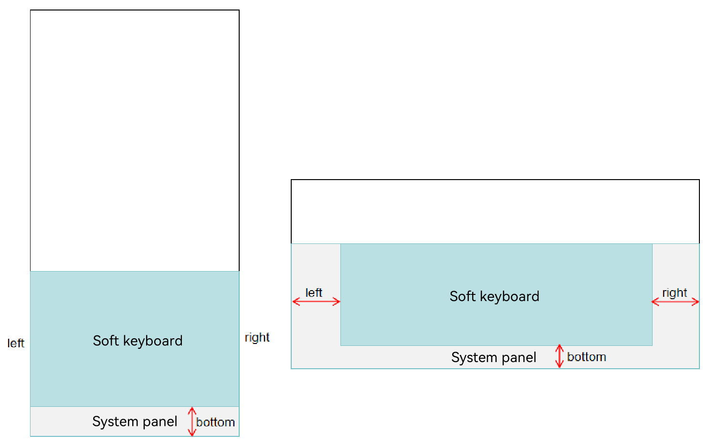
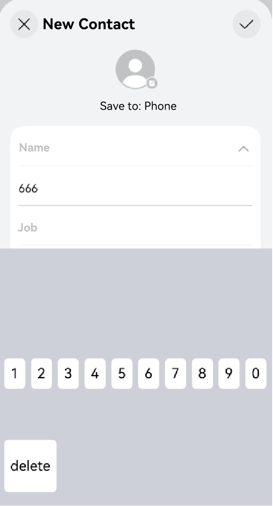

# Implementing an Input Method Application
<!--Kit: IME Kit-->
<!--Subsystem: MiscServices-->
<!--Owner: @illybyy-->
<!--Designer: @andeszhang-->
<!--Tester: @murphy1984-->
<!--Adviser: @zhang_yixin13-->

[InputMethodExtensionAbility](../reference/apis-ime-kit/js-apis-inputmethod-extension-ability.md) provides the **onCreate()** and **onDestroy()** callbacks, as described below. Override them as required. InputMethodExtensionAbility lifecycle:

- **onCreate()**

  This callback is triggered when a service is created for the first time. You can perform initialization operations, for example, registering a common event listener.

  > **NOTE**
  >
  > If an InputMethodExtensionAbility has been created, starting it again does not trigger the **onCreate()** callback.

- **onDestroy()**

  This callback is triggered when the service is no longer used and the instance is ready for destruction. You can clear resources in this callback, for example, deregister the listener.


## How to Develop

To implement an input method application, manually create an InputMethodExtensionAbility component in DevEco Studio. The procedure is as follows:

1. In the **ets** directory of the target module, right-click and choose **New** > **Directory** to create a directory named **InputMethodExtensionAbility**.

2. Right-click the **InputMethodExtensionAbility** directory, choose **New** > **File**, and create four files: **KeyboardController.ts**, **InputMethodService.ts**, **Index.ets**, and **KeyboardKeyData.ts**. The file directory is as follows:

``` 
/src/main/
├── ets/InputMethodExtensionAbility
│       └──model/KeyboardController.ts			# Shows the keyboard.
│       └──InputMethodService.ts				# Customizes a class that inherits from InputMethodExtensionAbility and add the required lifecycle callbacks.
│       └──pages
│         └── Index.ets						# Draws the keyboard and adds the input and deletion features.
│         └── KeyboardKeyData.ts			    # Defines keyboard attributes.
├── resources/base/profile/main_pages.json  
```

## Related Files

1. **InputMethodService.ts** file:

   In the **InputMethodService.ts** file, add the dependency package for importing InputMethodExtensionAbility. Customize a class that inherits from InputMethodExtensionAbility and add the required lifecycle callbacks.

<!-- @[input_case_module_import_InputMethodExtensionAbility](https://gitcode.com/openharmony/applications_app_samples/blob/master/code/Solutions/InputMethod/KikaInputMethod/entry/src/main/ets/ServiceExtAbility/ServiceExtAbility.ets) -->

``` TypeScript

import { InputMethodExtensionAbility } from '@kit.IMEKit';
import Log from '../model/Log';
import { keyboardController } from '../model/KeyboardController';
import { Want } from '@kit.AbilityKit';

const TAG: string = 'ServiceExtAbility->';

export default class ServiceExtAbility extends InputMethodExtensionAbility {
  onCreate(want: Want): void {
    this.addLog(`onCreate want: ${want.abilityName}`);
    keyboardController.onCreate(this.context);
  }

  onDestroy(): void {
    this.addLog('onDestroy');
    keyboardController.onDestroy();
  }

  addLog(message: string): void {
    Log.showInfo(TAG, `kikaInput-new: ${message}`);
  }
}
```


2. **KeyboardController.ts** file: In addition to creating the input method window, setting input method event listeners, and implementing text insertion and deletion, KeyboardController can obtain the [offset area between the input method keyboard and the system panel](../reference/apis-ime-kit/js-apis-inputmethodengine.md#getsystempanelcurrentinsets21). The input method system panel varies by device, as illustrated in the figure below.

   

<!-- @[input_case_input_KeyboardControler358](https://gitcode.com/openharmony/applications_app_samples/blob/master/code/Solutions/InputMethod/KikaInputMethod/entry/src/main/ets/model/KeyboardController.ets) -->

``` TypeScript
class KeyboardController {
  private barPosition: number = 0;
  private keyCodes: Array<number> = [];
  private mContext: InputMethodExtensionContext | undefined;
  private panel: inputMethodEngine.Panel | undefined;
  private isSpecialKeyPress: boolean = false;
  private isKeyboardShow: boolean = false;
  private inputHandle: InputHandler = InputHandler.getInstance();
  private mKeyboardDelegate: inputMethodEngine.KeyboardDelegate | undefined;

  constructor() {
    this.mContext = undefined;
    this.panel = undefined;
    this.mKeyboardDelegate = undefined;
  }

  public onCreate(context: InputMethodExtensionContext): void {
    this.mContext = context;
    this.inputHandle.addLog('onCreate');
    this.initWindow();
    this.registerListener();
  }

  public onDestroy(): void {
    this.inputHandle.addLog('onDestroy');
    this.unRegisterListener();
    this.destroyPanel();
  }

  private initWindow(): void {
    if (this.mContext === undefined) {
      return;
    }
    this.inputHandle.addLog('initWindow');
    let dis = display.getDefaultDisplaySync();
    this.inputHandle.addLog("initWindow-oncall display");
    let dWidth = dis.width;
    let dHeight = dis.height;
    let navigationBar_height = NAVIGATIONBAR_HEIGHT_DEFAULT;
    let keyHeightRate = KEYBOARD_HEIGHT_RATE_DEFAULT;
    AppStorage.setOrCreate('windowWidth', dis.width);
    AppStorage.setOrCreate('windowHeight', dis.height);
    let isLandscape = false;
    let isRkDevice = false;
    if (dis.width > dis.height) {
      isLandscape = true;
      AppStorage.setOrCreate('isLandscape', true);
    } else {
      AppStorage.setOrCreate('isLandscape', false);
    }
    if (dWidth === DEVICE_PHONE.width && dHeight === DEVICE_PHONE.height) {
      navigationBar_height = 0;
      keyHeightRate = KEYBOARD_HEIGHT_RATE_PHONE;
    } else if (dWidth === DEVICE_PHONE.height && dHeight === DEVICE_PHONE.width) {
      navigationBar_height = 0;
      keyHeightRate = KEYBOARD_HEIGHT_RATE_PHONE_LAND;
    } else if (dWidth === DEVICE_RK.width && dHeight === DEVICE_RK.height) {
      navigationBar_height = KEYBOARD_HEIGHT_RATE_DEFAULT;
      AppStorage.setOrCreate('isRkDevice', true);
      isRkDevice = true;
    } else if (dWidth === DEVICE_BIG.width && dHeight === DEVICE_BIG.height) {
      navigationBar_height = 0;
      keyHeightRate = KEYBOARD_HEIGHT_RATE_BIG_LAND;
    } else if (dWidth === DEVICE_BIG.height && dHeight === DEVICE_BIG.width) {
      navigationBar_height = 0;
      keyHeightRate = KEYBOARD_HEIGHT_RATE_BIG;
    }
    let keyHeight = dHeight * keyHeightRate;
    this.barPosition = dHeight - keyHeight - navigationBar_height;
    this.inputHandle.addLog(`initWindow-dWidth = ${dWidth};dHeight = ${dHeight};keyboard height = ${keyHeight};;navibar height = navigationBar_height`);
    this.inputHandle.addLog(`initWindow-deviceType = ${deviceInfo.deviceType}`);
    let panelInfo: inputMethodEngine.PanelInfo = {
      type: inputMethodEngine.PanelType.SOFT_KEYBOARD,
      flag: inputMethodEngine.PanelFlag.FLG_FIXED
    }
    let inputStyle = StyleConfiguration.getInputStyle(isLandscape, isRkDevice, deviceInfo.deviceType);
    AppStorage.setOrCreate('inputStyle', inputStyle);
    InputMethodEngine.createPanel(this.mContext, panelInfo).then((panel: inputMethodEngine.Panel) => {
      this.panel = panel;
      panel.resize(dWidth, keyHeight).then(() => {
        panel.moveTo(0, this.barPosition).then(() => {
          panel.setUiContent('pages/Index').then(() => {
            this.inputHandle.addLog('loadContent finished');
          })
        })
      })
    })
  }

  private destroyPanel(): void {
    this.inputHandle.addLog('destroyPanel');
    if (this.panel) {
      InputMethodEngine.destroyPanel(this.panel);
    }
  }

  private resizePanel(): void {
    this.inputHandle.addLog('resizeWindow');
    let dis = display.getDefaultDisplaySync();
    this.inputHandle.addLog('resizeWindow-oncall display');
    let dWidth = dis.width;
    let dHeight = dis.height;
    let navigationBar_height = dHeight * 0.07; // The height of the navigation bar is 0 for some products. The default value is 0.07.
    let keyHeightRate = KEYBOARD_HEIGHT_RATE_DEFAULT;
    AppStorage.setOrCreate<number>('windowWidth', dis.width);
    AppStorage.setOrCreate<number>('windowHeight', dis.height);
    let isLandscape = false;
    let isRkDevice = false;
    if (dis.width > dis.height) {
      isLandscape = true;
      AppStorage.setOrCreate('isLandscape', true);
    } else {
      AppStorage.setOrCreate('isLandscape', false);
    }
    if (dWidth === DEVICE_PHONE.width && dHeight === DEVICE_PHONE.height) {
      navigationBar_height = 0;
      keyHeightRate = KEYBOARD_HEIGHT_RATE_PHONE;
    } else if (dWidth === DEVICE_PHONE.height && dHeight === DEVICE_PHONE.width) {
      navigationBar_height = 0;
      keyHeightRate = KEYBOARD_HEIGHT_RATE_PHONE_LAND;
    } else if (dWidth === DEVICE_RK.width && dHeight === DEVICE_RK.height) {
      navigationBar_height = KEYBOARD_HEIGHT_RATE_DEFAULT;
      AppStorage.setOrCreate('isRkDevice', true);
      isRkDevice = true;
    } else if (dWidth === DEVICE_BIG.width && dHeight === DEVICE_BIG.height) {
      navigationBar_height = 0;
      keyHeightRate = KEYBOARD_HEIGHT_RATE_BIG_LAND;
    } else if (dWidth === DEVICE_BIG.height && dHeight === DEVICE_BIG.width) {
      navigationBar_height = 0;
      keyHeightRate = KEYBOARD_HEIGHT_RATE_BIG;
    }
    let keyHeight = dHeight * keyHeightRate;
    let inputStyle = StyleConfiguration.getInputStyle(isLandscape, isRkDevice, deviceInfo.deviceType);
    AppStorage.setOrCreate('inputStyle', inputStyle);
    if (this.panel) {
      this.panel.resize(dWidth, keyHeight).then(() => {
        if (this.panel) {
          this.panel.moveTo(0, dHeight - keyHeight - navigationBar_height).then(() => {
            this.inputHandle.addLog('resizePanel-moveTo success');
          })
        }
      }).catch((err: BusinessError) => {
        this.inputHandle.addLog('resizePanel-moveTo err' + JSON.stringify(err));
      })
    }
  }
```


<!-- @[input_case_input_KeyboardControler507](https://gitcode.com/openharmony/applications_app_samples/blob/master/code/Solutions/InputMethod/KikaInputMethod/entry/src/main/ets/model/KeyboardController.ets) -->

``` TypeScript
  private registerListener(): void {
    this.inputHandle.addLog('registerListener');

    display.on('change', () => {
      this.inputHandle.addLog('screenChangeEvent');
      this.resizePanel();
    });
    InputMethodEngine.on('inputStart', (kbController: inputMethodEngine.KeyboardController, textInputClient: inputMethodEngine.InputClient) => {
      this.inputHandle.addLog('keyboard inputStart');
      this.inputHandle.onInputStart(kbController, textInputClient);
    })

    // [Start input_case_input_KeyboardControllersetSubtype]
    // Register a listener in the input method application for subtype changes.
    InputMethodEngine.on('setSubtype', (inputMethodSubtype: InputMethodSubtype) => {
      this.inputHandle.addLog('GJ setSubtype inputMethodSubtype:' + inputMethodSubtype.id);
      if(inputMethodSubtype.id == 'InputMethodExtAbility') {
        AppStorage.setOrCreate('subtypeChange', 0);
        this.inputHandle.addLog('GJ setSubtype subtypeChange:' + AppStorage.get('subtypeChange'));
      }
      if(inputMethodSubtype.id == 'InputMethodExtAbility1') {
        AppStorage.setOrCreate('subtypeChange', 1);
        this.inputHandle.addLog('GJ setSubtype subtypeChange:' + AppStorage.get('subtypeChange'));
      }
    });
    // [End input_case_input_KeyboardControllersetSubtype]

    InputMethodEngine.on('inputStop', () => {
      this.inputHandle.addLog('keyboard inputStop');
      this.onDestroy();
      if (this.mContext) {
        this.mContext.destroy();
      }
    });

    this.inputHandle.addLog('pre on privateCommand');
    try {
      InputMethodEngine.on('privateCommand', (record : Record<string, inputMethodEngine.CommandDataType>) => {
        this.inputHandle.addLog('keyboard privateCommand' + JSON.stringify(record));
        Object.keys(record).forEach((key: string) => {
          this.inputHandle.addLog(`onPageShow private command key: ${key}, value: ${record[key]}`);
        })
      });
    } catch (err) {
      let error = err as BusinessError;
      this.inputHandle.addLog(`on privateCommand sendPrivateCommand catch error: ${error.code} ${error.message}`);
    }

    this.mKeyboardDelegate = inputMethodEngine.getKeyboardDelegate();

    this.mKeyboardDelegate.on('keyDown', (keyEvent: inputMethodEngine.KeyEvent) => {
      if (this.isKeyboardShow) {
        this.inputHandle.hideKeyboardSelf();
      }
      this.inputHandle.addLog(`keyDown: code = ${keyEvent.keyCode}`);
      let result = this.onKeyDown(keyEvent);
      this.inputHandle.addLog(`keyDown: result = ${result}`);
      return result;
    });

    this.mKeyboardDelegate.on('keyUp', (keyEvent: inputMethodEngine.KeyEvent) => {
      this.inputHandle.addLog(`keyUp: code = ${keyEvent.keyCode}`);
      let result = this.onKeyUp(keyEvent);
      this.inputHandle.addLog(`keyUp: result = ${result}`);
      return result;
    });
    this.mKeyboardDelegate.on('cursorContextChange', (x: number, y: number, height: number) => {
      let cursorInfo: CursorInfo = { x: x, y: y, height: height };
      this.inputHandle.setCursorInfo(cursorInfo);
    });
    if (isDebug) {
      this.mKeyboardDelegate.on('selectionChange', (oldBegin: number, oldEnd: number, newBegin: number, newEnd: number) => {
        this.inputHandle.setSelectInfo('selectInfo: from(' + oldBegin + ',' + oldEnd + ') to (' + newBegin + ',' + newEnd + ')');
      });
      this.mKeyboardDelegate.on('textChange', (text: string) => {
        this.inputHandle.setTextInfo('textInfo: ' + text);
      });
    }
  }
```


<!-- @[input_case_input_KeyboardControler587](https://gitcode.com/openharmony/applications_app_samples/blob/master/code/Solutions/InputMethod/KikaInputMethod/entry/src/main/ets/model/KeyboardController.ets) -->

``` TypeScript
  public isShiftKeyHold(): boolean {
    if (this.keyCodes.length === 0) {
      return false;
    }
    let preDownKey = this.keyCodes[0];
    return preDownKey === KeyCode.KEYCODE_SHIFT_LEFT || preDownKey === KeyCode.KEYCODE_SHIFT_RIGHT;
  }

  public onKeyDown(keyEvent: inputMethodEngine.KeyEvent): boolean {
    this.inputHandle.addLog('onKeyDown: code = ' + keyEvent.keyCode);
    let keyCode = keyEvent.keyCode;
    let idx = this.keyCodes.indexOf(keyCode);
    if (idx === -1) {
      this.keyCodes.push(keyCode);
    } else {
      this.inputHandle.addLog(`keyCode down is intercepted: ${keyCode}}`);
    }
    this.inputHandle.addLog(`onKeyDown: this.keyCodes =  ${JSON.stringify(this.keyCodes)}}`);
    if (this.isShiftKeyHold() && this.keyCodes.length === 2 && !this.isKeyCodeAZ(keyCode)) {
      this.isSpecialKeyPress = true;
      return false;
    }
    if (this.isSpecialKeyPress || keyCode === KeyCode.KEYCODE_ALT_LEFT || keyCode === KeyCode.KEYCODE_ALT_RIGHT) {
      return false;
    }
    let keyValue: string = GetHardKeyValue(keyCode, this.isShiftKeyHold());
    if (keyValue === '') {
      this.inputHandle.addLog('onKeyDown: unknown keyCode');
      this.isSpecialKeyPress = true;
      return false;
    }
    return this.inputHardKeyCode(keyValue, keyCode);
  }

  public onKeyUp(keyEvent: inputMethodEngine.KeyEvent): boolean {
    this.inputHandle.addLog('OnKeyUp: code = ' + keyEvent.keyCode);
    let keyCode = keyEvent.keyCode;
    let idx = this.keyCodes.indexOf(keyCode);
    if (idx !== -1) {
      this.keyCodes.splice(idx, 1);
    } else {
      this.inputHandle.addLog(`keyCode KeyUp is intercepted: ${keyCode}`);
    }
    this.inputHandle.addLog(`OnKeyUp: this.keyCodes = ${JSON.stringify(this.keyCodes)}`);

    // For KEYCODE_DEL/KEYCODE_FORWARD_DEL, processed in OnKeyDown, so just intercept it
    if (keyCode === 2055 || keyCode === 2071 || (keyCode >= 2012 && keyCode <= 2016)) {
      this.inputHandle.addLog(`special code: ${keyCode}`);
      return true;
    }

    if (this.isSpecialKeyPress) {
      let keyValue = GetHardKeyValue(keyCode, this.isShiftKeyHold());
      if (!keyValue) {
        this.isSpecialKeyPress = true;
      }
      if (this.keyCodes.length === 0) {
        this.isSpecialKeyPress = false;
      }
      this.inputHandle.addLog(`OnKeyUp: this.isSpecialKeyPress: ${this.isSpecialKeyPress}`);
      return false;
    }
    return true;
  }

  public isKeyCodeAZ(keyCode: number): boolean {
    return keyCode >= KeyCode.KEYCODE_A && keyCode <= KeyCode.KEYCODE_Z;
  }

  public isKeyCodeNumber(keyCode: number): boolean {
    return (keyCode >= KeyCode.KEYCODE_0 && keyCode <= KeyCode.KEYCODE_9) || (keyCode >= KeyCode.KEYCODE_NUMPAD_0 && keyCode <= KeyCode.KEYCODE_NUMPAD_9);
  }

  public inputHardKeyCode(keyValue: string, keyCode: number): boolean {
    this.inputHandle.addLog(`inputHardKeyCode keyValue is: ${keyValue}`);
    if (this.processFunctionKeys(keyValue)) {
      return true;
    }
    if (this.shiftKeys(keyValue)) {
      return false;
    }
    this.inputHandle.insertText(keyValue);
    return true;
  }

  public shiftKeys(keyValue: string): boolean {
    this.inputHandle.addLog(`shiftKeys keyValue is: ${keyValue}`);
    switch (keyValue) {
      case 'KEYCODE_SHIFT_LEFT':
      case 'KEYCODE_SHIFT_RIGHT':
        return true;
      default:
        return false;
    }
  }

  public processFunctionKeys(keyValue: string): boolean {
    this.inputHandle.addLog(`processFunctionKeys keyValue is: ${keyValue}`);
    switch (keyValue) {
      case "KEYCODE_DEL":
        this.inputHandle.deleteForward(1);
        return true;
      case "KEYCODE_FORWARD_DEL":
        this.inputHandle.deleteBackward(1);
        return true;
      case "KEYCODE_DPAD_UP":
        this.inputHandle.moveCursor(inputMethodEngine.Direction.CURSOR_UP);
        return true;
      case "KEYCODE_DPAD_DOWN":
        this.inputHandle.moveCursor(inputMethodEngine.Direction.CURSOR_DOWN);
        return true;
      case "KEYCODE_DPAD_LEFT":
        this.inputHandle.moveCursor(inputMethodEngine.Direction.CURSOR_LEFT);
        return true;
      case "KEYCODE_DPAD_RIGHT":
        this.inputHandle.moveCursor(inputMethodEngine.Direction.CURSOR_RIGHT);
        return true;
      default:
        return false;
    }
  }

  private unRegisterListener(): void {
    this.inputHandle.addLog('unRegisterListener');

    InputMethodEngine.off('inputStop', () => {
      this.inputHandle.addLog('inputStop off');
    });
    if (this.mKeyboardDelegate) {
      this.mKeyboardDelegate.off('keyDown');
      this.mKeyboardDelegate.off('keyUp');
      if (isDebug) {
        this.mKeyboardDelegate.off('cursorContextChange');
        this.mKeyboardDelegate.off('selectionChange');
        this.mKeyboardDelegate.off('textChange');
      }
    }
  }
}

export const keyboardController: KeyboardController = new KeyboardController();
```

 
3. **KeyboardKeyData.ts** file:

   In this file you can define the content displayed on the soft keyboard.


<!-- @[input_case_input_KeyboardKeyData016](https://gitcode.com/openharmony/applications_app_samples/blob/master/code/Solutions/InputMethod/KikaInputMethod/entry/src/main/ets/model/KeyboardKeyData.ets) -->

``` TypeScript
export interface keySourceListType {
  title: string,
  content: string,
  upperContent: string
}

export interface sourceListType {
  content: string
}

export enum MenuKey {
  NUMBER_KEY = '?123',
  NORMAL_KEY = 'ABC',
  SPECIAL_KEY = '=/\<'
}

export enum SubMenuType {
  NORMAL = 0,
  MENU = 1,
  EDIT = 2
}

export enum MenuType {
  NORMAL = 0,
  NUMBER = 1,
  SPECIAL = 2
}

export enum KeyState {
  LOWER_CASE = 0,
  ONCE_UPPER_CASE = 1,
  UPPER_CASE = 2
}

export let keySourceListData: keySourceListType[] = [
  {
    title: '1',
    content: 'q',
    upperContent: 'Q'
  },
  {
    title: '2',
    content: 'w',
    upperContent: 'W'
  },
  {
    title: '3',
    content: 'e',
    upperContent: 'E'
  },
  {
    title: '4',
    content: 'r',
    upperContent: 'R'
  },
  {
    title: '5',
    content: 't',
    upperContent: 'T'
  },
  {
    title: '6',
    content: 'y',
    upperContent: 'Y'
  },
  {
    title: '7',
    content: 'u',
    upperContent: 'U'
  },
  {
    title: '8',
    content: 'i',
    upperContent: 'I'
  },
  {
    title: '9',
    content: 'o',
    upperContent: 'O'
  },
  {
    title: '0',
    content: 'p',
    upperContent: 'P'
  },
  {
    title: String.fromCharCode(126),
    content: 'a',
    upperContent: 'A'
  },
  {
    title: String.fromCharCode(33),
    content: 's',
    upperContent: 'S'
  },
  {
    title: '@',
    content: 'd',
    upperContent: 'D'
  },
  {
    title: String.fromCharCode(35),
    content: 'f',
    upperContent: 'F'
  },
  {
    title: '%',
    content: 'g',
    upperContent: 'G'
  },
  {
    title: String.fromCharCode(39),
    content: 'h',
    upperContent: 'H'
  },
  {
    title: '&',
    content: 'j',
    upperContent: 'J'
  },
  {
    title: '*',
    content: 'k',
    upperContent: 'K'
  },
  {
    title: '?',
    content: 'l',
    upperContent: 'L'
  },
  {
    title: String.fromCharCode(72),
    content: 'z',
    upperContent: 'Z'
  },
  {
    title: String.fromCharCode(73),
    content: 'x',
    upperContent: 'X'
  },
  {
    title: String.fromCharCode(175),
    content: 'c',
    upperContent: 'C'
  },
  {
    title: String.fromCharCode(95),
    content: 'v',
    upperContent: 'V'
  },
  {
    title: String.fromCharCode(58),
    content: 'b',
    upperContent: 'B'
  },
  {
    title: String.fromCharCode(59),
    content: 'n',
    upperContent: 'N'
  },
  {
    title: String.fromCharCode(47),
    content: 'm',
    upperContent: 'M'
  }
]

```


<!-- @[input_case_input_KeyboardKeyData186](https://gitcode.com/openharmony/applications_app_samples/blob/master/code/Solutions/InputMethod/KikaInputMethod/entry/src/main/ets/model/KeyboardKeyData.ets) -->

``` TypeScript
export let numberSourceListData: sourceListType[] = [
  {
    content: '1'
  },
  {
    content: '2'
  },
  {
    content: '3'
  },
  {
    content: '4'
  },
  {
    content: '5'
  },
  {
    content: '6'
  },
  {
    content: '7'
  },
  {
    content: '8'
  },
  {
    content: '9'
  },
  {
    content: '0'
  },
  {
    content: '@'
  },
  {
    content: '#'
  },
  {
    content: '$'
  },
  {
    content: '%'
  },
  {
    content: '&'
  },
  {
    content: '-'
  },
  {
    content: '+'
  },
  {
    content: '('
  },
  {
    content: ')'
  },
  {
    content: '/'
  },
  {
    content: '*'
  },
  {
    content: '"'
  },
  {
    content: "'"
  },
  {
    content: ':'
  },
  {
    content: ';'
  },
  {
    content: '!'
  },
  {
    content: '?'
  },

]

export let symbolSourceListData: sourceListType[] = [
  {
    content: '~'
  },
  {
    content: '`'
  },
  {
    content: '|'
  },
  {
    content: '\u2022'
  },
  {
    content: '\u221A'
  },
  {
    content: '\u03A0'
  },
  {
    content: '\u00F7'
  },
  {
    content: '\u00D7'
  },
  {
    content: String.fromCharCode(182)
  },
  {
    content: '\u2206'
  },
  {
    content: String.fromCharCode(163)
  },
  {
    content: '\u20ac'
  },
  {
    content: String.fromCharCode(165)
  },
  {
    content: String.fromCharCode(162)
  },
  {
    content: String.fromCharCode(94)
  },
  {
    content: '\u00B0'
  },
  {
    content: '='
  },
  {
    content: String.fromCharCode(123)
  },
  {
    content: String.fromCharCode(125)
  },
  {
    content: String.fromCharCode(44)
  },
  {
    content: String.fromCharCode(92)
  },
  {
    content: String.fromCharCode(169)
  },
  {
    content: String.fromCharCode(174)
  },
  {
    content: '\u2122'
  },
  {
    content: '\u2105'
  },
  {
    content: '['
  },
  {
    content: ']'
  }
]
```
 
4. **Index.ets** file:

   This file describes the functions of keys. For example, the number keys print numbers in the text box, and the delete key deletes what's entered.

   <!--Del-->Add the path to this file to the **src** field in the **resources/base/profile/main_pages.json** file.<!--DelEnd-->

<!-- @[input_case_input_index](https://gitcode.com/openharmony/applications_app_samples/blob/master/code/Solutions/InputMethod/KikaInputMethod/entry/src/main/ets/pages/Index.ets) -->

``` TypeScript
import deviceInfo from '@ohos.deviceInfo';
import Log from '../model/Log';
import { EditView } from '../components/EditView';
import { InputHandler } from '../model/KeyboardController';
import {
  MenuType,
  SubMenuType,
  keySourceListData,
  numberSourceListData,
  symbolSourceListData,
  keySourceListType,
  sourceListType
} from '../model/KeyboardKeyData';
import { KeyMenu } from '../components/KeyMenu';
import { NumberMenu } from '../components/NumberMenu';
import { StyleConfiguration, KeyStyle } from '../common/StyleConfiguration';
import { SymbolMenu } from '../components/SymbolMenu';
import { Submenu } from '../components/Submenu';
import { TopMenu } from '../components/TopMenu';
import { inputMethodEngine } from '@kit.IMEKit';


const DEVICE_TYPE: string = deviceInfo.deviceType;
const TAG: string = 'index->';

@Entry
@Component
struct Index {
  @Provide menuType: number = MenuType.NORMAL;
  @StorageLink('inputPattern') @Watch('inputPatternChange') inputPattern: InputType = InputType.Normal
  @StorageLink('submenuType') submenuType: number = SubMenuType.NORMAL;
  @StorageLink('isLandscape') @Watch('change') isLandscape: boolean = false;
  @StorageLink('isRkDevice') isRkDevice: boolean = true;
  @StorageLink('inputStyle') inputStyle: KeyStyle = StyleConfiguration.getInputStyle(this.isLandscape, this.isRkDevice, DEVICE_TYPE);
  private panel: inputMethodEngine.Panel | undefined;
  @StorageLink('subtypeChange') subtypeChange: number = 0;


  aboutToAppear(): void {
    console.log('aabb',JSON.stringify(this.submenuType));

    console.log('diaoqijianpan');    
    // [Start input_case_input_immersiveMode]
    // Check whether the immersive mode is used. If the immersive mode is used, select the immersive mode.
    // [Start input_case_input_immersiveModeeditorAttributeChanged]
    inputMethodEngine.getKeyboardDelegate().on("editorAttributeChanged", (attr : inputMethodEngine.EditorAttribute) => {
      // [End input_case_input_immersiveModeeditorAttributeChanged]
      console.log('recv editorAttributeChanged, immersiveMode: ', JSON.stringify(attr.immersiveMode));
      if (attr.immersiveMode == 1) {
        this.panel?.setImmersiveMode(inputMethodEngine.ImmersiveMode.DARK_IMMERSIVE);
        console.log('recv editorAttributeChanged, panel:', JSON.stringify(this.panel?.getImmersiveMode()));
      }
    })
    // [End input_case_input_immersiveMode]
  }

  onBackPress(): boolean {
    Log.showInfo(TAG, 'kikaInput onBackPress');
    this.submenuType = SubMenuType.NORMAL;
    InputHandler.getInstance().hideKeyboardSelf();
    return true;
  }

  inputPatternChange(): void {
    if (this.inputPattern === InputType.Number || this.inputPattern === InputType.PhoneNumber) {
      this.menuType = MenuType.NUMBER;
    } else {
      this.menuType = MenuType.NORMAL;
    }
  }

  change(): void {
    AppStorage.set('inputStyle', StyleConfiguration.getInputStyle(this.isLandscape, this.isRkDevice, DEVICE_TYPE));
  }


  build() {
    Stack() {
      Column() {
        TopMenu()
        Column() {
          if (this.submenuType > SubMenuType.NORMAL) {
            if (this.submenuType === SubMenuType.MENU) {
              Submenu()
            } else {
              EditView();
            }
          } else {
            if (this.menuType === MenuType.NORMAL) {
              if (this.subtypeChange == 0) {
                KeyMenu()
              } else {
                NumberMenu()
              }
            } else if (this.menuType === MenuType.NUMBER) {
              NumberMenu()
            } else {
              SymbolMenu()
            }
          }
        }
        .width('100%')
        .layoutWeight(1)
        .justifyContent(FlexAlign.Center)
        .backgroundColor('#D5D8DD')
      }
      .height('100%')
    }
    .height('100%')
    .backgroundColor(Color.White)
  }
}
```


5. **module.json5** file:<br>Register the InputMethodExtensionAbility in the [module.json5 file](../quick-start/module-configuration-file.md) corresponding to the **Module** project. Set **type** to **"inputMethod"** and **srcEntry** to the code path of the **InputMethodExtensionAbility** component.


<!-- @[input_case_entry_module_extensionAbilities](https://gitcode.com/openharmony/applications_app_samples/blob/master/code/Solutions/InputMethod/KikaInputMethod/entry/src/main/module.json5) -->

``` JSON5
    "extensionAbilities": [
      {
        "srcEntry": "./ets/ServiceExtAbility/ServiceExtAbility.ets",
        "name": "ServiceExtAbility",
        "label": "$string:MainAbility_label",
        "description": "$string:extension_ability_descripter",
        "type": "inputMethod",
        "exported": true,
        "metadata": [
          {
            "name": "ohos.extension.input_method",
            "resource": "$profile:input_method_config"
          }
        ]
      }
    ],
```


## Constraints

To protect the InputMethodExtensionAbility against abuse, functional constraints of the basic access mode are provided.

> **NOTE**
>
> Strictly comply with the functional constraints of the basic access mode. In this mode, you should provide only basic typing features, not interaction with online services in any form. The system will gradually introduce measures for compliance with the basic access mode, including but not limited to running the Extension process as an independent process and in sandbox mode, preventing the Extension process from creating subprocesses, and restricting inter-process communication and network access. Violations may result in service exceptions.
## Effect

