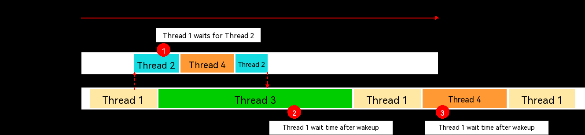
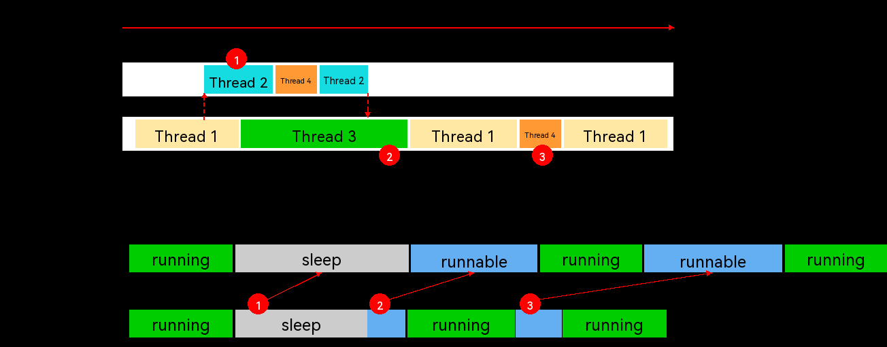

# QoS Development

<!--Kit: Kernel Enhance Kit-->
<!--Subsystem: Kernel-->
<!--Owner: @yzl-kongzhenhua; @Leibobo-->
<!--Designer: @wangxiayang; @lizongfeng; @zzzuo-->
<!--Tester: @lianxuanself; @laonie666-->
<!--Adviser: @fang-jinxu-->
<!-- md-trans-meta sourceCommit=906890335bf480362f63f05961ebc2618e5bb601 translatedAt=2026-07-02T12:58:17.917Z pushedAt=2026-07-03T10:42:31.357Z -->

## When to Use

Since the emergence of multiprogramming and multitasking operating systems, limited system resources such as CPU and memory have become resources competed for by all tasks in a system. Properly arranging tasks is of great significance to both system responsiveness and resource consumption. Compared with the operating system, developers have a clearer understanding of the importance of each task in an application. Classifying application tasks based on their importance can help the system schedule tasks more effectively. This guide describes how to use the QoS feature and related APIs in OpenHarmony to adjust task runtime allocation in the system.

This section guides you in customizing the priority scheduling attributes of application tasks based on the Quality of Service (QoS) feature.

## Basic Concepts

### QoS

QoS means service quality.

### QoS Levels

OpenHarmony currently defines the following six QoS levels. From top to bottom, the degree of association with user interaction increases. These levels apply to various application scenarios and load characteristics.

| QoS level | Scenario | Load characteristics |
| ------------------------------------------------------------ | ------------------------------------------------------------ | ------------------------------------------------------------ |
| QOS_BACKGROUND | Background tasks invisible to users, such as data synchronization and backup. | The task may take several minutes or even hours to complete. |
| QOS_UTILITY | Tasks whose response does not need to be immediately visible, such as downloading or importing data. | The task may take several seconds to several minutes to complete. |
| QOS_DEFAULT | Default. | The task may take several seconds to complete. |
| QOS_USER_INITIATED | Tasks triggered by users with visible progress, such as opening a document. | The task is completed within several seconds. |
| QOS_DEADLINE_REQUEST | Critical tasks that should finish as quickly as possible, such as page loading. | The task is completed almost immediately. |
| QOS_USER_INTERACTIVE | User interaction tasks, such as UI threads, UI refresh, and animations. | The task is immediate. |

QoS levels are defined as the `QoS_Level` enum type, as shown in the preceding table. The enum values are defined as follows.

### QoS_Level Declaration

```{.c}
typedef enum QoS_Level {
    /**
     * Applies to background tasks invisible to users, such as data synchronization.
     */
    QOS_BACKGROUND,
    /**
     * Applies to tasks whose response does not need to be immediately visible, such as downloading.
     */
    QOS_UTILITY,
    /**
     * Default QoS level.
     */
    QOS_DEFAULT,
    /**
     * Applies to tasks triggered by users with visible progress, such as opening a document.
     */
    QOS_USER_INITIATED,
    /**
     * Applies to tasks that should finish as quickly as possible, such as page loading.
     */
    QOS_DEADLINE_REQUEST,
    /**
     * Applies to user interaction tasks, such as animation drawing.
     */
    QOS_USER_INTERACTIVE,
} QoS_Level;

```

## Benefits

Tasks with higher QoS levels may be allocated more CPU time than tasks with lower QoS levels.

The following describes how proper use of QoS optimizes program execution.

### QoS Optimization for Thread Execution

**Before optimization**



Thread 1 and Thread 2 are two key threads of a program. When running, Thread 1 triggers a new task, Thread 2. After Thread 2 finishes execution, it wakes up Thread 1 to continue execution. Before the QoS levels of these two threads are marked, their execution priority is lower than that of Thread 3 and Thread 4. In this case, Thread 1 and Thread 2 run as shown in the preceding figure:

1. Thread 1 waits to be woken up by Thread 2. Because Thread 2 has a low priority and is preempted for a long time, Thread 1 stays asleep for a long time.

2. Thread 1 has a low priority and waits for a long time to run after it is woken up.

3. Thread 1 has a low priority and is preempted by other threads for a long time while running.

**After optimization**



After the QoS levels of Thread 1 and Thread 2 are properly marked, the execution of the two threads is optimized as shown in the preceding figure:

1. The runtime proportion of Thread 2 increases, and the wait time of Thread 1 decreases.

2. After Thread 1 is woken up by Thread 2, its wait time decreases.

3. The runtime proportion of Thread 1 increases, and the proportion of time spent preempted decreases.

### QoS Optimization for the RN Framework

After the QoS levels of key threads in the RN framework are properly marked, performance in open-source benchmark tests improves by about 13%, as shown in the following table.

| Verification Scenario | Verification Environment | Total Rendering Time |
| ----------- | ----------- | ----------- |
| benchmark<br>1500view | Without QoS optimization | 270.8 ms |
| benchmark<br>1500view | With QoS optimization | 236.6 ms |

## Available APIs

| Name | Description | Parameter | Return value |
| ------------------------------------------------------------ | ------------------------------------------------------------ | ------------------------------------------------------------ | ------------------------------------------------------------ |
| OH_QoS_SetThreadQoS(QoS_Level level) | Sets the QoS level of the current task. | QoS_Level level | 0 or -1 |
| OH_QoS_ResetThreadQoS() | Cancels the QoS level set for the current task. | None | 0 or -1 |
| OH_QoS_GetThreadQoS(QoS_Level *level) | Obtains the QoS level of the current task. If no QoS level has been set or an internal error occurs, -1 is returned. | QoS_Level *level | 0 or -1 |

### Constraints

* QoS APIs can set only the QoS level of the current task.

## Functions

### OH_QoS_SetThreadQoS

**Declaration**

```{.c}
int OH_QoS_SetThreadQoS(QoS_Level level);
```

**Parameters**

QoS_Level level

* Describes the QoS level to be set for the task.

**Returns**

* Returns **0** if the operation is successful; returns **-1** otherwise.

**Description**

Sets the QoS level of the current task. Developers can mark the current task with different QoS levels based on its importance to obtain different scheduling priorities. For details, see [Setting Thread Priority in Heavy-Load Scenarios](https://developer.huawei.com/consumer/en/doc/best-practices/bpta-thread-priority-setting).

**Example**

```c++
#include <stdio.h>
#include "qos/qos.h"

int func()
{
    // Set the QoS level of the current task to QOS_USER_INITIATED.
    int ret = OH_QoS_SetThreadQoS(QoS_Level::QOS_USER_INITIATED);

    if (ret == 0) { // ret equal to 0 indicates that the setting is successful.
        printf("set QoS success.");
    } else { // ret not equal to 0 indicates that the setting fails.
        printf("set QoS failed.");
    }

    return 0;
}
```

### OH_QoS_ResetThreadQoS

**Declaration**

```{.c}
int OH_QoS_ResetThreadQoS();
```

**Parameters**

* None.

**Returns**

* Returns **0** if the operation is successful; returns **-1** otherwise.

**Description**

Cancels the QoS level set for the current task. For details, see [Setting Thread Priority in Heavy-Load Scenarios](https://developer.huawei.com/consumer/en/doc/best-practices/bpta-thread-priority-setting).

**Example**

```c++
#include <stdio.h>
#include "qos/qos.h"

int func()
{
    // Reset the QoS level of the current task.
    int ret = OH_QoS_ResetThreadQoS();

    if (ret == 0) { // ret equal to 0 indicates that the reset is successful.
        printf("reset QoS success.");
    } else { // ret not equal to 0 indicates that the reset fails.
        printf("reset QoS failed.");
    }

    return 0;
}
```

### OH_QoS_GetThreadQoS

**Declaration**

```{.c}
int OH_QoS_GetThreadQoS(QoS_Level *level);
```

**Parameters**

QoS_Level *level

* Stores the QoS level that has been set for the task.

**Returns**

* Returns **0** if the operation is successful; returns **-1** otherwise.

**Description**

Obtains the QoS level most recently set for the current task. If no QoS level has been set, -1 is returned. For details, see [Setting Thread Priority in Heavy-Load Scenarios](https://developer.huawei.com/consumer/en/doc/best-practices/bpta-thread-priority-setting).

**Example**

```c++
#include <stdio.h>
#include "qos/qos.h"

int func()
{
    // Obtain the QoS level of the current task.
    QoS_Level level = QoS_Level::QOS_DEFAULT;
    int ret = OH_QoS_GetThreadQoS(&level);

    if (ret == 0) { // ret equal to 0 indicates that the query is successful.
        printf("get QoS level %d success.", level);
    } else { // ret not equal to 0 indicates that the query fails.
        printf("get QoS level failed.");
    }

    return 0;
}
```

## How to Develop

The following steps describe how to use the Native APIs provided by the QoS feature to adjust or query the QoS level of a task.

### Adding Dynamic Libraries

The QoS feature depends on the related dynamic library **libqos.so**, which needs to be added to the build environment of the target application or program.

**Example**

An NDK project template created using DevEco Studio generates a **CMakeLists.txt** script by default. Add the QoS-related dynamic library as follows:

```txt
# the minimum version of CMake.
cmake_minimum_required(VERSION 3.4.1)
project(qos)

set(NATIVERENDER_ROOT_PATH ${CMAKE_CURRENT_SOURCE_DIR})

include_directories(${NATIVERENDER_ROOT_PATH}
                    ${NATIVERENDER_ROOT_PATH}/include)

add_library(entry SHARED hello.cpp)

# Directly reference libqos.so because it is located in the NDK that is already in the link search path.
target_link_libraries(entry PUBLIC libqos.so)
```

### Including Header Files

Include the related header file in the source code where the QoS feature is used.

```c
#include "qos/qos.h"
```

### Calling QoS APIs

You can call the corresponding QoS APIs based on service requirements to adjust or query the QoS level of a task.