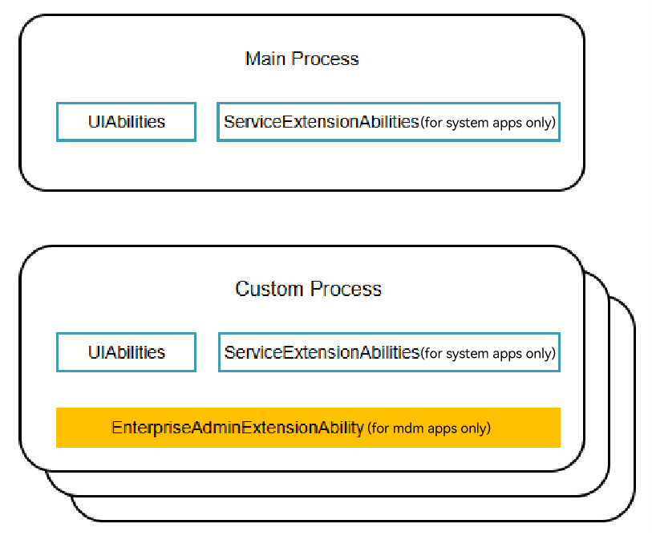
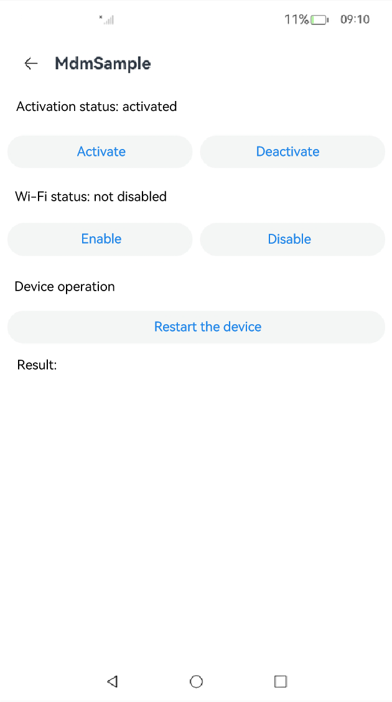
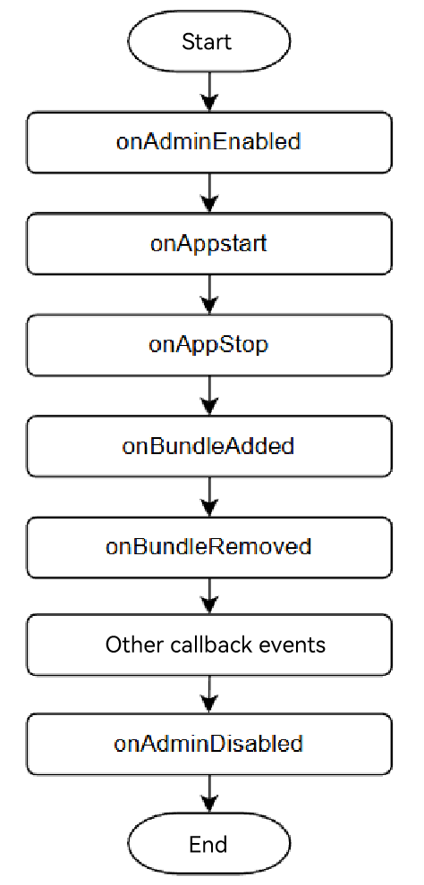
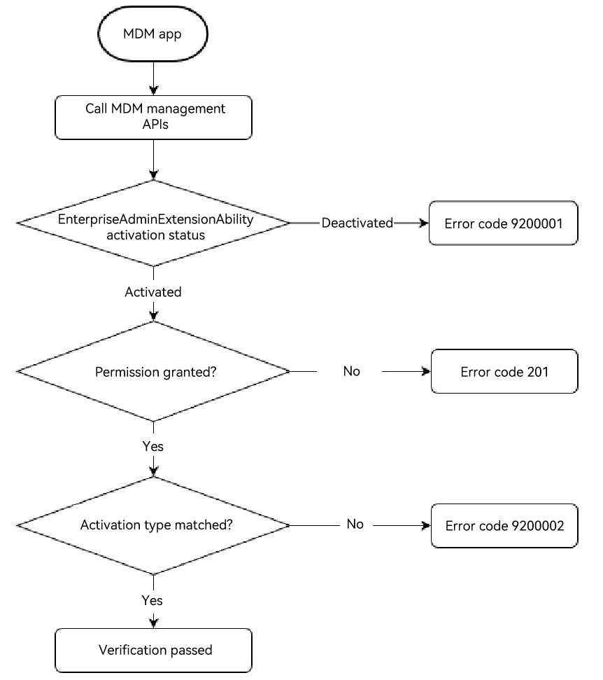

# App Model
<!--Kit: MDM Kit-->
<!--Subsystem: Customization-->
<!--Owner: @huanleima-->
<!--Designer: @liuzuming-->
<!--Tester: @lpw_work-->
<!--Adviser: @zhang_yixin13-->

## Overview

An app model is the abstraction of capabilities required by an app. It provides components and mechanisms required for running the app. By adhering to a unified model, you can streamline app development, making it more efficient and straightforward.

## About EnterpriseAdminExtensionAbility

[EnterpriseAdminExtensionAbility](./mdm-kit-term.md#enterpriseadminextensionability) is a mandatory component for [MDM apps](./mdm-kit-term.md#mdm-application-device-administrator-application). You need to define an [EnterpriseAdminExtensionAbility](../reference/apis-mdm-kit/js-apis-EnterpriseAdminExtensionAbility.md)-type [ExtensionAbility](../reference/apis-ability-kit/js-apis-app-ability-extensionAbility.md) component to activate an MDM app. Once activated, this component runs as an independent background process.

### Process Model

The [process model](../application-models/process-model-stage.md#process-model) of an MDM app inherits from that of a regular app. Building on the regular app model, an MDM app includes an additional independent **EnterpriseAdmin** process. When the **EnterpriseAdminExtensionAbility** component of the MDM app is activated, the **EnterpriseAdmin** process is created. As the background process of the device administrator app, the **EnterpriseAdmin** process is used to receive callbacks for events such as MDM app activation and deactivation. The lifecycle of the **EnterpriseAdmin** process is independent of the main process and is managed by the system instead. The way the **EnterpriseAdmin** process lifecycle is [managed](#enterpriseadminextensionability-capability-differences-after-activation) varies based on how the **EnterpriseAdminExtensionAbility** component is activated.

**Figure 1** MDM app process model

### EnterpriseAdmin Process Lifecycle

Once activated, the **EnterpriseAdminExtensionAbility** component runs as an independent process with support for system state change callbacks. The **EnterpriseAdmin** process resides in a separate process from the app's main process, with its startup and shutdown governed by the [EDM](./mdm-kit-term.md#edm) service. It remains operational even when the app is running in the background.

**Figure 2** MDM app in foreground and activated state

**Figure 3** MDM app foreground process and EnterpriseAdmin process

**Figure 4** EnterpriseAdmin process running when the MDM app main process is stopped

**Figure 5** EnterpriseAdmin process supporting system event callbacks

- **onAdminEnabled**: called when the **EnterpriseAdminExtensionAbility** component of the MDM app is activated.
- **onAdminDisabled**: called when the **EnterpriseAdminExtensionAbility** component of the MDM app is deactivated.
- **onAppStart**: called when an app is started. The callback contains the app bundle name and can be received only after the **MANAGED_EVENT_APP_START** event is registered using the [adminManager.subscribeManagedEventSync](../reference/apis-mdm-kit/js-apis-enterprise-adminManager.md#adminmanagersubscribemanagedeventsync) API.
- **onAppStop**: called when an app is stopped. The callback contains the app bundle name and can be received only after the **MANAGED_EVENT_APP_STOP** event is registered using the [adminManager.subscribeManagedEventSync](../reference/apis-mdm-kit/js-apis-enterprise-adminManager.md#adminmanagersubscribemanagedeventsync) API.
- **onBundleAdded**: called when an app is installed. The callback contains the app bundle name and account ID, and can be received only after the **MANAGED_EVENT_BUNDLE_ADDED** event is registered using the [adminManager.subscribeManagedEventSync](../reference/apis-mdm-kit/js-apis-enterprise-adminManager.md#adminmanagersubscribemanagedeventsync) API.
- **onBundleRemoved**: called when an app is uninstalled. The callback contains the app bundle name and account ID, and can be received only after the **MANAGED_EVENT_BUNDLE_REMOVED** event is registered using the [adminManager.subscribeManagedEventSync](../reference/apis-mdm-kit/js-apis-enterprise-adminManager.md#adminmanagersubscribemanagedeventsync) API.
- For more event callbacks, see [ManagedEvent](../reference/apis-mdm-kit/js-apis-enterprise-adminManager.md#managedevent).

### EnterpriseAdminExtensionAbility Capability Differences After Activation

The capabilities of the **EnterpriseAdminExtensionAbility** component vary depending on the activation API used, which can be <!--Del-->[adminManager.enableAdmin](../reference/apis-mdm-kit/js-apis-enterprise-adminManager-sys.md#adminmanagerenableadmin), <!--DelEnd-->[adminManager.enableDeviceAdmin](../reference/apis-mdm-kit/js-apis-enterprise-adminManager.md#adminmanagerenabledeviceadmin23), and [adminManager.startAdminProvision](../reference/apis-mdm-kit/js-apis-enterprise-adminManager.md#adminmanagerstartadminprovision15). For details, see the following table.

| Feature                  | SDA                | DA                | BDA      |
| ------------------------| --------------------| -------------------|------------ | 
|Uninstallation prevention| Users are not allowed to uninstall the app.| By default, users can uninstall the app.| Uninstallation is prohibited.|
| Permission to call MDM management APIs| All public management APIs are supported.| All public management APIs are supported.| Only the [restrictions.setDisallowedPolicy](../reference/apis-mdm-kit/js-apis-enterprise-restrictions.md#restrictionssetdisallowedpolicy) and [restrictions.getDisallowedPolicy](../reference/apis-mdm-kit/js-apis-enterprise-restrictions.md#restrictionsgetdisallowedpolicy) APIs are supported.|
| Number of supported roles| Up to 1| Up to 10| No limit|

> **NOTE**
>
> - BDA and other [administrators](./mdm-kit-term.md#administrators) cannot coexist.
>
> - The total number of SDAs and DAs cannot exceed 10.

## Authorization Principles of Management APIs

The **EnterpriseAdminExtensionAbility** component of an MDM app can take effect only after being authorized by the enterprise. Specifically, the enterprise needs to call the MDM Kit API to activate this component. <!--RP1--><!--RP1End-->Before this operation, the component is only in the declared state and does not have actual capabilities. After the component is activated, any process of the MDM app can call the MDM management APIs.

### API Permission Verification Mechanism

MDM management APIs verify access permissions via [ACL authorization](../security/AccessToken/app-permission-mgmt-overview.md#basic-concepts-in-the-permission-mechanism) and also verify the activation status and activation type of the **EnterpriseAdminExtensionAbility** component. The preceding three conditions must be met when the MDM app invokes the MDM management APIs. Otherwise, the error code [9200001](../reference/apis-mdm-kit/errorcode-enterpriseDeviceManager.md#9200001-deviceadmin-not-enabled), [201](../reference/errorcode-universal.md#201-permission-denied), or [9200002](../reference/apis-mdm-kit/errorcode-enterpriseDeviceManager.md#9200002-permission-denied) is displayed.

**Figure 6** EDM verification logic

