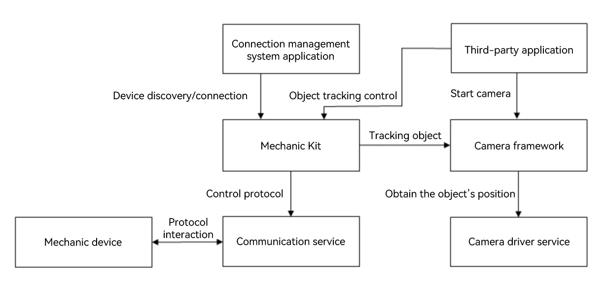

# Introduction to Mechanic Kit
<!--Kit: Mechanic Kit-->
<!--Subsystem: Mechanic-->
<!--Owner: @hobbycao-->
<!--Designer: @saga2025-->
<!--Tester: @zhaodengqi-->
<!--Adviser: @foryourself-->

Mechanic Manager is supported since API version 20. With the rapid development of smart devices, the demand for interaction between mobile phones and third-party accessory devices (such as gimbals and robotic arms) is growing. However, there remains a lack of a unified and comprehensive connection and control solution. To address this issue, Mechanic Kit offers a complete integration solution for third-party accessories.

Mechanic Kit enables device connection management, intelligent tracking, and status monitoring through its `mechanicManager` module. It provides key capabilities such as intelligent tracking<!--Del--> and precise control<!--DelEnd-->, facilitating development of high-quality device interaction applications. 

The `mechanicManager` module supports the control of and interaction with connected mechanic devices, including connection management, device control, and status monitoring.

## When to Use

Mechanic Kit primarily targets interaction control scenarios involving intelligent mechanic devices such as gimbals and robotic arms.

- **Intelligent photography assistance**: Implement automated photography functions such as face tracking and object tracking using mechanic devices, improving photography quality and user experience.
- **Photography control**: With a mobile phone serving as the control terminal, manipulate mechanic devices like gimbals or robotic arms for precise angle adjustment and motion trajectory control.

With the device connection, intelligent tracking, and precise control capabilities provided by Mechanic Kit, you can mechanic device control applications efficiently.

## Capabilities

Mechanic Kit provides developers with comprehensive mechanic device control capabilities, including:

### Managing Device Connections

- **Device discovery**: Obtain the list of currently connected mechanic devices, such as tripods.
- **Connection status listening**: Listen for the connection status changes of mechanic devices in real time.
- **Device information query**: Obtain basic information such as the ID, name, and type of mechanic devices.

### Intelligent Tracking

- **Camera tracking switch**: Enable or disable intelligent tracking of the camera.
- **Tracking layout setting**: Provide four tracking layout modes: default, left, center, and right.
- **Tracking status listening**: Listen for events such as user operations and layout changes.

<!--Del-->
### Precise Device Control

- **Relative angle rotation**: Perform relative angle rotation control based on the current position.
- **Absolute angle rotation**: Perform rotation control based on the absolute Euler angle.
- **Movement stop control**: Stop all movement operations of the mechanic device immediately.
<!--DelEnd-->

### Status Monitoring

- **Current angle query**: Obtain the current angle of the mechanic device on three axes in real time.
- **Rotation limit query**: Obtain the maximum rotation range of the mechanic device on each axis.
- **Rotation axis status listening**: Listen for the enabling status change events and restriction of each rotation axis.
- **Movement parameter query**: Obtain the maximum rotation speed and continuous rotation time.

## Working Principles

## Constraints

Before using the mechanic device management capability, ensure that the following conditions are met:

- **Device connection requirements**: The development device must be connected to the mechanic device to ensure that the communication link is normal.
- **Protocol compatibility**: Mechanical body accessories must support the Mechanic Kit protocol to ensure the accuracy of instruction transmission and status feedback.
- **Camera permission**: An application in the foreground must obtain the camera permission to support visual functions such as intelligent tracking.
- **System permission**: Some advanced functions (such as rotation control) require system application permissions.
- **Hardware restriction**: The operation range is limited by the movement limit of the mechanic device.

> **NOTE**
>
> Before calling the APIs of Mechanic Kit, make sure the preceding conditions are met. Otherwise, service exceptions may occur.
