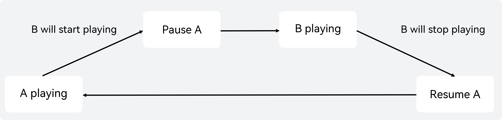

# Audio Focus and Audio Session Overview
<!--Kit: Audio Kit-->
<!--Subsystem: Multimedia-->
<!--Owner: @funny_sunix-->
<!--Designer: @hao-liangfei-->
<!--Tester: @Filger-->
<!--Adviser: @w_Machine_cc-->
<!-- md-trans-meta sourceCommit=2acf78e637d04a14dbd641a9e95180247cab262f translatedAt=2026-09-18T02:13:07.102Z pushedAt=2026-09-18T10:38:53.346Z -->

When an app plays or records audio, it may encounter audio focus conflicts with other apps or with other audio streams within the same app. This section provides an overview of how these conflicts are handled and explains how to use the system's audio focus management capabilities to resolve audio interruption issues.

The system provides two mechanisms for managing audio conflicts: audio focus and audio sessions.

Audio focus uses predefined system policies to handle relatively simple scenarios. After the appropriate audio stream type is selected, the system automatically manages audio focus without requiring app involvement.

If audio focus cannot meet the app's requirements, use audio sessions to customize the app's audio conflict management policy. This requires the app to integrate audio session support.

The following table lists the main differences between audio focus and audio session.

| Aspect | Audio Focus | Audio Session |
|---|---|---|
| Management granularity | Individual audio streams. | A group of audio streams as a whole. |
| Conflict resolution policy | Fixed priority rules. | Configurable concurrency modes (MIX, DUCK, PAUSE, etc.). |
| Control flexibility | System-managed. Apps respond passively to focus changes. | App-managed. Apps can proactively configure conflict management policies. |
| Callbacks | Interruption event callbacks. | Session state change, device change, and session invalidation callbacks. |
| Applicable scenarios | Single playback or recording scenarios. | Complex concurrency scenarios requiring fine-grained control. |

## Audio Focus Usage Scenarios
Audio focus is a system-managed mechanism that uses predefined focus policies to handle simple audio concurrency scenarios. Typical use cases include the following.

### Scenario 1: VoIP Calls Interrupted by Incoming Cellular Calls

A user is in a [VoIP call](./audio-call-overview.md) when an incoming cellular call arrives. The app must handle the transition between the two calls correctly.

Solution: Cellular calls have the highest audio focus priority and exclusively acquire audio focus. When the VoIP app receives `INTERRUPT_HINT_PAUSE`, it should pause the call. After the cellular call ends, the VoIP app receives `INTERRUPT_HINT_RESUME` and can resume the call.

Focus characteristics: Incoming cellular calls always preempt other audio by using the system-defined priority policy. The VoIP app passively responds to interruption events and cannot override the system's focus policy.

### Scenario 2: Background Playback Interrupted by Foreground App

A background music player is playing audio when a foreground app (such as a short video app) starts audio playback.

Solution: The background app requests audio focus (through the session mechanism or focus mechanism). The background player receives an interruption callback and, based on [`InterruptHint`](../../reference/apis-audio-kit/arkts-apis-audio-e.md#interrupthint), executes `INTERRUPT_HINT_PAUSE` or `INTERRUPT_HINT_DUCK`. After the foreground app releases the focus, the background player receives `INTERRUPT_HINT_RESUME` and resumes playback.

Focus characteristics: The background app passively receives interruption events and responds according to `InterruptHint` (pause/stop/duck). The app cannot actively declare a policy. This is suitable for traditional apps or simple playback scenarios.

### Scenario 3: Music Playback Interrupted by an Incoming Cellular Call

A user is listening to music when an incoming cellular call arrives. Playback should resume automatically after the call ends.

Solution: When the music player receives `INTERRUPT_HINT_PAUSE`, it pauses playback. After the call ends, it receives `INTERRUPT_HINT_RESUME` and resumes playback automatically.

Focus characteristics: Audio focus provides automatic playback recovery. When an `INTERRUPT_TYPE_END` event with an `INTERRUPT_HINT_RESUME` hint is delivered, the app can restore playback by responding to the interruption event.

## Audio Session Usage Scenarios

If the system default policies do not meet your scenario requirements, you are advised to use audio rendering, recording, and session-related APIs for processing. Typical scenarios are described below.

### Scenario 1: Music Playback Interrupted by a Later-Launched App and Unable to Resume

App A is playing music. The user then launches App B, which also starts audio playback. Under the default audio focus policy (STOP), App A is interrupted by App B and does not resume playback after App B stops playing. To enable App A to resume playback, the system provides the options listed in the following table.

<!--Table: 6%; 30%; 30%; 17%; 17% -->
| - | App A | App B | Interruption Effect | Remarks |
|--|-------|-------|---------|------|
| Default scenario | Plays media audio (music). | Plays media audio (short video). | Under the default audio focus policy (STOP), playback in App A is interrupted when App B starts playback and does not resume automatically after App B stops. | If App A needs to resume playback, refer to the solutions below. |
| Solution 1 | Uses the audio rendering API [setIndependentAudioSessionStrategy](../../reference/apis-audio-kit/arkts-apis-audio-AudioRenderer.md#setindependentaudiosessionstrategy24) with `AudioSessionBehaviorFlags` set to `MUTE_WHEN_INTERRUPTED`. | No adaptation required. | After App B preempts the focus, App A continues playback in mute mode. When B finishes playback, App A resumes. | After resuming, the muted content is skipped. Not recommended for scenarios where playback progress must remain synchronized with the user experience. |
| Solution 2 | Uses the audio rendering API [setIndependentAudioSessionStrategy](../../reference/apis-audio-kit/arkts-apis-audio-AudioRenderer.md#setindependentaudiosessionstrategy24) with AudioSessionBehaviorFlags set to `PAUSE_WHEN_INTERRUPTED`. | No adaptation required. | When App B's audio interrupts App A, the pause policy is used. After B finishes playback, App A receives a `RESUME` message and continues playback. | Recommended for scenarios that require accurate playback progress. |
| Solution 3 | No adaptation required. | Uses an audio session with `CONCURRENCY_PAUSE_OTHERS` at startup and the PAUSE policy upon interruption. When App B releases the focus, it sends a `RESUME` event to A. | After App B finishes playback, a `RESUME` event is sent, and App A continues playback. | - |
| Solution 4 | App A provides a switch, and the audio session concurrency policy uses `CONCURRENCY_MIX_WITH_OTHERS`. | No adaptation required. | App A provides a setting switch that takes effect when manually enabled by the user. After B starts playback, A and B play simultaneously. | For the switch, refer to the system music settings. |
| Solution 5 | No adaptation required. | App B provides a switch, and the audio session concurrency policy uses `CONCURRENCY_MIX_WITH_OTHERS`. | App B provides a setting switch that takes effect when manually enabled by the user. After B starts playback, A and B play simultaneously. | For the switch, refer to the system music settings. |
| Solution 6 | Uses the audio session API [setAudioSessionBehavior](../../reference/apis-audio-kit/arkts-apis-audio-AudioSessionManager.md#setaudiosessionbehavior24) with `AudioSessionBehaviorFlags` set to `MUTE_WHEN_INTERRUPTED`. | App B provides a switch, and the audio session concurrency policy uses `CONCURRENCY_MIX_WITH_OTHERS`. | The app provides a setting switch that takes effect when manually enabled by the user. After B starts playback, A and B play simultaneously. | For the switch, refer to the system music settings. |
| Solution 7 | No adaptation required. | The audio session concurrency policy uses `CONCURRENCY_DUCK_OTHERS`. | A's volume is lowered, and automatically restored after B stops. | Volume is automatically restored with no additional adaptation required. |

### Scenario 2: Recording Interrupted by a Calling App and Unable to Resume

<!--Table: 6%; 30%; 30%; 17%; 17% -->
| - | App A | App B | Interruption Effect | Remarks |
|--|-------|-------|---------|------|
| Default scenario | Starts audio recording. | Cellular call, video call | For security reasons, recording is prohibited during cellular calls and VoIP calls. | - |
| Solution 1 | Uses the [setWillMuteWhenInterrupted](../../reference/apis-audio-kit/arkts-apis-audio-AudioCapturer.md#setwillmutewheninterrupted20) API to set recording to mute when interrupted. | No configuration required. | When app B plays or records audio, app A can continue recording, and the recording is a silent stream. | - |
| Solution 2 | Uses the audio recording API [setIndependentAudioSessionStrategy](../../reference/apis-audio-kit/arkts-apis-audio-AudioCapturer.md#setindependentaudiosessionstrategy24) with `MUTE_WHEN_INTERRUPTED` for `AudioSessionBehaviorFlags`. | No configuration required. | When app B interrupts app A's recording, app A records silent data, and resumes recording audible data after app B's action completes. | The effect is equivalent to Solution 1. Solution 2 is recommended. |
| Solution 3 | Uses the audio recording API [setIndependentAudioSessionStrategy](../../reference/apis-audio-kit/arkts-apis-audio-AudioCapturer.md#setindependentaudiosessionstrategy24) with `PAUSE_WHEN_INTERRUPTED` for `AudioSessionBehaviorFlags`. | No configuration required. | When app B interrupts app A's recording, app A's recording pauses. After app B's action completes, app A receives the RESUME event and resumes recording. | Specification restriction: Recording must start in the foreground, and can move to the background after starting. When the RESUME event is received after recording is interrupted, ensure that the app is in the foreground to resume. If the app is in the background, resuming recording will fail. |

### Scenario 3: Recording Fails to Start During a Call

<!--Table: 6%; 30%; 30%; 17%; 17% -->
| - | App A | App B | Interruption Effect | Remarks |
|--|-------|-------|---------|------|
| Default scenario | Starts a call. | Starts recording. | Recording fails. | - |
| Solution 1 | No configuration required. | Uses the [setWillMuteWhenInterrupted](../../reference/apis-audio-kit/arkts-apis-audio-AudioCapturer.md#setwillmutewheninterrupted20) API. | Recording can start, but the recorded data is a silent stream. | - |
| Solution 2 | No configuration required. | Uses the recording API [setIndependentAudioSessionStrategy](../../reference/apis-audio-kit/arkts-apis-audio-AudioCapturer.md#setindependentaudiosessionstrategy24) with `AudioSessionBehaviorFlags` set to `MUTE_WHEN_INTERRUPTED`. | Recording can start, but the recorded data is a silent stream. | Equivalent to Solution 1; Solution 2 is recommended. |
| Solution 3 | No configuration required. | Uses the recording API [setIndependentAudioSessionStrategy](../../reference/apis-audio-kit/arkts-apis-audio-AudioCapturer.md#setindependentaudiosessionstrategy24) with `AudioSessionBehaviorFlags` set to `PAUSE_WHEN_INTERRUPTED`. | Recording is paused. After App A's call ends, App B receives a `RESUME` event and resumes recording. | - |

### Scenario 4: Recording Started During Music Playback, Interrupting the Music

App A is playing music, and app B starts recording (via voice recognition, voice recorder, etc.). The music is paused, and playback can resume after the recording ends.

| - | App A | App B | Interruption Effect | Remarks |
|--|-------|-------|---------|------|
| Default scenario | Starts music playback. | Start recording. | Recording preempts focus, and music pauses. After recording ends, music receives the `RESUME` hint and can resume. | The `RESUME` event requires the app to actively call `play()` to resume. |
| Solution 1 | Uses the audio recording API [setIndependentAudioSessionStrategy](../../reference/apis-audio-kit/arkts-apis-audio-AudioRenderer.md#setindependentaudiosessionstrategy24), with `AudioSessionBehaviorFlags` set to `MUTE_WHEN_INTERRUPTED`. | No adaptation required. | Music continues playing muted during recording, and resumes audibly after recording ends. | Resuming playback skips the muted content; not recommended for scenarios sensitive to the progress bar. |
| Solution 2 | No adaptation required. | Audio session concurrency policy uses `CONCURRENCY_DUCK_OTHERS`. | Recording proceeds normally, and music volume is lowered. Volume automatically restores after recording ends. | Volume restores automatically, with no additional adaptation required. |
| Solution 3 | No adaptation required. | Audio session concurrency policy uses `CONCURRENCY_MIX_WITH_OTHERS`. | Recording and music run simultaneously without affecting each other. | - |

### Scenario 5: Music Interrupted by TTS Notification Tone and Unable to Resume

App A is playing music while App B plays a notification tone. If the notification tone uses the `STREAM_USAGE_NOTIFICATION` stream type, it does not interrupt music playback. However, when App B uses Text-to-Speech (TTS), the TTS audio is treated as a media audio stream. Under the default audio focus policy (`STOP`) between media streams, music playback is interrupted and does not resume automatically.

| - | App A | App B | Interruption Effect | Remarks |
|--|-------|-------|---------|------|
| Default scenario | Starts music playback. | Plays a notification tone (TTS, media stream). | TTS preempts the focus, and the music stops without recovery. | Both TTS and music are media streams, and the default policy is `STOP`. |
| Solution 1 | Starts music playback. | Plays the notification tone using the STREAM_USAGE_NOTIFICATION stream type. | The notification plays normally, and the music volume is lowered. After the notification tone ends, the music volume automatically recovers. | - |
| Solution 2 | Uses the audio recording API [setIndependentAudioSessionStrategy](../../reference/apis-audio-kit/arkts-apis-audio-AudioRenderer.md#setindependentaudiosessionstrategy24) with `AudioSessionBehaviorFlags` set to `MUTE_WHEN_INTERRUPTED`. | No adaptation required. | After App B preempts the focus, App A continues playback in mute mode. After App B finishes the notification announcement, App A resumes. | Resuming playback skips the muted content. This solution is not recommended for scenarios sensitive to the progress bar. |
| Solution 3 | No adaptation required. | Uses the audio session concurrency policy `CONCURRENCY_MIX_WITH_OTHERS`. | TTS and music play simultaneously without affecting each other. | - |

### Scenario 6: An App Plays Audio/Video in Mute State, Interrupting Music That Cannot Resume

The app wants to play audio/video in mute state without interrupting the music that is now playing. However, when the app starts playback, it actually interrupts the music that is now playing, and the music cannot resume.

<!--Table: 6%; 30%; 30%; 17%; 17% -->
| - | App A | App B | Interruption Effect | Remarks |
|--|-------|-------|---------|------|
| Default scenario | Plays music. | Starts playing audio/video in mute state. | When App B starts, it preempts the focus, and App A is interrupted and cannot resume. | - |
| Solution 1 | No adaptation required. | Uses [setSilentModeAndMixWithOthers](../../reference/apis-audio-kit/arkts-apis-audio-AudioRenderer.md#setsilentmodeandmixwithothers12) to enable the silent concurrent playback mode. | App B starts playback in mute state. During the mute state, it does not preempt the focus and does not affect App A.<br>After App B exits mute state, it requests the focus according to the normal policy. | Applies to scenarios where AudioRenderer is used to play audio. |
| Solution 2 | No adaptation required. | Uses [setMediaMuted](../../reference/apis-media-kit/arkts-apis-media-AVPlayer.md#setmediamuted12) to enable silent playback. | App B starts playback in mute state. During the mute state, it does not preempt the focus and does not affect App A.<br>After App B exits mute state, it requests the focus according to the normal policy. | Applies to scenarios where AVPlayer is used to play audio. |
| Solution 3 | No adaptation required. | Uses [OH_AudioRenderer_SetSilentModeAndMixWithOthers](../../reference/apis-audio-kit/capi-native-audiorenderer-h.md#oh_audiorenderer_setsilentmodeandmixwithothers) to enable the silent concurrent playback mode. | App B starts playback in mute state. During the mute state, it does not preempt the focus and does not affect App A.<br>After App B exits mute state, it requests the focus according to the normal policy. | Applies to scenarios where OHAudio is used to play audio. |

### Scenario 7: Live Streaming Interrupted by a Later-Launched App and Unable to Resume

App A is live streaming, and app B is opened for audio playback. The default focus policy is STOP. After app A is interrupted by app B, app A cannot resume playback when app B stops playing.

A live stream is real-time content and has no concept of a progress bar. When the mute solution (`MUTE_WHEN_INTERRUPTED`) is used, the live stream keeps running and the connection remains during the mute period. After resuming, the current real-time content is played directly, avoiding the issue of "skipping content during the mute period", which suits the live streaming scenario.

<!--Table: 6%; 30%; 30%; 17%; 17% -->
| - | App A | App B | Interruption Effect | Remarks |
|--|-------|-------|---------|------|
| Default scenario | Starts live streaming (`MOVIE`). | Plays media audio (music/short video). | The default focus policy is STOP. After app B starts playback, app A is interrupted and does not resume. | - |
| Solution 1 (Recommended) | Uses the audio rendering API [setIndependentAudioSessionStrategy](../../reference/apis-audio-kit/arkts-apis-audio-AudioRenderer.md#setindependentaudiosessionstrategy24), with the AudioSessionBehaviorFlags parameter set to `MUTE_WHEN_INTERRUPTED`. | No adaptation required. | After app B preempts focus, app A continues muted playback. After app B finishes playback, app A resumes audio. | Live streaming is a real-time stream. During mute, the content is the current real-time content, so there is no progress-skipping issue. This solution is recommended. |
| Solution 2 | App A provides a switch, and the audio session concurrency policy uses `CONCURRENCY_MIX_WITH_OTHERS`. | No adaptation required. | App A provides a setting switch that takes effect when manually enabled by the user. After app B starts playback, it plays simultaneously with app A. | The switch references the system music setting. |

### Scenario 8: Input Method Key Tone Interrupts Audio/Video and Cannot Resume

App A is playing audio/video. When the user types in an input box using app B (an input method), a key tone is played. When the key tone uses a media stream type (`MUSIC`/`MOVIE`), the default focus policy between it and the audio/video is stop (`STOP`), and the audio/video cannot resume after being interrupted. Change the key tone to the notification tone type (`STREAM_USAGE_NOTIFICATION`) and set the concurrency mode to `CONCURRENCY_MIX_WITH_OTHERS` to enable simultaneous playback of the key tone and the audio/video without affecting each other. Only app B needs adaptation.

<!--Table: 6%; 30%; 30%; 17%; 17% -->
| - | App A | App B | Interruption Effect | Remarks |
|--|-------|-------|---------|------|
| Default scenario | Plays audio/video (`MOVIE`/`MUSIC`). | Plays key tone (`MUSIC`/`MOVIE`). | The key tone preempts focus, and the audio/video stops and cannot resume. | The key tone and the audio/video are both media streams, and the default policy is `STOP`. |
| Recommended solution | No adaptation required. | The key tone is played using the STREAM_USAGE_NOTIFICATION stream type, and the concurrency mode is set to `CONCURRENCY_MIX_WITH_OTHERS` using the audio rendering API [setIndependentAudioSessionStrategy](../../reference/apis-audio-kit/arkts-apis-audio-AudioRenderer.md#setindependentaudiosessionstrategy24). | The key tone and the audio/video are played simultaneously without affecting each other, and the audio/video volume is not reduced. | Only app B needs adaptation. By default, `NOTIFICATION` ducks media streams (`DUCK`). The concurrency (`MIX`) policy has a lower priority than duck (`DUCK`), so after it takes effect, the audio/video volume is not ducked. |

The following is a code example of the recommended solution:

<!-- @[keyboard_notification_mix](https://gitcode.com/openharmony/applications_app_samples/blob/master/code/DocsSample/Media/Audio/AudioKeyboardSoundSample/entry/src/main/ets/common/controllers/KeyboardSoundController.ets) -->

``` TypeScript
async init(): Promise<void> {
  this.renderer = await audio.createAudioRenderer({
    streamInfo: {
      samplingRate: audio.AudioSamplingRate.SAMPLE_RATE_44100,
      channels: audio.AudioChannel.CHANNEL_2,
      sampleFormat: audio.AudioSampleFormat.SAMPLE_FORMAT_S16LE,
      encodingType: audio.AudioEncodingType.ENCODING_TYPE_RAW,
    },
    rendererInfo: {
      // Use the notification tone type to downgrade the default focus policy from STOP to DUCK.
      usage: audio.StreamUsage.STREAM_USAGE_NOTIFICATION,
      rendererFlags: 0,
    },
  });
  const r = this.renderer;
  r.on('writeData', (buf: ArrayBuffer) => { this.fillAudioData(buf) });
}

async play(): Promise<void> {
  if (!this.renderer) {
    return;
  }
  const token = ++this.playToken;
  if (this.isStarted) {
    await this.renderer.stop();
    this.isStarted = false;
  }
  // Set the MIX policy, whose priority is lower than DUCK, to achieve full concurrency.
  this.renderer.setIndependentAudioSessionStrategy({
    concurrencyMode: audio.AudioConcurrencyMode.CONCURRENCY_MIX_WITH_OTHERS
  }, audio.AudioSessionBehaviorFlags.DEFAULT_BEHAVIOR);
  // Play the key tone.
  await this.renderer.start();
  this.isStarted = true;
  await new Promise<void>((resolve: () => void) => {
    setTimeout(resolve, AudioConstants.KEY_SOUND_DURATION_MS_NOTIFICATION);
  });
  if (token === this.playToken && this.isStarted) {
    await this.renderer.stop();
    this.isStarted = false;
  }
}
```

## Focus Management Scenarios Within the Same App

Multiple audio streams may be created simultaneously within the same app. For example, a music player may start a new song while background music is already playing, or a short video player may play a video while background music is also playing.

The system provides the focus mode (InterruptMode) to manage focus decisions among audio streams within the same app. For details and practice on focus mode, see [In-App Focus Management](./audio-playback-concurrency.md#in-app-focus-management).

**Common scenario: Music and video conflict within the same app**

| - | Stream A | Stream B | Adaptation Solution | Interruption Effect |
|--|-------|-------|-------------|---------|
| Default scenario | Playing music (`MUSIC`) | Playing video (`MOVIE`) | Defaults to `SHARE_MODE` mode, which does not trigger the focus policy. | Music A and video B are played concurrently. |
| Solution 1 (recommended) | Playing music (`MUSIC`) | Playing video (`MOVIE`) | Both stream A and stream B are in `SHARE_MODE` mode, and the application manages the behavior of each stream on its own, as shown in the following figure:  | Music A is interrupted by video B, video B pauses, and music A resumes. |
| Solution 2 | Playing music (`MUSIC`) | Playing video (`MOVIE`) | Either stream A or stream B, or both, are in `INDEPENDENT_MODE` mode, and the system makes focus decisions for the two streams. | Music A is interrupted by video B, video B pauses, and music A does not resume. |