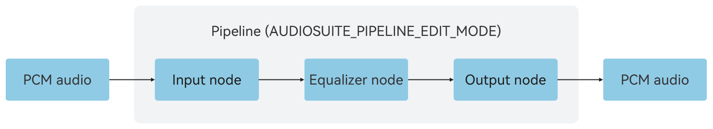
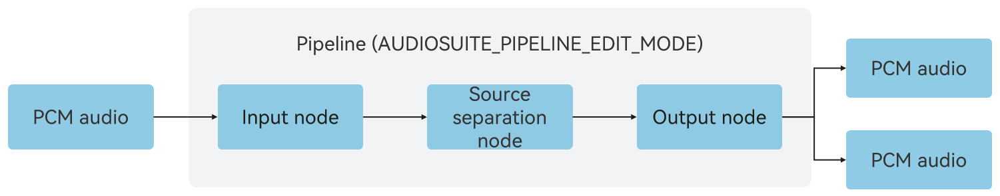
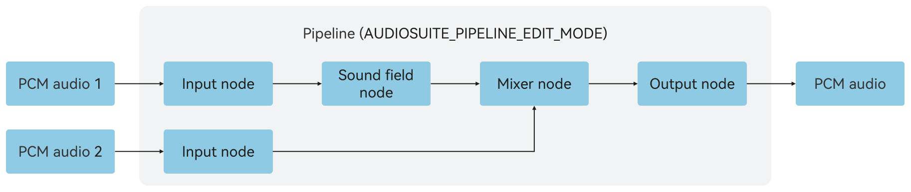

# Offline Editing (C/C++)
<!--Kit: Audio Kit-->
<!--Subsystem: Multimedia-->
<!--Owner: @songshenke-->
<!--Designer: @caixuejiang; @hao-liangfei; @zhanganxiang-->
<!--Tester: @Filger-->
<!--Adviser: @w_Machine_cc-->

Starting from API version 22, [OHAudioSuite](../../reference/apis-audio-kit/capi-ohaudiosuite.md) provides offline audio editing capabilities, allowing for audio data processing in non-real-time playback scenarios. You can combine multiple audio nodes to implement complex audio processing workflows.

## Basic Development Configuration

To use the offline editing capabilities provided by [OHAudioSuite](../../reference/apis-audio-kit/capi-ohaudiosuite.md), add the corresponding header files.

### Linking the Dynamic Library in the CMake Script

``` cmake
target_link_libraries(sample PUBLIC libohaudiosuite.so)
```
### Adding Header Files
To use APIs related to audio creation, include the <[native_audio_suite_base.h](../../reference/apis-audio-kit/capi-native-audio-suite-base-h.md)> and <[native_audio_suite_engine.h](../../reference/apis-audio-kit/capi-native-audio-suite-engine-h.md)> header files.

```cpp
#include <ohaudiosuite/native_audio_suite_base.h>
#include <ohaudiosuite/native_audio_suite_engine.h>
```

## How to Develop

For details on the APIs, see [OHAudioSuite](../../reference/apis-audio-kit/capi-ohaudiosuite.md).

This section describes how to implement offline audio editing.

### Specifying the Audio Node Type

Call [OH_AudioSuiteNodeBuilder_SetNodeType()](../../reference/apis-audio-kit/capi-native-audio-suite-engine-h.md#oh_audiosuitenodebuilder_setnodetype) to specify the [OH_AudioNode_Type](../../reference/apis-audio-kit/capi-native-audio-suite-base-h.md#oh_audionode_type) based on the service scenario.

### Specifying the Audio Node Format

Call [OH_AudioSuiteNodeBuilder_SetFormat()](../../reference/apis-audio-kit/capi-native-audio-suite-engine-h.md#oh_audiosuitenodebuilder_setformat) or [OH_AudioSuiteEngine_SetAudioFormat()](../../reference/apis-audio-kit/capi-native-audio-suite-engine-h.md#oh_audiosuiteengine_setaudioformat) to set the audio format based on the service scenario. The audio format includes [bit depth](../../reference/apis-audio-kit/capi-native-audio-suite-base-h.md#oh_audio_sampleformat), [sample rate](../../reference/apis-audio-kit/capi-native-audio-suite-base-h.md#oh_audio_samplerate), and [channel count](../../reference/apis-avcodec-kit/capi-native-audio-channel-layout-h.md#oh_audiochannellayout).

### Basic Offline Editing

Use effect nodes (for example, equalizer effect node) to process the input Pulse Code Modulation (PCM) audio data and output PCM audio data with the applied audio effects.

**Figure 1** Basic offline editing




1. Create an engine and pipeline.
   
   ```cpp
   // Create an engine.
   OH_AudioSuiteEngine *audioSuiteEngine = nullptr;
   OH_AudioSuiteEngine_Create(&audioSuiteEngine);

   // Create a pipeline.
   OH_AudioSuitePipeline *audioSuitePipeline = nullptr;
   OH_AudioSuiteEngine_CreatePipeline(
       audioSuiteEngine, &audioSuitePipeline, OH_AudioSuite_PipelineWorkMode::AUDIOSUITE_PIPELINE_EDIT_MODE);
   ```

2. Create input, output, and equalizer nodes and connect them.

   To create an input node, implement a custom callback function **InputNodeWriteDataCallBack** of the type [OH_InputNode_RequestDataCallback()](../../reference/apis-audio-kit/capi-native-audio-suite-engine-h.md#oh_inputnode_requestdatacallback), and set the callback function using [OH_AudioSuiteNodeBuilder_SetRequestDataCallback()](../../reference/apis-audio-kit/capi-native-audio-suite-engine-h.md#oh_audiosuitenodebuilder_setrequestdatacallback).
   ```cpp
   struct AudioDataInfo {
       uint8_t *buffer = nullptr;  // Audio data.
       int32_t bufferSize = 0;     // Total size of the audio data.
       int32_t totalWriteSize = 0; // Total size of the processed audio data.
   };

   // Callback function for the input node to request data.
   static int32_t InputNodeWriteDataCallBack(
       OH_AudioNode *audioNode,
       void *userData,
       void *audioData,
       int32_t audioDataSize,
       bool *finished)
   {
       if ((audioNode == nullptr) || (userData == nullptr) ||
           (audioData == nullptr) || (audioDataSize <= 0) || (finished == nullptr)) {
           return -1;
       }

       struct AudioDataInfo *info = static_cast<struct AudioDataInfo *>(userData);
       // Size of the audio data to be processed.
       int32_t actualDataSize = std::min(audioDataSize, info->bufferSize - info->totalWriteSize);
       // Write the PCM audio data into audioData.
       memcpy(static_cast<void *>(audioData), info->buffer + info->totalWriteSize, actualDataSize);
       info->totalWriteSize += actualDataSize;

       // All audio data has been processed.
       if (info->totalWriteSize >= info->bufferSize) {
           *finished = true;
       }
       return actualDataSize;
   }

   // Create a node builder.
   OH_AudioNodeBuilder *nodeBuilder = nullptr;
   OH_AudioSuiteNodeBuilder_Create(&nodeBuilder);
   OH_AudioSuiteNodeBuilder_SetNodeType(nodeBuilder, OH_AudioNode_Type::INPUT_NODE_TYPE_DEFAULT);

   // Configure the audio data format. Set the sample rate, channel layout, channel count, bit depth, and encoding type based on the audio data format to be processed.
   OH_AudioFormat audioFormatInput;
   audioFormatInput.samplingRate = OH_Audio_SampleRate::SAMPLE_RATE_48000;
   audioFormatInput.channelLayout = OH_AudioChannelLayout::CH_LAYOUT_STEREO;
   audioFormatInput.channelCount = 2;
   audioFormatInput.sampleFormat = OH_Audio_SampleFormat::AUDIO_SAMPLE_S16LE;
   audioFormatInput.encodingType = OH_Audio_EncodingType::AUDIO_ENCODING_TYPE_RAW;
   OH_AudioSuiteNodeBuilder_SetFormat(nodeBuilder, audioFormatInput);
   // Set the callback for the audio stream.
   struct AudioDataInfo audioInfo;
   audioInfo.buffer = nullptr; // Store the audio data to be processed based on the service scenario.
   audioInfo.bufferSize = 0; // Store the size of the audio data to be processed based on the service scenario.
   audioInfo.totalWriteSize = 0;
   void *userData = static_cast<void *>(&audioInfo);
   OH_AudioSuiteNodeBuilder_SetRequestDataCallback(nodeBuilder, InputNodeWriteDataCallBack, userData);
   // Create an input node.
   OH_AudioNode *inputNode = nullptr;
   OH_AudioSuiteEngine_CreateNode(audioSuitePipeline, nodeBuilder, &inputNode);

   // Reset the builder configuration and set the node type to equalizer.
   OH_AudioSuiteNodeBuilder_Reset(nodeBuilder);
   OH_AudioSuiteNodeBuilder_SetNodeType(nodeBuilder, OH_AudioNode_Type::EFFECT_NODE_TYPE_EQUALIZER);
   // Create an equalizer node.
   OH_AudioNode *eqNode = nullptr;
   OH_AudioSuiteEngine_CreateNode(audioSuitePipeline, nodeBuilder, &eqNode);
   // Set the effect of the equalizer node to the default value.
   OH_AudioSuiteEngine_SetEqualizerFrequencyBandGains(eqNode, OH_EQUALIZER_PARAM_DEFAULT);

   // Reset the builder configuration and set the node type to output.
   OH_AudioSuiteNodeBuilder_Reset(nodeBuilder);
   OH_AudioSuiteNodeBuilder_SetNodeType(nodeBuilder, OH_AudioNode_Type::OUTPUT_NODE_TYPE_DEFAULT);
   // Configure the audio data format. Set the sample rate, channel layout, channel count, bit depth, and encoding type based on the expected audio output format.
   OH_AudioFormat audioFormatOutput;
   audioFormatOutput.samplingRate = OH_Audio_SampleRate::SAMPLE_RATE_48000;
   audioFormatOutput.channelLayout = OH_AudioChannelLayout::CH_LAYOUT_STEREO;
   audioFormatOutput.channelCount = 2;
   audioFormatOutput.sampleFormat = OH_Audio_SampleFormat::AUDIO_SAMPLE_S16LE;
   audioFormatOutput.encodingType = OH_Audio_EncodingType::AUDIO_ENCODING_TYPE_RAW;
   OH_AudioSuiteNodeBuilder_SetFormat(nodeBuilder, audioFormatOutput);
   // Create an output node.
   OH_AudioNode *outputNode = nullptr;
   OH_AudioSuiteEngine_CreateNode(audioSuitePipeline, nodeBuilder, &outputNode);

   // Destroy the node builder.
   OH_AudioSuiteNodeBuilder_Destroy(nodeBuilder);

   // Connect the nodes to form a network.
   OH_AudioSuiteEngine_ConnectNodes(inputNode, eqNode);
   OH_AudioSuiteEngine_ConnectNodes(eqNode, outputNode);
   ```

3. Render audio data.

   Call [OH_AudioSuiteEngine_RenderFrame()](../../reference/apis-audio-kit/capi-native-audio-suite-engine-h.md#oh_audiosuiteengine_renderframe) to render and obtain PCM audio data.
   
   ```cpp
   int32_t byteSize = 2; // Byte size of the data corresponding to the OH_Audio_SampleFormat::AUDIO_SAMPLE_S16LE format.
   // Calculate the size of the data to be processed in a single frame based on the format of the output node.
   // 1000 is the time conversion unit. 20 indicates 20 ms of audio sampling data. If samplingRate is 11025, use 40 ms for calculation.
   int32_t frameSize = 20 * audioFormatOutput.samplingRate * audioFormatOutput.channelCount * byteSize / 1000;
   // Buffer used to receive the output audio data after rendering.
   uint8_t *audioData = (uint8_t *)malloc(frameSize);
   int32_t responseSize = 0;
   bool finished = false;

   // Start rendering.
   OH_AudioSuiteEngine_StartPipeline(audioSuitePipeline);
   do {
       OH_AudioSuite_Result result = OH_AudioSuiteEngine_RenderFrame(
           audioSuitePipeline, static_cast<void *>(audioData), frameSize, &responseSize, &finished);
       if ((result != OH_AudioSuite_Result::AUDIOSUITE_SUCCESS) || (responseSize <= 0)) {
           // The audio creation rendering fails.
           break;
       } else {
           // audioData is the rendered audio data. responseSize is the audio data length. You can use or save it as required.
       }
   } while (!finished);
   OH_AudioSuiteEngine_StopPipeline(audioSuitePipeline);
   free(audioData);
   audioData = nullptr;
   ```

4. Destroy resources.
   
   ```cpp
   // Destroy the nodes.
   OH_AudioSuiteEngine_DestroyNode(inputNode);
   OH_AudioSuiteEngine_DestroyNode(eqNode);
   OH_AudioSuiteEngine_DestroyNode(outputNode);

   // Destroy the pipeline.
   OH_AudioSuiteEngine_DestroyPipeline(audioSuitePipeline);

   // Destroy the engine.
   OH_AudioSuiteEngine_Destroy(audioSuiteEngine);
   ```

### Source Separation

Use a source separation node to separate input PCM audio data into vocal and background tracks, and then use an output node to output these tracks separately.

**Figure 2** Source separation editing



The sample code is as follows:

1. Create an engine and pipeline.
   ```cpp
   // Create an engine.
   OH_AudioSuiteEngine *audioSuiteEngine = nullptr;
   OH_AudioSuiteEngine_Create(&audioSuiteEngine);

   // Create a pipeline.
   OH_AudioSuitePipeline *audioSuitePipeline = nullptr;
   OH_AudioSuiteEngine_CreatePipeline(
       audioSuiteEngine, &audioSuitePipeline, OH_AudioSuite_PipelineWorkMode::AUDIOSUITE_PIPELINE_EDIT_MODE);
   ```

2. Create input, output, and source separation nodes and connect them.

   To create an input node, implement a custom callback function **InputNodeWriteDataCallBack** of the type [OH_InputNode_RequestDataCallback()](../../reference/apis-audio-kit/capi-native-audio-suite-engine-h.md#oh_inputnode_requestdatacallback), and set the callback function using [OH_AudioSuiteNodeBuilder_SetRequestDataCallback()](../../reference/apis-audio-kit/capi-native-audio-suite-engine-h.md#oh_audiosuitenodebuilder_setrequestdatacallback).

   ```cpp
   struct AudioDataInfo {
       uint8_t *buffer = nullptr;  // Audio data.
       int32_t bufferSize = 0;     // Total size of the audio data.
       int32_t totalWriteSize = 0; // Total size of the processed audio data.
   };

   // Callback function for the input node to request data.
   static int32_t InputNodeWriteDataCallBack(
       OH_AudioNode *audioNode,
       void *userData,
       void *audioData,
       int32_t audioDataSize,
       bool *finished)
   {
       if ((audioNode == nullptr) || (userData == nullptr) ||
           (audioData == nullptr) || (audioDataSize <= 0) || (finished == nullptr)) {
           return -1;
       }

       struct AudioDataInfo *info = static_cast<struct AudioDataInfo *>(userData);
       // Size of the audio data to be processed.
       int32_t actualDataSize = std::min(audioDataSize, info->bufferSize - info->totalWriteSize);
       // Write the PCM audio data into audioData.
       memcpy(static_cast<void *>(audioData), info->buffer + info->totalWriteSize, actualDataSize);
       info->totalWriteSize += actualDataSize;

       // All audio data has been processed.
       if (info->totalWriteSize >= info->bufferSize) {
           *finished = true;
       }
       return actualDataSize;
   }

   // Create a node builder.
   OH_AudioNodeBuilder *nodeBuilder = nullptr;
   OH_AudioSuiteNodeBuilder_Create(&nodeBuilder);
   OH_AudioSuiteNodeBuilder_SetNodeType(nodeBuilder, OH_AudioNode_Type::INPUT_NODE_TYPE_DEFAULT);

   // Configure the audio data format. Set the sample rate, channel layout, channel count, bit depth, and encoding type based on the audio data format to be processed.
   OH_AudioFormat audioFormatInput;
   audioFormatInput.samplingRate = OH_Audio_SampleRate::SAMPLE_RATE_48000;
   audioFormatInput.channelLayout = OH_AudioChannelLayout::CH_LAYOUT_STEREO;
   audioFormatInput.channelCount = 2;
   audioFormatInput.sampleFormat = OH_Audio_SampleFormat::AUDIO_SAMPLE_S16LE;
   audioFormatInput.encodingType = OH_Audio_EncodingType::AUDIO_ENCODING_TYPE_RAW;
   OH_AudioSuiteNodeBuilder_SetFormat(nodeBuilder, audioFormatInput);

   struct AudioDataInfo audioInfo;
   audioInfo.buffer = nullptr; // Store the audio data to be processed based on the service scenario.
   audioInfo.bufferSize = 0; // Store the size of the audio data to be processed based on the service scenario.
   audioInfo.totalWriteSize = 0;
   void *userData = static_cast<void *>(&audioInfo);
   // Set the callback for the audio stream.
   OH_AudioSuiteNodeBuilder_SetRequestDataCallback(nodeBuilder, InputNodeWriteDataCallBack, userData);

   // Create an input node.
   OH_AudioNode *inputNode = nullptr;
   OH_AudioSuiteEngine_CreateNode(audioSuitePipeline, nodeBuilder, &inputNode);

   // Reset the builder configuration and set the node type to source separation.
   OH_AudioSuiteNodeBuilder_Reset(nodeBuilder);
   OH_AudioSuiteNodeBuilder_SetNodeType(
       nodeBuilder, OH_AudioNode_Type::EFFECT_MULTII_OUTPUT_NODE_TYPE_AUDIO_SEPARATION);

   // Create a source separation node.
   OH_AudioNode *aissNode = nullptr;
   OH_AudioSuiteEngine_CreateNode(audioSuitePipeline, nodeBuilder, &aissNode);

   // Reset the builder configuration and set the node type to output.
   OH_AudioSuiteNodeBuilder_Reset(nodeBuilder);
   OH_AudioSuiteNodeBuilder_SetNodeType(nodeBuilder, OH_AudioNode_Type::OUTPUT_NODE_TYPE_DEFAULT);
   // Configure the audio data format. Set the sample rate, channel layout, channel count, bit depth, and encoding type based on the expected audio output format.
   OH_AudioFormat audioFormatOutput;
   audioFormatOutput.samplingRate = OH_Audio_SampleRate::SAMPLE_RATE_48000;
   audioFormatOutput.channelLayout = OH_AudioChannelLayout::CH_LAYOUT_STEREO;
   audioFormatOutput.channelCount = 2;
   audioFormatOutput.sampleFormat = OH_Audio_SampleFormat::AUDIO_SAMPLE_S16LE;
   audioFormatOutput.encodingType = OH_Audio_EncodingType::AUDIO_ENCODING_TYPE_RAW;
   OH_AudioSuiteNodeBuilder_SetFormat(nodeBuilder, audioFormatOutput);

   // Create an output node.
   OH_AudioNode *outputNode = nullptr;
   OH_AudioSuiteEngine_CreateNode(audioSuitePipeline, nodeBuilder, &outputNode);

   // Destroy the node builder.
   OH_AudioSuiteNodeBuilder_Destroy(nodeBuilder);

   // Connect the nodes to form a network.
   OH_AudioSuiteEngine_ConnectNodes(inputNode, aissNode);
   OH_AudioSuiteEngine_ConnectNodes(aissNode, outputNode);
   ```

3. Render audio data.

   For the pipeline that contains the source separation node , use [OH_AudioSuiteEngine_MultiRenderFrame()](../../reference/apis-audio-kit/capi-native-audio-suite-engine-h.md#oh_audiosuiteengine_multirenderframe) to render and obtain two streams of PCM audio data.

   ```cpp
   int32_t byteSize = 2; // Byte size of the data corresponding to the OH_Audio_SampleFormat::AUDIO_SAMPLE_S16LE format.
   // Calculate the size of the data to be processed in a single frame based on the format of the output node.
   // 1000 is the time conversion unit. 20 indicates 20 ms of audio sampling data. If samplingRate is 11025, use 40 ms for calculation.
   int32_t frameSize = 20 * audioFormatOutput.samplingRate * audioFormatOutput.channelCount * byteSize / 1000;
   // Buffer used to receive the output audio data after rendering.
   OH_AudioDataArray audioDataArray;
   int32_t outPutNum = 2;
   audioDataArray.audioDataArray = (void **)malloc(outPutNum * sizeof(void *));
   for(int32_t i = 0; i < outPutNum; i++) {
       audioDataArray.audioDataArray[i] = (void *)malloc(frameSize);
   }
   audioDataArray.arraySize = outPutNum;
   audioDataArray.requestFrameSize = frameSize;
   int32_t responseSize = 0;
   bool finished = false;

   // Start rendering.
   OH_AudioSuiteEngine_StartPipeline(audioSuitePipeline);
   do {
       OH_AudioSuite_Result result = OH_AudioSuiteEngine_MultiRenderFrame(
           audioSuitePipeline, &audioDataArray, &responseSize, &finished);
       if ((result != OH_AudioSuite_Result::AUDIOSUITE_SUCCESS) || (responseSize <= 0)) {
           // The audio creation rendering fails.
           break;
       } else {
           // audioDataArray.audioDataArray[0] is the extracted vocal track.
           // audioDataArray.audioDataArray[1] is the extracted background track.
           // responseSize is the audio data length. You can use or save it as required.
       }
   } while (!finished);
   OH_AudioSuiteEngine_StopPipeline(audioSuitePipeline);

   for(int32_t i = 0; i < outPutNum; i++) {
       free(audioDataArray.audioDataArray[i]);
       audioDataArray.audioDataArray[i] = nullptr;
   }
   free(audioDataArray.audioDataArray);
   audioDataArray.audioDataArray = nullptr;
   ```

4. Destroy resources.
   
   ```cpp
   // Destroy the nodes.
   OH_AudioSuiteEngine_DestroyNode(inputNode);
   OH_AudioSuiteEngine_DestroyNode(aissNode);
   OH_AudioSuiteEngine_DestroyNode(outputNode);

   // Destroy the pipeline.
   OH_AudioSuiteEngine_DestroyPipeline(audioSuitePipeline);

   // Destroy the engine.
   OH_AudioSuiteEngine_Destroy(audioSuiteEngine);
   ```

### Mixing and Cascading

Input multiple PCM audio data streams, mix them using an audio mixer node, and output the mixed PCM audio data.

**Figure 3** Cascading editing



The sample code is as follows:

1. Create an engine and pipeline.
   ```cpp
   // Create an engine.
   OH_AudioSuiteEngine *audioSuiteEngine = nullptr;
   OH_AudioSuiteEngine_Create(&audioSuiteEngine);

   // Create a pipeline.
   OH_AudioSuitePipeline *audioSuitePipeline = nullptr;
   OH_AudioSuiteEngine_CreatePipeline(
       audioSuiteEngine, &audioSuitePipeline, OH_AudioSuite_PipelineWorkMode::AUDIOSUITE_PIPELINE_EDIT_MODE);
   ```

2. Create input, output, and effect nodes and connect them.

   The audio mixing functionality has multiple input nodes. You need to set the **userData** parameter in the callback function **InputNodeWriteDataCallBack** to distinguish between multiple input nodes, thereby enabling the input of multiple PCM audio data streams. The **InputNodeWriteDataCallBack** function type is [OH_InputNode_RequestDataCallback()](../../reference/apis-audio-kit/capi-native-audio-suite-engine-h.md#oh_inputnode_requestdatacallback).

   ```cpp
   struct AudioDataInfo {
       uint8_t *buffer = nullptr;  // Audio data.
       int32_t bufferSize = 0;     // Total size of the audio data.
       int32_t totalWriteSize = 0; // Total size of the processed audio data.
   };

   // Callback function for the input node to request data.
   static int32_t InputNodeWriteDataCallBack(
       OH_AudioNode *audioNode,
       void *userData,
       void *audioData,
       int32_t audioDataSize,
       bool *finished)
   {
       if ((audioNode == nullptr) || (userData == nullptr) ||
           (audioData == nullptr) || (audioDataSize <= 0) || (finished == nullptr)) {
           return -1;
       }

       struct AudioDataInfo *info = static_cast<struct AudioDataInfo *>(userData);
       // Size of the audio data to be processed.
       int32_t actualDataSize = std::min(audioDataSize, info->bufferSize - info->totalWriteSize);
       // Write the PCM audio data into audioData.
       memcpy(static_cast<void *>(audioData), info->buffer + info->totalWriteSize, actualDataSize);
       info->totalWriteSize += actualDataSize;

       // All audio data has been processed.
       if (info->totalWriteSize >= info->bufferSize) {
           *finished = true;
       }
       return actualDataSize;
   }

   // Create a node builder.
   OH_AudioNodeBuilder *nodeBuilder = nullptr;
   OH_AudioSuiteNodeBuilder_Create(&nodeBuilder);
   OH_AudioSuiteNodeBuilder_SetNodeType(nodeBuilder, OH_AudioNode_Type::INPUT_NODE_TYPE_DEFAULT);
   // Configure the audio data format. Set the sample rate, channel layout, channel count, bit depth, and encoding type based on the audio data format to be processed.
   OH_AudioFormat audioFormatInput;
   audioFormatInput.samplingRate = OH_Audio_SampleRate::SAMPLE_RATE_48000;
   audioFormatInput.channelLayout = OH_AudioChannelLayout::CH_LAYOUT_STEREO;
   audioFormatInput.channelCount = 2;
   audioFormatInput.sampleFormat = OH_Audio_SampleFormat::AUDIO_SAMPLE_S16LE;
   audioFormatInput.encodingType = OH_Audio_EncodingType::AUDIO_ENCODING_TYPE_RAW;
   OH_AudioSuiteNodeBuilder_SetFormat(nodeBuilder, audioFormatInput);
   // Set the callback for the first audio stream.
   struct AudioDataInfo audioInfoForField;
   audioInfoForField.buffer = nullptr; // Store the audio data to be processed based on the service scenario.
   audioInfoForField.bufferSize = 0; // Store the size of the audio data to be processed based on the service scenario.
   audioInfoForField.totalWriteSize = 0;
   void *userData = static_cast<void *>(&audioInfoForField);
   OH_AudioSuiteNodeBuilder_SetRequestDataCallback(nodeBuilder, InputNodeWriteDataCallBack, userData);
   // Create the first input node.
   OH_AudioNode *inputNodeForField = nullptr;
   OH_AudioSuiteEngine_CreateNode(audioSuitePipeline, nodeBuilder, &inputNodeForField);

   // Reset the builder configuration and set the node type to input.
   OH_AudioSuiteNodeBuilder_Reset(nodeBuilder);
   OH_AudioSuiteNodeBuilder_SetNodeType(nodeBuilder, OH_AudioNode_Type::INPUT_NODE_TYPE_DEFAULT);
   OH_AudioSuiteNodeBuilder_SetFormat(nodeBuilder, audioFormatInput);
   // Set the callback for the second audio stream.
   struct AudioDataInfo audioInfoForMix;
   audioInfoForMix.buffer = nullptr; // Store the audio data to be processed based on the service scenario.
   audioInfoForMix.bufferSize = 0; // Store the size of the audio data to be processed based on the service scenario.
   audioInfoForMix.totalWriteSize = 0;
   userData = static_cast<void *>(&audioInfoForMix);
   OH_AudioSuiteNodeBuilder_SetRequestDataCallback(nodeBuilder, InputNodeWriteDataCallBack, userData);
   // Create the second input node.
   OH_AudioNode *inputNodeForMix = nullptr;
   OH_AudioSuiteEngine_CreateNode(audioSuitePipeline, nodeBuilder, &inputNodeForMix);

   // Reset the builder configuration and set the node type to input.
   OH_AudioSuiteNodeBuilder_Reset(nodeBuilder);
   OH_AudioSuiteNodeBuilder_SetNodeType(nodeBuilder, OH_AudioNode_Type::EFFECT_NODE_TYPE_SOUND_FIELD);
   // Create a sound field node and set the sound field mode to listening.
   OH_AudioNode *fieldNode = nullptr;
   OH_AudioSuiteEngine_CreateNode(audioSuitePipeline, nodeBuilder, &fieldNode);
   OH_AudioSuiteEngine_SetSoundFieldType(fieldNode, SOUND_FIELD_FRONT_FACING);

   // Reset the builder configuration and set the node type to input.
   OH_AudioSuiteNodeBuilder_Reset(nodeBuilder);
   OH_AudioSuiteNodeBuilder_SetNodeType(nodeBuilder, OH_AudioNode_Type::EFFECT_NODE_TYPE_AUDIO_MIXER);
   OH_AudioNode *mixerNode = nullptr;
   // Create a mixer node.
   OH_AudioSuiteEngine_CreateNode(audioSuitePipeline, nodeBuilder, &mixerNode);

   // Reset the builder configuration and set the node type to input.
   OH_AudioSuiteNodeBuilder_Reset(nodeBuilder);
   OH_AudioSuiteNodeBuilder_SetNodeType(nodeBuilder, OH_AudioNode_Type::OUTPUT_NODE_TYPE_DEFAULT);
   // Configure the audio data format. Set the sample rate, channel layout, channel count, bit depth, and encoding type based on the expected audio output format.
   OH_AudioFormat audioFormatOutput;
   audioFormatOutput.samplingRate = OH_Audio_SampleRate::SAMPLE_RATE_48000;
   audioFormatOutput.channelLayout = OH_AudioChannelLayout::CH_LAYOUT_STEREO;
   audioFormatOutput.channelCount = 2;
   audioFormatOutput.sampleFormat = OH_Audio_SampleFormat::AUDIO_SAMPLE_S16LE;
   audioFormatOutput.encodingType = OH_Audio_EncodingType::AUDIO_ENCODING_TYPE_RAW;
   OH_AudioSuiteNodeBuilder_SetFormat(nodeBuilder, audioFormatOutput);
   // Create an output node.
   OH_AudioNode *outputNode = nullptr;
   OH_AudioSuiteEngine_CreateNode(audioSuitePipeline, nodeBuilder, &outputNode);

   // Destroy the output node builder.
   OH_AudioSuiteNodeBuilder_Destroy(nodeBuilder);

   // Connect the nodes to form a network.
   OH_AudioSuiteEngine_ConnectNodes(inputNodeForField, fieldNode);
   OH_AudioSuiteEngine_ConnectNodes(fieldNode, mixerNode);
   OH_AudioSuiteEngine_ConnectNodes(inputNodeForMix, mixerNode);
   OH_AudioSuiteEngine_ConnectNodes(mixerNode, outputNode);
   ```

3. Render audio data.

   Call [OH_AudioSuiteEngine_RenderFrame()](../../reference/apis-audio-kit/capi-native-audio-suite-engine-h.md#oh_audiosuiteengine_renderframe) to render and obtain PCM audio data.
   
   ```cpp
   int32_t byteSize = 2; // Byte size of the data corresponding to the OH_Audio_SampleFormat::AUDIO_SAMPLE_S16LE format.
   // Calculate the size of the data to be processed in a single frame based on the format of the output node.
   // 1000 is the time conversion unit. 20 indicates 20 ms of audio sampling data. If samplingRate is 11025, use 40 ms for calculation.
   int32_t frameSize = 20 * audioFormatOutput.samplingRate * audioFormatOutput.channelCount * byteSize / 1000;
   // Buffer used to receive the output audio data after rendering.
   uint8_t *audioData = (uint8_t *)malloc(frameSize);
   int32_t responseSize = 0;
   bool finished = false;

   // Start rendering.
   OH_AudioSuiteEngine_StartPipeline(audioSuitePipeline);
   do {
       OH_AudioSuite_Result result = OH_AudioSuiteEngine_RenderFrame(
           audioSuitePipeline, static_cast<void *>(audioData), frameSize, &responseSize, &finished);
       if ((result != OH_AudioSuite_Result::AUDIOSUITE_SUCCESS) || (responseSize <= 0)) {
           // The audio creation rendering fails.
           break;
       } else {
           // audioData is the rendered audio data. responseSize is the audio data length. You can use or save it as required.
       }
   } while (!finished);
   OH_AudioSuiteEngine_StopPipeline(audioSuitePipeline);
   free(audioData);
   audioData = nullptr;
   ```

4. Destroy resources.
   
   ```cpp
   // Destroy the nodes.
   OH_AudioSuiteEngine_DestroyNode(inputNodeForMix);
   OH_AudioSuiteEngine_DestroyNode(inputNodeForField);
   OH_AudioSuiteEngine_DestroyNode(fieldNode);
   OH_AudioSuiteEngine_DestroyNode(mixerNode);
   OH_AudioSuiteEngine_DestroyNode(outputNode);

   // Destroy the pipeline.
   OH_AudioSuiteEngine_DestroyPipeline(audioSuitePipeline);

   // Destroy the engine.
   OH_AudioSuiteEngine_Destroy(audioSuiteEngine);
   ```

<!--RP1-->
<!--RP1End-->
