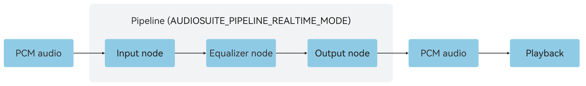

# Real-Time Rendering (C/C++)
<!--Kit: Audio Kit-->
<!--Subsystem: Multimedia-->
<!--Owner: @songshenke-->
<!--Designer: @caixuejiang; @hao-liangfei; @zhanganxiang-->
<!--Tester: @Filger-->
<!--Adviser: @w_Machine_cc-->

Starting from API version 22, [OHAudioSuite](../../reference/apis-audio-kit/capi-ohaudiosuite.md) provides real-time audio rendering capabilities, allowing for custom audio effects (only equalizer nodes supported) during real-time audio playback. For example, you can use the preset effects in the equalizer to change the style of the music.

## Basic Development Configuration

To use the real-time rendering capabilities provided by [OHAudioSuite](../../reference/apis-audio-kit/capi-ohaudiosuite.md), add the corresponding header files.

### Linking the Dynamic Library in the CMake Script

``` cmake
target_link_libraries(sample PUBLIC libohaudio.so libohaudiosuite.so)
```

### Adding Header Files
To use APIs related to audio creation and playback, include the <[native_audio_suite_base.h](../../reference/apis-audio-kit/capi-native-audio-suite-base-h.md)>, <[native_audio_suite_engine.h](../../reference/apis-audio-kit/capi-native-audio-suite-engine-h.md)>, <[native_audiostreambuilder.h](../../reference/apis-audio-kit/capi-native-audiostreambuilder-h.md)>, and <[native_audiorenderer.h](../../reference/apis-audio-kit/capi-native-audiorenderer-h.md)> header files.

```cpp
#include <ohaudiosuite/native_audio_suite_base.h>
#include <ohaudiosuite/native_audio_suite_engine.h>
#include <ohaudio/native_audiorenderer.h>
#include <ohaudio/native_audiostreambuilder.h>
```

## How to Develop

### Calling Interfaces

For details on the APIs, see [OHAudioSuite](../../reference/apis-audio-kit/capi-ohaudiosuite.md).

### Equalizer Effect

**Figure 1** Real-time playback

   

The following walks you through how to implement a simple equalizer effect node for real-time playback.

1. Initialize and create an [OHAudioSuite](../../reference/apis-audio-kit/capi-ohaudiosuite.md) pipeline (including the input node, equalizer node, and output node).
   ```cpp
   struct AudioDataInfo {
       uint8_t *buffer = nullptr;  // Audio data.
       int32_t bufferSize = 0;     // Total size of the audio data.
       int32_t totalWriteSize = 0; // Total size of the processed audio data.
   };

   // Callback function for the input node to request data.
   static int32_t InputNodeWriteDataCallBack(
       OH_AudioNode *audioNode,
       void *userData,
       void *audioData,
       int32_t audioDataSize,
       bool *finished)
   {
       if ((audioNode == nullptr) || (userData == nullptr) ||
           (audioData == nullptr) || (audioDataSize <= 0) || (finished == nullptr)) {
           return -1;
       }

       struct AudioDataInfo *info = static_cast<struct AudioDataInfo *>(userData);
       // Size of the audio data to be processed.
       int32_t actualDataSize = std::min(audioDataSize, info->bufferSize - info->totalWriteSize);
       // Write the PCM audio data into audioData.
       memcpy(static_cast<void *>(audioData), info->buffer + info->totalWriteSize, actualDataSize);
       info->totalWriteSize += actualDataSize;

       // All audio data has been processed.
       if (info->totalWriteSize >= info->bufferSize) {
           *finished = true;
       }
       return actualDataSize;
   }

   // Create an engine.
   OH_AudioSuiteEngine *audioSuiteEngine = nullptr;
   OH_AudioSuiteEngine_Create(&audioSuiteEngine);

   // Create a real-time rendering pipeline.
   OH_AudioSuitePipeline *audioSuitePipeline;
   OH_AudioSuiteEngine_CreatePipeline(audioSuiteEngine, &audioSuitePipeline,
       OH_AudioSuite_PipelineWorkMode::AUDIOSUITE_PIPELINE_REALTIME_MODE);

   // Create a node builder.
   OH_AudioNodeBuilder *nodeBuilder = nullptr;
   OH_AudioSuiteNodeBuilder_Create(&nodeBuilder);
   OH_AudioSuiteNodeBuilder_SetNodeType(nodeBuilder, OH_AudioNode_Type::INPUT_NODE_TYPE_DEFAULT);

   // Configure the audio data format. Set the sample rate, channel layout, channel count, bit depth, and encoding type based on the audio data format to be processed.
   OH_AudioFormat audioFormatInput;
   audioFormatInput.samplingRate = OH_Audio_SampleRate::SAMPLE_RATE_48000;
   audioFormatInput.channelLayout = OH_AudioChannelLayout::CH_LAYOUT_STEREO;
   audioFormatInput.channelCount = 2;
   audioFormatInput.sampleFormat = OH_Audio_SampleFormat::AUDIO_SAMPLE_S16LE;
   audioFormatInput.encodingType = OH_Audio_EncodingType::AUDIO_ENCODING_TYPE_RAW;
   OH_AudioSuiteNodeBuilder_SetFormat(nodeBuilder, audioFormatInput);
   // Set the callback for the audio stream.
   struct AudioDataInfo audioInfo;
   audioInfo.buffer = nullptr; // Store the audio data to be processed based on the service scenario.
   audioInfo.bufferSize = 0; // Store the size of the audio data to be processed based on the service scenario.
   audioInfo.totalWriteSize = 0;
   void *userData = static_cast<void *>(&audioInfo);
   OH_AudioSuiteNodeBuilder_SetRequestDataCallback(nodeBuilder, InputNodeWriteDataCallBack, userData);
   // Create an input node.
   OH_AudioNode *inputNode = nullptr;
   OH_AudioSuiteEngine_CreateNode(audioSuitePipeline, nodeBuilder, &inputNode);

   // Reset the builder configuration and set the node type to equalizer.
   OH_AudioSuiteNodeBuilder_Reset(nodeBuilder);
   OH_AudioSuiteNodeBuilder_SetNodeType(nodeBuilder, OH_AudioNode_Type::EFFECT_NODE_TYPE_EQUALIZER);
   // Create an equalizer node.
   OH_AudioNode *eqNode = nullptr;
   OH_AudioSuiteEngine_CreateNode(audioSuitePipeline, nodeBuilder, &eqNode);
   // Set the effect of the equalizer node to the default value.
   OH_AudioSuiteEngine_SetEqualizerFrequencyBandGains(eqNode, OH_EQUALIZER_PARAM_DEFAULT);

   // Reset the builder configuration and set the node type to output.
   OH_AudioSuiteNodeBuilder_Reset(nodeBuilder);
   OH_AudioSuiteNodeBuilder_SetNodeType(nodeBuilder, OH_AudioNode_Type::OUTPUT_NODE_TYPE_DEFAULT);
   // Configure the audio data format. Set the sample rate, channel layout, channel count, bit depth, and encoding type based on the expected audio output format.
   OH_AudioFormat audioFormatOutput;
   audioFormatOutput.samplingRate = OH_Audio_SampleRate::SAMPLE_RATE_48000;
   audioFormatOutput.channelLayout = OH_AudioChannelLayout::CH_LAYOUT_STEREO;
   audioFormatOutput.channelCount = 2;
   audioFormatOutput.sampleFormat = OH_Audio_SampleFormat::AUDIO_SAMPLE_S16LE;
   audioFormatOutput.encodingType = OH_Audio_EncodingType::AUDIO_ENCODING_TYPE_RAW;
   OH_AudioSuiteNodeBuilder_SetFormat(nodeBuilder, audioFormatOutput);
   // Create an output node.
   OH_AudioNode *outputNode = nullptr;
   OH_AudioSuiteEngine_CreateNode(audioSuitePipeline, nodeBuilder, &outputNode);

   // Destroy the node builder.
   OH_AudioSuiteNodeBuilder_Destroy(nodeBuilder);

   // Connect the nodes to form a network.
   OH_AudioSuiteEngine_ConnectNodes(inputNode, eqNode);
   OH_AudioSuiteEngine_ConnectNodes(eqNode, outputNode);
   ```

   > **NOTE**
   >
   > Offline editing and real-time rendering differ in pipeline creation.
   > + Real-time rendering: OH_AudioSuite_PipelineWorkMode::AUDIOSUITE_PIPELINE_REALTIME_MODE
   > + Offline editing: OH_AudioSuite_PipelineWorkMode::AUDIOSUITE_PIPELINE_EDIT_MODE


2. Create an [OH_AudioRendererStruct](../../reference/apis-audio-kit/capi-ohaudio-oh-audiorendererstruct.md) instance, and call [OH_AudioSuiteEngine_RenderFrame()](../../reference/apis-audio-kit/capi-native-audio-suite-engine-h.md#oh_audiosuiteengine_renderframe) of the OHAudioSuite pipeline in its **AudioRendererOnWriteData()** callback function to process the data.

   For details about how to develop audio playback, see [Using OHAudio for Audio Playback (C/C++)](./using-ohaudio-for-playback.md).


3. In the callback function of the player, copy the processed data to the buffer of the OH_AudioRenderer instance to implement real-time rendering during audio playback.
   ```cpp
   static OH_AudioData_Callback_Result AudioRendererOnWriteData(
       OH_AudioRenderer* renderer,
       void* userData,
       void* audioData,
       int32_t audioDataSize)
   {
       bool finishedFlag = false;
       int32_t writeSize = 0;
       OH_AudioSuite_Result result = OH_AudioSuiteEngine_RenderFrame(
           static_cast<OH_AudioSuitePipeline *>(userData), audioData, audioDataSize, &writeSize, &finishedFlag);
       if (result != OH_AudioSuite_Result::AUDIOSUITE_SUCCESS) {
           // The audio creation rendering fails.
           return AUDIO_DATA_CALLBACK_RESULT_INVALID;
       }
       // The audio creation rendering is complete.
       if (finishedFlag) {
           // Developer-defined behavior.
       }

       return AUDIO_DATA_CALLBACK_RESULT_VALID;
    }

   // Create a builder.
   OH_AudioStreamBuilder *rendererBuilder = nullptr;
   OH_AudioStreamBuilder_Create(&rendererBuilder, OH_AudioStream_Type::AUDIOSTREAM_TYPE_RENDERER);
   OH_AudioStreamBuilder_SetSamplingRate(rendererBuilder, 48000);
   OH_AudioStreamBuilder_SetChannelCount(rendererBuilder, 2);
   OH_AudioStreamBuilder_SetSampleFormat(rendererBuilder, AUDIOSTREAM_SAMPLE_S16LE);
   OH_AudioStreamBuilder_SetEncodingType(rendererBuilder, AUDIOSTREAM_ENCODING_TYPE_RAW);
   OH_AudioStreamBuilder_SetRendererInfo(rendererBuilder, AUDIOSTREAM_USAGE_MUSIC);

   int32_t byteSize = 2; // Byte size of the data corresponding to the AUDIOSTREAM_SAMPLE_S16LE format.
   // 1000 is the time conversion unit. 20 indicates 20 ms of audio sampling data. If samplingRate is 11025, use 40 ms for calculation.
   int32_t frameSize = 20 * audioFormatOutput.samplingRate * audioFormatOutput.channelCount * byteSize / 1000;
   // Set audioDataSize (size of the data to be played).
   OH_AudioStreamBuilder_SetFrameSizeInCallback(rendererBuilder, frameSize);
   // Configure the callback function for writing audio data.
   OH_AudioStreamBuilder_SetRendererWriteDataCallback(
       rendererBuilder, AudioRendererOnWriteData, static_cast<void *>(audioSuitePipeline));

   // Start the pipeline.
   OH_AudioSuiteEngine_StartPipeline(audioSuitePipeline);

   // Create a renderer stream to play audio.
   // ...

   // Stop the pipeline.
   OH_AudioSuiteEngine_StopPipeline(audioSuitePipeline);
   ```

4. Destroy resources.

   ```cpp
   // Destroy the stream builder.
   OH_AudioStreamBuilder_Destroy(rendererBuilder);

   // Destroy the nodes.
   OH_AudioSuiteEngine_DestroyNode(inputNode);
   OH_AudioSuiteEngine_DestroyNode(eqNode);
   OH_AudioSuiteEngine_DestroyNode(outputNode);

   // Destroy the pipeline.
   OH_AudioSuiteEngine_DestroyPipeline(audioSuitePipeline);

   // Destroy the engine.
   OH_AudioSuiteEngine_Destroy(audioSuiteEngine);
   ```

## Precautions

- During real-time audio rendering, you cannot create effect nodes. However, you can modify the parameters of nodes that already exist.

- For details about error codes, see [OH_AudioSuite_Result](../../reference/apis-audio-kit/capi-native-audio-suite-base-h.md#oh_audiosuite_result).


<!--RP1-->
<!--RP1End-->
