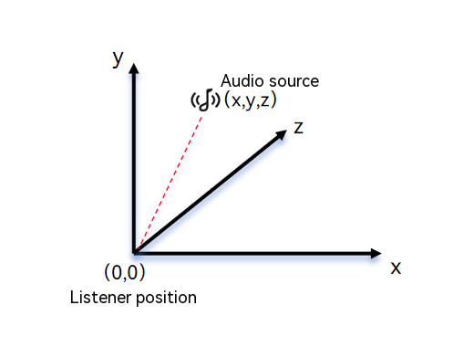
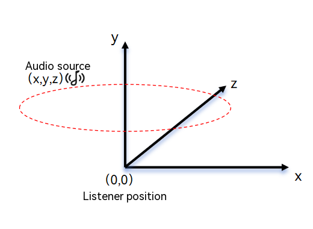
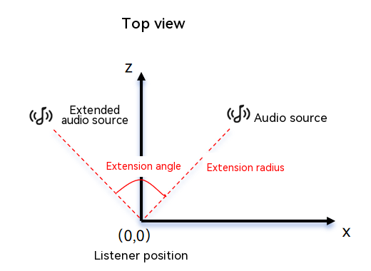

# Spatial Rendering (C/C++)

 <!--Kit: Audio Kit-->
 <!--Subsystem: Multimedia-->
 <!--Owner: @xxngwang-->
 <!--Designer: @jay-liusong-->
 <!--Tester: @Filger-->
 <!--Adviser: @w_Machine_cc-->
<!-- md-trans-meta sourceCommit=45526eba67080b876eb51af31a33be43ae26f701 translatedAt=2026-07-13T13:16:44.771Z pushedAt=2026-07-15T09:19:35.732Z -->

Starting from API version 23, [OHAudioSuite](../../reference/apis-audio-kit/capi-ohaudiosuite.md) provides a spatial rendering effect node [EFFECT_NODE_TYPE_SPACE_RENDER](../../reference/apis-audio-kit/capi-native-audio-suite-base-h.md#oh_audionode_type), which is used to implement 3D spatial audio rendering capabilities. The node offers three [working modes](audio-suite-space-render.md#working-modes): fixed placement, rotation, and extension. It can position, rotate, and extend audio sources in three-dimensional space, helping you efficiently create immersive spatial audio experiences.

## Coordinate System

Spatial rendering uses a left-hand coordinate system. Extend your left hand and form an "L" shape with your thumb and index finger.

- Thumb pointing to the right indicates the positive X-axis direction.

- Index finger pointing upward indicates the positive Y-axis direction.

- The remaining fingers pointing forward indicate the positive Z-axis direction.

Coordinate system parameter description:

- X coordinate: left-right direction. A negative value indicates the left side, and a positive value indicates the right side. The value range is [-5.0, 5.0], and the unit is meter (m).

- Y coordinate: up-down direction. A negative value indicates the lower side, and a positive value indicates the upper side. The value range is [-5.0, 5.0], and the unit is meter (m).

- Z coordinate: front-back direction. A negative value indicates the rear, and a positive value indicates the front. The value range is [-5.0, 5.0], and the unit is meter (m).

## Working Modes

### Fixed Placement Mode

Fixed placement mode is used to place an audio source at a fixed position in a specific space. It is suitable for scenarios that require a fixed sound source position. You can configure parameters for the spatial rendering node by calling [OH_AudioSuiteEngine_SetSpaceRenderPositionParams](../../reference/apis-audio-kit/capi-native-audio-suite-engine-h.md#oh_audiosuiteengine_setspacerenderpositionparams). The following figure shows the fixed placement mode.



### Rotation Mode

Rotation mode enables dynamic rendering of an audio source by setting the single-cycle rotation time and direction at a specified position. You can call [OH_AudioSuiteEngine_SetSpaceRenderRotationParams](../../reference/apis-audio-kit/capi-native-audio-suite-engine-h.md#oh_audiosuiteengine_setspacerenderrotationparams) to configure parameters for the spatial rendering node. The following figure shows the rotation mode.



### Extension Mode

In extension mode, the audio source is extended based on radius and angle. You can call [OH_AudioSuiteEngine_SetSpaceRenderExtensionParams](../../reference/apis-audio-kit/capi-native-audio-suite-engine-h.md#oh_audiosuiteengine_setspacerenderextensionparams) to configure parameters for the spatial rendering node. The following figure shows the extension mode.



## Basic Development Configuration

To use the spatial rendering effect node provided by [OHAudioSuite](../../reference/apis-audio-kit/capi-ohaudiosuite.md), you need to include the corresponding header files and link the dynamic libraries.

### Linking the Dynamic Library in the CMake Script

``` cmake
target_link_libraries(sample PUBLIC libohaudio.so libohaudiosuite.so)
```

### Including Header Files

Include the following header files to use AudioSuite APIs.

<!-- @[audioSuite_SpaceRenderEffectInclude](https://gitcode.com/openharmony/applications_app_samples/blob/master/code/DocsSample/Media/Audio/AudioSuiteSample/entry/src/main/cpp/space_render_rotation.h) -->

``` C
#include <ohaudiosuite/native_audio_suite_base.h>
#include <ohaudiosuite/native_audio_suite_engine.h>
#include <ohaudio/native_audiorenderer.h>
#include <ohaudio/native_audiostreambuilder.h>
```

## How to Develop

### Calling APIs

For detailed API descriptions, see [OHAudioSuite](../../reference/apis-audio-kit/capi-ohaudiosuite.md).

### Implementing Fixed Placement Spatial Rendering

1. Create the engine and pipeline.

   <!-- @[audioSuite_CreateSpaceRenderRotationEngineAndPipeline](https://gitcode.com/openharmony/applications_app_samples/blob/master/code/DocsSample/Media/Audio/AudioSuiteSample/entry/src/main/cpp/space_render_rotation.cpp) -->

   ``` C++
   // The sample code does not include return value verification. Add verification logic in actual use.
   // Create the engine.
   OH_AudioSuiteEngine_Create(&g_audioSuiteEngine);
   
   // Create the pipeline for real-time playback spatial rendering.
   OH_AudioSuiteEngine_CreatePipeline(g_audioSuiteEngine, &g_audioSuitePipeline,
                                      OH_AudioSuite_PipelineWorkMode::AUDIOSUITE_PIPELINE_REALTIME_MODE);
   ```

2. Create input, output, and spatial rendering nodes, and connect them into a network.

   To create an input node, implement the custom callback function `InputNodeWriteDataCallBack`, whose function type is [OH_InputNode_RequestDataCallback()](../../reference/apis-audio-kit/capi-native-audio-suite-engine-h.md#oh_inputnode_requestdatacallback). Call [OH_AudioSuiteNodeBuilder_SetRequestDataCallback()](../../reference/apis-audio-kit/capi-native-audio-suite-engine-h.md#oh_audiosuitenodebuilder_setrequestdatacallback) to set the callback function.

   <!-- @[audioSuite_AudioDataInfo](https://gitcode.com/openharmony/applications_app_samples/blob/master/code/DocsSample/Media/Audio/AudioSuiteSample/entry/src/main/cpp/pcm_file_utils.h) -->

   ``` C
   struct AudioDataInfo {
       uint8_t *buffer = nullptr;   // Audio data.
       int32_t bufferSize = 0;      // Total size of the audio data.
       int32_t totalWriteSize = 0;  // Total size of the processed audio data.
       int32_t totalReadSize = 0;  // Total size of audio data read.
   };
   ```

   <!-- @[audioSuite_SpaceRenderRotationInputNodeWriteDataCallBack](https://gitcode.com/openharmony/applications_app_samples/blob/master/code/DocsSample/Media/Audio/AudioSuiteSample/entry/src/main/cpp/space_render_rotation.cpp) -->

   ``` C++
   // The sample API does not include return value verification. Add verification logic in actual use.
   // Callback function for the input node to request data.
   static int32_t InputNodeWriteDataCallBack(OH_AudioNode *audioNode, void *userData, void *audioData,
                                             int32_t audioDataSize, bool *finished)
   {
       if ((audioNode == nullptr) || (userData == nullptr) || (audioData == nullptr) || (audioDataSize <= 0) ||
           (finished == nullptr)) {
           return -1;
       }
   
       struct AudioDataInfo *info = static_cast<struct AudioDataInfo *>(userData);
       // Size of audio data to process.
       int32_t actualDataSize = std::min(audioDataSize, info->bufferSize - info->totalWriteSize);
       // Write PCM audio data to audioData.
       if (actualDataSize > 0) {
           std::copy(info->buffer + info->totalWriteSize, info->buffer + info->totalWriteSize + actualDataSize,
                     static_cast<uint8_t *>(audioData));
       }
       info->totalWriteSize += actualDataSize;
   
       // All audio data has been processed.
       if (info->totalWriteSize >= info->bufferSize) {
           *finished = true;
       }
       return actualDataSize;
   }
   ```

   <!-- @[audioSuite_CreateSpaceRenderRotation](https://gitcode.com/openharmony/applications_app_samples/blob/master/code/DocsSample/Media/Audio/AudioSuiteSample/entry/src/main/cpp/space_render_rotation.cpp) -->

   ``` C++
   // The sample API does not include return value verification. Add verification logic in actual use.
   // Create a node builder.
   OH_AudioNodeBuilder *nodeBuilder = nullptr;
   OH_AudioSuiteNodeBuilder_Create(&nodeBuilder);
   
   // Configure the audio data format. Set the sampling rate, channel layout, number of channels, bit depth, and encoding format parameters based on the audio data format to be processed.
   OH_AudioFormat audioFormatInput;
   ConfigureAudioFormat(audioFormatInput);
   OH_AudioSuiteNodeBuilder_SetFormat(nodeBuilder, audioFormatInput);
   OH_AudioSuiteNodeBuilder_SetNodeType(nodeBuilder, OH_AudioNode_Type::INPUT_NODE_TYPE_DEFAULT);
   // You can set one or more input nodes based on your audio source.
   // Set the callback for the first audio stream.
   void *userData = static_cast<void *>(audioInfoForVocals);
   OH_AudioSuiteNodeBuilder_SetRequestDataCallback(nodeBuilder, InputNodeWriteDataCallBack, userData);
   // Create the first input node.
   OH_AudioSuiteEngine_CreateNode(g_audioSuitePipeline, nodeBuilder, &g_inputNodeForVocals);
   
   // Reset the builder configuration and set it to the input node type.
   OH_AudioSuiteNodeBuilder_Reset(nodeBuilder);
   OH_AudioSuiteNodeBuilder_SetNodeType(nodeBuilder, OH_AudioNode_Type::INPUT_NODE_TYPE_DEFAULT);
   OH_AudioSuiteNodeBuilder_SetFormat(nodeBuilder, audioFormatInput);
   // Set the callback for the second audio stream.
   userData = static_cast<void *>(audioInfoForAccompaniment);
   OH_AudioSuiteNodeBuilder_SetRequestDataCallback(nodeBuilder, InputNodeWriteDataCallBack, userData);
   // Create the second input node.
   OH_AudioSuiteEngine_CreateNode(g_audioSuitePipeline, nodeBuilder, &g_inputNodeForAccompaniment);
   
   // After the user sets spatial audio with fixed placement for spatial rendering, the spatial audio position can also be updated in real time to achieve periodic changes.
   // Reset the builder configuration and set the node type to spatial rendering node.
   OH_AudioSuiteNodeBuilder_Reset(nodeBuilder);
   OH_AudioSuiteNodeBuilder_SetNodeType(nodeBuilder, OH_AudioNode_Type::EFFECT_NODE_TYPE_SPACE_RENDER);
   // Create the first spatial rendering node.
   OH_AudioSuiteEngine_CreateNode(g_audioSuitePipeline, nodeBuilder, &g_spaceNodeForVocals);
   // Set the spatial rendering node to fixed placement.
   OH_AudioSuiteEngine_SetSpaceRenderPositionParams(
       g_spaceNodeForVocals,
       OH_AudioSuite_SpaceRenderPositionParams{-SPACE_RENDER_RADIUS, POSITION_ORIGIN, -SPACE_RENDER_RADIUS});
   
   // Reset the builder configuration and set the node type to spatial rendering node.
   OH_AudioSuiteNodeBuilder_Reset(nodeBuilder);
   OH_AudioSuiteNodeBuilder_SetNodeType(nodeBuilder, OH_AudioNode_Type::EFFECT_NODE_TYPE_SPACE_RENDER);
   // Create the second spatial rendering node.
   OH_AudioSuiteEngine_CreateNode(g_audioSuitePipeline, nodeBuilder, &g_spaceNodeForAccompaniment);
   // Set the spatial rendering node to fixed placement.
   OH_AudioSuiteEngine_SetSpaceRenderPositionParams(
       g_spaceNodeForAccompaniment,
       OH_AudioSuite_SpaceRenderPositionParams{SPACE_RENDER_RADIUS, POSITION_ORIGIN, SPACE_RENDER_RADIUS});
   
   // Reset the builder configuration and set it to the mixer node type.
   OH_AudioSuiteNodeBuilder_Reset(nodeBuilder);
   OH_AudioSuiteNodeBuilder_SetNodeType(nodeBuilder, OH_AudioNode_Type::EFFECT_NODE_TYPE_AUDIO_MIXER);
   // Create the mixer node.
   OH_AudioSuiteEngine_CreateNode(g_audioSuitePipeline, nodeBuilder, &g_mixerNode);
   
   // Reset the builder configuration and set it to the output node type.
   OH_AudioSuiteNodeBuilder_Reset(nodeBuilder);
   OH_AudioSuiteNodeBuilder_SetNodeType(nodeBuilder, OH_AudioNode_Type::OUTPUT_NODE_TYPE_DEFAULT);
   // Configure the audio data format. Set the sampling rate, channel layout, number of channels, bit depth, and encoding format parameters based on the expected output audio format.
   OH_AudioFormat audioFormatOutput;
   ConfigureAudioFormat(audioFormatOutput);
   OH_AudioSuiteNodeBuilder_SetFormat(nodeBuilder, audioFormatOutput);
   // Create the output node.
   OH_AudioSuiteEngine_CreateNode(g_audioSuitePipeline, nodeBuilder, &g_outputNode);
   
   // Destroy the node builder.
   OH_AudioSuiteNodeBuilder_Destroy(nodeBuilder);
   
   // Connect the nodes to form a pipeline.
   OH_AudioSuiteEngine_ConnectNodes(g_inputNodeForVocals, g_spaceNodeForVocals);
   OH_AudioSuiteEngine_ConnectNodes(g_spaceNodeForVocals, g_mixerNode);
   OH_AudioSuiteEngine_ConnectNodes(g_inputNodeForAccompaniment, g_spaceNodeForAccompaniment);
   OH_AudioSuiteEngine_ConnectNodes(g_spaceNodeForAccompaniment, g_mixerNode);
   OH_AudioSuiteEngine_ConnectNodes(g_mixerNode, g_outputNode);
   ```

3. In the player callback function, copy the processed data to the buffer of the `OH_AudioRenderer` instance to enable real-time preview during audio playback.

   <!-- @[audioSuite_SpaceRenderRotationAudioRendererOnWriteData](https://gitcode.com/openharmony/applications_app_samples/blob/master/code/DocsSample/Media/Audio/AudioSuiteSample/entry/src/main/cpp/space_render_rotation.cpp) -->

   ``` C++
   // The sample API does not include return value verification. Add verification logic in actual use.
   static OH_AudioData_Callback_Result AudioRendererOnWriteData(OH_AudioRenderer *renderer, void *userData,
                                                                void *audioData, int32_t audioDataSize)
   {
       bool finishedFlag = false;
       int32_t writeSize = 0;
       OH_AudioSuite_Result result = OH_AudioSuiteEngine_RenderFrame(static_cast<OH_AudioSuitePipeline *>(userData),
                                                                     audioData, audioDataSize, &writeSize, &finishedFlag);
       if (result != OH_AudioSuite_Result::AUDIOSUITE_SUCCESS) {
           // Audio suite rendering failed.
           return AUDIO_DATA_CALLBACK_RESULT_INVALID;
       }
       // Audio suite rendering completed.
       if (finishedFlag) {
           // Developer-defined behavior.
       }
   
       return AUDIO_DATA_CALLBACK_RESULT_VALID;
   }
   ```

   <!-- @[audioSuite_StartSpaceRenderRotationPipeline](https://gitcode.com/openharmony/applications_app_samples/blob/master/code/DocsSample/Media/Audio/AudioSuiteSample/entry/src/main/cpp/space_render_rotation.cpp) -->

   ``` C++
   // The sample API does not include return value verification. Add verification logic in actual use.
   // Create the builder.
   OH_AudioStreamBuilder_Create(&g_rendererBuilder, OH_AudioStream_Type::AUDIOSTREAM_TYPE_RENDERER);
   OH_AudioStreamBuilder_SetSamplingRate(g_rendererBuilder, OH_Audio_SampleRate::SAMPLE_RATE_48000);
   OH_AudioStreamBuilder_SetChannelCount(g_rendererBuilder, CHANNEL_COUNT);
   OH_AudioStreamBuilder_SetSampleFormat(g_rendererBuilder, AUDIOSTREAM_SAMPLE_S16LE);
   OH_AudioStreamBuilder_SetEncodingType(g_rendererBuilder, AUDIOSTREAM_ENCODING_TYPE_RAW);
   OH_AudioStreamBuilder_SetRendererInfo(g_rendererBuilder, AUDIOSTREAM_USAGE_MUSIC);
   
   // If the samplingRate is 11025, use 40 ms for calculation.
   OH_AudioFormat audioFormatOutput;
   ConfigureAudioFormat(audioFormatOutput);
   int32_t frameSize = RENDER_FRAME_DURATION_MS * audioFormatOutput.samplingRate * audioFormatOutput.channelCount *
                       SAMPLE_FORMAT_S16LE_BYTE_SIZE / MS_PER_SECOND;
   // Set the audioDataSize length (size of data to be played).
   OH_AudioStreamBuilder_SetFrameSizeInCallback(g_rendererBuilder, frameSize);
   // Configure the callback for writing audio data.
   OH_AudioStreamBuilder_SetRendererWriteDataCallback(g_rendererBuilder, AudioRendererOnWriteData,
                                                      static_cast<void *>(g_audioSuitePipeline));
   
   // Start the pipeline.
   OH_AudioSuiteEngine_StartPipeline(g_audioSuitePipeline);
   // ...
   // Stop the pipeline.
   OH_AudioSuiteEngine_StopPipeline(g_audioSuitePipeline);
   ```

4. Destroy resources.

   <!-- @[audioSuite_DestroySpaceRenderRotation](https://gitcode.com/openharmony/applications_app_samples/blob/master/code/DocsSample/Media/Audio/AudioSuiteSample/entry/src/main/cpp/space_render_rotation.cpp) -->

   ``` C++
   // The sample API does not include return value verification. Add verification logic in actual use.
   // Destroy the stream builder.
   OH_AudioStreamBuilder_Destroy(g_rendererBuilder);
   
   // Destroy the node.
   OH_AudioSuiteEngine_DestroyNode(g_inputNodeForVocals);
   OH_AudioSuiteEngine_DestroyNode(g_inputNodeForAccompaniment);
   OH_AudioSuiteEngine_DestroyNode(g_spaceNodeForVocals);
   OH_AudioSuiteEngine_DestroyNode(g_spaceNodeForAccompaniment);
   OH_AudioSuiteEngine_DestroyNode(g_mixerNode);
   OH_AudioSuiteEngine_DestroyNode(g_outputNode);
   
   // Destroy the pipeline.
   OH_AudioSuiteEngine_DestroyPipeline(g_audioSuitePipeline);
   
   // Destroy the engine.
   OH_AudioSuiteEngine_Destroy(g_audioSuiteEngine);
   ```

<!--RP1-->

## Samples

- [AudioSuiteSample](https://gitcode.com/openharmony/applications_app_samples/tree/master/code/DocsSample/Media/Audio/AudioSuiteSample)

<!--RP1End-->