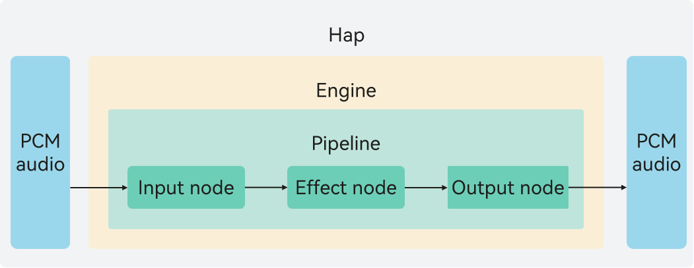

# Audio Creation Overview (C/C++)
<!--Kit: Audio Kit-->
<!--Subsystem: Multimedia-->
<!--Owner: @songshenke-->
<!--Designer: @caixuejiang; @hao-liangfei; @zhanganxiang-->
<!--Tester: @Filger-->
<!--Adviser: @w_Machine_cc-->

Starting from API version 22, [OHAudioSuite](../../reference/apis-audio-kit/capi-ohaudiosuite.md) is provided for audio creation. OHAudioSuite is a professional audio effects processing interface designed to help you efficiently build audio creation applications. It offers high-quality, low-latency, intelligent audio processing capabilities, and integrates a variety of audio effects such as noise reduction, equalization, and vocal separation. You can easily integrate these features into your application based on specific use cases.

OHAudioSuite is built around three core concepts: engine, pipeline, and node.

**Figure 1** Implementation principle of audio creation

## Engine

The engine in [OHAudioSuite](../../reference/apis-audio-kit/capi-ohaudiosuite.md) centrally manages audio pipelines and controls [offline editing (C/C++)](audio-suite-manual-rendering.md) and [real-time rendering (C/C++)](audio-suite-real-time-rendering.md). You can build an audio processing chain based on your needs. As shown in the preceding figure, initiated by the application, the process involves calling [OHAudioSuite](../../reference/apis-audio-kit/capi-ohaudiosuite.md) APIs to create engines, pipelines, and nodes sequentially. These nodes are then connected within the pipeline to transport Pulse Code Modulation (PCM) audio data, enabling the corresponding effect nodes to implement audio processing capabilities. When the pipeline is stopped, you can connect, disconnect, and remove nodes within certain limits (see [Pipeline Composition and Orchestration](#pipeline-composition-and-orchestration)), and adjust node orchestration to implement complex audio effects.

An engine supports the creation of up to 10 pipelines, with a maximum of 1 dedicated to real-time rendering.

## Node

### Introduction to Nodes

A node is the minimum unit of audio rendering. It provides the corresponding audio effect processing capability based on its functionality. Nodes themselves cannot be called independently; they must be attached to pipelines and engines for use.

[OHAudioSuite](../../reference/apis-audio-kit/capi-ohaudiosuite.md) supports three types of nodes: input node, output node, and effect node.

|Node Type  | Description   |
|----------|----------|
| INPUT_NODE  | Input node, which allows you to input PCM audio data in various formats. |
| EFFECT_NODE | Effect node, which allows you to add audio effects. Both single-input single-output and multi-input single-output are supported.|
| OUTPUT_NODE | Output node, which allows you to set the output format of PCM audio data. |

  For details about the complete node types, see [OH_AudioNode_Type](../../reference/apis-audio-kit/capi-native-audio-suite-base-h.md#oh_audionode_type).

### Functionalities of Nodes

- Input nodes are responsible for processing the input of PCM audio data and obtaining data from the application side.

- Output nodes are responsible for processing the output of PCM audio data. You can set the output format of audio data.

- In [offline editing (C/C++)](audio-suite-manual-rendering.md) scenarios, audio effect nodes such as equalizers, source separation, sound field effects, noise reduction, voice beautification, environment effects, and audio mixer are supported.
  
- In [real-time rendering (C/C++)](audio-suite-real-time-rendering.md) scenarios, equalizer effect nodes are supported.

- Audio effect nodes such as equalizers, source separation, sound field effects, and noise reduction support corresponding audio effect processing functionalities and multi-audio mixing operations. The output format of PCM audio data can be set (such as [OH_Audio_SampleFormat (bit depth)](../../reference/apis-audio-kit/capi-native-audio-suite-base-h.md#oh_audio_sampleformat), [OH_Audio_SampleRate (sampling rate)](../../reference/apis-audio-kit/capi-native-audio-suite-base-h.md#oh_audio_samplerate), and [OH_AudioChannelLayout (number of channels)](../../reference/apis-avcodec-kit/capi-native-audio-channel-layout-h.md#oh_audiochannellayout)).

## Pipeline

A pipeline centrally manages the connections and configurations of audio nodes. It supports two working modes: [offline editing (C/C++)](audio-suite-manual-rendering.md) and [real-time rendering (C/C++)](audio-suite-real-time-rendering.md).

The pipeline data processing uses a reverse drive mechanism. Initiated by [OH_AudioSuiteEngine_RenderFrame()](../../reference/apis-audio-kit/capi-native-audio-suite-engine-h.md#oh_audiosuiteengine_renderframe) or [OH_AudioSuiteEngine_MultiRenderFrame()](../../reference/apis-audio-kit/capi-native-audio-suite-engine-h.md#oh_audiosuiteengine_multirenderframe), the output node requests data from the upstream connected nodes level by level, ultimately prompting the input node's [OH_InputNode_RequestDataCallback()](../../reference/apis-audio-kit/capi-native-audio-suite-engine-h.md#oh_inputnode_requestdatacallback) callback function to request the audio data to be processed from the developer.

**Figure 2** Pipeline running state

The table below describes these states.

|State | Description   |
|----------|----------|
| stopped  | The initial state, or the state entered after [OH_AudioSuiteEngine_StopPipeline()](../../reference/apis-audio-kit/capi-native-audio-suite-engine-h.md#oh_audiosuiteengine_stoppipeline) is executed. When switching to the stopped state, each node releases its cache. |
| running  | The working state, or the state entered from the initial state by executing [OH_AudioSuiteEngine_StartPipeline()](../../reference/apis-audio-kit/capi-native-audio-suite-engine-h.md#oh_audiosuiteengine_startpipeline). This function checks the integrity of the pipeline, including whether there are valid connections and whether nodes are incorrectly connected.|

### Functionalities of Pipelines

- The pipeline is the audio effect chain in [OHAudioSuite](../../reference/apis-audio-kit/capi-ohaudiosuite.md) that supports applications in rendering PCM audio data. The pipeline supports flexible networking between nodes, providing a richer and more flexible audio creation experience.

- The pipeline is used in the following scenarios:

  Create an input node, an effect node (for example, an equalizer node [EFFECT_NODE_TYPE_EQUALIZER](../../reference/apis-audio-kit/capi-native-audio-suite-base-h.md#oh_audionode_type)), and an output node. Connect them in the sequence of input node -> effect node -> output node to form a pipeline that implements equalizer functionality. (For details about the code example, see [Basic Offline Editing](audio-suite-manual-rendering.md#basic-offline-editing).) In addition, the pipeline supports the multi-input scenario (for details, see [Mixing and Cascading](audio-suite-manual-rendering.md#mixing-and-cascading)), where PCM data from each pipeline input passes through its respective effect nodes and is mixed before output.

### Pipeline Composition and Orchestration

A pipeline is composed of nodes. In each pipeline, there can be up to 5 input nodes ([INPUT_NODE_TYPE_DEFAULT](../../reference/apis-audio-kit/capi-native-audio-suite-base-h.md#oh_audionode_type)), up to 1 output node ([OUTPUT_NODE_TYPE_DEFAULT](../../reference/apis-audio-kit/capi-native-audio-suite-base-h.md#oh_audionode_type)), and up to 5 effect nodes, with up to 3 audio mixer nodes ([EFFECT_NODE_TYPE_AUDIO_MIXER](../../reference/apis-audio-kit/capi-native-audio-suite-base-h.md#oh_audionode_type)) and up to 1 source separation node ([EFFECT_MULTII_OUTPUT_NODE_TYPE_AUDIO_SEPARATION](../../reference/apis-audio-kit/capi-native-audio-suite-base-h.md#oh_audionode_type)).

The rules for creating nodes in a pipeline are as follows:

- If the number of created nodes of a type reaches the limit for that type, further creation of nodes of that type will fail.
- Each pipeline must have at least one input node and exactly one output node.
- Before creating a node, call [OH_AudioSuiteEngine_IsNodeTypeSupported()](../../reference/apis-audio-kit/capi-native-audio-suite-engine-h.md#oh_audiosuiteengine_isnodetypesupported) to check whether the node type is supported to avoid node creation failure.
- Input and output nodes support node format setting, whereas other nodes do not. The input format is the audio format of the audio source, and the output format is the audio format that you expect to output.

The rules for orchestrating nodes in a pipeline are as follows:

- The connection order of nodes in a pipeline is as follows: input node -> effect node -> output node.
- The source separation effect node [EFFECT_MULTII_OUTPUT_NODE_TYPE_AUDIO_SEPARATION](../../reference/apis-audio-kit/capi-native-audio-suite-base-h.md#oh_audionode_type) can only be connected to an output node. There is no such restriction for other effect nodes.

- The audio mixer effect node [EFFECT_NODE_TYPE_AUDIO_MIXER](../../reference/apis-audio-kit/capi-native-audio-suite-base-h.md#oh_audionode_type) supports multiple input connections, whereas other nodes do not.

- Node connections are unidirectional, and reverse connections from subsequent nodes to preceding nodes are not supported. The input node is the first node in each pipeline, and the output node is the last node in each pipeline.
