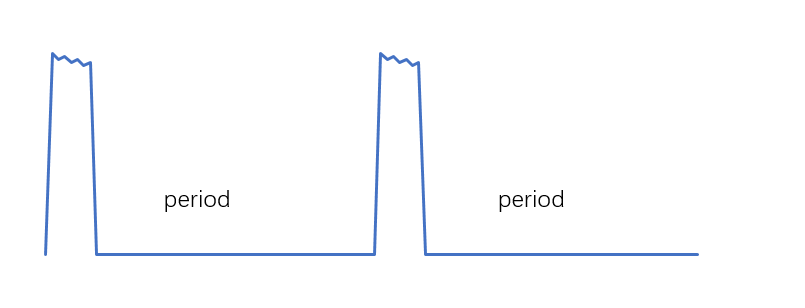
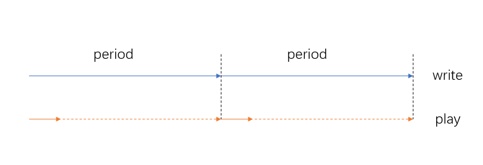
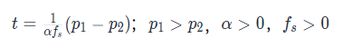

# Low-Power Audio Playback
<!--Kit: Audio Kit-->
<!--Subsystem: Multimedia-->
<!--Owner: @songshenke-->
<!--Designer: @caixuejiang; @hao-liangfei; @zhanganxiang-->
<!--Tester: @Filger-->
<!--Adviser: @w_Machine_cc-->

Starting from API version 11, low-power audio playback is available.

Low-power audio playback is an audio rendering solution that leverages software-hardware-chip synergy. It works by increasing the internal buffer of the audio renderer, allowing the system to fill a large amount of audio data at once. This enables the main processor to sleep for extended periods, reducing power consumption associated with frequent audio data processing and significantly lowering the system-level power load.

## Prerequisites

Low-power functionality is currently supported for external speakers, wired headphones, and some Bluetooth headphones.

## Development Guidelines

The low-power audio renderer provides the same APIs as the regular audio renderer. However, you should pay attention to the application data cycle and playback progress. For details about how to use the audio renderer, see [Using AudioRenderer for Audio Playback (ArkTs)](using-audiorenderer-for-playback.md) and [(Recommended) Using OHAudio for Audio Playback (C/C++)](using-ohaudio-for-playback.md).

**Data cycle diagram**

During the data cycle, when data is quickly requested to fill the buffer, the system enters a sleep state. When the buffer data is consumed, the next cycle is triggered.

**Playback progress diagram**

During the data cycle, when data is quickly requested to fill the buffer, playback progress is calculated based on the actual playback amount. When the buffer data is consumed (for example, playback progress reaches the amount of data written), the next cycle is triggered.

### Precautions

1. For stream types using [STREAM_USAGE_MUSIC](../../reference/apis-audio-kit/arkts-apis-audio-e.md#streamusage), [STREAM_USAGE_AUDIOBOOK](../../reference/apis-audio-kit/arkts-apis-audio-e.md#streamusage), [AUDIOSTREAM_USAGE_MUSIC](../../reference/apis-audio-kit/capi-native-audiostream-base-h.md#oh_audiostream_usage), or [AUDIOSTREAM_USAGE_AUDIOBOOK](../../reference/apis-audio-kit/capi-native-audiostream-base-h.md#oh_audiostream_usage), the low-power renderer is used by default.

2. Low-power renderer buffer: up to 1000 ms in screen-on scenarios; up to 10000 ms in screen-off scenarios. The main processor is woken up when the buffer data is consumed, triggering the application to send data. The data transmission cycle is consistent with the buffer size.

    > - It is normal for the application not to request data within the sensing cycle. There is no need to stop the stream. The system automatically stops the stream if data is not received for a long time. When the application sends data again, the system resumes the stream.
    > - In screen-off scenarios, after the buffer is filled, the main processor enters sleep mode, and the application enters the suspended state. If the application requires background playback or screen-off playback, refer to [Development Precautions for Background Playback](audio-playback-overview.md#development-precautions-for-background-playback).
    > - The low-power renderer requests data of the same length as the regular renderer, filling the buffer through high request frequency. It is expected to request data every 1 ms, but the actual duration is affected by the application and hardware. If the application cannot provide data quickly, it is downgraded to the regular renderer cycle. If the regular renderer cycle cannot ensure timely data, the application needs to optimize data processing.
    > - When the application data is insufficient for one callback length, do not fill with empty data to avoid playback stuttering (except when reaching EOS). You are advised to wait for sufficient data or return an error code. For details, see [AudioRenderer Audio Data Callback](using-audiorenderer-for-playback.md#how-to-develop) and [OHAudio Audio Data Callback](using-ohaudio-for-playback.md#how-to-develop).

3. Low-power renderers and low-latency renderers do not support concurrency, following the first-come, first-served principle, meaning the first one to start takes effect, and the later one is downgraded to a regular renderer. Specific examples are as follows:

    >- If low-power renderer A is started first, followed by low-power renderer B, then B is downgraded to a regular renderer.
    >- If a low-power renderer is started first, followed by a low-latency renderer, then the low-latency renderer is downgraded to a regular renderer.
    >- If a low-latency renderer is started first, followed by a low-power renderer, then the low-power renderer is downgraded to a regular renderer.

4. Writing application data does not mean that the playback is complete. You need to call [getAudioTimestampInfo](../../reference/apis-audio-kit/arkts-apis-audio-AudioRenderer.md#getaudiotimestampinfo19) or [OH_AudioRenderer_GetAudioTimestampInfo()](../../reference/apis-audio-kit/capi-native-audiorenderer-h.md#oh_audiorenderer_getaudiotimestampinfo) to obtain the audio timestamp to determine the actual playback progress.

    > - You are advised to call the API for obtaining the timestamp at an interval greater than 200 ms to avoid affecting the system performance.
    > - After the application calls [flush](../../reference/apis-audio-kit/arkts-apis-audio-AudioRenderer.md#flush11) or [OH_AudioRenderer_Flush()](../../reference/apis-audio-kit/capi-native-audiorenderer-h.md#oh_audiorenderer_flush), the amount of data played back will be reset to 0.
    > - Due to the system frame length and latency mechanism, the amount of data played is always less than the amount of data written.
    > - You can obtain the timestamp after finishing writing data. If the timestamp obtained remains unchanged for two cycles, playback is finished. You can also estimate the remaining playback duration based on the set speed. If the estimated duration exceeds the actual duration, playback is finished. For example, let the total written data amount be p1, obtain the timestamp p2 after writing, the set speed be α where α>0, the audio sampling rate be fs where fs>0, and the remaining playable duration be t. The formula is as follows: 
