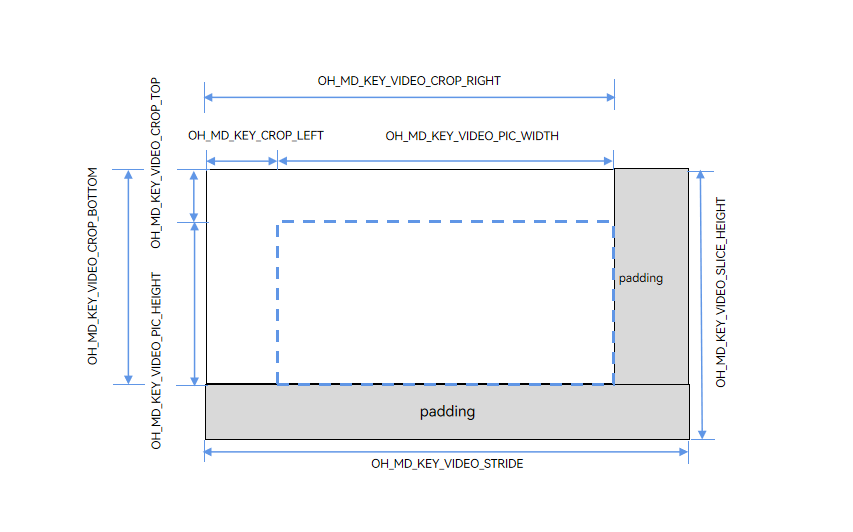

# Video Codec Width, Height, Stride, and Crop Information

<!--Kit: AVCodec Kit-->
<!--Subsystem: Multimedia-->
<!--Owner: @zhanghongran-->
<!--Designer: @dpy2650--->
<!--Tester: @cyakee-->
<!--Adviser: @w_Machine_cc-->
<!-- md-trans-meta sourceCommit=444d4b7458e1317b3c2f1a471488b9c4b8344c2e translatedAt=2026-06-03T06:21:34.948Z pushedAt=2026-06-03T10:32:22.503Z -->

## Overview

In video codec development, there are multiple representations of image **width** and **height**. Additionally, hardware processing typically requires memory alignment (stride), and decoded output may involve a **crop area**. This document systematically outlines the dimension-related parameters in the video codec API and their relationships, helping developers correctly understand and use these parameters.

## Parameter Overview

**Table 1** Dimension parameter list

| Parameter | Key Name | Type | Description | Encoder Usage Scenario | Decoder Usage Scenario | API Interface |
|------|------|------|------|--------|--------|----------|
| width/height | `OH_MD_KEY_WIDTH`/`OH_MD_KEY_HEIGHT` | int32_t | Configured video width/height. | Configure target encoding resolution. | Configure pre-allocated buffer. | Configure |
| stride | `OH_MD_KEY_VIDEO_STRIDE` | int32_t | Width stride (bytes per row after row alignment). | Get buffer memory alignment width. | Get buffer memory alignment width. |GetInputDescription/GetOutputDescription/OnStreamChanged |
| sliceHeight | `OH_MD_KEY_VIDEO_SLICE_HEIGHT` | int32_t | Height stride (total rows after column alignment). | Get buffer memory alignment height. | Get buffer memory alignment height. |GetInputDescription/GetOutputDescription/OnStreamChanged |
| picWidth/picHeight | `OH_MD_KEY_VIDEO_PIC_WIDTH`/`OH_MD_KEY_VIDEO_PIC_HEIGHT` | int32_t | Actual effective image width/height. | — | Get decoded output effective width/height.|GetOutputDescription/OnStreamChanged |
| cropTop | `OH_MD_KEY_VIDEO_CROP_TOP` | int32_t | Top row coordinate (y) of the crop rectangle, inclusive of the top row of the crop box, with row index starting from 0. | — | Get decoded crop top boundary.|GetOutputDescription/OnStreamChanged |
| cropBottom | `OH_MD_KEY_VIDEO_CROP_BOTTOM` | int32_t | Bottom row coordinate (y) of the crop rectangle, inclusive of the bottom row of the crop box, with row index starting from 0. | — | Get decoded crop bottom boundary. |GetOutputDescription/OnStreamChanged |
| cropLeft | `OH_MD_KEY_VIDEO_CROP_LEFT` | int32_t | Left column coordinate (x) of the crop rectangle, inclusive of the leftmost column of the crop box, with column index starting from 0. | — | Get decoded crop left boundary. |GetOutputDescription/OnStreamChanged |
| cropRight | `OH_MD_KEY_VIDEO_CROP_RIGHT` | int32_t | Right column coordinate (x) of the crop rectangle, inclusive of the rightmost column of the crop box, with column index starting from 0. | — | Get decoded crop right boundary. |GetOutputDescription/OnStreamChanged |

> **NOTE**
>
> For the definition of keys in the table, refer to [native_avcodec_base.h](../../reference/apis-avcodec-kit/capi-native-avcodec-base-h.md).

## Detailed Explanation of Core Concepts

### Difference Between width/height and picWidth/picHeight

**width/height (Configuration Dimensions)**

The encoder's `OH_MD_KEY_WIDTH` and `OH_MD_KEY_HEIGHT` are the target encoding resolution configured by the developer through the `Configure` interface. This is the **expected size** of the encoder input data and also the **encoding resolution** in the bitstream.

```c++
// Encoder configuration example.
OH_AVFormat *format = OH_AVFormat_Create();
OH_AVFormat_SetIntValue(format, OH_MD_KEY_WIDTH, 1920);  // Target encoding width.encoding width.
OH_AVFormat_SetIntValue(format, OH_MD_KEY_HEIGHT, 1080);  // Target encoding height.encoding height.
OH_AVFormat_SetIntValue(format, OH_MD_KEY_PIXEL_FORMAT, AV_PIXEL_FORMAT_NV12);
// Must be destroyed after using format.
OH_AVFormat_Destroy(format);
```

The decoder's `OH_MD_KEY_WIDTH` and `OH_MD_KEY_HEIGHT` are decoding resolution hints configured by the developer through the `Configure` interface. Based on these parameters, the decoder **pre-allocates internal buffers** to ensure they can accommodate the encoded frame dimensions in the bitstream.

> **NOTE**
>
> - The decoder's width/height are the **expected values** during the configuration phase. The effective image dimensions of the actual decoded output are determined by `OH_MD_KEY_VIDEO_PIC_WIDTH`/`OH_MD_KEY_VIDEO_PIC_HEIGHT` (see below).
> - It is generally recommended to set width/height to be consistent with or slightly larger than the actual resolution of the bitstream.
> - The decoder supports dynamic changes in bitstream resolution (such as in adaptive bitrate scenarios). In this case, the decoder will output the corresponding picWidth/picHeight based on the actual frame dimensions.

```c++
// Decoder configuration example.
OH_AVFormat *format = OH_AVFormat_Create();
OH_AVFormat_SetIntValue(format, OH_MD_KEY_WIDTH, 1920);   // Decoding width (required).dth (required).
OH_AVFormat_SetIntValue(format, OH_MD_KEY_HEIGHT, 1080);  // Decoding height (required).ight (required).
OH_AVFormat_SetIntValue(format, OH_MD_KEY_PIXEL_FORMAT, AV_PIXEL_FORMAT_NV12);
// Must be destroyed after use with format.
OH_AVFormat_Destroy(format);
```

**picWidth/picHeight (effective image dimensions)**

The decoder's `OH_MD_KEY_VIDEO_PIC_WIDTH` and `OH_MD_KEY_VIDEO_PIC_HEIGHT` represent the width and height of the **actual effective pixel area** of the decoded output.

Because video bitstream standards (such as H.264/H.265) support a cropping (crop) mechanism, the size of the encoded frame in the bitstream is not equivalent to the **actual effective pixel area**.

```txt
picWidth  = cropRight - cropLeft + 1     (width: difference between the left and right column coordinates + 1)
picHeight = cropBottom - cropTop + 1     (height: difference between the top and bottom row coordinates + 1)
```

### stride/sliceHeight (memory stride)

**Definition of stride**

Video codec hardware typically requires **memory to be aligned to specific bytes or pixels** to improve access efficiency. When the configured image width/height does not meet alignment requirements, the hardware allocates a larger buffer, and the excess portion is called **padding**.

Stride encompasses two dimensions:

- **Width stride (stride)**: The actual number of bytes per row in memory, typically ≥ the effective width of the image.

- **Height stride (sliceHeight)**: The total number of rows allocated in memory, typically ≥ the effective height of the image.

The relationship between these two and the effective dimensions is:

```txt
stride      = width + padding_width          (horizontal direction)
sliceHeight = height + padding_height        (vertical direction)
```

**Encoder-Side Memory Layout**

Taking the NV12 format as an example, the memory layout of the encoder input buffer is shown in Figure 1.

**Figure 1** Memory layout diagram of an NV12 format image


Description of parameters in Figure 1:

| Parameter | Key Name | Description |
|------|------|------|
| width | `OH_MD_KEY_WIDTH` | The effective width of the image configured by the developer. |
| height | `OH_MD_KEY_HEIGHT` | The effective height of the image configured by the developer. |
| stride | `OH_MD_KEY_VIDEO_STRIDE` | The actual pixel count per row in the buffer (including right-side padding). |
| sliceHeight | `OH_MD_KEY_VIDEO_SLICE_HEIGHT` | The actual number of rows in the Y component area (including bottom padding). |

**Memory Layout on the Decoder Side**

The memory layout of the decoder output buffer is similar, but different key names are used to identify the effective area.

**Figure 2** Schematic diagram of the decoder output buffer memory layout


Description of each parameter in Figure 2:

| Parameter | Key Name | Description |
|------|------|------|
| picWidth | `OH_MD_KEY_VIDEO_PIC_WIDTH` | The actual effective width of the decoded image. |
| picHeight | `OH_MD_KEY_VIDEO_PIC_HEIGHT` | The actual effective height of the decoded image. |
| stride | `OH_MD_KEY_VIDEO_STRIDE` | The actual pixel count per row in the buffer (including right-side padding). |
| sliceHeight | `OH_MD_KEY_VIDEO_SLICE_HEIGHT` | The actual number of rows in the Y component area (including bottom padding). |

### Crop (Crop Rectangle)

**Decoder-side memory layout with crop information**

Generally, the left/top crop offset fields in the bitstream parameter set are usually 0, so the effective area of the decoded output typically starts from the beginning of the memory, meaning cropLeft and cropTop are both 0.

**Figure 3** Schematic diagram of decoder-side memory layout with crop information


The four crop parameters specific to the decoder define the rectangular range of the **effective display area**.

| Parameter | Key Name | Description |
|------|--------|--------|
| cropLeft | `OH_MD_KEY_VIDEO_CROP_LEFT` | Column coordinate (x) of the left edge of the effective area, starting from 0, inclusive. |
| cropRight | `OH_MD_KEY_VIDEO_CROP_RIGHT` | Column coordinate (x) of the right edge of the effective area, starting from 0, inclusive. |
| cropTop | `OH_MD_KEY_VIDEO_CROP_TOP` | Row coordinate (y) of the top edge of the effective area, starting from 0, inclusive. |
| cropBottom | `OH_MD_KEY_VIDEO_CROP_BOTTOM` | Row coordinate (y) of the bottom edge of the effective area, starting from 0, inclusive. |

## Relationship Between picWidth/picHeight and Bitstream Standards (H.264/H.265)

### H.264 AVC Standard

The H.264 standard defines the image size relationship through the following fields in the SPS (Sequence Parameter Set).

| H.264 SPS Field | Description |
|----------------|------|
| `pic_width_in_mbs_minus1` | Encoded frame width in macroblocks. |
| `pic_height_in_map_units_minus1` | Encoded frame height in macroblock rows. |
| `frame_cropping_flag` | Flag indicating whether cropping is enabled. |
| `frame_crop_left_offset` | Left cropping offset (pixel count from the left edge). |
| `frame_crop_right_offset` | Right cropping offset (pixel count from the right edge). |
| `frame_crop_top_offset` | Top cropping offset (pixel count from the top edge). |
| `frame_crop_bottom_offset` | Bottom cropping offset (pixel count from the bottom edge). |

For common formats, such as yuv420 and H.264 video with frame_mbs_only_flag = 1, the effective image size calculation formula is as follows.

```txt
// Method 1: Direct calculation via SPS offsets.
picWidth  = (pic_width_in_mbs_minus1 + 1) * 16 - 2 * frame_crop_left_offset - 2 * frame_crop_right_offset
picHeight = (pic_height_in_map_units_minus1 + 1) * 16 - 2 * frame_crop_top_offset - 2 * frame_crop_bottom_offset

// Method 2: Calculation via API coordinate values (equivalent).
picWidth  = cropRight - cropLeft + 1
picHeight = cropBottom - cropTop + 1
```

### H.265 HEVC Standard

The H.265 standard uses CTU (Coding Tree Unit) instead of macroblocks. The corresponding fields in the SPS are shown in the following table.

| H.265 SPS Field | Description |
|----------------|------|
| `pic_width_in_luma_samples` | Encoded frame width of the luma component (in pixels). |
| `pic_height_in_luma_samples` | Encoded frame height of the luma component (in pixels). |
| `conformance_window_flag` | Flag indicating whether the conformance window (cropping) is enabled. |
| `conf_win_left_offset` | Left offset of the conformance window (pixel count from the left edge). |
| `conf_win_right_offset` | Right offset of the conformance window (pixel count from the right edge). |
| `conf_win_top_offset` | Top offset of the conformance window (pixel count from the top edge). |
| `conf_win_bottom_offset` | Bottom offset of the conformance window (pixel count from the bottom edge). |

For common H.265 video in yuv420 format, the formula for calculating the effective image dimensions is as follows.

```txt
// Method 1: Calculate directly using SPS offsets.
picWidth  = pic_width_in_luma_samples - 2 * conf_win_right_offset - 2 * conf_win_left_offset
picHeight = pic_height_in_luma_samples - 2 * conf_win_bottom_offset - 2 * conf_win_top_offset

// Method 2: Calculate using API coordinate values (equivalent).
picWidth  = cropRight - cropLeft + 1
picHeight = cropBottom - cropTop + 1
```

> **NOTE**
>
> Stride (stride/sliceHeight) is a **platform/hardware implementation-specific memory management property** and does not belong to any video bitstream standard. Therefore, different chip platforms have different alignment rules.
>
> 1. General-purpose CPU (software codec) platforms: stride is usually equal to width (no extra alignment required).
> 2. ARM GPU (Mali) platforms: row alignment to 64 or 128 bytes.
> 3. DSP/NPU platforms: row alignment to 16 or 32 pixels.
> 4. Specific SoCs: may require stricter alignment.
> Developers should always obtain the actual stride values through the `GetInputDescription`/`GetOutputDescription` or `OnStreamChanged` callback, rather than assuming fixed values.

## Code Example

### Scenario 1: Writing Data to Encoder Input Buffer

In encoder buffer mode, the encoder provides an available input buffer through the `OnNeedInputBuffer` callback. The developer needs to copy the raw image data into the `OH_AVBuffer`. When the buffer memory stride is greater than the configured width and height, valid data must be copied row by row, skipping the padding area; otherwise, it will cause image misalignment.

Sample code: video encoding development guide - [buffer mode](video-encoding.md#buffer-mode) step 3, video encoding development guide - [buffer mode](video-encoding.md#buffer-mode) step 8.

### Scenario 2: Reading Data from Decoder Output Buffer

In decoder buffer mode, when reading data, you need to read row by row based on the effective image dimensions and stride, and skip padding and invalid edges in conjunction with crop information.

Sample code: video decoding development guide - [buffer mode](video-decoding.md#buffer-mode) step 3, video decoding development guide - [buffer mode](video-decoding.md#buffer-mode) step 11.

### Scenario 3: Surface Mode

When using Surface mode, the system automatically handles stride and memory alignment, so developers do not need to worry about padding.

| Mode | Stride Handling Responsibility | Stride Consideration |
|------|---------------|--------------|
| Surface mode | System (automatically handled by the underlying graphics stack). | No |
| Buffer mode | Developer (must perform row-by-row copy manually). | Yes |

## Dimension Relationship Quick Reference Table

### Encoder Parameter Relationship Diagram

```txt
Configure phase (set by developers):
  OH_MD_KEY_WIDTH                -> Target encoding width
  OH_MD_KEY_HEIGHT               -> Target encoding height

Runtime (obtained by GetInputDescription):
  OH_MD_KEY_VIDEO_STRIDE         -> Buffer width stride (>= width)
  OH_MD_KEY_VIDEO_SLICE_HEIGHT   -> Buffer height stride (>= height)

Relationship:
  stride      >= width (no stride offset is required when they are equal)
  sliceHeight >= height (no vertical padding exists when they are equal)
```

### Decoder Parameter Relationship Diagram

```txt id="q5x8kd"
Configure parameters:
  OH_MD_KEY_WIDTH                -> Configured width (used by the decoder to allocate buffers)
  OH_MD_KEY_HEIGHT               -> Configured height (used by the decoder to allocate buffers)

Bitstream parsing result (GetOutputDescription/OnStreamChanged):
  OH_MD_KEY_VIDEO_PIC_WIDTH      -> cropRight - cropLeft + 1 (valid display width)
  OH_MD_KEY_VIDEO_PIC_HEIGHT     -> cropBottom - cropTop + 1 (valid display height)
  OH_MD_KEY_VIDEO_CROP_*         -> Crop coordinates (optional. No cropping is applied when cropLeft = 0, cropTop = 0, cropRight = encoded frame width - 1, and cropBottom = encoded frame height - 1.)

  OH_MD_KEY_VIDEO_STRIDE         -> Buffer width stride (>= encoded frame width)
  OH_MD_KEY_VIDEO_SLICE_HEIGHT   -> Buffer height stride (>= encoded frame height)

Relationship (typical case with cropping and alignment):
  width/height  >= cropRight + 1/cropBottom + 1 (the configured values must cover the actual coordinate range of the bitstream)
  stride        >= cropRight + 1
  sliceHeight   >= cropBottom + 1
```

## FAQ

### Q1: Why does the encoded output image have green borders or screen corruption?

**Answer**: When writing to the encoder input buffer, the copy operation is not aligned with the stride, causing the padding area to contain dirty data or out-of-bounds writes.

**Solution**: Use the row-by-row copy code from Scenario 1, ensuring that the length of each memcpy is the effective width and the pointer step is the stride.

### Q2: Why does the decoded image appear stretched or compressed

**Answer**: When reading the decoder output, `stride` is used instead of `picWidth`/`picHeight` as the image dimensions for subsequent processing.

**Solution**: Use `picWidth`/`picHeight` as the actual resolution of the image when displaying or saving, and only use the stride for memory operations.

### Q3: When to Pay Attention to Crop Information

**Answer**: Only when using a decoder and the bitstream contains non-zero crop values. Common scenarios include:

- Bitstreams output by certain webcams (where the encoded frame is padded to a multiple of 16 and then cropped back to the original size).

- Bitstreams generated by some transcoding tools.

For most conventional bitstreams (such as videos shot on mobile phones), the crop values typically cover the entire encoded frame (i.e., `LEFT=0, TOP=0, RIGHT=encoded frame width-1, BOTTOM=encoded frame height-1`). In this case, `picWidth=encoded frame width, picHeight=encoded frame height`, and no additional handling of crop offsets is required.

### Q4: Difference Between Surface Mode and Buffer Mode

**Answer**: As shown in the table below.

| Dimension | Surface Mode | Buffer Mode |
|------|-------------|-------------|
| Stride Handling | Handled automatically by the system/driver layer. | Must be handled manually by the developer. |
| Applicable Scenarios | Camera preview, playback rendering. | Transcoding, AI processing, file saving, etc. |

### Q5: Is the Stride Value Always Fixed

**Answer**: Not necessarily. The stride depends on:

- Hardware platform: Different SoCs have different alignment requirements.

- Pixel format: The alignment rules for YUV420P and RGBA may differ.

Therefore, it is recommended to re-query each time in `OnStreamChanged` or the first `GetInputDescription`/`GetOutputDescription`, and do not cache stride values.

### Q6: What do the width and height parameters in capability query interfaces such as `OH_AVCapability_IsVideoSizeSupported` refer to?

**Answer**: The width and height parameters in these interfaces typically refer to the **encoded frame width and height** defined in the bitstream parameter set (e.g., SPS), and have no direct mapping relationship with the various width and height keys used in the `avcodec` interface (such as `OH_MD_KEY_WIDTH`, `OH_MD_KEY_VIDEO_PIC_WIDTH`, etc.). During decoding, the decoder determines whether it supports decoding that resolution based on the **encoded frame width and height** read from the input bitstream's parameter set. If the width and height queried previously do not match the parameters in the actual bitstream, the actual decoding capability may differ from the query result.

## Reference

- [Video Encoding Development Guide](video-encoding.md): complete process for surface mode/buffer mode

- [Video Decoding Development Guide](video-decoding.md): complete process for surface mode/buffer mode

- [native_avcodec_base.h](../../reference/apis-avcodec-kit/capi-native-avcodec-base-h.md): all key name definitions

- [native_avcodec_videodecoder.h](../../reference/apis-avcodec-kit/capi-native-avcodec-videoencoder-h.md): encoder APIs

- [native_avcodec_videoencoder.h](../../reference/apis-avcodec-kit/capi-native-avcodec-videodecoder-h.md): decoder APIs