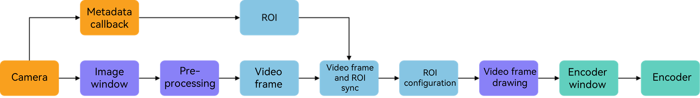
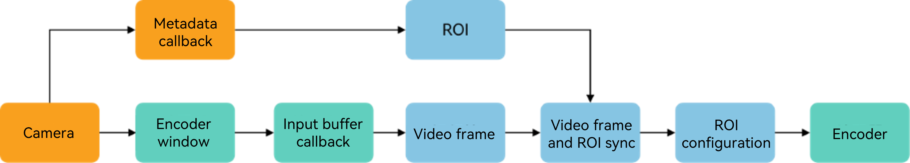
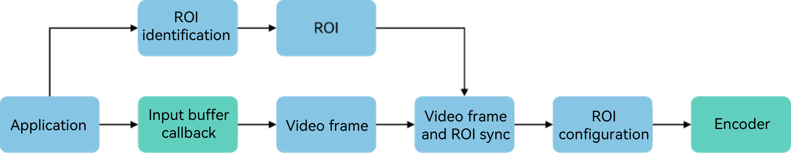

# ROI Video Encoding

<!--Kit: AVCodec Kit-->
<!--Subsystem: Multimedia-->
<!--Owner: @yang-xiaoyu5-->
<!--Designer: @dpy2650--->
<!--Tester: @cyakee-->
<!--Adviser: @w_Machine_cc-->

## Basic Concepts

Region of Interest (ROI) video encoding has been supported since API version 20. This feature is an advanced optimization technology extended based on the hardware H.264/H.265 encoding capability. Its core logic is to allocate more encoding resources to the specified key regions in the frame to achieve high-quality encoding. It ensures the clear presentation of content in ROI regions under limited bandwidth, which significantly enhances the overall visual experience.

You can define ROI regions in the video frame (for example, human faces in live streaming, license plates in video security, etc.), and adjust the encoding quality difference between ROI and non-ROI regions by setting quality offset parameters, thus realizing the differentiated allocation of encoding resources.

## When to Use

ROI video encoding applies to scenarios where the bit rate cannot meet the video quality requirements due to limited network bandwidth, and the key frame content (ROI regions) can be clearly defined. Examples include video calls, live video streaming, video security, and more.

Recommended ROI regions for each scenario are as follows:
- Live fashion shows: Set the anchor's facial region as the ROI to optimize facial details (e.g., skin tone and facial feature contours), enhancing the audience's immersive viewing experience.
- Outdoor live streaming: Set the anchor's main body/core shooting scenes (for example, natural scenery and core areas of sports event footage) as the ROI to ensure the clarity of core content when the mobile network bandwidth fluctuates.
- E-commerce live streaming: Set the product display area (for example, makeup color testing and electronic product details) as the ROI to clearly present the product's appearance, material, and functional details, helping to improve product conversion rates.
- Online course videos: Set the areas of courseware text, lecture notes charts, and blackboard writing content as the ROI to ensure the clear readability of knowledge points, reduce visual fatigue, and improve teaching effectiveness.
- Video security: Set key regions in the camera frame (for example, human faces, license plates, entrances and exits) as the ROI to improve the clarity of capture, facilitating subsequent identification and analysis.

To support different encoding scenarios, three types of ROI encoding development samples are provided. You can select samples based on the actual service and technical architecture.

| Scenario| Live Streaming/Video Call| Video Recording| Editing & Export/Content Publishing|
| :----: |:----:|:----:| :----: |
| **ROI information producer**| Camera| Camera| Application|
| **ROI information obtaining method**| Obtained via camera metadata callback| Obtained via camera metadata callback| Self-managed by the application|
| **Direct producer of encoded video frames**| Graphics| Camera| Application|
| **Encoding mode**| Surface mode| Surface mode| Buffer mode|
| **ROI management & alignment method**| Matched based on timestamp| Matched based on callback timing| Self-selected|
| **ROI parameter configuration method**| NativeBuffer metadata configuration| Encoding input parameter callback configuration| Encoding input buffer callback configuration|
| **Example**| [Configuring ROI via the NativeBuffer API in Surface Mode](#configuring-roi-via-the-nativebuffer-api-in-surface-mode)| [Configuring ROI via the Encoding Input Callback API in Surface Mode](#configuring-roi-via-the-encoding-input-callback-api-in-surface-mode)| [Configuring ROI in Buffer Mode](#configuring-roi-in-buffer-mode)|

## Constraints

**Supported encoders**: H.264 8-bit hardware encoding, H.265 8-bit hardware encoding, and H.265 10-bit hardware encoding

Supported bit rate control modes: variable bit rate (VBR), constant bit rate (CBR) and stable quality rate control (SQR)

**ROI detection and identification capability dependency**: The encoder does not have built-in ROI detection and recognition capability, so the effectiveness of ROI encoding technology relies on the ROI information input by developers. You can design and implement ROI recognition capability according to service scenarios, or reduce development costs by calling the face region information provided by the system camera module. For details, see the [camera face ROI acquisition example](../camera/native-camera-metadata.md#status-listening).

## Parameter Requirements

You candeliver ROI parameters in the form of strings, which must comply with the format: "Top,Left-Bottom,Right=DeltaQp". All parameters are integers.

- An ROI is a rectangular region. **Top**, **Left**, **Bottom**, and **Right** define the coordinates of the top-left and bottom-right corners of the ROI region in the image (as shown in figure 1).
- **DeltaQp** specifies the difference value of the encoding quantization parameter (QP). The larger the absolute value of **DeltaQp**, the greater the difference in encoding quality between the ROI region and non-ROI regions. A negative **DeltaQp** indicates that the encoding quality of the ROI region is better than that of non-ROI regions. The segment "**=DeltaQp**" can be omitted; if omitted, the default parameter (**=-3**) will be used.
- Multiple ROI parameters are connected by semicolons (;). An example of multi-ROI configuration is: **"Top1,Left1-Bottom1,Right1=DeltaQp1;Top2,Left2-Bottom2,Right2=DeltaQp2"**.
- A maximum of 6 ROI regions are supported per frame. Excess ROI regions will be ignored in the order of configuration. The total area of ROIs must not exceed 1/5 of the image area. The areas are accumulated in the order of configuration, and only the ROI regions whose accumulated area is within the limit will take effect.

**Figure 1: ROI coordinates and maximum allowed area ratio**

! [ROI coordinates and maximum allowed area ratio](figures/roi-size-and-coordinate.png)

## Effectiveness Mechanism

Two methods are supported for ROI configuration: **NativeBuffer metadata configuration** and **encoding input callback configuration**. The encoding input callback configuration method includes encoding input parameter callback (Surface mode) and encoding input buffer callback (Buffer mode).
- (Recommended) NativeBuffer metadata configuration: Starting from API version 22, the ROI enumeration **OH_REGION_OF_INTEREST_METADATA** of **OH_NativeBuffer_MetaDataKey** can be used to configure ROI parameters in the NativeBuffer metadata.
- Encoding input callback configuration method: The video encoding parameter **OH_MD_KEY_VIDEO_ENCODER_ROI_PARAMS** is used to configure ROI parameters in the encoding input callback.

**General effectiveness mechanism:**
1. ROI parameters support frame-by-frame delivery and take effect in real time. You do not need to query capabilities or configure global switches.
2. If the system encoder does not support ROI encoding, the encoder ignores ROI parameters and performs normal encoding.
3. The valid range of **DeltaQp** is [-51, 51]. The encoder overlays **DeltaQp** on the QP of the ROI region, and then limit the result to the range [minQp, maxQp] to obtain the final QP.
4. When no ROI parameters are configured for a frame, if ROI encoding takes effect for the previous frame, the ROI information of the previous frame is reused for ROI encoding of the current frame. If normal encoding is used for the previous frame, normal encoding is performed for the current frame.
5. If the ROI parameters configured for a frame fail to parse any valid ROI information, normal encoding will be performed.
6. If multiple ROI regions overlap, only the first configured ROI region will take effect at the overlapping area in the order of configuration.

**Unique mechanism of NativeBuffer metadata configuration method**: A maximum of 256 bytes of character length is supported; the excess part will be truncated.

**Differences in empty string processing:**
- NativeBuffer metadata configuration method: Empty strings are not allowed to be configured. An empty string is regarded as no ROI parameters configured, and the current frame will inherit the historical frame information for ROI encoding.
- Encoding input callback configuration method: Empty strings are allowed to be configured, but since no valid ROI information can be parsed, normal encoding will be performed actually.

> **NOTE**
>
> Due to the differences in empty string processing, you are advised not to configure empty strings. If you need to disable ROI encoding for a frame, you can configure a string without position information (for example, **"Clear"** or **";"**).

**Effectiveness priority**: If ROI parameters are configured via both methods for a frame, only the ROI parameters delivered via the encoding input callback configuration method will take effect, regardless of whether valid ROI information can be parsed from them.

## Development Example

### Configuring ROI via the NativeBuffer API in Surface Mode

The API for the system camera to obtain video frames and the API to obtain ROI information are two independent callback APIs. Data synchronization and matching must be performed based on the video timestamp and the ROI information timestamp, and ROI configuration for the corresponding frame must be completed before encoding.

> **NOTE**
>
> ROI information must be strictly aligned with the camera video frame information. In actual applications, if the two APIs are not processed synchronously, it may lead to misalignment of ROI calls. In high-load scenarios, an exception may also occur where the ROI timestamps of two consecutive frames are the same. Even if the above situations occur, the encoding function is not affected. You can determine whether to continue ROI encoding based on the evaluated encoding quality.

In specific service scenarios, the video frames obtained by the camera will undergo a series of image processing, such as beautification, filtering, and enhancement (as shown in figure 2). You can add or delete modules based on the actual service requirements.

**Figure 2: ROI configuration process via the NativeBuffer metadata API**



The development procedure is as follows:

1. Link dynamic libraries in **CMakeList.txt**.

   ```txt
   set(BASE_LIBRARY
       libnative_media_codecbase.so libnative_media_core.so libnative_media_venc.so libnative_window.so
       libnative_buffer.so libnative_image.so libEGL.so libGLESv3.so
   )
   target_link_libraries(recorder PUBLIC ${BASE_LIBRARY})
   ```
   > **NOTE**
   >
   > Replace **recorder** with the actual target name of the CMake project.
   >

2. Listen for the camera metadata callback API to obtain the face position information.

   For details, see [Camera Metadata Status Listening](../camera/camera-metadata.md#status-listening).
   ```ts
   import { camera } from '@kit.CameraKit'
   import { BusinessError } from '@kit.BasicServicesKit'
   import recorder from 'librecorder.so';

   interface FaceBoundingBox {
       topLeftX: number;
       topLeftY: number;
       width: number;
       height: number;
   }
   
   onMetadataObjectsAvailable(metadataOutput: camera.MetadataOutput): void {
       metadataOutput.on('metadataObjectsAvailable', (err: BusinessError, metadataObjectArr: Array<camera.MetadataObject>) => {
           if (err !== undefined && err.code !== 0) {
               return;
           }
           const faceBoundingBoxes: Array<FaceBoundingBox> = [];
           let unifiedTimestamp = 0;
           let timestampSet = false;
    
           for (const metadataObject of metadataObjectArr) {
               if (metadataObject.type === camera.MetadataObjectType.FACE_DETECTION) {
                   if (!timestampSet) {
                       unifiedTimestamp = metadataObject.timestamp;
                       timestampSet = true;
                   }
                   faceBoundingBoxes.push({
                       topLeftX: metadataObject.boundingBox.topLeftX,
                       topLeftY: metadataObject.boundingBox.topLeftY,
                       width: metadataObject.boundingBox.width,
                       height: metadataObject.boundingBox.height
                   })
               }
           }
           if (faceBoundingBoxes.length > 0) {
               // Deliver the face position information to the Native layer (this.nativeRecorderObj is a native-layer instance).
               recorder.UpdateFaceRect(this.nativeRecorderObj, unifiedTimestamp, faceBoundingBoxes);
           }
       });
   }
   ```

3. The Native layer parses the face position information transferred by the TS layer.

   ```c++
   struct FaceRect {
       double topLeftX;
       double topLeftY;
       double width;
       double height;
   };

   static napi_value UpdateFaceRect(napi_env env, napi_callback_info info)
   {
       size_t argc = 3;
       napi_value args[3] = {nullptr};
       napi_get_cb_info(env, info, &argc, args, nullptr, nullptr);
       if (argc < 3) {
           return nullptr;
       }
       // Parse the native instance.
       int64_t addrValue = 0;
       bool flag = false;
       napi_get_value_bigint_int64(env, args[0], &addrValue, &flag);
       Recorder *recorder = reinterpret_cast<Recorder *>(addrValue);
       if (recorder == nullptr) {
           return nullptr;
       }
       // Parse the timestamp.
       int64_t timestamp = 0;
       napi_get_value_int64(env, args[1], &timestamp);
       // Parse the face rectangle.
       napi_value faceRectArray = args[2];
       bool isArray;
       napi_is_array(env, faceRectArray, &isArray);
       if (!isArray) {
           return nullptr;
       }
       uint32_t arrayLength;
       napi_get_array_length(env, faceRectArray, &arrayLength);
       std::vector<FaceRect> faceRectVec;
       for (uint32_t i = 0; i < arrayLength; i++) {
           FaceRect item = {0};
           napi_value faceRectObj;
           napi_get_element(env, faceRectArray, i, &faceRectObj);
           napi_value propValue;
           napi_get_named_property(env, faceRectObj, "topLeftX", &propValue);
           napi_get_value_double(env, propValue, &item.topLeftX);
           napi_get_named_property(env, faceRectObj, "topLeftY", &propValue);
           napi_get_value_double(env, propValue, &item.topLeftY);
           napi_get_named_property(env, faceRectObj, "width", &propValue);
           napi_get_value_double(env, propValue, &item.width);
           napi_get_named_property(env, faceRectObj, "topLeftX", &propValue);
           napi_get_value_double(env, propValue, &item.height);
           faceRectVec.push_back(item);
       }
       recorder->ConvertToRoi(timestamp, faceRectVec);
       return nullptr;
   }
   ```

4. Convert the ROI information into a character string and save the string.

   ```c++
   #include <map>
   #include <mutex>
   #include <sstream>
   #include <string>

   const int width = 1920; // Video frame width.
   const int height = 1080; // Video frame height.
   const int qpOffset = -6; // QP offset.
   std::map<int64_t, std::string> g_roiStrMap; // Timestamp and ROI information mapping.
   std::mutex g_roiMutex;

   void Recorder::ConvertToRoi(int64_t timestamp, std::vector<FaceRect>* faceRectVec)
   {   
       std::string mergedRoiStr;
       // Traverse all faceRect objects.
       for (const auto& faceRect : faceRectVec) {
           // Convert normalized coordinates to pixel coordinates.
           int left = static_cast<int32_t>(faceRect.topLeftX * width);
           int top = static_cast<int32_t>(faceRect.topLeftY * height);
           int right = static_cast<int32_t>(faceRect.width * width) + left;
           int bottom = static_cast<int32_t>(faceRect.height * height) + top;

           // Concatenate the format string for the current face frame (top,left-bottom,right=QpOffset;).
           std::ostringstream oss;
           oss << mergedRoiStr; // Concatenate the existing segments.
           oss << top << "," << left << "-" << bottom << "," << right << "=" << qpOffset << ";";
           mergedRoiStr = oss.str();
       }

       if (!mergedRoiStr.empty()) {
           std::lock_guard<std::mutex> lock(g_roiMutex);
           // In this scenario, the video frame timestamp can be obtained for matching.
           g_roiStrMap[timestamp] = mergedRoiStr;
       }
   }
   ```

5. Look up the matching ROI information based on the video frame timestamp.

   Include required header files.
   ```c++
   #include <EGL/egl.h>
   #include <EGL/eglext.h>
   #include <GLES3/gl3.h>
   #include <GLES2/gl2ext.h>
   #include <native_image/native_image.h>
   ```
   
   Create a **NativeImage** instance to receive video frames.
   ```c++
   GLuint textureId;
   glGenTextures(1, &textureId);
   // Create a NativeImage instance and associate it with the texture.
   OH_NativeImage* image = OH_NativeImage_Create(textureId, GL_TEXTURE_EXTERNAL_OES);
   ```

   Obtain the **NativeWindow** corresponding to the **NativeImage** instance as the target window of the camera preview stream, and register callback **OH_OnFrameAvailableListener** via **OH_NativeImage_SetOnFrameAvailableListener** to obtain video frame updates.
   ```c++
   // Update the NativeImage instance after the callback.
   int32_t ret = OH_NativeImage_UpdateSurfaceImage(image);
   if (ret != 0) {
       // Handle exceptions.
   }
   // Obtain the video frame timestamp.
   int64_t imageTimeStamp = OH_NativeImage_GetTimestamp(image);
   // Use the video frame timestamp to find the ROI information.
   std::lock_guard<std::mutex> lock(g_roiMutex);
   auto it = g_roiStrMap.find(imageTimeStamp);
   std::string noRoiStr = ";"; // Similar to metadata configuration, a non-empty invalid string can be configured to disable ROI encoding for the current video frame.
   std::string roiInfo = (it != g_roiStrMap.end()) ? it->second : noRoiStr;
   ```

6. Set the ROI information to the NativeBuffer metadata of the video frame.
   
   Include required header files.
   ```c++
   #include <multimedia/player_framework/native_avcodec_videoencoder.h>
   #include <multimedia/player_framework/native_avcodec_base.h>
   #include <native_window/external_window.h> 
   #include <native_buffer/native_buffer.h>
   ```

   After a series of EGL processing, the video frame texture used for encoding is generated. You need to use the **eglSwapBuffers** function to draw the texture into the input **NativeWindow** of the encoder. The following describes how to obtain the **NativeWindow**.
   ```c++
   OH_AVCodec *codec = OH_VideoEncoder_CreateByMime(OH_AVCODEC_MIMETYPE_VIDEO_HEVC);
   OHNativeWindow *nativeWindow = nullptr;
   OH_VideoEncoder_GetSurface(codec, &nativeWindow);
   ```

   Obtain the latest NativeBuffer and configure ROI information before drawing. For details about the drawing process, see [OpenGL ES Example](../../../application-dev/reference/native-lib/opengles.md#example). Finally, send the drawn data to the encoder for encoding via **eglSwapBuffers**.
   ```c++
   int fenceFd = -1;
   OHNativeWindowBuffer *winBuffer = nullptr;
   // Request a frame of OHNativeWindowBuffer from the surface.
   int32_t ret = OH_NativeWindow_NativeWindowRequestBuffer(nativeWindow, &winBuffer, &fenceFd);
   if (ret != 0) {
       // Handle exceptions.
   }
   // Convert the OHNativeWindowBuffer to NativeBuffer.
   OH_NativeBuffer *nativeBuffer = nullptr;
   OH_NativeBuffer_FromNativeWindowBuffer(winBuffer, &nativeBuffer);
   // Configure the ROI information to the NativeBuffer metadata.
   int32_t ret = OH_NativeBuffer_SetMetaDataValue(nativeBuffer,
       OH_NativeBuffer_MetaDataKey::OH_REGION_OF_INTEREST_METADATA, roiInfo.size,
       reinterpret_cast<uint8_t *>(roiInfo.data()));
   if (ret != 0) {
       // Handle exceptions.
   }
   ```

### Configuring ROI via the Encoding Input Callback API in Surface Mode

In this scenario, video frames are directly sent to the encoder window (as shown in figure 3).
The timestamps of the video frames output by the camera and the metadata (if any) are close. After the callback for encoding input parameters is set, the callback is triggered when the encoder receives video frames. In the callback, if the ROI information is successfully obtained, the video frame contains the matched ROI information. If the obtaining times out, the video frame does not contain the matched ROI information.

**Figure 3: ROI configuration process via the encoding input parameter callback API**



The development procedure is as follows:

1. Link dynamic libraries in **CMakeList.txt**.

   ```txt
   set(BASE_LIBRARY
       libnative_media_codecbase.so libnative_media_core.so libnative_media_venc.so
   )
   target_link_libraries(recorder PUBLIC ${BASE_LIBRARY})
   ```
   > **NOTE**
   >
   > Replace **recorder** with the actual target name of the CMake project.
   >

2. Listen for the camera metadata callback API to obtain the face position information. 

   Same as step 2 in [Configuring ROI via the NativeBuffer API in Surface Mode](#configuring-roi-via-the-nativebuffer-api-in-surface-mode).

3. The Native layer parses the face position information transferred by the TS layer.

   Same as step 3 in [Configuring ROI via the NativeBuffer API in Surface Mode](#configuring-roi-via-the-nativebuffer-api-in-surface-mode).

4. Convert the ROI information into a character string and save the string.

   The timestamp field of video frames is not included in the design of the encoding parameter callback. To facilitate subsequent alignment, it is necessary to use a thread-safe first-in-first-out (FIFO) queue to manage ROI information. The following is a reference implementation.
   ```c++
   // RoiFifoQueue.h
   #include <queue>
   #include <string>
   #include <mutex>
   #include <condition_variable>
   #include <chrono>

   class RoiFifoQueue {
   public:
       void push(const std::string& roiStr) {
           std::lock_guard<std::mutex> lock(mtx);
           roiQueue.push(roiStr);
           cv.notify_one(); // Notify the thread that waits for the data.
       }

       bool pop(std::string& outRoiStr, const std::chrono::milliseconds& timeout) {
           std::unique_lock<std::mutex> lock(mtx);
           if (!cv.wait_for(lock, timeout, [this]() {
               return !roiQueue.empty() || isStopped;
           })) {
               return false; // No ROI information is returned if a timeout occurs.
           }
           if (isStopped || roiQueue.empty()) {
               return false;
           }
           outRoiStr = roiQueue.front();
           roiQueue.pop();
           return true;
       }

       void clear() {
           std::lock_guard<std::mutex> lock(mtx);
           while (!roiQueue.empty()) {
               roiQueue.pop();
           }
       }

       void stop() {
           std::lock_guard<std::mutex> lock(mtx);
           isStopped = true;
           cv.notify_all(); // Wake up all waiting threads.
       }

       ~RoiFifoQueue() {
           stop();
       }
   };
   private:
       std::queue<std::string> roiQueue;    // Store the merged complete ROI string.
       std::mutex mtx;                      // Mutex lock to protect the queue.
       std::condition_variable cv;          // Condition variable used for timeout waiting.
       bool isStopped = false;              // Stop flag.
   ```

   Convert the data into the ROI information format and store it in the queue.

   ```c++
   #include <sstream>
   #include "RoiFifoQueue.h"

   const int width = 1920; // Video frame width.
   const int height = 1080; // Video frame height.
   const int qpOffset = -6; // QP offset.
   RoiFifoQueue g_roiStrQueue;

   void Recorder::ConvertToRoi(int64_t timestamp, std::vector<FaceRect>* faceRectVec)
   {   
       std::string mergedRoiStr;
       // Traverse all faceRect objects.
       for (const auto& faceRect : faceRectVec) {
           // Convert normalized coordinates to pixel coordinates.
           int left = static_cast<int32_t>(faceRect.topLeftX * width);
           int top = static_cast<int32_t>(faceRect.topLeftY * height);
           int right = static_cast<int32_t>(faceRect.width * width) + left;
           int bottom = static_cast<int32_t>(faceRect.height * height) + top;

           // Concatenate the format string for the current face frame (top,left-bottom,right=QpOffset;).
           std::ostringstream oss;
           oss << mergedRoiStr; // Concatenate the existing segments.
           oss << top << "," << left << "-" << bottom << "," << right << "=" << qpOffset << ";";
           mergedRoiStr = oss.str();
       }

       if (!mergedRoiStr.empty()) {
           std::lock_guard<std::mutex> lock(g_roiMutex);
           // In this scenario, the video frame timestamp can be obtained for matching.
           g_roiStrQueue.push(mergedRoiStr);
       }
   }
   ```

5. Configure ROI information in the encoding input parameter callback.

   Include required header files.
   ```c++
   #include <multimedia/player_framework/native_avcodec_videoencoder.h>
   #include <multimedia/player_framework/native_avcodec_base.h>
   #include <multimedia/player_framework/native_avformat.h>
   #include <multimedia/player_framework/native_avbuffer.h>
   ```

   Create an encoder.
   ```c++
   OH_AVCodec *codec = OH_VideoEncoder_CreateByMime(OH_AVCODEC_MIMETYPE_VIDEO_HEVC);
   ```

   For details about the video encoding procedure, see [Synchronous Video Encoding](video-encoding.md). The following describes only ROI encoding.
   ```c++
   const std::chrono::milliseconds ROI_WAIT_TIMEOUT = std::chrono::milliseconds(4); // 4 ms timeout.
   static void OnNeedInputParameter(OH_AVCodec *codec, uint32_t index, OH_AVFormat *parameter, void *userData)
   {
       (void)codec;
       (void)userData;
       std::string roiInfo = ""; 
       if (!g_roiStrQueue.pop(roiInfo, ROI_WAIT_TIMEOUT)) {
           roiInfo = ";"; // Align with the NativeBuffer path.
       }
       // If ROI configuration is found, ROI encoding takes effect. Otherwise, normal encoding takes effect.
       OH_AVFormat_SetStringValue(parameter, OH_MD_KEY_VIDEO_ENCODER_ROI_PARAMS, roiInfo.c_str());
       OH_VideoEncoder_PushInputParameter(codec, index);
   }

   // Register the per-frame parameter callback.
   OH_VideoEncoder_OnNeedInputParameter inParaCb = OnNeedInputParameter;
   OH_VideoEncoder_RegisterParameterCallback(codec, inParaCb, nullptr);
   ```

### Configuring ROI in Buffer Mode

In this scenario, video frames and ROI information are provided by the application, and encoding is performed in buffer mode. You can align the ROI with video frames based on the timestamp or callback timing, and configure ROI parameters in the encoding input buffer callback (as shown in figure 4).

**Figure 4: ROI configuration process via the encoding input buffer callback API**



The preparation procedure is the same as steps 1 to 4 in [Configuring ROI via the Encoding Input Callback API in Surface Mode](#configuring-roi-via-the-encoding-input-callback-api-in-surface-mode). The following only describes the configuration differences.

Configure ROI information in the encoding input buffer callback.

```c++
static void OnNeedInputBuffer(OH_AVCodec *codec, uint32_t index, OH_AVBuffer *buffer, void *userData)
{
    (void)codec;
    (void)userData;
    auto format = std::shared_ptr<OH_AVFormat>(OH_AVBuffer_GetParameter(buffer), OH_AVFormat_Destroy);
    if (format == nullptr) {
        // Handle exceptions.
    }
    std::string roiInfo = ""; 
    if (!g_roiStrQueue.pop(roiInfo, ROI_WAIT_TIMEOUT)) {
        roiInfo = ";"; // Align with the NativeBuffer path.
    }
    OH_AVFormat_SetStringValue(format.get(), OH_MD_KEY_VIDEO_ENCODER_ROI_PARAMS, roiInfo.c_str());

    // Video frame filling is required, which is omitted here.
    // Notify the encoder that the buffer input is complete.
    OH_VideoEncoder_PushInputBuffer(codec, index);
}

static void OnStreamChanged(OH_AVCodec *codec, OH_AVFormat *format, void *userData)
{
    // Only the definition is provided here, and the implementation is omitted.
}

static void OnError(OH_AVCodec *codec, int32_t errorCode, void *userData)
{
    // Only the definition is provided here, and the implementation is omitted.
}

static void OnNewOutputBuffer(OH_AVCodec *codec, uint32_t index, OH_AVBuffer *buffer, void *userData)
{
    // Only the definition is provided here, and the implementation is omitted.
}

OH_AVCodecCallback cb = {&OnError, &OnStreamChanged, &OnNeedInputBuffer, &OnNewOutputBuffer};
OH_AVErrCode ret = OH_VideoEncoder_RegisterCallback(videoEnc, cb, nullptr);
```
