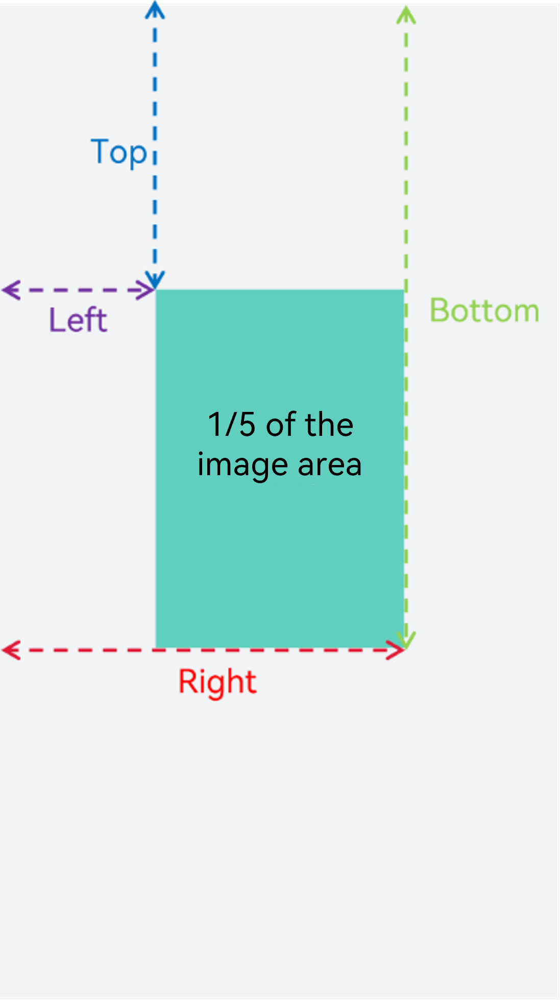
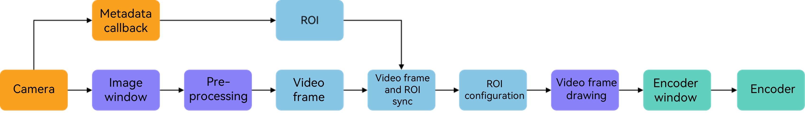
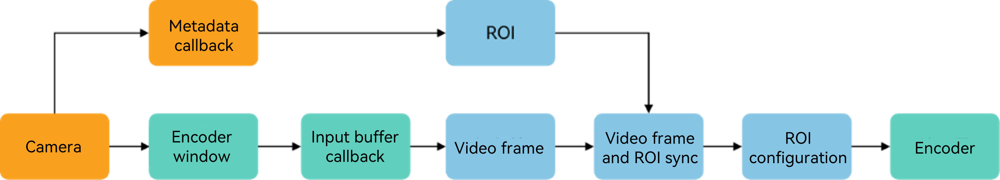
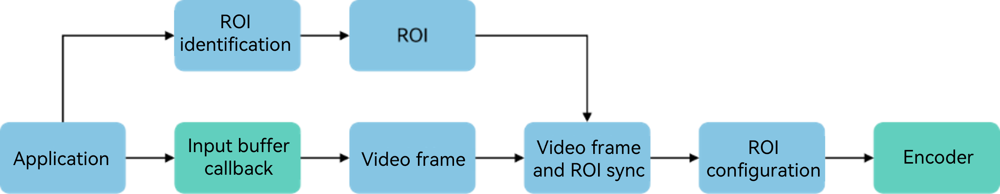

# ROI Video Encoding

<!--Kit: AVCodec Kit-->
<!--Subsystem: Multimedia-->
<!--Owner: @yang-xiaoyu5-->
<!--Designer: @dpy2650--->
<!--Tester: @cyakee-->
<!--Adviser: @w_Machine_cc-->
<!-- md-trans-meta sourceCommit=85acaeeff256506c8e1cb0a264579789c64b9379 translatedAt=2026-09-16T02:56:24.908Z pushedAt=2026-09-16T08:06:26.150Z -->

## Basic Concepts

Region of Interest (ROI) video encoding has been supported since API version 20. This feature is an advanced optimization technology extended based on the hardware H.264/H.265 encoding capability. Its core logic is to allocate more encoding resources to the specified key regions in the frame to achieve high-quality encoding, which ensures the clear presentation of content in ROI regions under limited bandwidth and significantly enhances the overall visual experience.

You can define ROI regions in the video frame (for example, human faces in live streaming, license plates in video security, etc.), and adjust the encoding quality difference between ROI and non-ROI regions by setting quality offset parameters, thus realizing the differentiated allocation of encoding resources.

## When to Use

ROI video encoding applies to scenarios where the bit rate cannot meet the video quality requirements due to limited network bandwidth, and the key frame content (ROI regions) can be clearly defined. Examples include video calls, live video streaming, video security, and more.

Recommended ROI regions for each scenario are as follows:
- Live fashion shows: Set the anchor's facial region as the ROI to optimize facial details (e.g., skin tone and facial feature contours), enhancing the audience's immersive viewing experience.
- Outdoor live streaming: Set the anchor's main body/core shooting scenes (for example, natural scenery and core areas of sports event footage) as the ROI to ensure the clarity of core content when the mobile network bandwidth fluctuates.
- E-commerce live streaming: Set the product display area (for example, makeup color testing and electronic product details) as the ROI to clearly present the product's appearance, material, and functional details, helping to drive product sales.
- Online course videos: Set the areas of courseware text, lecture notes charts, and blackboard writing content as the ROI to ensure the clear readability of knowledge points, reduce visual fatigue, and improve teaching effectiveness.
- Video security: Set key regions in the camera frame (for example, human faces, license plates, entrances and exits) as the ROI to improve the clarity of capture, facilitating subsequent identification and analysis.

Based on the encoding mode and ROI configuration method, the ROI encoding development examples are divided into two types: [configuring ROI via NativeBuffer metadata (recommended)](#method-1-configuring-roi-via-nativebuffer-metadata-recommended) and [configuring ROI via the encoding input parameter callback](#method-2-configuring-roi-via-the-encoding-input-parameter-callback). You can choose based on your actual business and technical architecture.

| Scenario| Live Streaming/Video Call| Video Recording| Editing & Export/Content Publishing|
| :----: |:----:|:----:| :----: |
| **ROI information producer**| Camera| Camera| App|
| **ROI Information Retrieval Method** | Extracted from video frame NativeBuffer metadata | Extracted from video frame NativeBuffer metadata | Self-managed by the app |
| **Direct Producer of Encoded Video Frames** | Graphics | Graphics | App |
| **Encoding mode**| Surface mode| Surface mode| Buffer mode|
| **ROI Parameter Configuration Method** | NativeBuffer metadata configuration (recommended) | Encoding input parameter callback configuration | Encoding input buffer callback configuration |
| **Development Example** | [Method 1: Configuring ROI via NativeBuffer Metadata (Recommended)](#method-1-configuring-roi-via-nativebuffer-metadata-recommended) | [Surface Mode: Encoding Input Parameter Callback](#surface-mode-encoding-input-parameter-callback) | [Buffer Mode: Encoding Input Buffer Callback](#buffer-mode-encoding-input-buffer-callback) |

> **NOTE**
>
> - Both live streaming and recording scenarios use Surface mode encoding. The only difference lies in the ROI configuration method. [Method 1: Configuring ROI via NativeBuffer Metadata (Recommended)](#method-1-configuring-roi-via-nativebuffer-metadata-recommended) is simple to implement and naturally aligned with the encoded frames.
> - If the metadata of the encoder input buffer cannot be modified during frame processing (for example, when camera frames are directly sent to the encoder Surface), you can choose the encoding input parameter callback configuration method.

## Constraints

**Supported encoders**: H.264 8-bit hardware encoding, H.265 8-bit hardware encoding, and H.265 10-bit hardware encoding

**Supported bit rate control modes:** variable bit rate (VBR), constant bit rate (CBR) and stable quality rate control (SQR)

**Dependent on ROI detection and recognition capability:** The encoder does not have the ROI detection and recognition capability, so the ROI encoding technology takes effect depending on the ROI information you input. You can design and implement the ROI recognition capability based on your business scenario, or obtain the ROI region through the face region information (metadata) natively provided by the system camera module to reduce development costs. For metadata configuration and retrieval, see [Metadata (ArkTS)](../camera/camera-metadata.md) and [Metadata (C/C++)](../camera/native-camera-metadata.md). For the development steps of extracting ROI information from the video frame NativeBuffer metadata, see [Method 1: Configuring ROI via NativeBuffer Metadata (Recommended)](#method-1-configuring-roi-via-nativebuffer-metadata-recommended).

## Parameter Requirements

ROI configuration parameters are ultimately delivered to the encoder in the form of strings. Starting from API version 26.0.0, the key-value pair format is supported, while the legacy numeric-only format remains compatible. All coordinate parameters and numeric parameters are integers.

When ROI data comes from the NativeBuffer metadata of a camera frame, you do not need to manually concatenate strings. You can use the `OH_VideoMetadata_GetRoiCount`, `OH_VideoMetadata_ParseRoiString`, and `OH_VideoMetadata_AppendRoiString` APIs to directly parse region information from the ROI metadata of the camera frame, set key-value pair parameters (such as `OH_MD_KEY_VIDEO_METADATA_ROI_DELTA_QP` and `OH_MD_KEY_VIDEO_METADATA_ROI_SEM_LABEL`), and automatically generate a configuration string that meets the encoder requirements.

**String format:**

- Key-value pair format (recommended): `Top,Left-Bottom,Right=dqp:-6,slb:1`
- Numeric-only format (legacy compatible): `Top,Left-Bottom,Right=DeltaQp`

**Rectangle region definition:**
An ROI is a rectangular region. **Top**, **Left** and **Bottom**, **Right** define the coordinates of the top-left and bottom-right corners of the ROI region in the image (as shown in figure 1).

**Key-value pair parameters:**

| Parameter | Description | Value Range | Mandatory | Default Behavior |
| :----: | :----: | :----: |:----:|:----------------:|
| dqp | Quantization parameter offset (DeltaQP) | [-51, 51] | No | When not set, the encoder uses the default QP strategy (=-3). |
| slb | Semantic Label | 0 (unspecified) or 1 (face) | No | This parameter is only used for developers to distinguish ROI region types and does not affect encoding behavior. |

- A negative dqp value indicates that the encoding quality of the ROI region is better than that of non-ROI regions. The larger the absolute value, the greater the quality difference.
- The slb value corresponds to the [OH_VideoMetadataRoiSemanticLabel](../../reference/apis-avcodec-kit/capi-native-avcodec-videobase-h.md#oh_videometadataroisemanticlabel) enumeration: `OH_VIDEO_METADATA_ROI_SEM_LABEL_OTHER` (0) indicates an unspecified region type, and `OH_VIDEO_METADATA_ROI_SEM_LABEL_FACE` (1) indicates a face region.
- Multiple ROI parameters are connected by semicolons (;). An example of multi-ROI configuration is `100,50-300,200=dqp:-6,slb:1;400,30-600,200=dqp:-3`.

**Quantity and area constraints:**
- A maximum of 6 ROI regions are supported per frame. Excess ROI regions will be ignored in the order of configuration.
- The total ROI area must not exceed 1/5 of the image area. The areas are accumulated in the order of configuration, and only the ROI regions whose cumulative area stays within the limit take effect.

**Figure 1: ROI coordinates and maximum allowed area ratio**



## Effectiveness Mechanism

The following two methods are supported for configuring ROI:
- [Method 1: Configuring ROI via NativeBuffer Metadata (Recommended)](#method-1-configuring-roi-via-nativebuffer-metadata-recommended): Starting from API version 22, the ROI enumeration `OH_REGION_OF_INTEREST_METADATA` of `OH_NativeBuffer_MetaDataKey` can be used to configure ROI parameters in the NativeBuffer metadata.
- [Method 2: Configuring ROI via the Encoding Input Parameter Callback](#method-2-configuring-roi-via-the-encoding-input-parameter-callback): Use the video encoding parameter `OH_MD_KEY_VIDEO_ENCODER_ROI_PARAMS` to configure ROI parameters in the encoding input callback, including the encoding input parameter callback (Surface mode) and the encoding input buffer callback (Buffer mode).

**General effectiveness mechanism:**
1. ROI parameters support frame-by-frame delivery and take effect in real time. You do not need to query capabilities or configure global switches.
2. If the system encoder does not support ROI encoding, the encoder ignores ROI parameters and performs normal encoding.
3. The valid range of **DeltaQp** is [-51, 51]. The encoder overlays **DeltaQp** on the QP of the ROI region, and then limits the result to the range [minQp, maxQp] to obtain the final QP.
4. When no ROI parameters are configured for a frame, if ROI encoding takes effect for the previous frame, the ROI information of the previous frame is reused for ROI encoding of the current frame. If normal encoding is used for the previous frame, normal encoding is performed for the current frame.
5. If the ROI parameters configured for a frame fail to parse any valid ROI information, normal encoding will be performed.
6. If multiple ROI regions overlap, only the first configured ROI region will take effect at the overlapping area in the order of configuration.

**Mechanism unique to method 1:** A maximum of 256 bytes of characters is supported, and the excess part is truncated.

**Empty string handling differences:**
- Method 1: Empty strings are not allowed to be configured. This is regarded as having no ROI parameters configured, and the current frame inherits the historical frame information for ROI encoding.
- Method 2: Empty strings are allowed to be configured, but since no valid ROI information can be parsed, normal encoding will be performed actually.

> **NOTE**
>
> Due to the differences in empty string processing, you are advised not to configure empty strings. If you need to disable ROI encoding for a frame, you can configure a string without position information (for example, **"Clear"** or **";"**).

**Effectiveness priority**: If ROI parameters are configured via both methods for a frame, only the ROI parameters delivered via the encoding input callback configuration method will take effect, regardless of whether valid ROI information can be parsed from them.

## Method 1: Configuring ROI via NativeBuffer Metadata (Recommended)

Surface mode and Buffer mode share the same ROI information acquisition and assembly process. The difference lies in how ROI is configured to the encoder.

When the camera outputs a video frame, if an ROI region (such as a face) is detected, the ROI information is written into the NativeBuffer metadata of the frame. You can directly extract it from each frame without additional callback APIs or timestamp matching. For details, see [OH_NativeBuffer_MetadataKey](../../reference/apis-arkgraphics2d/capi-buffer-common-h.md#oh_nativebuffer_metadatakey).

In surface mode, the camera outputs video frames to the surface of `OH_NativeImage`. In the frame processing thread, you extract ROI information from the NativeBuffer metadata of each frame, assemble it into a configuration string, and then write the ROI string into the NativeBuffer metadata of the encoder input frame, thereby delivering the ROI to the encoder frame by frame (as shown in figure 2).

**Figure 2: ROI configuration process via the NativeBuffer metadata API**



The development procedure is as follows:

1. Link dynamic libraries in `CMakeLists.txt`.

   <!-- @[roi_cmake_link_libraries](https://gitcode.com/openharmony/applications_app_samples/blob/master/code/DocsSample/Media/AVCodec/ROISample/entry/src/main/cpp/CMakeLists.txt) -->

   ``` Text
   set(BASE_LIBRARY
       libace_napi.z.so libEGL.so libGLESv3.so libace_ndk.z.so libuv.so libhilog_ndk.z.so
       libnative_media_codecbase.so libnative_media_core.so libnative_media_vdec.so libnative_window.so
       libnative_media_venc.so libnative_media_acodec.so libnative_media_avdemuxer.so libnative_media_avsource.so
       libnative_media_avmuxer.so libohaudio.so libnative_buffer.so libnative_vsync.so libnative_image.so libdeviceinfo_ndk.z.so
   )
   
   add_library(recorder SHARED recorder/RecorderNative.cpp
                               recorder/Recorder.cpp
                               capbilities/codec/Muxer.cpp
                               capbilities/codec/VideoEncoder.cpp
                               capbilities/codec/AudioCapturer.cpp
                               capbilities/codec/AudioEncoder.cpp
                               capbilities/codec/CodecCallback.cpp
                               capbilities/render/egl_render_context.cpp
                               capbilities/render/render_thread.cpp
                               capbilities/render/shader_program.cpp
                               common/RoiQueue.cpp
   )
   
   target_link_libraries(recorder PUBLIC ${BASE_LIBRARY} player)
   ```

   > **NOTE**
   >
   > The names **recorder** and **player** are examples only. Replace them with the actual target name of your CMake project.

2. Extract ROI information from the NativeBuffer metadata of the video frame.

   When the camera outputs a video frame, if an ROI region (such as a face) is detected, the ROI information is written into the NativeBuffer metadata of the frame. You can extract the raw ROI string through `OH_NativeBuffer_GetMetadataValue`.

   <!-- @[roi_buffer_roi_extraction](https://gitcode.com/openharmony/applications_app_samples/blob/master/code/DocsSample/Media/AVCodec/ROISample/entry/src/main/cpp/capbilities/render/render_thread.cpp) -->

   ``` C++
   OH_NativeBuffer *nativeBuffer = nullptr;
   int32_t ret = OH_NativeBuffer_FromNativeWindowBuffer(InBuffer, &nativeBuffer);
   if (ret == 0 && nativeBuffer != nullptr) {
       int32_t roiSize = 0;
       uint8_t *roiData = nullptr;
       ret = OH_NativeBuffer_GetMetadataValue(nativeBuffer,
           OH_NativeBuffer_MetadataKey::OH_REGION_OF_INTEREST_METADATA, &roiSize, &roiData);
       if (ret == 0 && roiData != nullptr && roiSize > 0) {
           return std::string(reinterpret_cast<char*>(roiData), roiSize);
       }
   }
   ```

   > **NOTE**
   >
   > `InBuffer` is the camera frame obtained from `OH_NativeImage` through `OH_NativeImage_AcquireNativeWindowBuffer`. The ROI information output by the camera has already been written into the metadata of this buffer. For details about NativeImage creation and the frame receiving mechanism, see [Surface Mode](video-encoding.md#surface-mode) in the video encoding development guide.

3. Use the `OH_VideoMetadata` API to assemble the ROI configuration string.

   The extracted raw ROI string contains region coordinate information. You need to use the `OH_VideoMetadata_GetRoiCount`, `OH_VideoMetadata_ParseRoiString`, and `OH_VideoMetadata_AppendRoiString` APIs to parse the raw ROI and append the DeltaQP parameter, generating a complete ROI configuration string (for example, `"100,50-300,200=dqp:-6"`).

   <!-- @[roi_buffer_roi_assembly](https://gitcode.com/openharmony/applications_app_samples/blob/master/code/DocsSample/Media/AVCodec/ROISample/entry/src/main/cpp/capbilities/render/render_thread.cpp) -->

   ``` C++
   if (currentRoiStr.empty()) {
       return "";
   }
   uint32_t roiCount = 0;
   OH_AVErrCode roiRet = OH_VideoMetadata_GetRoiCount(currentRoiStr.c_str(), &roiCount);
   if (roiRet != AV_ERR_OK || roiCount == 0) {
       return "";
   }
   std::vector<OH_AVFormat*> parsedFormats(roiCount, nullptr);
   uint32_t actualCount = 0;
   roiRet = OH_VideoMetadata_ParseRoiString(currentRoiStr.c_str(), parsedFormats.data(),
                                            roiCount, &actualCount);
   if (roiRet != AV_ERR_OK || actualCount == 0) {
       return "";
   }
   char *assembledStr = nullptr;
   for (uint32_t i = 0; i < actualCount; i++) {
       if (parsedFormats[i] != nullptr) {
           OH_AVFormat_SetIntValue(parsedFormats[i], OH_MD_KEY_VIDEO_METADATA_ROI_DELTA_QP,
               ROI_DELTA_QP);
           OH_VideoMetadata_AppendRoiString(&assembledStr, parsedFormats[i]);
           OH_AVFormat_Destroy(parsedFormats[i]);
           parsedFormats[i] = nullptr;
       }
   }
   std::string result;
   if (assembledStr != nullptr) {
       result = std::string(assembledStr);
       free(assembledStr);
   }
   ```

   > **NOTE**
   >
   > `OH_VideoMetadata_AppendRoiString` internally performs memory expansion. The returned C-style string must be released by calling `free()`.

4. Write the ROI configuration string into the NativeBuffer metadata of the encoder input frame.

   In surface mode, the encoder receives video frames through the surface. You need to first request a buffer from the encoder surface through `OH_NativeWindow_NativeWindowRequestBuffer`, and then write the assembled ROI string into the NativeBuffer metadata of that buffer.

   <!-- @[roi_nativebuffer_metadata_config](https://gitcode.com/openharmony/applications_app_samples/blob/master/code/DocsSample/Media/AVCodec/ROISample/entry/src/main/cpp/capbilities/render/render_thread.cpp) -->

   ``` C++
   OH_NativeBuffer *encoderNativeBuffer = nullptr;
   int32_t ret = OH_NativeBuffer_FromNativeWindowBuffer(OutBufferEncoder, &encoderNativeBuffer);
   if (ret == 0 && encoderNativeBuffer != nullptr) {
       int32_t roiStrSize = static_cast<int32_t>(assembledRoiStr.size());
       ret = OH_NativeBuffer_SetMetadataValue(encoderNativeBuffer,
           OH_NativeBuffer_MetadataKey::OH_REGION_OF_INTEREST_METADATA,
           roiStrSize, reinterpret_cast<uint8_t*>(const_cast<char*>(assembledRoiStr.data())));
       if (ret != 0) {
           OH_LOG_Print(LOG_APP, LOG_WARN, LOG_PRINT_DOMAIN, "RenderThread",
                        "OH_NativeBuffer_SetMetadataValue failed, ret: %{public}d", ret);
       } else {
           OH_LOG_Print(LOG_APP, LOG_INFO, LOG_PRINT_DOMAIN, "RenderThread",
                        "ROI metadata written to encoder buffer: %{public}s", assembledRoiStr.c_str());
       }
   }
   ```

   > **NOTE**
   >
   > When no ROI region is detected in the camera frame, `assembledRoiStr` is an empty string. The NativeBuffer metadata configuration method does not support empty strings. You need to write a string without position information (such as "Clear" or ";"). For details, see [Effectiveness Mechanism](#effectiveness-mechanism).

5. Submit the buffer to the encoder and release resources.

   After the ROI configuration is complete, submit the preview buffer and the encoder buffer through `OH_NativeWindow_NativeWindowFlushBuffer`, and release the camera frame resources.

   <!-- @[roi_surface_flush_buffer](https://gitcode.com/openharmony/applications_app_samples/blob/master/code/DocsSample/Media/AVCodec/ROISample/entry/src/main/cpp/capbilities/render/render_thread.cpp) -->

   ``` C++
   void RenderThread::FlushAndCleanup(OHNativeWindowBuffer *InBuffer, int32_t fenceFd1,
       OHNativeWindowBuffer *OutBuffer, OHNativeWindowBuffer *OutBufferEncoder)
   {
       OH_NativeWindow_NativeObjectUnreference(InBuffer);
       OH_NativeImage_ReleaseNativeWindowBuffer(nativeImage_, InBuffer, fenceFd1);
   
       Region region{nullptr, 0};
       int acquireFenceFd = -1;
       OH_NativeWindow_NativeWindowFlushBuffer(nativeWindow_, OutBuffer, acquireFenceFd, region);
       if (OutBufferEncoder != nullptr) {
           OH_NativeWindow_NativeWindowFlushBuffer(encoderNativeWindow_, OutBufferEncoder, acquireFenceFd, region);
       }
   }
   ```

## Method 2: Configuring ROI via the Encoding Input Parameter Callback

Method 2 uses the video encoding parameter `OH_MD_KEY_VIDEO_ENCODER_ROI_PARAMS` to configure ROI parameters in the encoding input callback. Depending on the encoding mode, it is divided into the following two modes:
- Surface mode: configured through the encoding input parameter callback registered by `OH_VideoEncoder_RegisterParameterCallback`.
- Buffer mode: in the `OnNeedInputBuffer` callback, obtain the format through `OH_AVBuffer_GetParameter` and then set the ROI string.

### Surface Mode: Encoding Input Parameter Callback

This method is also applicable to Surface mode. ROI information is extracted from the NativeBuffer metadata of the frame, and the configuration is completed through the encoding input parameter callback registered via `OH_VideoEncoder_RegisterParameterCallback` (as shown in figure 3).

The encoder triggers the parameter callback when receiving a video frame. Since the parameter callback does not include frame timestamp information, you need to use a synchronization queue (RoiQueue) keyed by PTS (timestamp) to pass the ROI data from the frame processing thread to the encoding callback in chronological order. In the callback, the ROI entry with the smallest PTS is popped from the queue and configured into the parameter format through `OH_AVFormat_SetStringValue`.

**Figure 3: ROI configuration process via the encoding input parameter callback API**



The development procedure is as follows:

1. Link dynamic libraries in `CMakeLists.txt`.

   Same as step 1 in [Method 1: Configuring ROI via NativeBuffer Metadata (Recommended)](#method-1-configuring-roi-via-nativebuffer-metadata-recommended).

2. Extract ROI information from the NativeBuffer metadata of the video frame.

   Same as step 2 in [Method 1: Configuring ROI via NativeBuffer Metadata (Recommended)](#method-1-configuring-roi-via-nativebuffer-metadata-recommended).

3. Use the OH_VideoMetadata API to assemble the ROI configuration string.

   Same as step 3 in [Method 1: Configuring ROI via NativeBuffer Metadata (Recommended)](#method-1-configuring-roi-via-nativebuffer-metadata-recommended).

4. Implement the PTS synchronization queue and callback user data structure.

   Since the parameter callback does not include frame timestamp information, ROI data cannot be directly aligned with encoding frames. It is recommended to implement a synchronization queue keyed by PTS to pass the ROI data from the frame processing thread to the encoding callback in PTS order. The encoding callback accesses the queue through the queue pointer in the user data structure, popping the entry with the smallest PTS to obtain the ROI configuration string.

   `CodecUserRoi` is a nested structure defined inside the VideoEncoder class, containing a queue pointer for direct access by the callback.

   <!-- @[roi_user_data_struct](https://gitcode.com/openharmony/applications_app_samples/blob/master/code/DocsSample/Media/AVCodec/ROISample/entry/src/main/cpp/capbilities/codec/include/VideoEncoder.h) -->

   ``` C
   // User data structure for parameter callback configuration.
   struct CodecUserRoi {
       VideoEncoder* vencoder = nullptr;
       RoiQueue* roiQueue = nullptr;
   };
   ```

5. Register the encoding input parameter callback.

   The callback must be registered after the encoder is created and before Configure; otherwise, it does not take effect.

   <!-- @[roi_register_parameter_callback](https://gitcode.com/openharmony/applications_app_samples/blob/master/code/DocsSample/Media/AVCodec/ROISample/entry/src/main/cpp/capbilities/codec/VideoEncoder.cpp) -->

   ``` C++
   // Parameter callback configuration: register the parameter callback before Configure.
   if (roiPathType_ == ROI_PATH_METADATA_CALLBACK) {
       userData_ = std::make_unique<CodecUserRoi>();
       if (userData_) {
           userData_->vencoder = this;
           userData_->roiQueue = &roiQueue_;
       }
       int32_t ret = OH_VideoEncoder_RegisterParameterCallback(encoder_, OnNeedInputParameter, userData_.get());
       CHECK_AND_RETURN_RET_LOG(ret == AV_ERR_OK, SAMPLE_ERR_ERROR,
                                "OH_VideoEncoder_RegisterParameterCallback failed, ret: %{public}d", ret);
       SAMPLE_LOGI("Parameter callback configuration: ROI parameter callback registered.");
   }
   ```

   > **NOTE**
   >
   > `OH_VideoEncoder_RegisterParameterCallback` must be called before `OH_VideoEncoder_Configure`. After the callback is registered, the `OnNeedInputParameter` callback is triggered each time the encoder receives a frame of input data.

6. Configure ROI information in the encoding input parameter callback.

   When the encoder receives input data, the `OnNeedInputParameter` callback is triggered. In the callback, pop the ROI entry with the smallest PTS from the RoiQueue, and configure it into the parameter format through `OH_AVFormat_SetStringValue`. An empty string must also be configured into the encoding parameters to explicitly indicate that no ROI region is configured for the frame.

   <!-- @[roi_encode_parameter_callback](https://gitcode.com/openharmony/applications_app_samples/blob/master/code/DocsSample/Media/AVCodec/ROISample/entry/src/main/cpp/capbilities/codec/VideoEncoder.cpp) -->

   ``` C++
   static void OnNeedInputParameter(OH_AVCodec *codec, uint32_t index, OH_AVFormat *parameter, void *userData)
   {
       auto *roiUserData = static_cast<VideoEncoder::CodecUserRoi *>(userData);
       if (!roiUserData || !roiUserData->roiQueue) {
           OH_VideoEncoder_PushInputParameter(codec, index);
           return;
       }
   
       std::string roiStr = roiUserData->roiQueue->Pop();
       OH_AVFormat_SetStringValue(parameter, OH_MD_KEY_VIDEO_ENCODER_ROI_PARAMS, roiStr.c_str());
       if (!roiStr.empty()) {
           SAMPLE_LOGI("ROI configured (parameter callback path): %{public}s", roiStr.c_str());
       }
       OH_VideoEncoder_PushInputParameter(codec, index);
   }
   ```

7. Pass the assembled ROI string together with the frame PTS to the RoiQueue of VideoEncoder.

   After extracting and assembling the ROI string in the frame processing thread, you need to push the ROI string into the RoiQueue of VideoEncoder, indexed by PTS. The RoiQueue is sorted by PTS to ensure that the encoding callback obtains ROI data in frame order, avoiding misalignment.

   <!-- @[roi_parameter_callback_str_passing](https://gitcode.com/openharmony/applications_app_samples/blob/master/code/DocsSample/Media/AVCodec/ROISample/entry/src/main/cpp/capbilities/render/render_thread.cpp) -->

   ``` C++
   int64_t pts = OH_NativeImage_GetTimestamp(nativeImage_);
   if ((roiPathType_ == ROI_PATH_METADATA_CALLBACK || roiPathType_ == ROI_PATH_BUFFER_MODE) && onRoiStrAssembled_) {
       onRoiStrAssembled_(pts, assembledRoiStr);
   }
   ```

   VideoEncoder pushes ROI data into the RoiQueue:

   <!-- @[roi_parameter_callback_queue_storage](https://gitcode.com/openharmony/applications_app_samples/blob/master/code/DocsSample/Media/AVCodec/ROISample/entry/src/main/cpp/capbilities/codec/VideoEncoder.cpp) -->

   ``` C++
   // Parameter callback configuration: Push ROI entries into RoiQueue by PTS.
   void VideoEncoder::PushRoiEntry(int64_t pts, const std::string &roiStr)
   {
       roiQueue_.Push(pts, roiStr);
   }
   
   // Parameter callback configuration: Clear RoiQueue when ROI is disabled.
   void VideoEncoder::ClearRoiQueue()
   {
       roiQueue_.Clear();
   }
   ```


> **NOTE**
>
> The RoiQueue stores ROI entries sorted by PTS. The encoding callback retrieves the entry with the smallest PTS to ensure the order consistency between frames and ROI data. If the queue is empty, it waits for up to 3 ms before returning an empty string. The queue automatically cleans up stale entries older than 2 seconds to prevent unbounded growth. The ROI string (including an empty ROI string) must be enqueued for each frame. An empty ROI string is used to explicitly indicate that no ROI region is configured for the frame. When disabling ROI, call `ClearRoiQueue` to clear the queue.

### Buffer Mode: Encoding Input Buffer Callback

In Buffer mode, video frames are sent to the encoder through `OH_VideoEncoder_PushInputBuffer`. Because Buffer mode has no encoder surface, the ROI string cannot be delivered through NativeBuffer metadata and must be configured through the encoding input callback: in the frame processing thread, push the ROI string together with the frame PTS into RoiQueue (the same PTS synchronization queue as in [Surface Mode: Encoding Input Parameter Callback](#surface-mode-encoding-input-parameter-callback)); when the encoder requests an input buffer, the `OnNeedInputBuffer` callback is triggered, in which the ROI string is retrieved from RoiQueue and set into the input buffer parameters (as shown in Figure 4).

**Figure 4: ROI configuration process via the encoding input buffer callback API**



The detailed development procedure is as follows:

1. Link dynamic libraries in `CMakeLists.txt`.

   Same as step 1 in [Method 1: Configuring ROI via NativeBuffer Metadata (Recommended)](#method-1-configuring-roi-via-nativebuffer-metadata-recommended).

2. Extract ROI information from the NativeBuffer metadata of the video frame.

   Same as step 2 in [Method 1: Configuring ROI via NativeBuffer Metadata (Recommended)](#method-1-configuring-roi-via-nativebuffer-metadata-recommended).

3. Use the OH_VideoMetadata API to assemble the ROI configuration string.

   Same as step 3 in [Method 1: Configuring ROI via NativeBuffer Metadata (Recommended)](#method-1-configuring-roi-via-nativebuffer-metadata-recommended).

4. Pass the ROI string together with the frame PTS to RoiQueue.

   After extracting and assembling the ROI string in the frame processing thread, push the ROI string into RoiQueue indexed by PTS so that the encoding callback can retrieve it in frame order. The passing method is the same as step 7 in [Surface Mode: Encoding Input Parameter Callback](#surface-mode-encoding-input-parameter-callback).

5. Configure ROI information in the encoding input buffer callback.

   When the encoder requests an input buffer, the `OnNeedInputBuffer` callback is triggered. In the callback, retrieve the ROI string with the smallest PTS from RoiQueue, obtain the parameter format of the input buffer through `OH_AVBuffer_GetParameter`, set the ROI string using `OH_AVFormat_SetStringValue`, call `OH_AVBuffer_SetParameter` to write it back to the buffer so that the configuration takes effect, and finally enqueue the buffer for the consumer thread to fill in the frame pixel data.

   <!-- @[roi_buffer_input_callback_queue](https://gitcode.com/openharmony/applications_app_samples/blob/master/code/DocsSample/Media/AVCodec/ROISample/entry/src/main/cpp/capbilities/codec/CodecCallback.cpp) -->

   ``` C++
   void CodecCallback::OnNeedInputBuffer(OH_AVCodec *codec, uint32_t index, OH_AVBuffer *buffer, void *userData)
   {
       if (userData == nullptr) {
           return;
       }
       CodecUserData *codecUserData = static_cast<CodecUserData *>(userData);
       // Buffer mode: Obtain the ROI string from RoiQueue and set it to the input Buffer parameters.
       if (codecUserData->roiPathType == ROI_PATH_BUFFER_MODE && codecUserData->roiQueue != nullptr) {
           std::string roiStr = codecUserData->roiQueue->Pop();
           OH_AVFormat *format = OH_AVBuffer_GetParameter(buffer);
           if (format != nullptr) {
               OH_AVFormat_SetStringValue(format, OH_MD_KEY_VIDEO_ENCODER_ROI_PARAMS, roiStr.c_str());
               OH_AVBuffer_SetParameter(buffer, format);
               OH_AVFormat_Destroy(format);
           }
       }
       std::unique_lock<std::mutex> lock(codecUserData->inputMutex);
       codecUserData->inputBufferInfoQueue.emplace(index, buffer);
       codecUserData->inputCond.notify_all();
   }
   ```

   > **NOTE**
   >
   > - After the ROI configuration is complete, you also need to fill the input buffer with frame pixel data and send it to the encoder through `OH_VideoEncoder_PushInputBuffer`. This is not elaborated here. For details, see the description of [Buffer mode](video-encoding.md#buffer-mode) in asynchronous-mode video encoding.
   > - `OH_AVBuffer_GetParameter` returns a copy of the parameters. You must call `OH_AVBuffer_SetParameter` to write it back for the ROI configuration to take effect, and call `OH_AVFormat_Destroy` to release it after use.
   > - The PTS synchronization mechanism of RoiQueue and the clearing process when ROI is disabled are the same as described in [Surface Mode: Encoding Input Parameter Callback](#surface-mode-encoding-input-parameter-callback).

