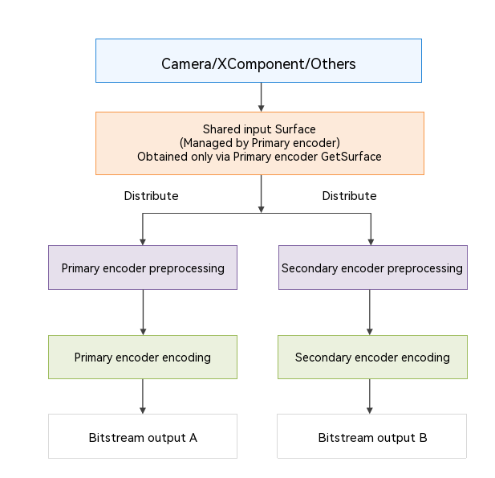

# Encoding with One Input and Dual Outputs

<!--Kit: AVCodec Kit-->
<!--Subsystem: Multimedia-->
<!--Owner: @zhanghongran-->
<!--Designer: @dpy2650-->
<!--Tester: @cyakee-->
<!--Adviser: @w_Machine_cc-->
<!-- md-trans-meta sourceCommit=45526eba67080b876eb51af31a33be43ae26f701 translatedAt=2026-07-13T13:19:26.909Z pushedAt=2026-07-20T10:52:29.420Z -->

Starting from API version 26.0.0, video encoding supports one input and dual outputs. This capability allows the same video input data to simultaneously drive **two independent encoders** to generate two encoded streams with different configurations.

## Overview

The **One Input Dual Outputs feature allows the same video input data to simultaneously drive two independent encoders**, generating two encoded streams with different configurations.

| Encoder Role | Creation Method | Description |
|-----------|----------|------|
| Primary encoder | Created via [OH_VideoEncoder_CreatePrimaryWithPreproc](../../reference/apis-avcodec-kit/capi-native-avcodec-videoencoder-h.md#oh_videoencoder_createprimarywithpreproc) | Manages the shared input Surface, is responsible for preprocessing pipeline scheduling, and allows independent encoding and preprocessing parameters to be configured. |
| Secondary encoder | Created from the primary encoder via [OH_VideoEncoder_CreateSecondaryFromPrimary](../../reference/apis-avcodec-kit/capi-native-avcodec-videoencoder-h.md#oh_videoencoder_createsecondaryfromprimary) | Shares the input source of the primary encoder and allows independent encoding and preprocessing parameters to be configured. |

### Architecture Diagram

The following figure shows the architecture of the One Input Dual Outputs feature.



### When to Use

Apps can choose the appropriate mode based on their own scenarios. The following table lists usage examples.

| Scenario | Primary Encoder | Secondary Encoder | Description |
|------|---------------------|----------------------|----------|
| Adaptive bitrate (ABR) streaming | High-bitrate primary bitstream | Downsampled, lower-frame-rate, lower-bitrate stream | Eliminates the need for cloud-side adaptive bitrate transcoding. Encoding both streams on the broadcaster side enables devices with different network conditions to receive the most appropriate stream, reducing cloud transcoding latency and cost. |
| Region of interest (ROI) | Full-frame encoding for archiving | Cropped ROI encoding | Supports full-frame recording while enabling analysis of regions of interest. |
| Multi-party video call | High-resolution, high-frame-rate, high-bitrate stream | Downsampled, lower-frame-rate, lower-bitrate stream | Eliminates the need for cloud-side adaptive bitrate transcoding. Encoding both streams on the sender side enables receivers with different device capabilities and network conditions to receive the most appropriate stream, reducing cloud transcoding latency and cost. |

### Constraints

**Creation and Lifecycle Constraints**

| No. | Rule |
|------|----------|
| 1 | Secondary instances: Each Primary can have at most one Secondary attached at a time. |
| 2 | Creation order: Create the Primary first, and then create the Secondary from the Primary. |
| 3 | Lifecycle relationship: The Primary owns the Secondary. A Secondary cannot exist independently of its Primary.<br>- **Recommended destruction order**: Call `Destroy` on the Secondary first, and then on the Primary. After destruction, immediately set the corresponding pointer to `nullptr`.<br>- **Fault tolerance**: If the Primary is destroyed before the Secondary, the system automatically destroys the associated Secondary. However, you should still explicitly follow the recommended destruction order. |
| 4 | Recreation: After a Secondary is destroyed, a new Secondary can be created from the same Primary. |
| 5 | Supported mode: Only Surface mode is supported. |

**API Availability Constraints**

| API | Primary Encoder | Secondary Encoder | Remarks |
|------|:--------:|:--------:|------|
| [OH_VideoEncoder_CreatePrimaryWithPreproc](../../reference/apis-avcodec-kit/capi-native-avcodec-videoencoder-h.md#oh_videoencoder_createprimarywithpreproc) | √ | N/A | Creates a primary encoder. |
| [OH_VideoEncoder_CreateSecondaryFromPrimary](../../reference/apis-avcodec-kit/capi-native-avcodec-videoencoder-h.md#oh_videoencoder_createsecondaryfromprimary) | √ | N/A | Creates a secondary encoder from a primary encoder. |
| [OH_VideoEncoder_RegisterCallback](../../reference/apis-avcodec-kit/capi-native-avcodec-videoencoder-h.md#oh_videoencoder_registercallback) | √ | √ | Registers callbacks independently for each encoder. |
| [OH_VideoEncoder_RegisterParameterCallback](../../reference/apis-avcodec-kit/capi-native-avcodec-videoencoder-h.md#oh_videoencoder_registerparametercallback) | × | × | Per-frame parameters are not supported. |
| [OH_VideoEncoder_PushInputParameter](../../reference/apis-avcodec-kit/capi-native-avcodec-videoencoder-h.md#oh_videoencoder_pushinputparameter) | × | × | Per-frame parameters are not supported. |
| [OH_VideoEncoder_Configure](../../reference/apis-avcodec-kit/capi-native-avcodec-videoencoder-h.md#oh_videoencoder_configure) | √ | √ | Configured independently for each encoder. Encoding parameters (such as the resolution and bitrate) and preprocessing parameters can differ between encoders. |
| [OH_VideoEncoder_GetSurface](../../reference/apis-avcodec-kit/capi-native-avcodec-videoencoder-h.md#oh_videoencoder_getsurface) | √ | × | Supported only for the primary encoder. Calling this API on a secondary encoder returns an error. |
| [OH_VideoEncoder_Prepare](../../reference/apis-avcodec-kit/capi-native-avcodec-videoencoder-h.md#oh_videoencoder_prepare) | √ | √ | Prepares resources independently for each encoder. Same as for a regular encoder. |
| [OH_VideoEncoder_Start](../../reference/apis-avcodec-kit/capi-native-avcodec-videoencoder-h.md#oh_videoencoder_start) | √ | √ | Starts each encoder independently. Same as for a regular encoder. |
| [OH_VideoEncoder_Stop](../../reference/apis-avcodec-kit/capi-native-avcodec-videoencoder-h.md#oh_videoencoder_stop) | √ | √ | Stops each encoder independently. Same as for a regular encoder. |
| [OH_VideoEncoder_Flush](../../reference/apis-avcodec-kit/capi-native-avcodec-videoencoder-h.md#oh_videoencoder_flush) | √ | √ | Flushes each encoder independently. Same as for a regular encoder. |
| [OH_VideoEncoder_Reset](../../reference/apis-avcodec-kit/capi-native-avcodec-videoencoder-h.md#oh_videoencoder_reset) | √ | √ | Resets each encoder independently. Same as for a regular encoder. |
| [OH_VideoEncoder_SetParameter](../../reference/apis-avcodec-kit/capi-native-avcodec-videoencoder-h.md#oh_videoencoder_setparameter) | √ | √ | Dynamically adjusted at runtime. |
| [OH_VideoEncoder_NotifyEndOfStream](../../reference/apis-avcodec-kit/capi-native-avcodec-videoencoder-h.md#oh_videoencoder_notifyendofstream) | √ | √ | Dedicated to surface mode. |
| [OH_VideoEncoder_FreeOutputBuffer](../../reference/apis-avcodec-kit/capi-native-avcodec-videoencoder-h.md#oh_videoencoder_freeoutputbuffer) | √ | √ | Releases the output buffer of each encoder independently. |
| [OH_VideoEncoder_PushInputData](../../reference/apis-avcodec-kit/capi-native-avcodec-videoencoder-h.md#oh_videoencoder_pushinputdata) | × | × | Buffer mode is not supported. |
| [OH_VideoEncoder_PushInputBuffer](../../reference/apis-avcodec-kit/capi-native-avcodec-videoencoder-h.md#oh_videoencoder_pushinputbuffer) | × | × | Buffer mode is not supported. |
| [OH_VideoEncoder_QueryInputBuffer](../../reference/apis-avcodec-kit/capi-native-avcodec-videoencoder-h.md#oh_videoencoder_queryinputbuffer) | × | × | Synchronous mode is not supported. |
| [OH_VideoEncoder_QueryOutputBuffer](../../reference/apis-avcodec-kit/capi-native-avcodec-videoencoder-h.md#oh_videoencoder_queryoutputbuffer) | × | × | Synchronous mode is not supported. |
| [OH_VideoEncoder_GetInputDescription](../../reference/apis-avcodec-kit/capi-native-avcodec-videoencoder-h.md#oh_videoencoder_getinputdescription) | √ | √ | Returns the input description, including preprocessing metadata. |
| [OH_VideoEncoder_GetOutputDescription](../../reference/apis-avcodec-kit/capi-native-avcodec-videoencoder-h.md#oh_videoencoder_getoutputdescription) | √ | √ | Queries output information independently for each encoder. Same as for a regular encoder. |
| [OH_VideoEncoder_IsValid](../../reference/apis-avcodec-kit/capi-native-avcodec-videoencoder-h.md#oh_videoencoder_isvalid) | √ | √ | Checks the validity of each encoder independently. Same as for a regular encoder. |
| [OH_VideoEncoder_Destroy](../../reference/apis-avcodec-kit/capi-native-avcodec-videoencoder-h.md#oh_videoencoder_destroy) | √ | √ | Destroys the secondary encoder before destroying the primary encoder. |

**Configuration Constraints**

| Constraint | Description |
|--------|------|
| Surface sharing | The primary and secondary encoders share the same Consumer Surface. You only need to obtain it once from `GetSurface` and bind it to the data source (Camera/XComponent). |
| Window lifecycle | The window instance obtained through `OH_VideoEncoder_GetSurface` must be released. After all encoders are destroyed, call `OH_NativeWindow_DestroyNativeWindow(window)` to destroy the window. |
| Preprocessing independence | Each encoder can independently configure different downsampling, cropping, and frame dropping strategies. However, within a single encoder, downsampling and cropping remain mutually exclusive. |
| Callback independence | The `onNewOutputBuffer` callbacks for the two streams are triggered in different threads. You must call `FreeOutputBuffer` separately for each encoder. |

## How to Develop

### Creating the Primary Encoder

Before creating the preprocessing encoder, you are advised to first check whether the current encoder supports the required preprocessing features through the capability query API.

```cpp
const char *mime = OH_AVCODEC_MIMETYPE_VIDEO_AVC;

OH_AVCapability *capability = OH_AVCodec_GetCapability(mime, true);
if (capability == nullptr) {
    return -1; // Failed to obtain capabilities. The MIME type may be unsupported.
}

// Query whether downsampling preprocessing is supported.
bool supportDownsampling = OH_AVCapability_IsFeatureSupported(capability,
    VIDEO_ENCODER_PREPROC_DOWNSAMPLING);

// Query whether crop preprocessing is supported.
bool supportCrop = OH_AVCapability_IsFeatureSupported(capability,
    VIDEO_ENCODER_PREPROC_CROP);

static OH_AVCodec *g_primary = nullptr;
OH_AVErrCode ret = OH_VideoEncoder_CreatePrimaryWithPreproc(mime, &g_primary);
if (ret != AV_ERR_OK || g_primary == nullptr) {
    // Handle the exception.
    return -1;
}
```

### Registering Callbacks for the Primary Encoder

The implementation is the same as that of a regular encoder. For details, see step 3 (call `OH_VideoEncoder_RegisterCallback()` to register the callback functions) in [Surface Mode](video-encoding.md#surface-mode) of video encoding.

### Configuring the Primary Encoder

For encoder parameter configuration, refer to step 5 (call `OH_VideoEncoder_Configure()` to configure the encoder) in [Surface mode](video-encoding.md#surface-mode) of video encoding. The following focuses on the configuration of basic parameters and preprocessing parameters.

```c++
OH_AVFormat *format = OH_AVFormat_Create();

// Basic encoding parameters (required).
OH_AVFormat_SetIntValue(format, OH_MD_KEY_WIDTH, 1920);         // Width of the input image.
OH_AVFormat_SetIntValue(format, OH_MD_KEY_HEIGHT, 1080);        // Height of the input image.
OH_AVFormat_SetDoubleValue(format, OH_MD_KEY_FRAME_RATE, 30.0); // Original frame rate (prerequisite for the frame dropping feature).

// Preprocessing parameters (configure as needed; verify feature support via IsFeatureSupported before configuration).
// Option A: Downsampling example.
// The following example scales 1920 x 1080 to 640 x 360 before encoding.
// Note: width and height must be specified in pairs.
if (supportDownsampling) {
    OH_AVFormat_SetIntValue(format, OH_MD_KEY_VIDEO_ENCODER_PREPROC_DOWNSAMPLING_WIDTH, 640); // Width of the actual encoded image.
    OH_AVFormat_SetIntValue(format, OH_MD_KEY_VIDEO_ENCODER_PREPROC_DOWNSAMPLING_HEIGHT, 360); // Height of the actual encoded image.
}

// Option B: Cropping example.
// The following example crops a central 1280 x 720 region from 1920 x 1080.
// Note: left/top/right/bottom must all appear together.
// Downsampling and cropping are mutually exclusive and cannot be used simultaneously.
// Example: left = 320, top = 180, right = 1599, bottom = 899; corresponding to: width = 1599 - 320 + 1 = 1280, height = 899 - 180 + 1 = 720.
// if (supportCrop) {
//     OH_AVFormat_SetIntValue(format, OH_MD_KEY_VIDEO_ENCODER_PREPROC_CROP_LEFT, 320);
//     OH_AVFormat_SetIntValue(format, OH_MD_KEY_VIDEO_ENCODER_PREPROC_CROP_TOP, 180);
//     OH_AVFormat_SetIntValue(format, OH_MD_KEY_VIDEO_ENCODER_PREPROC_CROP_RIGHT, 1599);
//     OH_AVFormat_SetIntValue(format, OH_MD_KEY_VIDEO_ENCODER_PREPROC_CROP_BOTTOM, 899);
// }

// Scheme C: frame dropping example.
// Example: from 30 fps to 15 fps (can be used alone or combined with downsampling/cropping).
// OH_AVFormat_SetDoubleValue(format, OH_MD_KEY_VIDEO_ENCODER_PREPROC_DROP_TO_FRAME_RATE, 15.0);

// Execute the configuration.
OH_AVErrCode ret = OH_VideoEncoder_Configure(g_primary, format);
if (ret != AV_ERR_OK) {
    // Handle the error.
    OH_AVFormat_Destroy(format);
    return -1;
}
OH_AVFormat_Destroy(format);
```

### Creating a Secondary Encoder from the Primary Encoder

```c++
static OH_AVCodec *g_secondary = nullptr;

// Secondary can only be created after Primary is successfully created.
OH_AVErrCode ret = OH_VideoEncoder_CreateSecondaryFromPrimary(g_primary, &g_secondary);
if (ret != AV_ERR_OK || g_secondary == nullptr) {
    // Handle the exception.
    return -1;
}
```

### Registering the Secondary Encoder Callback

The implementation is the same as that for a regular encoder. For details, see step 3 (call `OH_VideoEncoder_RegisterCallback()` to register the callback functions) in [Surface Mode](video-encoding.md#surface-mode) of video encoding.

> **NOTE**
>
> The callbacks of the primary and secondary encoders are executed in **different threads**. Both must independently call `FreeOutputBuffer`; otherwise, blocking or starvation may occur.

### Configuring the Secondary Encoder (with Differentiated Preprocessing)

```c++
OH_AVFormat *secFmt = OH_AVFormat_Create();

// The input dimensions are the same as Primary (sharing the same input source).
OH_AVFormat_SetIntValue(secFmt, OH_MD_KEY_WIDTH, 1920);           // Same as Primary.
OH_AVFormat_SetIntValue(secFmt, OH_MD_KEY_HEIGHT, 1080);          // Same as Primary.
OH_AVFormat_SetDoubleValue(secFmt, OH_MD_KEY_FRAME_RATE, 30.0);   // Same as Primary.
OH_AVFormat_SetLongValue(secFmt, OH_MD_KEY_BITRATE, 1500000);     // 1.5 Mbit/s (lower bitrate)

// Differentiated preprocessing configuration (independent secondary encoder configuration).
// Mode A: Downsampling (most common).
// The following example scales 1080p down to 480p for preview.
// Note: width and height must be specified in pairs.
OH_AVFormat_SetIntValue(secFmt,
    OH_MD_KEY_VIDEO_ENCODER_PREPROC_DOWNSAMPLING_WIDTH, 854);
OH_AVFormat_SetIntValue(secFmt,
    OH_MD_KEY_VIDEO_ENCODER_PREPROC_DOWNSAMPLING_HEIGHT, 480);

// Combination: downsampling + frame dropping, to further reduce the preview frame rate.
OH_AVFormat_SetDoubleValue(secFmt,
    OH_MD_KEY_VIDEO_ENCODER_PREPROC_DROP_TO_FRAME_RATE, 15.0);

// Mode B: ROI cropping (alternative).
// The following example encodes the center area of the frame.
// Note: left, top, right, and bottom must all appear together.
// OH_AVFormat_SetIntValue(secFmt, OH_MD_KEY_VIDEO_ENCODER_PREPROC_CROP_LEFT, 480);
// OH_AVFormat_SetIntValue(secFmt, OH_MD_KEY_VIDEO_ENCODER_PREPROC_CROP_TOP, 270);
// OH_AVFormat_SetIntValue(secFmt, OH_MD_KEY_VIDEO_ENCODER_PREPROC_CROP_RIGHT, 1439);
// OH_AVFormat_SetIntValue(secFmt, OH_MD_KEY_VIDEO_ENCODER_PREPROC_CROP_BOTTOM, 809);

OH_AVErrCode ret = OH_VideoEncoder_Configure(g_secondary, secFmt);
OH_AVFormat_Destroy(secFmt);

if (ret != AV_ERR_OK) {
    // Handle the exception.
    return -1;
}
```

### Obtaining the Shared Surface and Binding the Data Source

```c++
// Key rule: Only the primary encoder can obtain the Surface.
OHNativeWindow *window = nullptr;
OH_AVErrCode ret = OH_VideoEncoder_GetSurface(g_primary, &window);
if (ret != AV_ERR_OK || window == nullptr) {
    // Handle the exception.
    return -1;
}

// Bind the window to the Camera/XComponent data source.
// cameraManager->SetPreviewSurface(window)。
// nativeXComponent->SetSurface(window)。
```

> **Core rules:**
> - Only the **primary encoder** can call `GetSurface`.
> - Calling it from the secondary encoder will directly return `AV_ERR_OPERATE_NOT_PERMIT`.
> - The primary and secondary encoders share the same consumer Surface. Obtain the Surface and bind it to the data source only once.

### Completing Encoder Preparation and Starting Both Encoders

```c++
OH_AVErrCode ret = OH_VideoEncoder_Prepare(g_primary);
if (ret != AV_ERR_OK) {
    // Handle the exception.
}
ret = OH_VideoEncoder_Prepare(g_secondary);
if (ret != AV_ERR_OK) {
    // Handle the exception.
}
ret = OH_VideoEncoder_Start(g_primary);
if (ret != AV_ERR_OK) {
    // Handle the exception.
}

ret = OH_VideoEncoder_Start(g_secondary);
if (ret != AV_ERR_OK) {
    // Handle the exception.
}
```

### (Optional) Dynamically Adjusting at Runtime

You can dynamically modify the preprocessing parameters of the secondary encoder at runtime by calling `SetParameter`:

```c++
// Dynamically adjust the downsampling target resolution of the secondary encoder.
void ChangeSecondaryResolution(int newWidth, int newHeight)
{
    OH_AVFormat *param = OH_AVFormat_Create();
    OH_AVFormat_SetIntValue(param,
        OH_MD_KEY_VIDEO_ENCODER_PREPROC_DOWNSAMPLING_WIDTH, newWidth);
    OH_AVFormat_SetIntValue(param,
        OH_MD_KEY_VIDEO_ENCODER_PREPROC_DOWNSAMPLING_HEIGHT, newHeight);
    OH_VideoEncoder_SetParameter(g_secondary, param);
    OH_AVFormat_Destroy(param);
}

// Dynamically adjust the frame dropping intensity based on network conditions.
void AdjustSecondaryDropRate(double targetFps)
{
    OH_AVFormat *param = OH_AVFormat_Create();
    if (targetFps > 0 && targetFps < 30.0) {
        OH_AVFormat_SetDoubleValue(param,
            OH_MD_KEY_VIDEO_ENCODER_PREPROC_DROP_TO_FRAME_RATE, targetFps);
    } else {
        // Set to 0.0 to cancel frame dropping.
        OH_AVFormat_SetDoubleValue(param,
            OH_MD_KEY_VIDEO_ENCODER_PREPROC_DROP_TO_FRAME_RATE, 0.0);
    }
    OH_VideoEncoder_SetParameter(g_secondary, param);
    OH_AVFormat_Destroy(param);
}
```

### Stopping and Destroying the Encoders

```c++
// Stop the encoders.
OH_VideoEncoder_Stop(g_secondary);
OH_VideoEncoder_Stop(g_primary);

// Send the end-of-stream flag for each encoder.
OH_VideoEncoder_NotifyEndOfStream(g_primary);
OH_VideoEncoder_NotifyEndOfStream(g_secondary);

// Destroy the secondary encoder first, and then the primary encoder.
if (g_secondary != nullptr)
{
    OH_VideoEncoder_Destroy(g_secondary);
    g_secondary = nullptr;
}

if (g_primary != nullptr)
{
    OH_VideoEncoder_Destroy(g_primary);
    g_primary = nullptr;
}

// Release the window instance.
if (window != nullptr){
    OH_NativeWindow_DestroyNativeWindow(window);
    window = nullptr;
}
```

> **Destruction rules:**
> - **Recommended order**: Destroy the secondary encoder before destroying the primary encoder.
> - If the primary encoder is destroyed first, the system automatically destroys the associated secondary encoder before releasing the primary encoder.
> - However, it is recommended that you explicitly follow the recommended destruction order to keep the code clear and predictable.

## Recommended Configuration Modes

### Mode A: Dual-Resolution Encoding (Recommended)

- **Primary**: Encodes the original resolution with no preprocessing or only light frame dropping for recording and archiving.

- **Secondary**: Applies downsampling to a lower resolution together with frame dropping for preview and live streaming.

### Mode B: Full-Frame Encoding with ROI Cropping

- **Primary**: Encodes the full frame for complete video archiving.

- **Secondary**: Crops a specified ROI for localized analysis or close-up views.

### Mode C: Adaptive Bitrate (ABR)

- **Primary**: Encodes the full frame with moderate frame dropping to produce the primary stream.

- **Secondary**: Applies aggressive downsampling and frame dropping to produce a backup stream for low-bandwidth networks.

## Troubleshooting

### CreateSecondaryFromPrimary Returns AV_ERR_INVALID_VAL

**Possible cause**: The passed-in handle is not a valid primary encoder handle.

**Solution**: Ensure that the primary encoder is created by `CreatePrimaryWithPreproc` and has been successfully configured.

### CreateSecondaryFromPrimary returns `AV_ERR_OPERATE_NOT_PERMIT`

**Possible cause**: The primary encoder already has a secondary encoder attached.

**Solution**: Destroy the old secondary encoder before creating a new one, or check for any missing `Destroy` calls.

### Secondary Encoder Configuration Fails

**Possible cause**: The preprocessing parameters are invalid.

**Solution**: Check that the downsampling and cropping parameters are complete and within the valid ranges, and ensure that cropping and downsampling are not configured at the same time.

### Calling GetSurface on the Secondary Encoder Fails

**Possible cause**: The secondary encoder handle is used for the call.

**Solution**: Call `GetSurface` only with the primary encoder handle. The primary and secondary encoders share the same consumer Surface.

### Secondary Encoder Has No Output

**Possible cause**: The secondary encoder has not been started, the Surface is not bound to a data source, or the callback is not registered correctly.

**Solution**: Check that the secondary encoder has been started, the primary encoder's Surface is bound to the camera or XComponent, and the callback is valid and calls `FreeOutputBuffer`.

### The Secondary Encoder Is Starved Because the Primary Encoder Callback Is Blocked

**Possible cause**: The `onNewOutputBuffer` callback for the primary encoder takes too long to complete.

**Solution**: Call `FreeOutputBuffer` as soon as possible in the primary encoder callback to avoid blocking the encoding pipeline for an extended period.