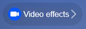
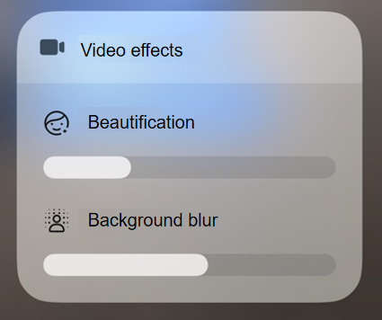

# Camera Controller (ArkTS)
<!--Kit: Camera Kit-->
<!--Subsystem: Multimedia-->
<!--Owner: @qano-->
<!--Designer: @leo_ysl-->
<!--Tester: @xchaosioda-->
<!--Adviser: @w_Machine_cc-->

Starting from API version 20, the camera framework introduces a camera controller to enhance live streaming with features like beautification and background blur.

The camera controller is designed for live streaming and video calls and currently works only with the front camera in video mode, supporting up to 1080p resolution at 30fps.

## How to Develop

Read [Camera](../../reference/apis-camera-kit/arkts-apis-camera.md) for the API reference.

1. Import the camera module, which provides camera-related properties and methods.

    ```ts
    import { camera } from '@kit.CameraKit';
    import { BusinessError } from '@kit.BasicServicesKit';
    ```

2. Call [isControlCenterSupported](../../reference/apis-camera-kit/arkts-apis-camera-ControlCenterQuery.md#iscontrolcentersupported20) to check whether the current device and scenario support the camera controller.

    ```ts
    function isControlCenterSupported(videoSession: camera.VideoSession): boolean {
      let isSupported: boolean = videoSession.isControlCenterSupported();
      return isSupported;
    }
    ```

3. Call [getSupportedEffectTypes](../../reference/apis-camera-kit/arkts-apis-camera-ControlCenterQuery.md#getsupportedeffecttypes20) to query the effect types supported by the camera controller on the current device and in the current scenario.

    ```ts
    function getSupportedEffectTypes(videoSession: camera.VideoSession): Array<camera.ControlCenterEffectType> {
      let effectTypes: Array<camera.ControlCenterEffectType> = [];
      effectTypes = videoSession.getSupportedEffectTypes();
      return effectTypes;
    }
    ```

4. Call [enableControlCenter](../../reference/apis-camera-kit/arkts-apis-camera-ControlCenter.md#enablecontrolcenter20) to enable or disable the camera controller, if it is supported.

    ```ts
    function enableControlCenter(videoSession: camera.VideoSession, enable: boolean): void {
      let isSupported: boolean = videoSession.isControlCenterSupported();
      if (isSupported) {
        videoSession.enableControlCenter(enable);
      }
    }
    ```

5. Once the camera controller is enabled, the **Video effects** icon is displayed in the status bar.

    

6. You can tap the **Video effects** icon to go to the secondary screen, where you can adjust effects like **Beautification** and **Background blur**.

    


## Status Listening

Applications can listen for the enabled status of the camera controller's effects.

Register the [controlCenterEffectStatusChange](../../reference/apis-camera-kit/arkts-apis-camera-VideoSession.md#oncontrolcentereffectstatuschange20) callback to track changes in the enabled status of each effect.

When the enabled status of an effect in the camera controller changes, the callback returns the [ControlCenterStatusInfo](../../reference/apis-camera-kit/arkts-apis-camera-i.md#controlcenterstatusinfo20) parameter.

```ts
import { camera } from '@kit.CameraKit';
import { BusinessError } from '@kit.BasicServicesKit';

function callback(err: BusinessError, status: camera.ControlCenterStatusInfo): void {
  if (err !== undefined && err.code !== 0) {
    console.error(`Callback Error, errorCode: ${err.code}`);
    return;
  }
  console.info(`controlCenterEffectStatusChange: ${status}`);
}

function registerControlCenterEffectStatusChangeCallback(videoSession: camera.VideoSession): void {
  videoSession.on('controlCenterEffectStatusChange', callback);
}
```
