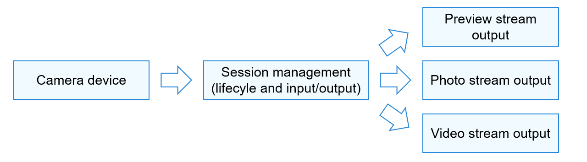

# About This Kit
<!--Kit: Camera Kit-->
<!--Subsystem: Multimedia-->
<!--Owner: @qano-->
<!--Designer: @leo_ysl-->
<!--Tester: @xchaosioda-->
<!--Adviser: @w_Machine_cc-->

With the APIs provided by Camera Kit, you can develop a camera application. The application accesses and operates the camera device to implement basic operations, such as preview, photo capture, and video recording. It can also perform more operations, for example, controlling the flash and exposure time, and focusing or adjusting the focus.

## When to Use

When you want to develop a camera application or develop a camera module in an application, you can refer to the development model described below to understand the working process of the camera before the development.

If you only need to start the system camera to take a photo or record a video, you can directly use the CameraPicker module, without applying for the camera permission. For details, see [Camera Picker](../../reference/apis-camera-kit/js-apis-cameraPicker.md).

## Development Model

The camera application invokes the camera device to collect and process image and video data, and output images and videos. It can be used when there are multiple lenses (such as wide-angle lens, long-focus lens, and ToF lens) in various service scenarios (such as different requirements on the resolution, format, and effect).

The workflow for camera application development is shown in Figure 1, which can be summarized into three parts: camera device management, camera session management, and camera output management.

- A camera application invokes the camera device to collect data, which serves as the camera input stream.

- Camera session management allows configuration of the input stream, for example, selecting the appropriate camera lens (front or rear camera) for shooting. You can also set parameters, such as the flash, exposure time, focus, and focus adjustment, to implement different shooting effects in various service scenarios. The application can switch between sessions to meet service requirements in different scenarios.

- Camera output management configures the output streams of the camera, that is, outputting image content as preview streams, photo streams, or video streams.

**Figure 1** Camera working process 

To help you better develop camera applications, you are advised to first understand the camera development workflow, then learn about the camera development model (as shown in Figure 2). 

The camera application controls the camera device to implement basic operations such as image display (preview), photo saving (photo capture), and video recording. During the implementation of these basic operations, the camera service controls the camera device to collect and output data. The collected image data is processed by the Image Signal Processor (ISP) and then directly transmitted to specific functional modules for processing through the Hardware Device Interfaces (HDI) of the underlying camera layer, using a buffer queue. You do not need to focus on the buffer queue during application development; it is used to promptly deliver the underlying processed data to the upper layer for image display.

Take video recording as an example: the camera service can control the camera device to collect video data and generate a video stream. After the collected data is processed by the underlying camera HDI, the video stream is transmitted to the media recording service via Surface, and finally the media recording service processes the video data and saves it as a video file to complete video recording.

**Figure 2** Camera development model 

