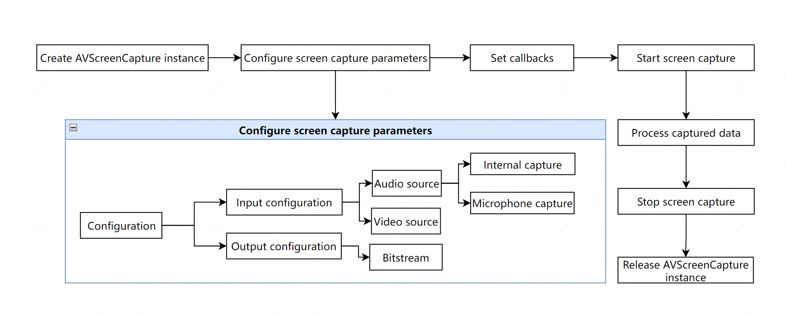
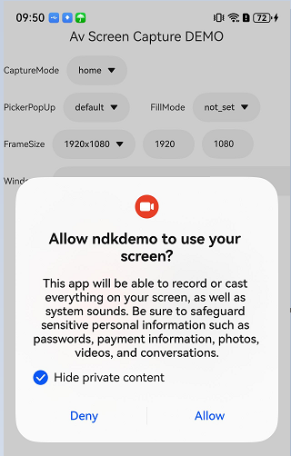

# Using AVScreenCapture in Basic Scenarios

<!--Kit: Media Kit-->
<!--Subsystem: Multimedia-->
<!--Owner: @zzs_911-->
<!--Designer: @stupig001-->
<!--Tester: @xdlinc-->
<!--Adviser: @w_Machine_cc-->

Screen capture enables you to collect screen data for scenarios like screen recording, meeting sharing, and live streaming. By calling the C APIs of the [AVScreenCapture](media-kit-intro.md#avscreencapture) module, you can collect audio and video data from both internal and external sources. The AVScreenCapture module works with the Window and Graphics modules to complete video capture.

Starting from API version 22, the following capabilities are introduced to screen capture on PCs/2-in-1 devices:
- Capture while the screen is off but not locked: This requires the ohos.permission.TIMEOUTSCREENOFFDISABLE_LOCK permission. For details about the permission configuration, see [Declaring Permissions](../../security/AccessToken/declare-permissions.md).
- Capture without privacy protection pop-ups: This requires the ohos.permission.CUSTOM_SCREEN_RECORDING permission. For details about the permission configuration, see [Requesting Restricted Permissions](../../security/AccessToken/restricted-permissions.md).

## Workflow Overview

Basic screen capture involves creating an AVScreenCapture instance, configuring audio and video parameters, setting callbacks, starting and stopping capture, processing results, and releasing resources.

On this basis, you can implement advanced configurations for specific scenarios like video recording or live streaming. For details, see [Using AVScreenCapture in Custom Scenarios](avscreencapture-c-custom-scenarios.md).

The following figure shows the basic workflow.



The captured screen content can be output in the following forms:

- As files: The captured content can be saved as a file, which can be played or shared.

- As streams: The stream can be processed based on the scenario. For example, the stream can be transferred to other modules for desktop sharing or live video streaming.

## Constraints

- When using AVScreenCapture, you must be aware of its state transitions. APIs should only be called in the appropriate states, as calling them in an incorrect state will cause errors. You should check the state before attempting transitions to avoid exceptions.

- When screen capture starts, a privacy protection pop-up is displayed, containing the **Hide private content** option. If this option is selected, private information (such as banner notifications, the control panel, or call screen) will be masked. The specific private information may vary by product. The actual captured result prevails.

  Privacy protection pop-up:

  

## General Development Steps

### Importing Dependencies

Link the dynamic libraries in the CMake script.

```
target_link_libraries(entry PUBLIC libnative_avscreen_capture.so libnative_buffer.so libnative_media_core.so) 
```

Add the header files.

```c++
#include "napi/native_api.h"
#include <multimedia/player_framework/native_avscreen_capture.h>
#include <multimedia/player_framework/native_avscreen_capture_base.h>
#include <multimedia/player_framework/native_avscreen_capture_errors.h>
#include <multimedia/player_framework/native_avbuffer.h>
#include <native_buffer/native_buffer.h>
#include <vector>
```

### Creating an AVScreenCapture Instance

Instantiate the object by creating an [OH_AVScreenCapture](../../reference/apis-media-kit/capi-avscreencapture-oh-avscreencapture.md) instance by calling [OH_AVScreenCapture_Create](../../reference/apis-media-kit/capi-native-avscreen-capture-h.md#oh_avscreencapture_create).

```c++
OH_AVScreenCapture* capture = OH_AVScreenCapture_Create(); 
```

### Configuring Audio Capture Parameters

After creating the AVScreenCapture instance, configure the required audio parameters [OH_AudioInfo](../../reference/apis-media-kit/capi-avscreencapture-oh-audioinfo.md), including internal audio information, microphone audio information [OH_AudioCaptureInfo](../../reference/apis-media-kit/capi-avscreencapture-oh-audiocaptureinfo.md), and output specifications [OH_AudioEncInfo](../../reference/apis-media-kit/capi-avscreencapture-oh-audioencinfo.md).

If microphone audio capture needs to be configured, do as follows:

- Configure the ohos.permission.MICROPHONE permission. For details, see [Requesting User Authorization](../../security/AccessToken/request-user-authorization.md).
- Apply for a continuous task. For details, see [Continuous Task](../../task-management/continuous-task.md).

When you save the captured content to a file, only internal capture is enabled by default. The microphone can be dynamically enabled or disabled during capture. Once enabled, both internal and external (microphone) audio can be recorded simultaneously.

Internal audio information must be configured. Microphone audio information can be set as needed based on the actual scenario.

```c++
// Microphone capture information. If both internal and microphone audio are set, their parameters must be consistent.
OH_AudioCaptureInfo micCapInfo = {
    .audioSampleRate = 48000,
    .audioChannels = 2,
    .audioSource = OH_MIC
}; 
// Internal audio capture information, which is mandatory. If both internal and microphone audio are set, their parameters must be consistent.
OH_AudioCaptureInfo innerCapInfo = {
    .audioSampleRate = 48000,
    .audioChannels = 2,
    .audioSource = OH_ALL_PLAYBACK
};
// Audio output specifications for screen capture.
OH_AudioEncInfo audioEncInfo = {
    .audioBitrate = 48000,
    .audioCodecformat = OH_AAC_LC
};
OH_AudioInfo audioInfo = {
    .micCapInfo = micCapInfo,
    .innerCapInfo = innerCapInfo,
    .audioEncInfo = audioEncInfo
};  
// You can set the microphone switch separately.
bool isMic = true;
OH_AVScreenCapture_SetMicrophoneEnabled(capture, isMic);
```

### Configuring Video Capture Parameters

The video capture information [OH_VideoInfo](../../reference/apis-media-kit/capi-avscreencapture-oh-videoinfo.md) includes the input specifications [OH_VideoCaptureInfo](../../reference/apis-media-kit/capi-avscreencapture-oh-videocaptureinfo.md) and output specifications [OH_VideoEncInfo](../../reference/apis-media-kit/capi-avscreencapture-oh-videoencinfo.md).

```c++
// Input specifications for screen capture.
OH_VideoCaptureInfo videoCapInfo = {
    .videoFrameWidth = 768,
    .videoFrameHeight = 1280,
    .videoSource = OH_VIDEO_SOURCE_SURFACE_RGBA
 };
// Output specifications for screen capture.
OH_VideoEncInfo videoEncInfo = {
    .videoCodec = OH_H264,
    .videoBitrate = 2000000,
    .videoFrameRate = 30
 };
OH_VideoInfo videoInfo = {
    .videoCapInfo = videoCapInfo,
    .videoEncInfo = videoEncInfo
};  
```

### Initializing the AVScreenCapture Instance Configuration

The AVScreenCapture instance configuration [OH_AVScreenRecorderConfig](../../reference/apis-media-kit/capi-avscreencapture-oh-avscreencaptureconfig.md) includes the capture data format [OH_VideoInfo](../../reference/apis-media-kit/capi-avscreencapture-oh-videoinfo.md), audio and video capture parameters [OH_AudioInfo](../../reference/apis-media-kit/capi-avscreencapture-oh-audioinfo.md), and screen capture mode [OH_CaptureMode](../../reference/apis-media-kit/capi-native-avscreen-capture-base-h.md#oh_capturemode), which can be **OH_CAPTURE_HOME_SCREEN**, **OH_CAPTURE_SPECIFIED_SCREEN**, or **OH_CAPTURE_SPECIFIED_WINDOW**.

After configuration, call [OH_AVScreenCapture_Init](../../reference/apis-media-kit/capi-native-avscreen-capture-h.md#oh_avscreencapture_init) to apply the settings to the [OH_AVScreenCapture](../../reference/apis-media-kit/capi-avscreencapture-oh-avscreencapture.md) instance.

> **NOTE**
>
> On PCs/2-in-1 devices, different screen capture modes trigger different pop-up behaviors. For details, see [PC/2-in-1 Pop-up Mode Configuration](#pc2-in-1-pop-up-mode-configuration).

```c++
// Initialize the screen capture parameters by passing in an OH_AVScreenRecorderConfig struct.
OH_AVScreenCaptureConfig config = {
    .dataType = OH_ORIGINAL_STREAM,
    .audioInfo = audioInfo,
    .captureMode = OH_CAPTURE_HOME_SCREEN, // Set the screen capture mode.
    .videoInfo = videoInfo
};
OH_AVScreenCapture_Init(capture, config);
```

### Setting Callbacks for Data Updates, State Changes, and Error Reporting

Callback functions are used to listen for events during screen capture, such as errors, audio/video stream generation, and state changes. For details, [Error Callback](../../reference/apis-media-kit/capi-native-avscreen-capture-base-h.md#oh_avscreencaptureonerror), [Status Callback](../../reference/apis-media-kit/capi-native-avscreen-capture-h.md#oh_avscreencapture_setstatecallback), and [Data Obtaining Callback](../../reference/apis-media-kit/capi-native-avscreen-capture-h.md#oh_avscreencapture_setdatacallback).

```c++
// Set callbacks.
// OnError(), a callback function invoked when an error occurs.
void OnError(OH_AVScreenCapture *capture, int32_t errorCode, void *userData) {
    (void)capture;
    // Handle the event based on the error code.
    (void)errorCode;
    (void)userData;
}

// OnStateChange(), a callback function invoked when the state changes.
void OnStateChange(struct OH_AVScreenCapture *capture, OH_AVScreenCaptureStateCode stateCode, void *userData) {
    (void)capture;
    if (stateCode == OH_AVScreenCaptureStateCode::OH_SCREEN_CAPTURE_STATE_CANCELED) { // Modify the state code as required.
        // Process the screen capture state change.
    }
    (void)userData;
}

// Obtain and process the OnBufferAvailable() callback function of the original audio and video stream data.
void OnBufferAvailable(OH_AVScreenCapture *capture, OH_AVBuffer *buffer, OH_AVScreenCaptureBufferType bufferType, int64_t timestamp, void *userData) {
    // Screen capture is in progress.
}
int *userData = nullptr;// User-defined data.
OH_AVScreenCapture_SetErrorCallback(capture, OnError, userData);
OH_AVScreenCapture_SetStateCallback(capture, OnStateChange, userData);
OH_AVScreenCapture_SetDataCallback(capture, OnBufferAvailable, userData);
```

### Starting Screen Capture

After screen capture is started by calling [OH_AVScreenCapture_StartScreenCapture](../../reference/apis-media-kit/capi-native-avscreen-capture-h.md#oh_avscreencapture_startscreencapture), the system begins capturing the raw stream. Use the [OH_AVScreenCapture_OnBufferAvailable](../../reference/apis-media-kit/capi-native-avscreen-capture-base-h.md#oh_avscreencapture_onbufferavailable) callback to listen for stream generation and the [OH_AVScreenCapture_OnStateChange](../../reference/apis-media-kit/capi-native-avscreen-capture-base-h.md#oh_avscreencapture_onstatechange) callback to listen for state changes.

Within the callbacks, you can call [OH_AVScreenCapture_AcquireAudioBuffer](../../reference/apis-media-kit/capi-native-avscreen-capture-h.md#oh_avscreencapture_acquireaudiobuffer) to obtain the audio stream and [OH_AVScreenCapture_AcquireVideoBuffer](../../reference/apis-media-kit/capi-native-avscreen-capture-h.md#oh_avscreencapture_acquirevideobuffer) to obtain the video stream.

```c++
OH_AVScreenCapture_StartScreenCapture(capture);
```

### Processing Captured Data

Depending on the audio and video capture parameters, different data streams are generated, including video streams, internal audio streams, and microphone audio streams. You can process these according to your scenario, such as routing the streams to other modules for desktop sharing or live video streaming.

```c++
bool IsCaptureStreamRunning = true;
// Obtain and process the OnBufferAvailable() callback function of the original audio and video stream data.
void OnBufferAvailable(OH_AVScreenCapture *capture, OH_AVBuffer *buffer, OH_AVScreenCaptureBufferType bufferType, int64_t timestamp, void *userData) {
    // Screen capture is in progress.
    if (IsCaptureStreamRunning) {
        if (bufferType == OH_SCREEN_CAPTURE_BUFFERTYPE_VIDEO) {
            // Video buffer.
            OH_NativeBuffer *nativeBuffer = OH_AVBuffer_GetNativeBuffer(buffer);
            if (nativeBuffer != nullptr && capture != nullptr) {
                // Obtain the buffer capacity.
                int bufferLen = OH_AVBuffer_GetCapacity(buffer);

                // Obtain the buffer attribute.
                OH_AVCodecBufferAttr info;
                OH_AVBuffer_GetBufferAttr(buffer, &info);

                // Obtain the native buffer configuration.
                OH_NativeBuffer_Config config;
                OH_NativeBuffer_GetConfig(nativeBuffer, &config);

                // Obtain the buffer address.
                uint8_t *buf = OH_AVBuffer_GetAddr(buffer);
                if (buf == nullptr) {
                    return;
                }
                // Use the buffer data.

                // The reference count of the native buffer is decremented by 1. When the reference count reaches 0, the buffer is released.
                OH_NativeBuffer_Unreference(nativeBuffer);
            }
        } else if (bufferType == OH_SCREEN_CAPTURE_BUFFERTYPE_AUDIO_INNER) {
            // Buffer for internal recording.
            // Obtain the buffer attribute.
            OH_AVCodecBufferAttr info;
            OH_AVBuffer_GetBufferAttr(buffer, &info);

            // Obtain the buffer capacity.
            int bufferLen = OH_AVBuffer_GetCapacity(buffer);

            // Obtain the buffer address.
            uint8_t *buf = OH_AVBuffer_GetAddr(buffer);
            if (buf == nullptr) {
                return;
            }
            // Use the buffer data.
        } else if (bufferType == OH_SCREEN_CAPTURE_BUFFERTYPE_AUDIO_MIC) {
            // Microphone buffer.
            // Obtain the buffer capacity.
            int bufferLen = OH_AVBuffer_GetCapacity(buffer);

            // Obtain the buffer address.
            uint8_t *buf = OH_AVBuffer_GetAddr(buffer);
            if (buf == nullptr) {
                return;
            }
            // Use the buffer data.
        }
    }
}
```

### Stopping Screen Capture

Call [OH_AVScreenCapture_StopScreenCapture](../../reference/apis-media-kit/capi-native-avscreen-capture-h.md#oh_avscreencapture_stopscreencapture) to stop screen capture or sharing and release the microphone.

```c++
// Stop screen capture.
OH_AVScreenCapture_StopScreenCapture(capture);
```

### Releasing Resources

Call [OH_AVScreenCapture_Release](../../reference/apis-media-kit/capi-native-avscreen-capture-h.md#oh_avscreencapture_release) to release the created OH_AVScreenCapture instance. This must be done after screen capture is stopped.

```c++
// Release screen capture resources.
OH_AVScreenCapture_Release(capture);
```

## PC/2-in-1 Pop-up Mode Configuration

The system provides the following screen capture modes: [Capturing a Specified Screen](#capturing-a-specified-screen), [Capturing the Main Screen](#capturing-the-main-screen), and [Capturing a Specified Window](#capturing-a-specified-window-recommended).

The screen capture mode uses the display ID (**displayId**) and window ID (**missionIds**). For details about how to obtain the display ID and window ID, see [Obtaining displayId](../../reference/apis-arkui/capi-oh-display-manager-h.md#oh_nativedisplaymanager_createalldisplays) and [Obtaining missionIds](../../reference/apis-arkui/arkts-apis-window-Window.md#getwindowproperties9).

### Capturing a Specified Screen

This is the [OH_CAPTURE_SPECIFIED_SCREEN](../../reference/apis-media-kit/capi-native-avscreen-capture-base-h.md#oh_capturemode) mode.

In this mode, after screen capture starts, the PC/2-in-1 device displays a pop-up for selecting the content to share. By default, the screen corresponding to the **videoCapInfo.displayId** parameter is selected. If the window corresponding to the provided **displayId** does not exist, no selection is made.

```c++
// Configure the screen capture width and height in config based on the PC's or 2-in-1 device's resolution.
config.videoInfo.videoCapInfo.videoFrameWidth = 2880;
config.videoInfo.videoCapInfo.videoFrameHeight = 1920;

// Set the screen capture mode to OH_CAPTURE_SPECIFIED_SCREEN and pass a display ID.
config.captureMode = OH_CAPTURE_SPECIFIED_SCREEN;
config.videoInfo.videoCapInfo.displayId = 0;
```

<!--RP1--><!--RP1End-->

### Capturing the Main Screen

This is the [OH_CAPTURE_HOME_SCREEN](../../reference/apis-media-kit/capi-native-avscreen-capture-base-h.md#oh_capturemode) mode.

In this mode, after screen capture starts, the PC/2-in-1 device does not display a pop-up for selecting the content to share. Instead, it displays a privacy protection pop-up. The configured **videoCapInfo.displayId** parameter does not take effect, and the display ID of the main screen is used by default.

```c++
// Configure the screen capture width and height in config based on the PC's or 2-in-1 device's resolution.
config.videoInfo.videoCapInfo.videoFrameWidth = 2880;
config.videoInfo.videoCapInfo.videoFrameHeight = 1920;

// Set the screen capture mode to OH_CAPTURE_HOME_SCREEN and pass a display ID.
config.captureMode = OH_CAPTURE_HOME_SCREEN;
```

### Capturing a Specified Window (Recommended)

This is the [OH_CAPTURE_SPECIFIED_WINDOW](../../reference/apis-media-kit/capi-native-avscreen-capture-base-h.md#oh_capturemode) mode.

The application should configure the screen capture height and width values according to the PC/2-in-1 device resolution and pass the display ID.

To capture a specific window, the target window ID must be set. In this scenario, after screen capture starts, the PC/2-in-1 device displays a pop-up for selecting the content to share, and the specified window is selected by default.

```c++
// Configure the screen capture width and height in config based on the PC's or 2-in-1 device's resolution.
config.videoInfo.videoCapInfo.videoFrameWidth = 2880;
config.videoInfo.videoCapInfo.videoFrameHeight = 1920;

// Set the screen capture mode to OH_CAPTURE_SPECIFIED_WINDOW and pass a display ID.
config.captureMode = OH_CAPTURE_SPECIFIED_WINDOW;
config.videoInfo.videoCapInfo.displayId = 0;

// (Optional) Pass a window ID if you want to capture a specific window.
std::vector<int32_t> missionIds = {61}; // Window 61 is selected in the picker by default.
config.videoInfo.videoCapInfo.missionIDs = &missionIds[0];
config.videoInfo.videoCapInfo.missionIDsLen = static_cast<int32_t>(missionIds.size());
```

<!--RP2--><!--RP2End-->

To capture multiple windows simultaneously, pass a list of the desired window IDs. In this scenario, the PC/2-in-1 device does not display a pop-up for selecting the content to share. Instead, it displays the privacy protection pop-up.

```c++
// Configure the screen capture width and height in config based on the PC's or 2-in-1 device's resolution.
config.videoInfo.videoCapInfo.videoFrameWidth = 2880;
config.videoInfo.videoCapInfo.videoFrameHeight = 1920;

// Set the screen capture mode to OH_CAPTURE_SPECIFIED_WINDOW and pass a display ID.
config.captureMode = OH_CAPTURE_SPECIFIED_WINDOW;
config.videoInfo.videoCapInfo.displayId = 0;

// Pass multiple window IDs.
vector<int32_t> missionIds = {60, 61}; // Windows 60 and 61 are to be captured simultaneously.
config.videoInfo.videoCapInfo.missionIDs = &missionIds[0];
config.videoInfo.videoCapInfo.missionIDsLen = static_cast<int32_t>(missionIds.size());
```

## Additional Resources

- API reference: For details, see [native_avscreen_capture.h](../../reference/apis-media-kit/capi-native-avscreen-capture-h.md).

- Sample project: This sample demonstrates screen capture using the AVScreenCapture component APIs. For details, see [Screen Capture](https://gitcode.com/openharmony/applications_app_samples/tree/master/code/DocsSample/Media/ScreenCapture/ScreenCaptureSample).
