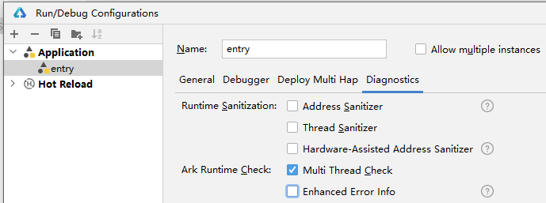

# Summary of Stability-Related Issues
<!--Kit: ArkTS-->
<!--Subsystem: arkcompiler-->
<!--Owner: @shilei123; @liudachuan3-->
<!--Designer: @shilei123-->
<!--Tester: @kirl75; @zsw_zhushiwei-->
<!--Adviser: @k1ngqaquuu-->
<!-- md-trans-meta sourceCommit=70ba2bcd8488b9d551343ac02dbfe4989edea211 translatedAt=2026-09-16T03:07:00.327Z pushedAt=2026-09-16T08:19:07.779Z -->

## How to Locate and Resolve High-Probability Crashes During Application Running

- Specific issue: During development with Node-API, the application crashes with high probability. A cpp crash stack appears, with the top of the stack being the system library libark_jsruntime.so, and the first few frames of the crash stack also containing libace_napi.z.so. How to locate and resolve this issue?  

The reproduction probability is high, and each crash stack differs slightly. However, the commonality is that the top of the crash stack is the system library libark_jsruntime.so or libace_napi.z.so.    

- The crash information is as follows:  
```sh
Reason:Signal:SIGSEGV(SEGV_MAPERR)@0x00000136 probably caused by NULL pointer dereference
Fault thread info:
Tid:15894, Name:e.myapplication
#00 pc 002b8dd4 /system/lib/platformsdk/libark_jsruntime.so
#01 pc 0024d3e1 /system/lib/platformsdk/libark_jsruntime.so
#02 pc 0024d0d9 /system/lib/platformsdk/libark_jsruntime.so
#03 pc 002eac5d /system/lib/platformsdk/libark_jsruntime.so
#04 pc 00428d0f /system/lib/platformsdk/libark_jsruntime.so
```

- Locate the issue:  

If a high-probability crash occurs when using Node-API and the top of the crash stack is the system library libark_jsruntime.so, it is generally caused by improper use of Node-API APIs.   
- The following approach to locating the issue can be used as a reference:   
1. Check whether there is a thread safety issue (high probability).   

   DevEco Studio provides a related switch. After enabling the switch, recompile, package, and run the application, and check whether the crash stack matches the description in the following document. If so, there is a thread safety issue when using Node-API. 

   [Common Thread Safety Issues](https://developer.huawei.com/consumer/cn/doc/best-practices/bpta-stability-ark-runtime-detection#section19357830121120)  

   DevEco Studio switch:   

      
2. Invalid input parameters when calling Node-API interfaces.   
- In this case, the .so file on the crash stack is usually shallow. The .so file calls a specific Node-API interface, such as `napi_call_function`, and then Node-API calls the `libark_jsruntime` .so file, where the crash occurs directly.  

The following is an example of the stack structure.  
```sh
#01 /system/lib/platformsdk/libark_jsruntime.so
#02 /system/lib/platformsdk/libark_jsruntime.so
#03 /system/lib/platformsdk/libace_napi.z.so(napi_set_named_property+170) -- The Node-API .so file. This location shows the specific interface that reports the call error.
#04 /data/storage/el1/bundle/libs/arm/libentry.so -- Your .so file
```
- If the issue is caused by input parameters, the .so file is usually at a shallow position on the crash stack (it does not reach a position far from the top of the stack, such as #10). However, you can still troubleshoot by following this approach.  
- Troubleshooting approach:  

a. Check whether any `napi_value` is uninitialized or not yet assigned successfully, and is directly passed to an interface as an invalid input parameter.

b. Check whether the corresponding section can be found in this list of error-prone APIs.

  References

  [Ark Runtime API](https://developer.huawei.com/consumer/cn/doc/best-practices/bpta-stability-coding-standard-api#section1219614634615).


## How to Handle Thread Safety When Concurrently Calling ArkTS Methods in a Thread Pool

- Consider the following scenario: there is a class method in ArkTS, and a `napi_ref` reference has been created for this method. You now want to call the ArkTS method concurrently in a C++ thread pool. The following questions arise:  
1. Can the ArkTS class method cached by `napi_ref` be called in a thread pool created in C++?  
2. How can thread safety be ensured when calling back to ArkTS?  

For question 1:

You can only throw the ArkTS task back to the ArkTS thread from the C++ thread. This is not a synchronous call, but an action of throwing a task.  

Note that the actual execution of this ArkTS method can only be completed on the ArkTS thread. That is, the method can only run on the corresponding ArkTS thread.  

For question 2:

As mentioned above, C++ threads throw tasks to the ArkTS thread, which then executes the ArkTS method. For thread safety, refer to [Thread Safety Development Using Node-API](use-napi-thread-safety.md).  

In addition, during development, you can enable [Ark multithreading detection](https://developer.huawei.com/consumer/cn/doc/best-practices/bpta-stability-ark-runtime-detection#section75786272088), which can intercept multithreading safety issues.  

> ⚠️ [翻译失败]此段需用户自行翻译

> ⚠️ [翻译失败]此段需用户自行翻译

- Answer:  
> ⚠️ [翻译失败]此段需用户自行翻译

   References

> ⚠️ [翻译失败]此段需用户自行翻译

> ⚠️ [翻译失败]此段需用户自行翻译

## Is There a Way to Obtain the Latest napi_env

- Specific description: The native layer needs to call ArkTS methods at a deep call level and cannot pass napi_env layer by layer. Caching it directly causes crashes.  
```sh
#00 /system/lib/platformsdk/libark_jsruntime.so(panda::JSValueRef::IsFunction)
#01 /system/lib/platformsdk/libace_napi.z.so(napi_call_function)
#02 /data/storage/el1/bundle/libs/arm/libentry.so
...
```
- Answer:  
1. About saving napi_env:  

   Node-API does not provide the capability to obtain napi_env directly; it can only be passed through layer-by-layer function calls. Saving napi_env is generally not recommended for two reasons:  

   First, if the exit of napi_env is not perceived by the user, a use-after-free issue can easily occur.  

   Second, napi_env is strongly bound to the ArkTS thread. If napi_env is used on another ArkTS thread, thread safety issues arise.  

   References

   [Why cannot napi_env be cached?](https://developer.huawei.com/consumer/cn/doc/harmonyos-faqs/faqs-ndk-73). 

2. The key to this issue is as follows:  

   If you must save env, you need to perceive whether env has exited. You can use the callback of napi_add_env_cleanup_hook to perceive this. At the same time, enable the multi-thread detection switch during development to avoid thread safety issues.

   References

   [Common thread safety issues](https://developer.huawei.com/consumer/cn/doc/best-practices/bpta-stability-ark-runtime-detection#section19357830121120).   

3. For the crash itself, it may occur when calling `napi_call_function` because the `func` parameter is invalid. You can check whether the `napi_value` has been cached. In this case, the `napi_value` may have been cached and then become invalid after going out of the scope of the `napi_handle_scope`. 

    If similar logic exists, use `napi_ref` for storage, which can extend the lifecycle.  

- References  

  [napi_create_reference, napi_delete_reference](use-napi-life-cycle.md)  

  [Ark Runtime API](https://developer.huawei.com/consumer/cn/doc/best-practices/bpta-stability-coding-standard-api#section1219614634615) 

## How to Handle Call Errors of napi_add_env_cleanup_hook

- Specific issue: How to handle call errors of `napi_add_env_cleanup_hook`/`napi_remove_env_cleanup_hook`?

The call errors of `napi_add_env_cleanup_hook` and `napi_remove_env_cleanup_hook` are usually caused by improper API usage. The common causes and characteristic logs are as follows.
1. The two APIs are called outside the ArkTS thread where `env` resides, causing a thread safety issue. The characteristic error log is `current napi interface cannot run in multi-thread`.
2. When calling `napi_add_env_cleanup_hook`, the same `args` is reused to register different callback functions, causing subsequent registrations to fail. The third parameter `args` of this API serves as the `key` in the internal `map`. When a callback with the same `args` is registered repeatedly, subsequent registrations fail, and only the first registration succeeds. A registration failure may cause subsequent service functions to behave abnormally or crash. The characteristic error log is `AddCleanupHook Failed`.
3. When calling `napi_remove_env_cleanup_hook`, an attempt is made to remove a callback function through an `args` that does not exist (or has already been removed). The API call fails, and the characteristic error log `RemoveCleanupHook Failed` appears.

Example:

```c++
void AddEnvCleanupHook(napi_env env)
{
    napi_add_env_cleanup_hook(env, [](void* args) -> void {
        // Cleanup function callback.
    }, env); // env is common data. Even if it is not registered repeatedly here, it may have been registered earlier elsewhere, causing the registration here to fail.
}

static napi_value Test(napi_env env, napi_callback_info info)
{
    // First registration.
    AddEnvCleanupHook(env);
    // Second repeated registration.
    AddEnvCleanupHook(env);
    return nullptr;
}
```

- Fix suggestions:
1. For multi-thread safety issues, ensure that the thread calling the API is on the ArkTS thread where `env` resides.
2. For registration failure issues, the function to be registered must be specified by the caller. Ensure that the `key` value (that is, the third input parameter of `napi_add_env_cleanup_hook`) is unique.
3. For deletion failure issues, ensure that `args` has been registered and has not been deleted.

Related reference links:

[Registering and Using Environment Cleanup Hooks with Node-API](use-napi-about-cleanuphook.md)

[Ark Runtime API](https://developer.huawei.com/consumer/cn/doc/best-practices/bpta-stability-coding-standard-api#section1219614634615)

## Typical Error Scenarios in Lifecycle Development Using napi_open_handle_scope and napi_close_handle_scope

- Specific issue: How to handle stability issues that occur when using the `napi_open_handle_scope` and `napi_close_handle_scope` APIs to manage ArkTS objects?

Stability issues in `napi_open_handle_scope` and `napi_close_handle_scope` calls are commonly caused by the following, all of which result from improper API usage.
1. `napi_open_handle_scope` and `napi_close_handle_scope` are not used in pairs. Opening a scope without closing it causes memory leaks and may trigger a program crash.
2. Scopes are not closed in the reverse order in which they were opened, which may cause memory corruption. For example, in a scenario such as open_scope1, open_scope2, close_scope1, close_scope2, after close_scope1 the pointer is returned and is highly likely to overwrite the memory in scope2, causing memory corruption.
3. A scope created in a native method is not closed before the method returns, causing scope pairing to become disordered upon function re-entry and leading to stability issues.

Example:

```cpp
#include "napi/native_api.h"
#include <hilog/log.h>

// 1. Global scope
static napi_handle_scope g_globalScope = nullptr;

static napi_value CallFunction(napi_env env, napi_callback_info info) {
    size_t argc = 1;
    napi_value argv[1] = {nullptr};
    napi_get_cb_info(env, info, &argc, argv, nullptr, nullptr);
    
    napi_valuetype type = napi_undefined;
    if (argv[0] == nullptr || napi_typeof(env, argv[0], &type) != napi_ok || type != napi_function) {
        OH_LOG_INFO(LOG_APP, "Invalid JS function parameter");
        napi_value errRet = nullptr;
        napi_create_int32(env, -1, &errRet);
        return errRet;
    }

    if (!g_globalScope) {
        OH_LOG_INFO(LOG_APP, "First call: global scope is empty, execute open");
        napi_open_handle_scope(env, &g_globalScope);
        // First call: execute the JS function
        napi_value global = nullptr;
        napi_get_global(env, &global);
        napi_value result = nullptr;
        napi_call_function(env, global, argv[0], argc, argv, &result);
        return result; // Return directly on the first call without executing the subsequent close logic.
    } else {
        // Reentrant call: return a fixed value directly and close the scope.
        napi_value result = nullptr;
        napi_create_int32(env, 10, &result);
        OH_LOG_INFO(LOG_APP, "[Reentrant call] Global scope is not empty, executing close.");
        napi_close_handle_scope(env, g_globalScope);
        g_globalScope = nullptr;
        return result;
    }
}
```
API declaration:
```ts
// index.d.ts
export const callFunction : (func : Function) => void;
```
ArkTS code:

```ts
import { hilog } from '@kit.PerformanceAnalysisKit';
import testNapi from 'libentry.so';

function reenterFunc(count = 1) : void{
  hilog.info(0x0000, 'testTag', `[JS side] Recursion`);
  if (count <= 0) {
    return;
  }
  testNapi.callFunction(() => reenterFunc(count - 1));
  hilog.info(0x0000, 'testTag', `[JS side] Reentrant call`);
  return;
}

try {
  testNapi.callFunction(reenterFunc);
  hilog.info(0x0000, 'testTag', '[Execution completed]');
} catch (error) {
  hilog.error(0x0000, 'testTag', `Call error: ${error.message}`);
}
```
CMakeLists.txt
```text
cmake_minimum_required(VERSION 3.5.0)
project(Test)

set(NATIVERENDER_ROOT_PATH ${CMAKE_CURRENT_SOURCE_DIR})

if(DEFINED PACKAGE_FIND_FILE)
    include(${PACKAGE_FIND_FILE})
endif()

include_directories(${NATIVERENDER_ROOT_PATH}
                    ${NATIVERENDER_ROOT_PATH}/include)

add_library(entry SHARED napi_init.cpp)
add_definitions( "-DLOG_DOMAIN=0xd0d0" )
add_definitions( "-DLOG_TAG=\"testTag\"" )
target_link_libraries(entry PUBLIC libace_napi.z.so libhilog_ndk.z.so)
```
- Fix suggestion:
1. `napi_open_handle_scope` and `napi_close_handle_scope` must be used in pairs, and you should check this yourself.  
2. All scopes must be closed in the reverse order of opening.
3. All scopes created in a native method must be closed before the method returns.

Related reference links:

[Lifecycle Development Using Node-API APIs](https://developer.huawei.com/consumer/cn/doc/harmonyos-guides/use-napi-life-cycle#napi_open_handle_scopenapi_close_handle_scope)