# Analyzing Web Page Memory Using DevTools
<!--Kit: NDK Development-->
<!--Subsystem: arkcompiler-->
<!--Owner: @yuanjiahao-->
<!--Designer: @xiexuhui-->
<!--Tester: @test_lzz-->
<!--Adviser: @fang-jinxu-->
## Obtaining JS Heap Memory Snapshots

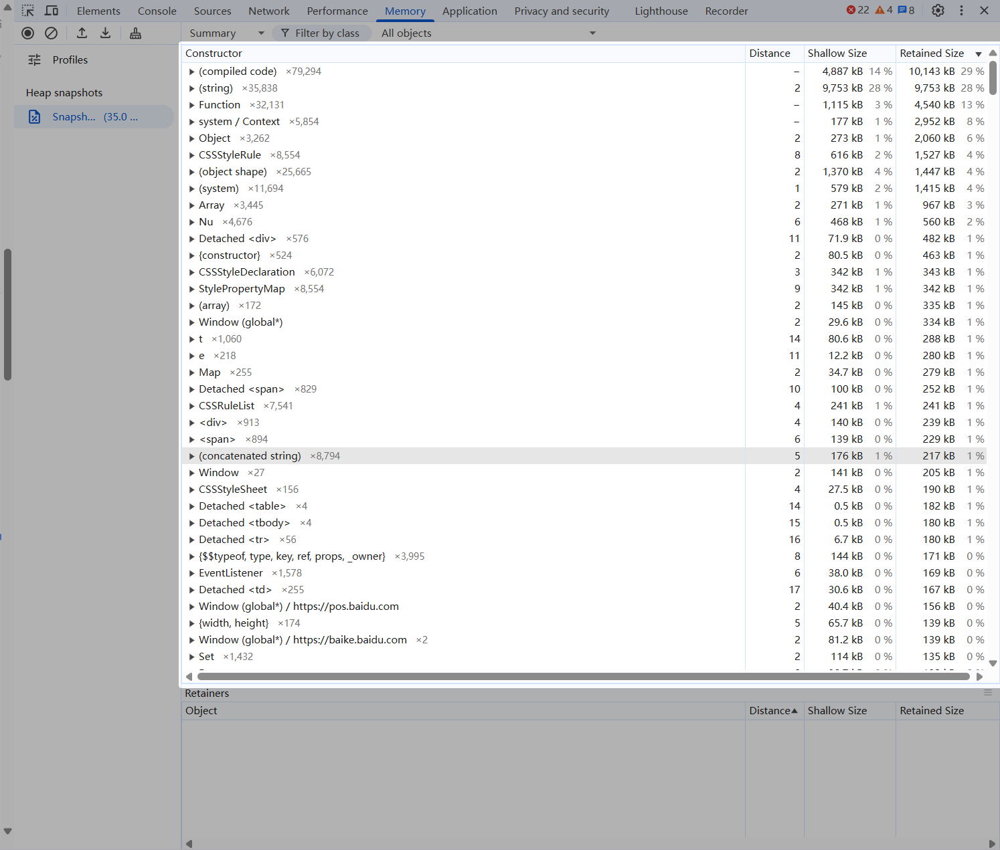

## Analyzing Heap Snapshots
### Summary
The **Summary** tab displays the overview of the current memory snapshot. Key details include:
- **Constructor**: constructor of an object.
- **Distance**: distance from the reference chain of the GC root to the object. If the distances of objects of the same type are different, the code logic may be incorrect.
- **Object Count**: total number of objects constructed by the current constructor, which is a gray number next to the constructor.
- **Shallow Size**: memory size occupied by an object.
- **Retained Size**: memory size that can be released after the object is released. Specifically, the value of this parameter is the sum of the memory occupied by the object and the dependent objects that cannot be accessed from the GC root after the object is deleted.

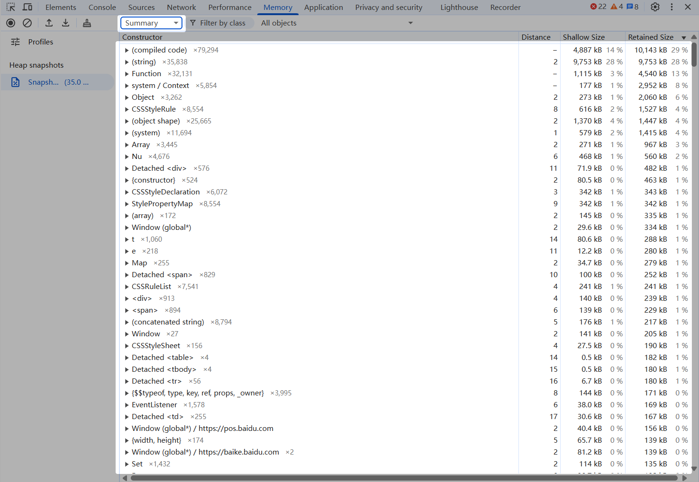

A filter panel on the right side of the **Summary** tab allows you to focus on specific objects. For example, selecting "Objects allocated between Snapshot 2 and Snapshot 3" (as shown below) helps locate where memory issues occur.
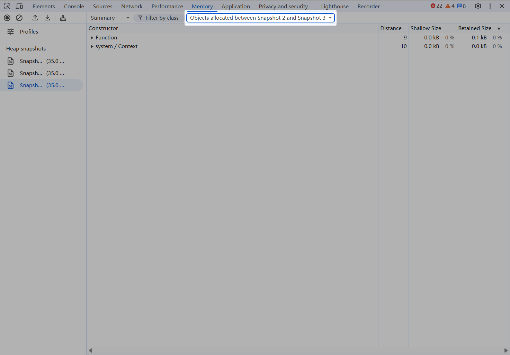

### Comparison
In **Comparison**, you can compare the current snapshot with another snapshot to track the changes of object properties and memory usage. Key details include:
- **Constructor**: constructor of an object.
- **New**: number of new objects created under the object constructor.
- **Deleted**: number of new objects deleted under the object constructor.
- **Delta**: difference between new objects and deleted objects.
- **Alloc Size**: size of the memory allocated for two snapshots.
- **Freed Size**: size of the memory released for two snapshots.
- **Size Delta**: difference between **Alloc Size** and **Freed Size**.

You can analyze memory problems based on the differences between snapshots on the **Comparison** page.
! 

### Containment
 **Containment** provides a top-down tree interface, which allows you to browse and explore the content in the heap memory. You can use it to analyze the reference of all variables (such as **Window**).
! 

### Statistics
Statistics displays the memory usage ratio of different object types in a pie chart.
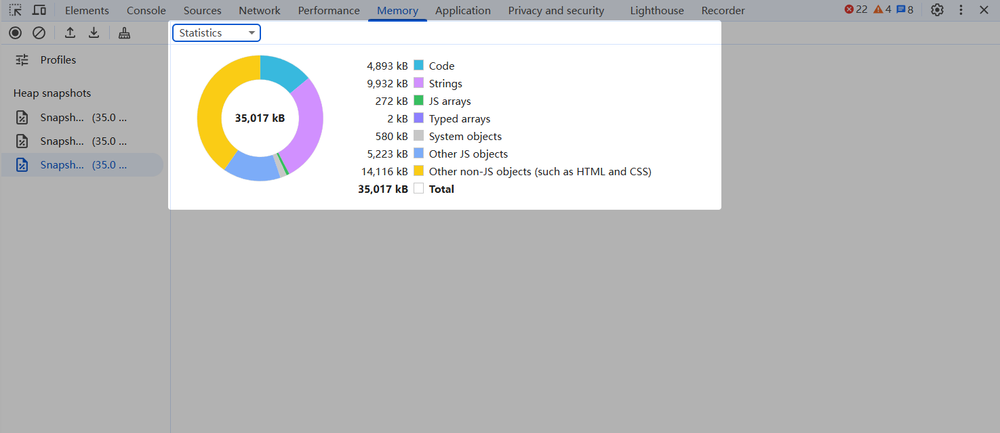

## Memory Leak Analysis Process
1. Open a page where memory leaks may occur and enable DevTools. The following figure shows a page from the memory-leak-simulation project on GitHub. This page simulates a memory leak scenario by setting a global array and continuously pushing the **memory leak** string to the array.
   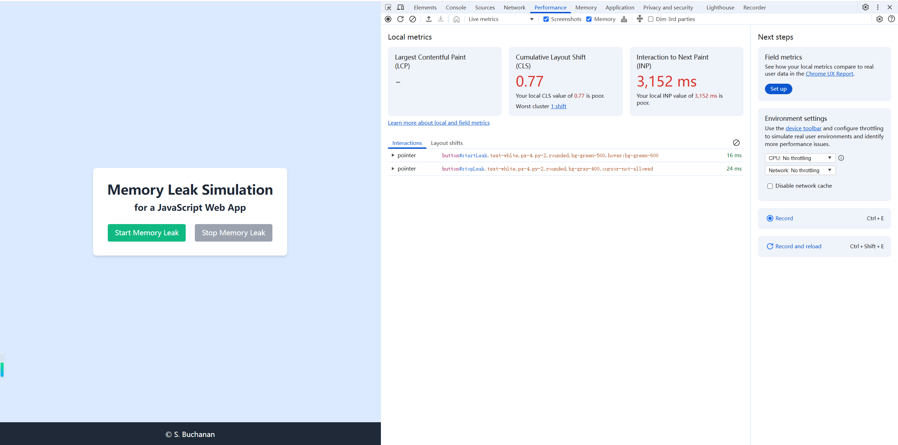

2. Record user operations that may cause memory leaks on the **Performance** tab to identify the specific operations or components triggering leaks. As shown in the following figure, the web page has been loaded, but the memory keeps increasing, indicating that a memory leak may occur. For web pages that contain a large number of dynamic components and frequently perform DOM operations, the memory curve may fluctuate. Observe the minimum memory value. If the minimum memory value increases gradually, the web page may have a memory leak.
   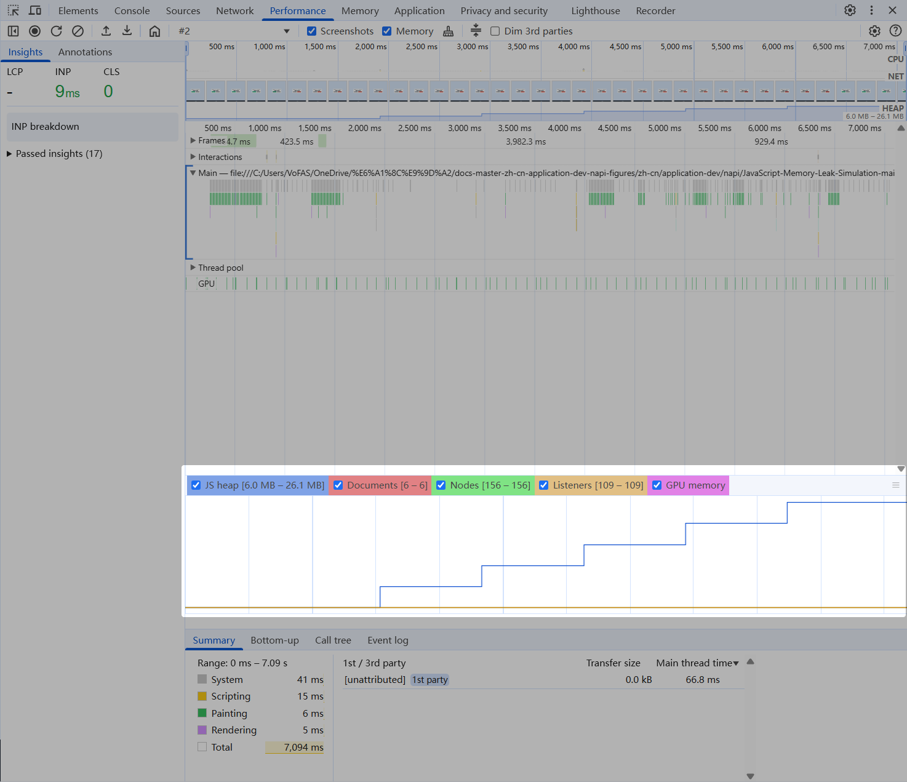

3. Take the first heap snapshot of the web page. It is found that the **Array** object occupies 24 MB memory, which is significantly higher than the normal value (usually within several MB). Therefore, a memory leak may occur on this object.
   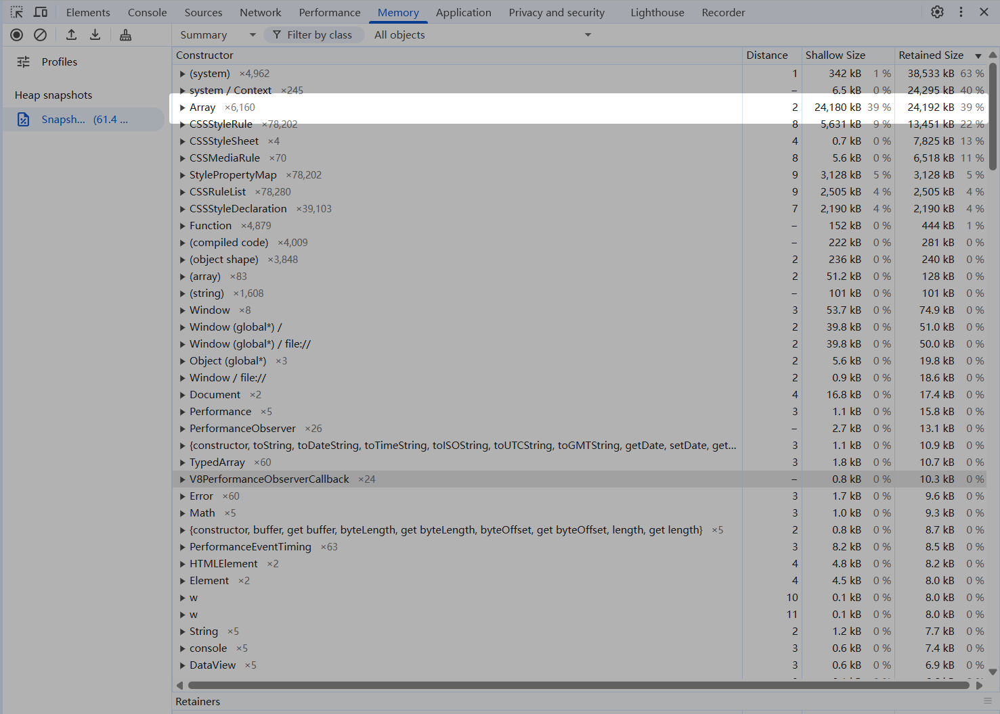

4. Perform operations that may trigger memory leaks on the page. Take a second heap snapshot after completing the operations, then select "Objects allocated between Snapshot 2 and Snapshot 3". It shows the **Array** constructor newly occupies approximately 20 MB of memory.
   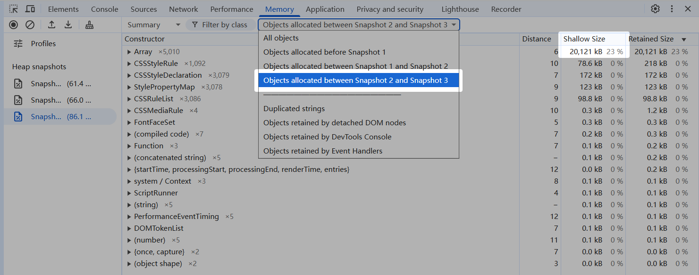

5. Open the **Comparison** tab, select snapshot 3, and use snapshot 2 as the reference. The results show the **Array** constructor created 5,010 new objects, occupying 20.1 MB but releasing only 184 B. Therefore, the memory leak occurred in **Array**.
   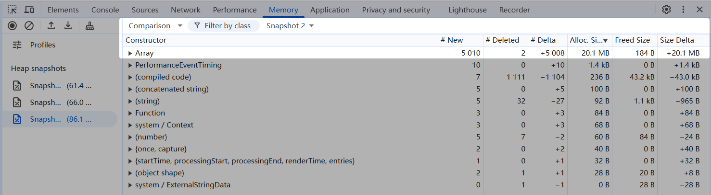

6. Record a heap snapshot for 1 to 2 minutes to obtain a **Summary** view with a timeline, which is similar to the view on the **Performance** page. This helps identify which actions caused memory usage changes. Select **Allocations on timeline**, and click the recording button. After the test action is complete, stop the recording to generate the memory heap timeline view.
   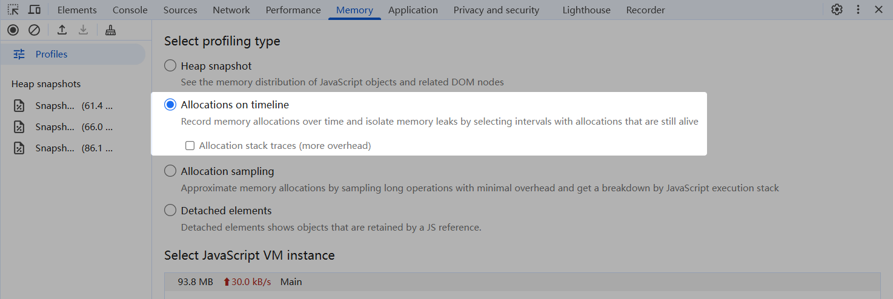

7. On the result timeline, you can drag the left mouse button to select the target time range and view memory allocations during that period. The highlighted area in the image below shows the **Array** constructor created 2,000 new objects in the selected time frame. This feature clarifies the impact of different operations on memory.
   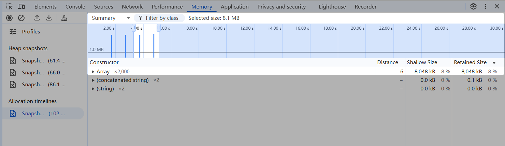
