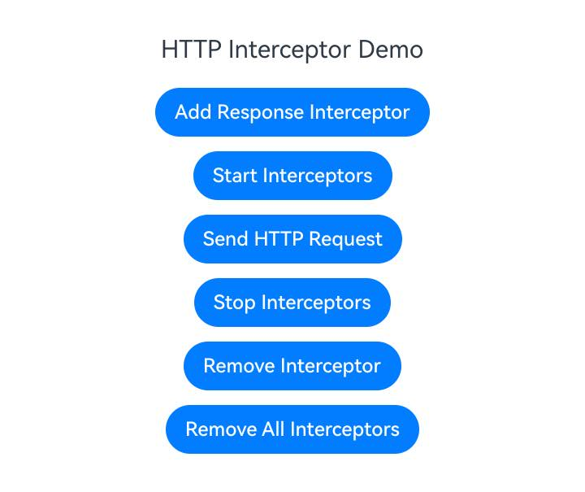
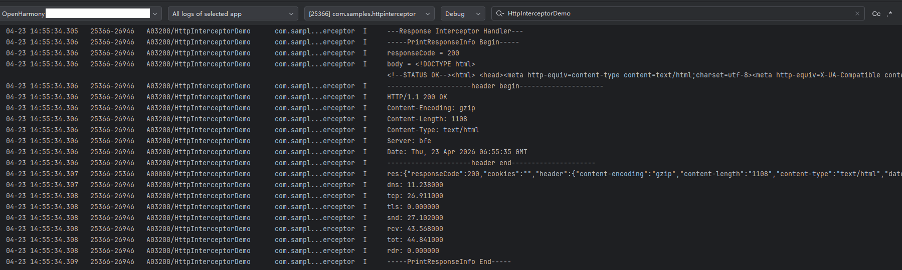

# Using HTTP Global Interceptor (C/C++)

<!--Kit: Network Kit-->
<!--Subsystem: Communication-->
<!--Owner: @wmyao_mm-->
<!--Designer: @guo-min_net-->
<!--Tester: @tongxilin-->
<!--Adviser: @zhang_yixin13-->
<!-- md-trans-meta sourceCommit=444d4b7458e1317b3c2f1a471488b9c4b8344c2e translatedAt=2026-06-03T07:17:31.344Z pushedAt=2026-06-03T10:21:32.358Z -->

## When to Use

Starting from API version 24, developers can monitor HTTP traffic and implement logging functionality through the HTTP global interceptor.

## Available APIs

Common APIs for the HTTP global interceptor are listed in the table below. For detailed API descriptions, refer to [http_interceptor.h](../reference/apis-network-kit/capi-net-http-interceptor-h.md).

| API | Description |
| -------- | -------- |
| OH_Http_AddReadOnlyInterceptor(struct OH_Http_Interceptor *interceptor) | Adds an HTTP global read-only interceptor. |
| OH_Http_RemoveInterceptor(struct OH_Http_Interceptor *interceptor) | Removes a specified HTTP global interceptor. |
| OH_Http_RemoveAllInterceptors(int32_t groupId) | Removes all HTTP global interceptors with a specified group ID. |
| OH_Http_StartAllInterceptors(int32_t groupId) | Enables all HTTP global interceptors with a specified group ID. |
| OH_Http_StopAllInterceptors(int32_t groupId) | Disables all HTTP global interceptors with a specified group ID. |

## How to Develop

To create and use an HTTP global interceptor using the APIs covered in this document, you need to first create a Native C++ project, encapsulate the relevant APIs in the source file, and then call the encapsulated APIs from the ArkTS layer. Use methods such as hilog or console.info to print logs to the console or generate device logs.

This document provides specific development guidance using the example of adding an HTTP global read-only response interceptor, enabling/disabling interceptors, and removing interceptors.

### Adding Development Dependencies

**Adding Dynamic Link Libraries**

Add the following lib to CMakeLists.txt:

```txt
libace_napi.z.so
libhttp_interceptor.so
```

**Header Files**

```c
#include "napi/native_api.h"
#include "network/netstack/http_interceptor.h"
#include "network/netstack/http_interceptor_type.h"
```

### Building the Project

1. Write code in the source file to call the API, implementing the processing functions and related operations for the HTTP global interceptor.

   <!-- @[HttpInterceptor_build_project](https://gitcode.com/openharmony/applications_app_samples/blob/master/code/DocsSample/NetWork_Kit/NetWorkKit_Datatransmission/HTTP_interceptor_C/entry/src/main/cpp/napi_init.cpp) -->

   ``` C++
   #include "napi/native_api.h"
   #include "network/netstack/http_interceptor.h"
   #include "network/netstack/http_interceptor_type.h"
   #include "hilog/log.h"
   
   #include <cstring>
   
   #undef LOG_DOMAIN
   #undef LOG_TAG
   #define LOG_DOMAIN 0x3200 // Global domain macro, identifying the business domaincro, identifying the business domain
   #define LOG_TAG "HttpInterceptorDemo"  // Global tag macro, identifying the module log tag, identifying the module log tag
   
   // Global interceptor instance
   static OH_Http_Interceptor g_responseInterceptor = {
       .groupId = 1,
       .stage = OH_STAGE_RESPONSE,
       .type = OH_TYPE_READ_ONLY,
       .enabled = 1,
       .handler = nullptr,
   };
   
   // Logging Helper Function
   void LogHeader(OH_Http_Interceptor_Headers *headers)
   {
       OH_LOG_INFO(LOG_APP, "---------------------header begin---------------------");
       while (headers != nullptr) {
           if (headers->data != nullptr) {
               OH_LOG_INFO(LOG_APP, "%{public}s", headers->data);
           }
           headers = headers->next;
       }
       OH_LOG_INFO(LOG_APP, "---------------------header end---------------------");
   }
   
   // Print Response Information
   void PrintResponseInfo(OH_Http_Interceptor_Response *response)
   {
       OH_LOG_INFO(LOG_APP, "-----PrintResponseInfo Begin-----");
       if (response != nullptr) {
           OH_LOG_INFO(LOG_APP, "responseCode = %{public}d", response->responseCode);
           if (response->body.buffer != nullptr) {
               OH_LOG_INFO(LOG_APP, "body = %{public}s", response->body.buffer);
           }
           if (response->headers != nullptr) {
               LogHeader(response->headers);
           }
   
           OH_LOG_INFO(LOG_APP, "dns: %{public}lf", response->performanceTiming.dnsTiming);
           OH_LOG_INFO(LOG_APP, "tcp: %{public}lf", response->performanceTiming.tcpTiming);
           OH_LOG_INFO(LOG_APP, "tls: %{public}lf", response->performanceTiming.tlsTiming);
           OH_LOG_INFO(LOG_APP, "snd: %{public}lf", response->performanceTiming.firstSendTiming);
           OH_LOG_INFO(LOG_APP, "rcv: %{public}lf", response->performanceTiming.firstReceiveTiming);
           OH_LOG_INFO(LOG_APP, "tot: %{public}lf", response->performanceTiming.totalFinishTiming);
           OH_LOG_INFO(LOG_APP, "rdr: %{public}lf", response->performanceTiming.redirectTiming);
           OH_LOG_INFO(LOG_APP, "-----PrintResponseInfo End-----");
       }
   }
   
   // Response Interceptor Handler
   OH_Interceptor_Result ResponseInterceptorHandler(
       OH_Http_Interceptor_Request *request,
       OH_Http_Interceptor_Response *response,
       int32_t *isModified)
   {
       (void)request;
       (void)isModified;
       
       if (response != nullptr) {
           OH_LOG_INFO(LOG_APP, "---Response Interceptor Handler---");
           PrintResponseInfo(response);
       }
       return OH_CONTINUE;
   }
   
   // Add Read-Only Response Interceptor
   static napi_value AddResponseInterceptor(napi_env env, napi_callback_info info)
   {
       napi_value result;
       
       // Set Interceptor Handler
       g_responseInterceptor.handler = ResponseInterceptorHandler;
       
       // Add Interceptor
       int ret = OH_Http_AddReadOnlyInterceptor(&g_responseInterceptor);
       
       OH_LOG_INFO(LOG_APP, "AddResponseInterceptor ret: %{public}d", ret);
       napi_create_int32(env, ret, &result);
       return result;
   }
   
   // Remove Interceptor
   static napi_value RemoveInterceptor(napi_env env, napi_callback_info info)
   {
       napi_value result;
       
       // Remove Interceptor
       int ret = OH_Http_RemoveInterceptor(&g_responseInterceptor);
       
       OH_LOG_INFO(LOG_APP, "RemoveInterceptor ret: %{public}d", ret);
       napi_create_int32(env, ret, &result);
       return result;
   }
   
   // Enable All Interceptors in a Specified Group
   static napi_value StartInterceptors(napi_env env, napi_callback_info info)
   {
       napi_value result;
       
       // Enable All Interceptors with Group ID 1
       int ret = OH_Http_StartAllInterceptors(1);
       
       OH_LOG_INFO(LOG_APP, "StartInterceptors ret: %{public}d", ret);
       napi_create_int32(env, ret, &result);
       return result;
   }
   
   // Disable all interceptors in a specified group
   static napi_value StopInterceptors(napi_env env, napi_callback_info info)
   {
       napi_value result;
       
       // Disable all interceptors in group ID 1
       int ret = OH_Http_StopAllInterceptors(1);
       
       OH_LOG_INFO(LOG_APP, "StopInterceptors ret: %{public}d", ret);
       napi_create_int32(env, ret, &result);
       return result;
   }
   
   // Remove all interceptors in a specified group
   static napi_value RemoveAllInterceptors(napi_env env, napi_callback_info info)
   {
       napi_value result;
       
       // Remove all interceptors in group ID 1
       int ret = OH_Http_RemoveAllInterceptors(1);
       
       OH_LOG_INFO(LOG_APP, "RemoveAllInterceptors ret: %{public}d", ret);
       napi_create_int32(env, ret, &result);
       return result;
   }
   ```

   The above code implements an HTTP global read-only response interceptor for monitoring HTTP responses. In the response interceptor handler, information such as the response status code, response body, response headers, and performance metrics is printed.

2. Initialize and export the `napi_value` type object encapsulated via N-API, and expose the function to JavaScript through the external function interface.

   <!-- @[HttpInterceptor_extern_c](https://gitcode.com/openharmony/applications_app_samples/blob/master/code/DocsSample/NetWork_Kit/NetWorkKit_Datatransmission/HTTP_interceptor_C/entry/src/main/cpp/napi_init.cpp) -->

   ``` C++
   EXTERN_C_START
   static napi_value Init(napi_env env, napi_value exports)
   {
       napi_property_descriptor desc[] = {
           {"AddResponseInterceptor", nullptr, AddResponseInterceptor, nullptr, nullptr, nullptr, napi_default, nullptr},
           {"RemoveInterceptor", nullptr, RemoveInterceptor, nullptr, nullptr, nullptr, napi_default, nullptr},
           {"StartInterceptors", nullptr, StartInterceptors, nullptr, nullptr, nullptr, napi_default, nullptr},
           {"StopInterceptors", nullptr, StopInterceptors, nullptr, nullptr, nullptr, napi_default, nullptr},
           {"RemoveAllInterceptors", nullptr, RemoveAllInterceptors, nullptr, nullptr, nullptr, napi_default, nullptr},
       };
       napi_define_properties(env, exports, sizeof(desc) / sizeof(desc[0]), desc);
       return exports;
   }
   EXTERN_C_END
   ```

3. Register the object successfully initialized in the previous step with Node.js using the `napi_module_register` function through the `RegisterEntryModule` function.

   <!-- @[HttpInterceptor_napi_module](https://gitcode.com/openharmony/applications_app_samples/blob/master/code/DocsSample/NetWork_Kit/NetWorkKit_Datatransmission/HTTP_interceptor_C/entry/src/main/cpp/napi_init.cpp) -->

   ``` C++
   static napi_module demoModule = {
       .nm_version = 1,
       .nm_flags = 0,
       .nm_filename = nullptr,
       .nm_register_func = Init,
       .nm_modname = "entry",
       .nm_priv = ((void *)0),
       .reserved = {0},
   };
   
   extern "C" __attribute__((constructor)) void RegisterEntryModule(void)
   {
       napi_module_register(&demoModule);
   }
   ```

4. Define the function types in the project's Index.d.ts file.

   <!-- @[HttpInterceptor_defining_function_types](https://gitcode.com/openharmony/applications_app_samples/blob/master/code/DocsSample/NetWork_Kit/NetWorkKit_Datatransmission/HTTP_interceptor_C/entry/src/main/cpp/types/libentry/Index.d.ts) -->

   ``` TypeScript
   export const AddResponseInterceptor: () => number;
   export const RemoveInterceptor: () => number;
   export const StartInterceptors: () => number;
   export const StopInterceptors: () => number;
   export const RemoveAllInterceptors: () => number;
   ```

5. Call the encapsulated interfaces described above in the Index.ets file.

   <!-- @[HttpInterceptor_C_full_example](https://gitcode.com/openharmony/applications_app_samples/blob/master/code/DocsSample/NetWork_Kit/NetWorkKit_Datatransmission/HTTP_interceptor_C/entry/src/main/ets/pages/Index.ets) -->

   ``` TypeScript
   import { hilog } from '@kit.PerformanceAnalysisKit';
   import httpInterceptor from 'libentry.so';
   import { http } from '@kit.NetworkKit';
   
   const LOG_TAG: string = 'HttpInterceptorDemo';
   const HTTP_URL_BAIDU: string = "http://www.baidu.com";
   
   @Entry
   @Component
   struct Index {
     @State message: string = 'HTTP Interceptor Demo';
   
     build() {
       Navigation() {
         Column() {
           Text(this.message)
             .fontSize(20)
             .margin({ bottom: 20 })
   
           Column({
             space: 12
           }) {
             Button('Add Response Interceptor')
               .id('AddInterceptor')
               .onClick(() => {
                 let ret = httpInterceptor.AddResponseInterceptor();
                 hilog.info(0x0000, LOG_TAG, `AddResponseInterceptor ret: ${ret}`);
               })
   
             Button('Start Interceptors')
               .id('StartInterceptors')
               .onClick(() => {
                 let ret = httpInterceptor.StartInterceptors();
                 hilog.info(0x0000, LOG_TAG, `StartInterceptors ret: ${ret}`);
               })
   
             Button('Send HTTP Request')
               .id('networkRequest')
               .onClick(() => {
                 let httpRequest: http.HttpRequest = http.createHttp();
                 let options: http.HttpRequestOptions = {
                   method: http.RequestMethod.POST,
                 };
                 httpRequest.request(HTTP_URL_BAIDU, options, (err: BusinessError, res: http.HttpResponse) => {
                   if (err) {
                     hilog.info(0x0000, LOG_TAG, `request fail, error code: ${err.code}, msg: ${err.message}`);
                     httpRequest.destroy();
                   } else {
                     hilog.info(0x0000, LOG_TAG, `res:${JSON.stringify(res)}`);
                     httpRequest.destroy();
                   }
                 });
               })
   
             Button('Stop Interceptors')
               .id('StopInterceptors')
               .onClick(() => {
                 let ret = httpInterceptor.StopInterceptors();
                 hilog.info(0x0000, LOG_TAG, `StopInterceptors ret: ${ret}`);
               })
   
             Button('Remove Interceptor')
               .id('RemoveInterceptor')
               .onClick(() => {
                 let ret = httpInterceptor.RemoveInterceptor();
                 hilog.info(0x0000, LOG_TAG, `RemoveInterceptor ret: ${ret}`);
               })
   
             Button('Remove All Interceptors')
               .id('RemoveAllInterceptors')
               .onClick(() => {
                 let ret = httpInterceptor.RemoveAllInterceptors();
                 hilog.info(0x0000, LOG_TAG, `RemoveAllInterceptors ret: ${ret}`);
               })
           }
         }
         .padding(20)
       }
     }
   }
   ```

6. Configure `CMakeLists.txt`. The shared library required for this module is `libhttp_interceptor.so`. Add this shared library to `target_link_libraries` in the project's auto-generated `CMakeLists.txt`.

   NOTE: As shown in the figure, `entry` in `add_library` is the `module name` automatically generated by the project. If you need to modify it, ensure it is consistent with `.nm_modname` in step 3.


7. Calling the HTTP global interceptor C API requires the application to have the `ohos.permission.INTERNET` permission. Add this permission in the `requestPermissions` item in `module.json5`.

After completing the above steps, the project setup is fully finished. You can then connect a device to run the project and view the logs.

## Test Steps

1. Connect the device and use DevEco Studio to open the built project.

2. Run the project. The interface shown in the following image will appear on the device.



   - Click the `Add Response Interceptor` button to add an HTTP global read-only response interceptor.


   - Click the `Start Interceptors` button to enable all interceptors with group ID 1.


   - Click the `Send HTTP Request` button. The interceptor captures the response and prints the relevant information to the log.



   - Click the `Stop Interceptors` button to disable all interceptors with group ID 1.


   - Click the `Remove Interceptor` button to remove the previously added interceptor.


   - Click the `Remove All Interceptors` button to delete all interceptors with group ID 1.


## Samples

For the development of HTTP global interceptors, the following related samples are available for reference:

- [HTTP Global Interceptor (C/C++)](https://gitcode.com/openharmony/applications_app_samples/tree/master/code/DocsSample/NetWork_Kit/NetWorkKit_Datatransmission/HTTP_interceptor_C)