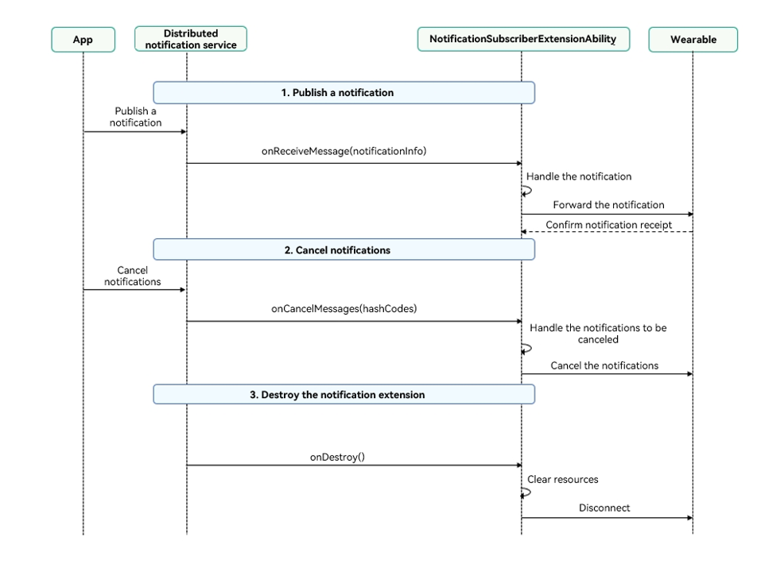

# ExtensionAbility Overview for Notification Subscription
<!--Kit: Notification Kit-->
<!--Subsystem: Notification-->
<!--Owner: @cheerful_ricky-->
<!--Designer: @dongqingran-->
<!--Tester: @wanghong1997-->
<!--Adviser: @fang-jinxu-->
## Introduction to NotificationSubscriberExtensionAbility

### Functionality Overview

[NotificationSubscriberExtensionAbility](../reference/apis-notification-kit/js-apis-notificationSubscriberExtensionAbility.md) allows third-party applications to receive system notifications and sync them with wearables, enabling notification collaboration between smartphones and third-party wearables. [NotificationSubscriberExtensionAbility](../reference/apis-notification-kit/js-apis-notificationSubscriberExtensionAbility.md) will be destroyed if no notification is published within a certain period of time.

### Prerequisites
- The user has connected the wearable to the smartphone through the corresponding application.
- In the semi-modal dialog box started by the [OpenSubscriptionSettings](../reference/apis-notification-kit/js-apis-notificationExtensionSubscription.md#notificationextensionsubscriptionopensubscriptionsettings) API of the wearable application, the user has turned on the **Allow access to notifications on this device** switch and allowed the wearable to access notifications from specified applications on the smartphone.
### When to Use
<!--Del-->
- Ecosystem requirement: Support third-party wearables to receive system notifications.
<!--DelEnd-->
- Use scenario: Synchronize notifications from the smartphone to the wearable.
- Transmission modes: Bluetooth Low Energy (BLE) and classic Bluetooth.

### Constraints
1. This sample is only supported on smartphones and tablets with standard systems.
2. This sample uses the stage model and SDK 6.0.2.54 (API version 22).
3. This sample can be compiled and run only in DevEco Studio 6.0.0 beta5 (build version: 6.0.0.848, built on September 12, 2025).
4. The third-party wearable application should request the [ohos.permission.SUBSCRIBE_NOTIFICATION](../security/AccessToken/restricted-permissions.md#ohospermissionsubscribe_notification) permission (system_basic level).

### Working Principles

