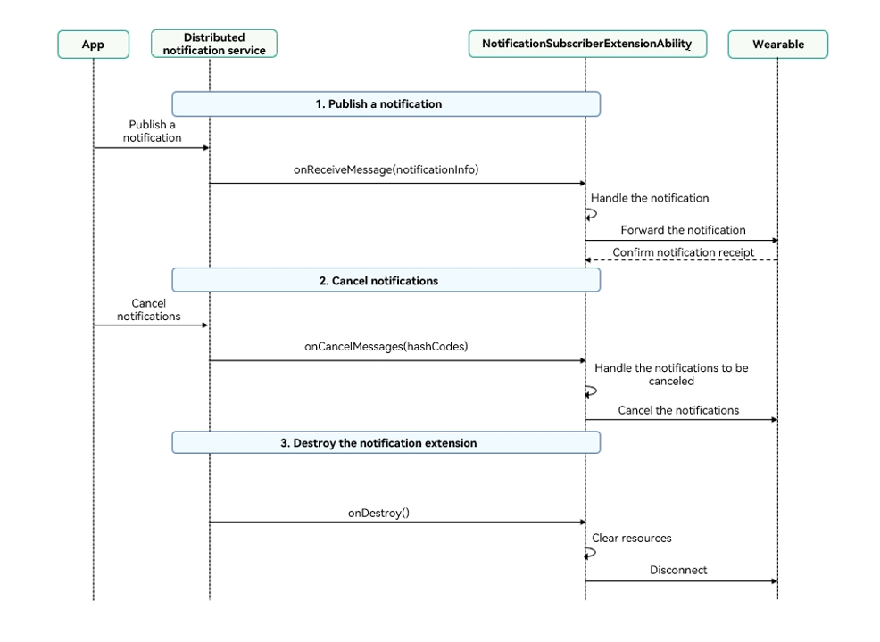

#  Introduction to NotificationSubscriberExtensionAbility
<!--Kit: Notification Kit-->
<!--Subsystem: Notification-->
<!--Owner: @cheerful_ricky-->
<!--Designer: @dongqingran-->
<!--Tester: @wanghong1997-->
<!--Adviser: @fang-jinxu-->
## Functionality Overview
The core purpose of this extension ability is to enable third-party applications to receive system notifications. Applications can implement data transmission between the phone and wearables within this extension ability. After an application sends a notification to the distributed notification service, the service forwards the notification to the [NotificationSubscriberExtensionAbility](../reference/apis-notification-kit/js-apis-notificationSubscriberExtensionAbility.md) implemented by the third-party application. If no new notification is published within a certain period, the running [NotificationSubscriberExtensionAbility](../reference/apis-notification-kit/js-apis-notificationSubscriberExtensionAbility.md) will be automatically destroyed by the system.

## Prerequisites
- The user has paired the wearable with the phone using the wearable application on the phone.
- In the semi-modal dialog box launched by the [openSubscriptionSettings](../reference/apis-notification-kit/js-apis-notificationExtensionSubscription.md#notificationextensionsubscriptionopensubscriptionsettings) API of the wearable application, the user has turned on the **Allow access to notifications on this device** switch and allowed the wearable to access notifications from specified applications on the smartphone.
- The HFP connection remains active for devices that support [HFP](../connectivity/terminology.md#hfp) connection.

## When to Use
<!--Del-->
- Ecosystem requirement: Support third-party wearables in receiving system notifications.
<!--DelEnd-->
- Use scenario: Synchronize notifications from the smartphone to the wearable.
- Transmission modes: Bluetooth Low Energy (BLE) and classic Bluetooth.

## Constraints
1. This sample is only supported on smartphones and tablets with standard systems.
2. This sample uses the stage model and requires an SDK with API version 22 or later.
3. This sample can only be compiled and run in DevEco Studio 6.0.2 or later.
4. The third-party wearable application should request the [ohos.permission.SUBSCRIBE_NOTIFICATION](../security/AccessToken/restricted-permissions.md#ohospermissionsubscribe_notification) permission (system_basic level).

## Working Principles

