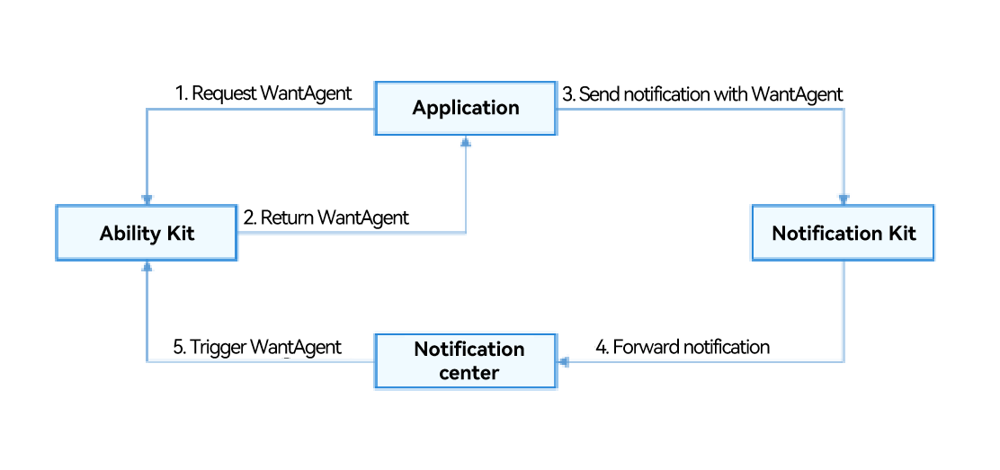

# Adding a WantAgent Object to a Notification

<!--Kit: Notification Kit-->
<!--Subsystem: Notification-->
<!--Owner: @HuYueRong-->
<!--Designer: @dongqingran-->
<!--Tester: @wanghong1997-->
<!--Adviser: @fang-jinxu-->
<!-- md-trans-meta sourceCommit=b0e965054b682272b6c9e3890a6020b1129a6551 translatedAt=2026-08-22T02:22:56.472Z pushedAt=2026-08-22T07:16:56.792Z -->

An application requests [WantAgent](../reference/apis-ability-kit/js-apis-app-ability-wantAgent.md) from Ability Kit and encapsulates it into the notification. When a notification is published, the user may tap a message or a button in the notification panel to start the target application or publish a common event.

The following figure shows a notification carrying action buttons.


## Working Principles



## Available APIs

| **API**| **Description**|
| -------- | -------- |
| [publish](../reference/apis-notification-kit/js-apis-notificationManager.md#notificationmanagerpublish-1)(request: NotificationRequest): Promise\<void\>       | Publishes a notification. |
| [getWantAgent](../reference/apis-ability-kit/js-apis-app-ability-wantAgent.md#wantagentgetwantagent)(info:&nbsp;WantAgentInfo,&nbsp;callback:&nbsp;AsyncCallback&lt;WantAgent&gt;):&nbsp;void | Creates a **WantAgent** object.|

## How to Develop

1. Import the modules.

   <!-- @[add_behavior_intent_header](https://gitcode.com/openharmony/applications_app_samples/blob/master/code/DocsSample/Notification-Kit/Notification/entry/src/main/ets/filemanager/AddWantAgent.ets) -->

   ``` TypeScript
   import { notificationManager } from '@kit.NotificationKit';
   import { wantAgent, WantAgent } from '@kit.AbilityKit';
   import { BusinessError } from '@kit.BasicServicesKit';
   import { hilog } from '@kit.PerformanceAnalysisKit';
   
   const TAG: string = '[PublishOperation]';
   const DOMAIN_NUMBER: number = 0xFF00;
   ```

2. Create a **WantAgentInfo** object.

   Scenario 1: Create a [WantAgentInfo](../reference/apis-ability-kit/js-apis-inner-wantAgent-wantAgentInfo.md) object for starting a UIAbility.

   <!-- @[create_launch_uiAbility_agent_info](https://gitcode.com/openharmony/applications_app_samples/blob/master/code/DocsSample/Notification-Kit/Notification/entry/src/main/ets/filemanager/AddWantAgent.ets) -->

   ``` TypeScript
   let wantAgentObj: WantAgent | null = null; // Store the created WantAgent object for subsequent trigger actions.
   
   // Set the action type through operationType of WantAgentInfo.
   let wantAgentInfo: wantAgent.WantAgentInfo = {
     wants: [
       {
         deviceId: '',
         bundleName: 'com.sample.eventnotification', // Use the actual bundle name.
         abilityName: 'EntryAbility', // Use the actual ability name.
         action: '',
         entities: [],
         uri: '',
         parameters: {}
       }
     ],
     actionType: wantAgent.OperationType.START_ABILITY,
     requestCode: 0,
     actionFlags: [wantAgent.WantAgentFlags.CONSTANT_FLAG]
   };
   ```

   Scenario 2: Create a [WantAgentInfo](../reference/apis-ability-kit/js-apis-inner-wantAgent-wantAgentInfo.md) object for publishing a [common event](../basic-services/common-event/common-event-overview.md).

   <!-- @[create_pub_event_agent_info](https://gitcode.com/openharmony/applications_app_samples/blob/master/code/DocsSample/Notification-Kit/Notification/entry/src/main/ets/filemanager/AddWantAgent.ets) -->

   ``` TypeScript
   let wantAgentObj: WantAgent | null = null; // Store the created WantAgent object for subsequent trigger actions.
   
   // Set the action type through operationType of WantAgentInfo.
   let wantAgentInfo: wantAgent.WantAgentInfo = {
     wants: [
       {
         action: 'event_name', // Set the action name.
         parameters: {},
       }
     ],
     actionType: wantAgent.OperationType.SEND_COMMON_EVENT,
     requestCode: 0,
     actionFlags: [wantAgent.WantAgentFlags.CONSTANT_FLAG],
   };
   ```

3. Call [getWantAgent()](../reference/apis-ability-kit/js-apis-app-ability-wantAgent.md#wantagentgetwantagent) to create a **WantAgent** object.

   <!-- @[create_get_agent](https://gitcode.com/openharmony/applications_app_samples/blob/master/code/DocsSample/Notification-Kit/Notification/entry/src/main/ets/filemanager/AddWantAgent.ets) -->

   ``` TypeScript
   // Create a WantAgent object.
   wantAgent.getWantAgent(wantAgentInfo, (err: BusinessError, data: WantAgent) => {
     if (err) {
       hilog.error(DOMAIN_NUMBER, TAG,
         `Failed to get want agent. Code is ${err.code}, message is ${err.message}`);
       return;
     }
     hilog.info(DOMAIN_NUMBER, TAG, 'Succeeded in getting want agent.');
     wantAgentObj = data;
   
     // ...
   });
   ```

4. Create a **NotificationRequest** object and publish a notification carrying **WantAgent**.

   > **NOTE**
   >
   > - If **WantAgent** is encapsulated in a notification message, you can tap the notification to trigger **WantAgent**. When the notification message contains **actionButtons**, tapping the notification first displays the **actionButtons**, and tapping the notification again triggers **WantAgent**.
   >
   > - If **WantAgent** is encapsulated in a [notification button](notification-glossary.md#notification-button), after you tap the notification, a notification button appears below the notification, and you can tap the button to trigger **WantAgent**.

   <!-- @[pub_want_agent_req_notify](https://gitcode.com/openharmony/applications_app_samples/blob/master/code/DocsSample/Notification-Kit/Notification/entry/src/main/ets/filemanager/AddWantAgent.ets) -->

   ``` TypeScript
   // Create the NotificationActionButton object.
   let actionButton: notificationManager.NotificationActionButton = {
     title: 'open_the_app',
     // Before using wantAgentObj, ensure that a value has been assigned to it (that is, step 3 is performed).
     // WantAgent of the notification buttons
     wantAgent: wantAgentObj!
   };
   
   // Create a NotificationRequest object.
   let notificationRequest: notificationManager.NotificationRequest = {
     content: {
       notificationContentType: notificationManager.ContentType.NOTIFICATION_CONTENT_BASIC_TEXT,
       normal: {
         title: 'one_button_notify',
         text: 'Click on this notification twice to open the app',
         additionalText: 'Test_AdditionalText',
       },
     },
     id: 6,
     // WantAgent of the notification
     wantAgent: wantAgentObj!,
     // Action buttons
     actionButtons: [actionButton],
   };
   
   notificationManager.publish(notificationRequest, (err: BusinessError) => {
     if (err) {
       hilog.error(DOMAIN_NUMBER, TAG,
         `Failed to publish notification. Code is ${err.code}, message is ${err.message}`);
       return;
     }
     hilog.info(DOMAIN_NUMBER, TAG, 'Succeeded in publishing notification.');
   });
   ```

<!--RP1-->

## Sample Code

  - [Custom Notification](https://gitcode.com/openharmony/applications_app_samples/blob/master/code/BasicFeature/Notification/CustomNotification/README.md)

<!--RP1End-->