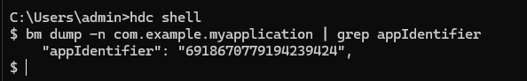
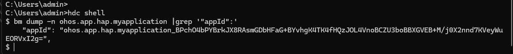

# FAQs About Application Packages
<!--Kit: Ability Kit-->
<!--Subsystem: BundleManager-->
<!--Owner: @wanghang904-->
<!--Designer: @hanfeng6-->
<!--Tester: @kongjing2-->
<!--Adviser: @Brilliantry_Rui-->

## How Do I Obtain the Fingerprint in the Signature Information?

* Call an API.

You can call [bundleManager.getBundleInfoForSelf](../reference/apis-ability-kit/js-apis-bundleManager.md#bundlemanagergetbundleinfoforself) to obtain the application's own **BundleInfo**. **BundleInfo** contains **signatureInfo**, which includes fingerprint information generated using the SHA-256 hash algorithm.

<!-- @[get_fingerprint](https://gitcode.com/openharmony/applications_app_samples/blob/master/code/DocsSample/bmsSample/CommonProblemOfApplication/entry/src/main/ets/pages/GetFingerprint.ets) -->

``` TypeScript
import { bundleManager } from '@kit.AbilityKit';
import { BusinessError } from '@kit.BasicServicesKit';

let bundleFlags = bundleManager.BundleFlag.GET_BUNDLE_INFO_WITH_APPLICATION |
  bundleManager.BundleFlag.GET_BUNDLE_INFO_WITH_SIGNATURE_INFO;
try {
  bundleManager.getBundleInfoForSelf(bundleFlags).then((bundleInfo:bundleManager.BundleInfo) => {
    console.info('testTag', 'getBundleInfoForSelf successfully. fingerprint: ', bundleInfo.signatureInfo.fingerprint);
  }).catch((err: BusinessError) => {
    console.error('testTag', 'getBundleInfoForSelf failed. Cause: ', err.message);
  });
} catch (err) {
  let message = (err as BusinessError).message;
  console.error('testTag', 'getBundleInfoForSelf failed: %{public}s', message);
}
```


* Use [Bundle Manager](../tools/bm-tool.md) to obtain the fingerprint information. The fingerprint information is generated using the SHA-256 hash algorithm.

```shell
hdc shell
# Replace **com.example.myapplication** with the actual bundle name.
bm dump -n com.example.myapplication | grep fingerprint 
```


* Obtain fingerprint information from the **.cer** certificate file. The fingerprint information is generated using the SHA-1 hash algorithm.

* Obtain fingerprint information using the keytool tool. For details, see [Generating a Signing Certificate Fingerprint](https://developer.huawei.com/consumer/en/doc/AppGallery-connect-Guides/appgallerykit-preparation-game-0000001055356911#section147011294331). The fingerprint information is generated using the SHA-256 hash algorithm.

## What Is appIdentifier?

**appIdentifier**, generated during application signing, is a field in the <!--RP1-->[profile](../security/app-provision-structure.md)<!--RP1End--> and is the unique identifier of an application. There are two ways to generate an application identifier:

1. Randomly generate the **appIdentifier** field through [automatic signing](https://developer.huawei.com/consumer/en/doc/harmonyos-guides/ide-signing#section18815157237) on DevEco Studio. Signing on different devices or re-signing will result in different values of **appIdentifier**.
2. <!--RP2-->Manually configure the signature. The **appIdentifier** field here is the same as the **app-identifier** field in the [HarmonyAppProvision configuration file](../security/app-provision-structure.md). For details, see [hapsigner Guide](../security/hapsigntool-guidelines.md).<!--RP2End-->

Therefore, manual signing is recommended in scenarios where **appIdentifier** must remain unchanged, such as cross-device debugging, cross-application interaction debugging, or multi-user development with a shared key. For details, see [Use Cases for Automatic and Manual Signing](https://developer.huawei.com/consumer/en/doc/harmonyos-guides/ide-signing#section54361623194519).

## How Do I Obtain appIdentifier from Application Information?

* You can call [bundleManager.getBundleInfoForSelf](../reference/apis-ability-kit/js-apis-bundleManager.md#bundlemanagergetbundleinfoforself) to obtain the bundle information, which contains the signature information, and signature information in turn contains the **appIdentifier**.

<!-- @[get_app_identifier](https://gitcode.com/openharmony/applications_app_samples/blob/master/code/DocsSample/bmsSample/CommonProblemOfApplication/entry/src/main/ets/pages/GetAppIdentifier.ets) -->

``` TypeScript
import { bundleManager } from '@kit.AbilityKit';
import { BusinessError } from '@kit.BasicServicesKit';

let bundleFlags = bundleManager.BundleFlag.GET_BUNDLE_INFO_WITH_APPLICATION |
  bundleManager.BundleFlag.GET_BUNDLE_INFO_WITH_SIGNATURE_INFO;
try {
  bundleManager.getBundleInfoForSelf(bundleFlags).then((bundleInfo:bundleManager.BundleInfo) => {
    console.info('testTag', 'getBundleInfoForSelf successfully. appIdentifier:', bundleInfo.signatureInfo.appIdentifier);
  }).catch((err: BusinessError) => {
    console.error('testTag', 'getBundleInfoForSelf failed. Cause:', err.message);
  });
} catch (err) {
  let message = (err as BusinessError).message;
  console.error('testTag', 'getBundleInfoForSelf failed:', message);
}
```


* Use the [bm](../tools/bm-tool.md) tool.

```shell
hdc shell
# Replace **com.example.myapplication** with the actual bundle name.
bm dump -n com.example.myapplication | grep appIdentifier
```




## What Is appId?

**appId**, the unique identifier of an application, consists of a bundle name, underscore (_), and Base64-encoded public key of the certificate. Since it changes with the public key of the signing certificate, you are advised to use [appIdentifier](#what-is-appidentifier) as the unique identifier of an application.

## How do I obtain appId from application information?

* You can call [bundleManager.getBundleInfoForSelf](../reference/apis-ability-kit/js-apis-bundleManager.md#bundlemanagergetbundleinfoforself) to obtain the bundle information, which contains the signature information, and signature information in turn contains the **appId**.

<!-- @[get_app_id](https://gitcode.com/openharmony/applications_app_samples/blob/master/code/DocsSample/bmsSample/CommonProblemOfApplication/entry/src/main/ets/pages/GetAppId.ets) -->

``` TypeScript
import { bundleManager } from '@kit.AbilityKit';
import { BusinessError } from '@kit.BasicServicesKit';

let bundleFlags = bundleManager.BundleFlag.GET_BUNDLE_INFO_WITH_APPLICATION |
  bundleManager.BundleFlag.GET_BUNDLE_INFO_WITH_SIGNATURE_INFO;
try {
  bundleManager.getBundleInfoForSelf(bundleFlags).then((bundleInfo:bundleManager.BundleInfo) => {
    console.info('testTag', 'getBundleInfoForSelf successfully. appId:', bundleInfo.signatureInfo.appId);
  }).catch((err: BusinessError) => {
    console.error('testTag', 'getBundleInfoForSelf failed. Cause:', err.message);
  });
} catch (err) {
  let message = (err as BusinessError).message;
  console.error('testTag', 'getBundleInfoForSelf failed:', message);
}
```


* Use the [bm](../tools/bm-tool.md) tool.

```shell
hdc shell
# Replace **ohos.app.hap.myapplication** with the actual bundle name.
bm dump -n ohos.app.hap.myapplication |grep '"appId":'
```


## Application UID

A UID is a unique identifier used by the system for [application sandbox](../security/AccessToken/access-token-overview.md#application-sandbox) isolation. It is assigned to each application process to ensure runtime isolation between applications, such as file system isolation and memory space isolation.

The algorithm for generating a UID is as follows: uid = userId * 200000 + (bundleId % 200000). Here, **%** indicates the modulo operation, which calculates the remainder of **bundleId** divided by 200,000. **userId** indicates the ID of the user for whom the application is installed. You can obtain it through the [getOsAccountLocalId API](../reference/apis-basic-services-kit/js-apis-osAccount.md#getosaccountlocalid9). **bundleId** indicates the unique ID of the application. Its value ranges from 10000 to 65535 and is used only internally by the system. It can be derived from **uid** and **userId**<!--Del-->, or obtained through [getBundleIdForUid](../reference/apis-basic-services-kit/js-apis-osAccount-sys.md#getbundleidforuid9)<!--DelEnd-->.

## How to Obtain the Application UID?

* Use the [bm](../tools/bm-tool.md) tool.

```shell
hdc shell
# Replace **ohos.app.hap.myapplication** with the actual bundle name.
bm dump -n ohos.app.hap.myapplication |grep uid
```


* You can call [bundleManager.getBundleInfoForSelf](../reference/apis-ability-kit/js-apis-bundleManager.md#bundlemanagergetbundleinfoforself) to obtain the application's own **BundleInfo**. For sample code, see [How do I obtain appIdentifier from application information?](#how-do-i-obtain-appidentifier-from-application-information). The UID can be obtained through **bundleInfo.appInfo.uid**.
