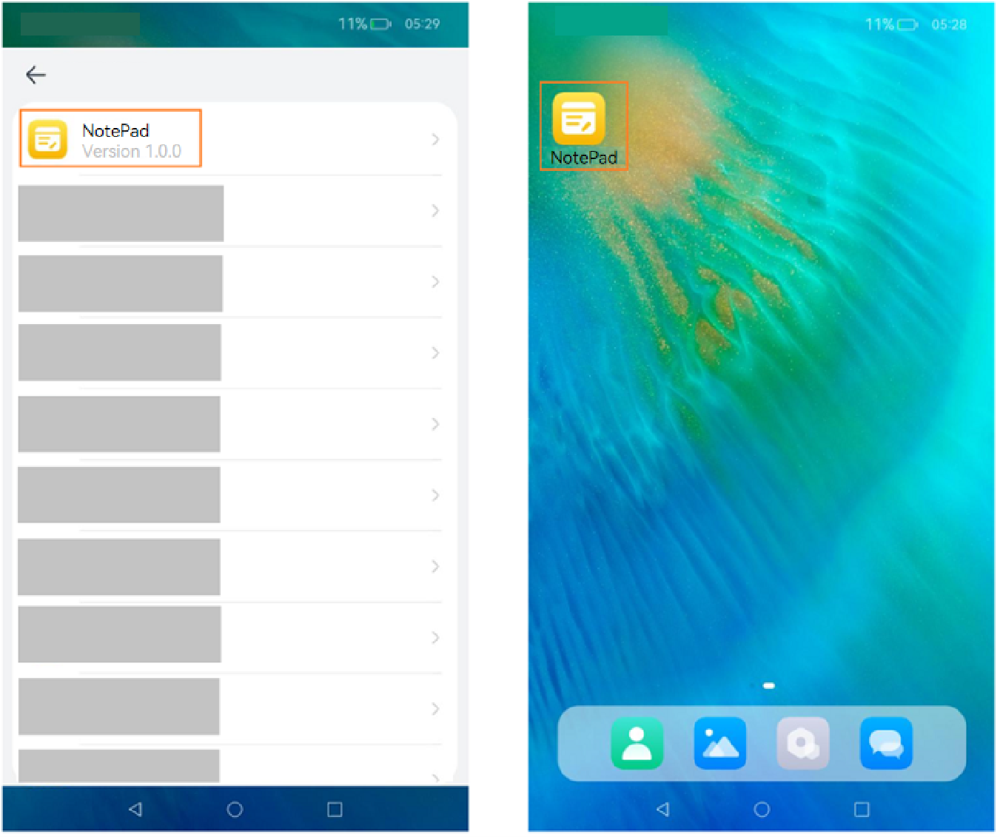

# Configuring an Application Icon and Label
<!--Kit: Ability Kit-->
<!--Subsystem: BundleManager-->
<!--Owner: @wanghang904-->
<!--Designer: @hanfeng6-->
<!--Tester: @kongjing2-->
<!--Adviser: @Brilliantry_Rui-->

This topic describes how to configure the application icon and label. Application icons are classified into single-layer icons and layered icons. A single-layer icon contains only one image, and a layered icon contains a foreground image and a background image. For details about icon specifications, see <!--RP1-->[Design Principles](https://docs.openharmony.cn/pages/v6.0/zh-cn/design/ux-design/visual-icons.md#%E8%AE%BE%E8%AE%A1%E5%8E%9F%E5%88%99)<!--RP1End-->. For details about the restrictions on icon and label configuration, see [Configuring the Application Icon and Label](../application-models/application-component-configuration-stage.md#configuring-the-application-icon-and-label).

## Use Scenarios

<!--RP2-->
- Display an application on an application screen, for example, application list in the Settings app.
- Display an application on the home screen, for example, applications displayed on the home screen or in the recent task list.
<!--RP2End-->

The display effects are as follows.
<!--RP3-->

<!--RP3End-->

## Configuration Priority and Build Policy

* For the HAP file containing UIAbility configuration, the following scenarios are possible:

  1. An entry **UIAbility** is a **UIAbility** whose **entities** in the **skills** tag contain **"entity.system.home"** and whose **actions** contain **"ohos.want.action.home"**.
  
  2. If multiple entry **UIAbilities** are configured in **module.json5**:

      * If **mainElement** in **module.json5** is configured as an entry **UIAbility**, the system returns the **icon** and **label** configured for the entry **UIAbility** specified by **mainElement**.

      * If **mainElement** is not configured in **module.json5**, or is not configured as an entry **UIAbility**, the system returns the **icon** and **label** configured for the first entry **UIAbility** in **module.json5**.

  3. In **module.json5**, the system returns the **icon** or **label** in **app.json5** in either of the following cases:

      * **mainElement** is configured as an entry **UIAbility**, but the entry **UIAbility** does not configure an **icon** or **label**.

      * **mainElement** is not configured, or is not configured as an entry **UIAbility**, and the first entry **UIAbility** in **module.json5** does not configure an **icon** or **label**.

  In a multi-HAP project, if an **entry**-type HAP exists, the **module.json5** file of the **entry**-type HAP is used. If no **entry**-type HAP exists, the system sorts the **moduleName** values of all HAPs in ASCII lexicographical order and uses the **module.json5** file of the **feature** HAP that appears last in the sorted result.

* For the HAP file that does not contain **UIAbility** configuration, the system returns the **icon** and **label** configured in **app.json5**.

>
> **NOTE**
> 
> The resource files in the **AppScope** directory are merged into the **resources** directory of the module. If files with the same name exist in these two directories, the ones in the **AppScope** directory will overwrite those in the module after build and packaging.
>
> For example, if the labels of the layered icon files configured in **app.json5** and **module.json5** are the same but the icons are different, the resource files in the **AppScope** directory overwrite those in the module. Finally, the icon configured in **app.json5** is used.
> 
> If no entry UIAbility is set in the application configuration, the application details page is displayed after you tap the application icon on the home screen. Alternatively, go to **Settings** > **Apps & services**, and tap any application to access the application details page. In other cases, the application main page is displayed after you tap the application icon on the home screen. An application does not have an entry UIAbility in either of the following scenarios:
>
>   1. The application does not have any UIAbility.
>   2. Under the **skills** tag in all **UIAbility** configurations, **entities** is not set or does not contain **entity.system.home**, and **actions** is not set or does not contain **ohos.want.action.home**.
>

## Configuring a Single-Layer Icon and Label

- **Method 1: Configuring app.json5**

  This configuration takes effect only when the **module.json5** configuration file does not contain any UIAbility or **icon** and **label** under the **abilities** tag of the UIAbility are not set. (You can manually delete the icon and label configurations).

  <!-- @[layered_image_001](https://gitcode.com/openharmony/applications_app_samples/blob/master/code/DocsSample/bmsSample/LayeredImage1/AppScope/app.json5) -->
  
  ``` JSON5
  {
    "app": {
      // ...
      "icon": "$media:app_icon",
      "label": "$string:app_name" // Configure the resource whose name is app_name in AppScope/resources/base/element/string.json. If the resource already exists, skip this step.
    }
  }
  ```

- **Method 2: Configuring module.json5**

  In addition to configuring the **icon** and **label** fields, you also need to add **entity.system.home** to **entities** and **ohos.want.action.home** to **actions** under the **skills** tag.

  <!-- @[layered_image_002](https://gitcode.com/openharmony/applications_app_samples/blob/master/code/DocsSample/bmsSample/LayeredImage1/entry/src/main/module.json5) -->
  
  ``` JSON5
  {
    "module": {
      // ...
      "abilities": [
        {
          // ...
          "icon": "$media:icon",
          // Configure the resource whose name is EntryAbility_label in entry/src/main/resources/base/element/string.json. If the resource already exists, skip this step.
          "label": "$string:EntryAbility_label",
          "skills": [
            {
              "entities": [
                "entity.system.home"
              ],
              "actions": [
                "ohos.want.action.home"
              ]
            }
          ]
        }
      ],
      // ...
    }
  }
  ```

## Configuring a Layered Icon and Label

- **Method 1: Configuring app.json5**

  This configuration takes effect only when the **module.json5** configuration file does not contain any UIAbility or **icon** and **label** under the **abilities** tag of the UIAbility are not set. (You can manually delete the icon and label configurations).

  1. Place the foreground and background resource files in **AppScope\resources\base\media**.

      In this example, the file names of the foreground and background resource files are **foreground.png** and **background.png**, respectively.

  2. In the **app_layered_image.json** file under the **AppScope\resources\base\media** directory, configure the foreground and background resources of the layered icon.

      ```json
      {
        "layered-image":
        {
          "background" : "$media:background",
          "foreground" : "$media:foreground"
        }
      }
      ```
  3. Reference the layered icon resource file in the [app.json5](app-configuration-file.md) file. Example:

      <!-- @[layered_image_003](https://gitcode.com/openharmony/applications_app_samples/blob/master/code/DocsSample/bmsSample/LayeredImage2/AppScope/app.json5) -->
      
      ``` JSON5
      {
        "app": {
          // ...
          "icon": "$media:layered_image",
          "label": "$string:app_name" // Configure the resource whose name is app_name in AppScope/resources/base/element/string.json. If the resource already exists, skip this step.
        }
      }
      ```

- **Method 2: Configuring module.json5**

  1. Place the foreground and background resource files in **entry\src\main\resources\base\media**.

      In this example, the file names of the foreground and background resource files are **foreground.png** and **background.png**, respectively.

  2. In the **layered_image.json** file under the **entry\src\main\resources\base\media** directory, configure the foreground and background resources of the layered icon.

      ```json
      {
        "layered-image":
        {
          "background" : "$media:background",
          "foreground" : "$media:foreground"
        }
      }
      ```

  3. If you need to display a **UIAbility** icon on the home screen, in addition to configuring the **icon** and **label** fields, you also need to add **entity.system.home** to **entities** and **ohos.want.action.home** to **actions** under the **skills** tag.

      <!-- @[layered_image_004](https://gitcode.com/openharmony/applications_app_samples/blob/master/code/DocsSample/bmsSample/LayeredImage2/entry/src/main/module.json5)  -->
      
      ``` JSON5
      {
        "module": {
          // ...
          "abilities": [
            {
              // ...
              // Set icon to the index of the layered icon resource file.
              "icon": "$media:layered_image",
              // Configure the resource whose name is EntryAbility_label in entry/src/main/resources/base/element/string.json. If the resource already exists, skip this step.
              "label": "$string:EntryAbility_label",
              "skills": [
                {
                  "entities": [
                    "entity.system.home"
                  ],
                  "actions": [
                    "ohos.want.action.home"
                  ]
                }
              ]
            }
          ],
          // ...
        }
      }
      ```

>
> **NOTE**
>
> Since DevEco Studio 5.0.3.814, the default template contains the layered icon resource file when an application is created. The name of the resource file generated in different versions may be different. The file name can be manually modified. If the layered icon resource file does not exist, you have to manually create it. The file name must comply with the resource naming rules and can contain only digits, letters, periods (.), and underscores (_).
>

<!--Del-->
## Management Rules

The system strictly controls applications without icons to prevent malicious applications from deliberately displaying no icon on the home screen to block uninstall attempts. Therefore, home screen icons cannot be hidden for applications except pre-installed ones.

If the pre-installed application indeed needs to hide the home screen icon, the application privilege **AllowAppDesktopIconHide** must be configured. For details about how to configure, see [Application Privilege Configuration](../../device-dev/subsystems/subsys-app-privilege-config-guide.md#general-application-privileges). After this privilege is granted, the application icon will not be displayed on the home screen.<!--DelEnd-->
