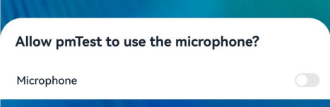
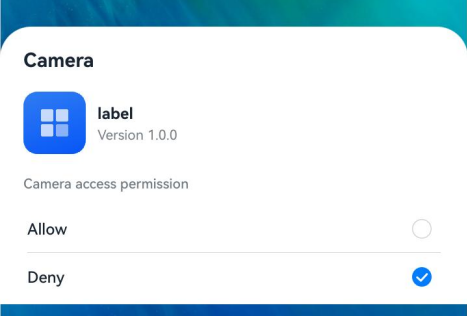
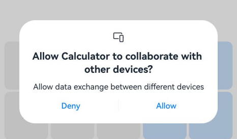

# AtManager

Program access control management class, providing capabilities such as permission verification, runtime permission dialog box request, settings page authorization guidance, global switch request, and permission status monitoring. Obtain an instance through [createAtManager](arkts-ability-abilityaccessctrl-createatmanager-f.md).

**Since:** 8

**System capability:** SystemCapability.Security.AccessToken

## Modules to Import

```TypeScript
import { abilityAccessCtrl, Context, PermissionRequestResult, Permissions } from '@kit.AbilityKit';
```

## checkAccessToken

```TypeScript
checkAccessToken(tokenID: number, permissionName: Permissions): Promise<GrantStatus>
```

Verifies whether an app has been granted the specified permission. After the call is successful, the authorization status of the current permission is returned. The developer can decide accordingly whether to directly execute subsequent services, continue to initiate a permission request, or guide the user to go to system settings to modify the authorization status. This API uses a promise to return the result.

Applicable to scenarios where a pre-permission check is performed before an app accesses protected resources such as the camera, microphone, or location.

**Since:** 9

**Atomic service API:** This API can be used in atomic services since API version 11.

**System capability:** SystemCapability.Security.AccessToken

**Parameters:**

| Name | Type | Mandatory | Description |
| --- | --- | --- | --- |
| tokenID | number | Yes | Identity identifier of the target app to be verified. It can be obtained through the [accessTokenId](arkts-ability-applicationinfo-i.md#accesstokenid) field in ApplicationInfo of BundleInfo. Passing an invalid value returns error code 12100001. <br>The value should be an integer. Value constraint: This parameter must be an integer greater than 0. <br> For BundleInfo acquisition, please refer to: [bundleManager.getBundleInfoSync](arkts-ability-bundlemanager-getbundleinfosync-f.md). <br>If verifying the current app, it can also be obtained through [bundleManager.getBundleInfoForSelfSync](arkts-ability-bundlemanager-getbundleinfoforselfsync-f.md). |
| permissionName | [Permissions](arkts-ability-permissions-t.md) | Yes | Name of the permission to be verified. Passing an invalid value returns error code 12100001.<br>Value constraint: The permission name length cannot exceed 256 characters. |

**Return value:**

| Type | Description |
| --- | --- |
| Promise&lt;[GrantStatus](arkts-ability-abilityaccessctrl-grantstatus-e.md)&gt; | Promise used to return the authorization status result. |

**Error codes:**

| Error Code ID | Error Message |
| --- | --- |
| [401](../../errorcode-universal.md#401-parameter-check-failed) | Parameter error. Possible causes: 1. Mandatory parameters are left unspecified; 2.Incorrect parameter types. |
| [12100001](../errorcode-access-token.md#12100001-invalid-parameters) | Invalid parameter. The tokenID is 0, or the permissionName exceeds 256 characters. |

**Examples**

```TypeScript
import { abilityAccessCtrl, Permissions, bundleManager } from '@kit.AbilityKit';
import { BusinessError } from '@kit.BasicServicesKit';

// Create a permission manager instance
let atManager: abilityAccessCtrl.AtManager = abilityAccessCtrl.createAtManager();
// Obtain the bundleInfo of the app
let bundleInfo = bundleManager.getBundleInfoForSelfSync(bundleManager.BundleFlag.GET_BUNDLE_INFO_WITH_APPLICATION);
// Obtain the TokenID of the app
let tokenID: number = bundleInfo.appInfo.accessTokenId;
// Set the permission name to be verified
let permissionName: Permissions = 'ohos.permission.GRANT_SENSITIVE_PERMISSIONS';
// Verify whether the app has been granted the permission
atManager.checkAccessToken(tokenID, permissionName).then((data: abilityAccessCtrl.GrantStatus) => {
  console.info(`checkAccessToken success, result: ${data}`);
}).catch((err: BusinessError): void => {
  console.error(`checkAccessToken fail, code: ${err.code}, message: ${err.message}`);
});
```

## checkAccessTokenSync

```TypeScript
checkAccessTokenSync(tokenID: number, permissionName: Permissions): GrantStatus
```

Verifies whether an app has been granted the specified permission, and synchronously returns the authorization status of the permission. The developer can decide accordingly whether to directly execute subsequent service processes, continue to initiate a permission request, or guide the user to go to the settings page to modify the authorization status.

Compared with [checkAccessToken](#checkaccesstoken), this API returns the authorization status synchronously, making it suitable for permission verification scenarios that do not require asynchronous processing.

Applicable to scenarios where a pre-permission check is performed before an app accesses protected resources such as the camera, microphone, or location.

**Since:** 10

**Atomic service API:** This API can be used in atomic services since API version 11.

**System capability:** SystemCapability.Security.AccessToken

**Parameters:**

| Name | Type | Mandatory | Description |
| --- | --- | --- | --- |
| tokenID | number | Yes | Identity identifier of the target app to be verified. It can be obtained through the [accessTokenId](arkts-ability-applicationinfo-i.md#accesstokenid) field in ApplicationInfo of BundleInfo. Passing an invalid value returns error code 12100001. <br>The value should be an integer. Value constraint: This parameter must be an integer greater than 0. <br> For BundleInfo acquisition, please refer to: [bundleManager.getBundleInfoSync](arkts-ability-bundlemanager-getbundleinfosync-f.md). <br>If verifying the current app, it can also be obtained through [bundleManager.getBundleInfoForSelfSync](arkts-ability-bundlemanager-getbundleinfoforselfsync-f.md). |
| permissionName | [Permissions](arkts-ability-permissions-t.md) | Yes | Name of the permission to be verified. Passing an invalid value returns error code 12100001.<br>Value constraint: The permission name length cannot exceed 256 characters. |

**Return value:**

| Type | Description |
| --- | --- |
| [GrantStatus](arkts-ability-abilityaccessctrl-grantstatus-e.md) | Permission grant state. |

**Error codes:**

| Error Code ID | Error Message |
| --- | --- |
| [401](../../errorcode-universal.md#401-parameter-check-failed) | Parameter error. Possible causes: 1. Mandatory parameters are left unspecified; 2. Incorrect parameter types. |
| [12100001](../errorcode-access-token.md#12100001-invalid-parameters) | Invalid parameter. The tokenID is 0, or the permissionName exceeds 256 characters. |

**Examples**

```TypeScript
import { abilityAccessCtrl, Permissions, bundleManager } from '@kit.AbilityKit';

// Create a permission manager instance
let atManager: abilityAccessCtrl.AtManager = abilityAccessCtrl.createAtManager();
// Obtain the bundleInfo of the app
let bundleInfo = bundleManager.getBundleInfoForSelfSync(bundleManager.BundleFlag.GET_BUNDLE_INFO_WITH_APPLICATION);
// Obtain the TokenID of the app
let tokenID: number = bundleInfo.appInfo.accessTokenId;
// Set the permission name to be verified
let permissionName: Permissions = 'ohos.permission.GRANT_SENSITIVE_PERMISSIONS';
// Synchronously verify whether the app has been granted the permission
let data: abilityAccessCtrl.GrantStatus = atManager.checkAccessTokenSync(tokenID, permissionName);
console.info(`Result: ${data}`);
```

## getSelfPermissionStatus

```TypeScript
getSelfPermissionStatus(permissionName: Permissions): PermissionStatus
```

Queries the permission status of the current app and returns the result synchronously. After the call is successful, the status of the current permission is returned. Unlike [checkAccessToken](#checkaccesstoken), this API does not require passing in the app identity and is only used to query the permission status of the current app itself.

Applicable to scenarios such as before determining whether to request a permission, confirming the authorization result after a permission request, or re-querying after monitoring a permission status change.

**Since:** 20

**Atomic service API:** This API can be used in atomic services since API version 20.

**System capability:** SystemCapability.Security.AccessToken

**Parameters:**

| Name | Type | Mandatory | Description |
| --- | --- | --- | --- |
| permissionName | [Permissions](arkts-ability-permissions-t.md) | Yes | Name of the permission whose status is to be queried. Passing an invalid value returns error code 12100001.<br>Value constraint: The permission name length cannot exceed 256 characters. |

**Return value:**

| Type | Description |
| --- | --- |
| [PermissionStatus](arkts-ability-abilityaccessctrl-permissionstatus-e.md) | Permission status. |

**Error codes:**

| Error Code ID | Error Message |
| --- | --- |
| [12100001](../errorcode-access-token.md#12100001-invalid-parameters) | Invalid parameter. The permissionName is empty or exceeds 256 characters. |
| [12100007](../errorcode-access-token.md#12100007-system-service-not-working-properly) | Service exception. |

**Examples**

```TypeScript
import { abilityAccessCtrl } from '@kit.AbilityKit';
import { BusinessError } from '@kit.BasicServicesKit';

// Create a permission management instance
let atManager: abilityAccessCtrl.AtManager = abilityAccessCtrl.createAtManager();
try {
  // Query the permission status of the current app
  let data: abilityAccessCtrl.PermissionStatus = atManager.getSelfPermissionStatus('ohos.permission.CAMERA');
  console.info(`getSelfPermissionStatus success, result: ${data}`);
} catch (err) {
  let error = err as BusinessError;
  console.error(`getSelfPermissionStatus fail, code: ${error.code}, message: ${error.message}`);
}
```

## off('selfPermissionStateChange')

```TypeScript
off(
      type: 'selfPermissionStateChange',
      permissionList: Array<Permissions>,
      callback?: Callback<PermissionStateChangeInfo>
    ): void
```

Unsubscribes from permission status change events for the specified permission list of itself. After the unsubscription is successful, status change notifications for the specified permission list will no longer be received.

This API can be called to unsubscribe in scenarios such as when there is no need to continue monitoring permission changes, when the app exits, or when switching pages.

When the callback parameter is not passed in, all callback functions associated with the permissionList will be deleted in batch.

This API is usually used in conjunction with [on](arkts-ability-abilityaccessctrl-atmanager-i-sys.md#on) to cancel the monitoring relationship created through on.

**Since:** 18

**Atomic service API:** This API can be used in atomic services since API version 18.

**System capability:** SystemCapability.Security.AccessToken

**Parameters:**

| Name | Type | Mandatory | Description |
| --- | --- | --- | --- |
| type | 'selfPermissionStateChange' | Yes | Type of the unsubscription event, which is fixed as'selfPermissionStateChange', indicating a permission status change event. |
| permissionList | Array&lt;[Permissions](arkts-ability-permissions-t.md)&gt; | Yes | List of permission names to unsubscribe from. If empty, it indicates unsubscribing from all permission status changes, and must match the permission list used during [on](arkts-ability-abilityaccessctrl-atmanager-i-sys.md#on) subscription (order insensitive). <br>The maximum length is 1024. Value constraint: Each permission name in the list must be a valid permission name, and its length cannot exceed 256 characters. |
| callback | [Callback](../../apis-basic-services-kit/arkts-apis/arkts-basicservices-base-callback-i.md)&lt;[PermissionStateChangeInfo](arkts-ability-abilityaccessctrl-permissionstatechangeinfo-i.md)&gt; | No | Callback function. Callback for unsubscribing from the status change event of the specified permission names. If this parameter is not passed, all callback functions associated with permissionList will be deleted in batch. |

**Error codes:**

| Error Code ID | Error Message |
| --- | --- |
| [401](../../errorcode-universal.md#401-parameter-check-failed) | Parameter error. Possible causes: 1. Mandatory parameters are left unspecified; 2. Incorrect parameter types. |
| [12100004](../errorcode-access-token.md#12100004-listener-apis-not-used-in-pairs) | The API is not used in pair with 'on'. |
| [12100007](../errorcode-access-token.md#12100007-system-service-not-working-properly) | Service exception. |

**Examples**

```TypeScript
import { abilityAccessCtrl, Permissions } from '@kit.AbilityKit';
import { BusinessError } from '@kit.BasicServicesKit';

try {
  // Create a permission management instance
  let atManager: abilityAccessCtrl.AtManager = abilityAccessCtrl.createAtManager();
  // Set the permission list to unsubscribe from
  let permissionList: Array<Permissions> = ['ohos.permission.APPROXIMATELY_LOCATION'];
  // Unsubscribe from permission status changes
  atManager.off('selfPermissionStateChange', permissionList);
} catch (err) {
  let error = err as BusinessError;
  console.error(`Code: ${error.code}, message: ${error.message}`);
}
```

```TypeScript
import { abilityAccessCtrl, Permissions, bundleManager } from '@kit.AbilityKit';
import { BusinessError } from '@kit.BasicServicesKit';

try {
  let atManager: abilityAccessCtrl.AtManager = abilityAccessCtrl.createAtManager();
  let bundleInfo: bundleManager.BundleInfo = bundleManager.getBundleInfoForSelfSync(bundleManager.BundleFlag.GET_BUNDLE_INFO_WITH_APPLICATION);
  let tokenIDList: Array<number> = [bundleInfo.appInfo.accessTokenId];
  let permissionList: Array<Permissions> = ['ohos.permission.DISTRIBUTED_DATASYNC'];
  atManager.off('permissionStateChange', tokenIDList, permissionList);
} catch (err) {
  let error = err as BusinessError;
  console.error(`catch errcode: ${error.code}, message: ${error.message}`);
}
```

## on('selfPermissionStateChange')

```TypeScript
on(
      type: 'selfPermissionStateChange',
      permissionList: Array<Permissions>,
      callback: Callback<PermissionStateChangeInfo>
    ): void
```

Subscribes to permission authorization status change events for a specified permission list of this app, using an asynchronous callback. It can be used in scenarios such as updating the UI or service logic in real time based on permission status, and monitoring user authorization behavior. When monitoring is no longer needed, call [off](arkts-ability-abilityaccessctrl-atmanager-i-sys.md#off) to unsubscribe.

- When this subscription API is called for multiple times, if the subscribed permission lists are the same but  
the callbacks are different, the subscription is successful.  
- When this subscription API is called for multiple times, if the subscribed permission lists contain the same  
subset and the callbacks are the same, the subscription fails.

There are two possible scenarios when the permission status changes from "authorized" to "unauthorized":

- User actively revokes: The system will terminate the corresponding app process.  
- System actively reclaims: The app process will not be terminated. A typical scenario is the one-time  
authorization of a security component, which is automatically reclaimed by the system after the authorization period ends.

This API is usually used in conjunction with [off](arkts-ability-abilityaccessctrl-atmanager-i-sys.md#off). When monitoring is no longer needed, call off to unsubscribe.

**Since:** 18

**Atomic service API:** This API can be used in atomic services since API version 18.

**System capability:** SystemCapability.Security.AccessToken

**Parameters:**

| Name | Type | Mandatory | Description |
| --- | --- | --- | --- |
| type | 'selfPermissionStateChange' | Yes | Event type. The value is **'selfPermissionStateChange'**, which indicates the changes in the permission states specific to this application alone. |
| permissionList | Array&lt;[Permissions](arkts-ability-permissions-t.md)&gt; | Yes | List of permission names to subscribe to. Passing an invalid value returns error code 12100001.<br>The maximum length is 1024. Value constraint: Each permission name in the list must be a valid permission name, and its length cannot exceed 256 characters. |
| callback | [Callback](../../apis-basic-services-kit/arkts-apis/arkts-basicservices-base-callback-i.md)&lt;[PermissionStateChangeInfo](arkts-ability-abilityaccessctrl-permissionstatechangeinfo-i.md)&gt; | Yes | Callback used to return the result. Callback for subscribing to status change events of the specified permission name. |

**Error codes:**

| Error Code ID | Error Message |
| --- | --- |
| [401](../../errorcode-universal.md#401-parameter-check-failed) | Parameter error. Possible causes: 1. Mandatory parameters are left unspecified; 2. Incorrect parameter types. |
| [12100001](../errorcode-access-token.md#12100001-invalid-parameters) | Invalid parameter. Possible causes: 1. The permissionList exceeds the size limit; 2. The permissionNames in the list are all invalid. |
| [12100004](../errorcode-access-token.md#12100004-listener-apis-not-used-in-pairs) | The API is used repeatedly with the same input. |
| [12100005](../errorcode-access-token.md#12100005-listener-overflows) | The registration time has exceeded the limit. |
| [12100007](../errorcode-access-token.md#12100007-system-service-not-working-properly) | Service exception. |

**Examples**

```TypeScript
import { abilityAccessCtrl, Permissions } from '@kit.AbilityKit';
import { BusinessError } from '@kit.BasicServicesKit';

try {
  // Create a permission management instance
  let atManager: abilityAccessCtrl.AtManager = abilityAccessCtrl.createAtManager();
  // Set the list of permissions to subscribe to
  let permissionList: Array<Permissions> = ['ohos.permission.APPROXIMATELY_LOCATION'];
  // Subscribe to permission status changes
  atManager.on('selfPermissionStateChange', permissionList, (data: abilityAccessCtrl.PermissionStateChangeInfo) => {
    console.info('receive permission state change');
    console.info(`data change: ${data.change}, tokenID: ${data.tokenID}, permission name: ${data.permissionName}`);
  });
} catch (err) {
  let error = err as BusinessError;
  console.error(`Code: ${error.code}, message: ${error.message}`);
}
```

```TypeScript
import { abilityAccessCtrl, Permissions, bundleManager } from '@kit.AbilityKit';
import { BusinessError } from '@kit.BasicServicesKit';

try {
  let atManager: abilityAccessCtrl.AtManager = abilityAccessCtrl.createAtManager();
  let bundleInfo: bundleManager.BundleInfo = bundleManager.getBundleInfoForSelfSync(bundleManager.BundleFlag.GET_BUNDLE_INFO_WITH_APPLICATION);
  let tokenIDList: Array<number> = [bundleInfo.appInfo.accessTokenId];
  let permissionList: Array<Permissions> = ['ohos.permission.DISTRIBUTED_DATASYNC'];

  atManager.on('permissionStateChange', tokenIDList, permissionList, (data: abilityAccessCtrl.PermissionStateChangeInfo) => {
    console.info('receive permission state change');
    console.info(`data change: ${data.change}, tokenID: ${data.tokenID}, permission name: ${data.permissionName}`);
    });
} catch (err) {
  let error = err as BusinessError;
  console.error(`catch errcode: ${error.code}, message: ${error.message}`);
}
```

## openPermissionOnSetting

```TypeScript
openPermissionOnSetting(context: Context, permission: Permissions): Promise<SelectedResult>
```

Used by [UIAbility](arkts-ability-app-ability-uiability-uiability-c.md)/ [UIExtensionAbility](arkts-ability-app-ability-uiextensionability-uiextensionability-c.md) to bring up the permission settings page. After the call is successful, the permission settings page will be opened. After the user operates on the page, the user's selection result on the settings page will be returned. This API uses a promise to return the result.

Applicable to scenarios where [manual_settings](../../../security/AccessToken/app-permission-mgmt-overview.md#manual_settings-manual-authorization) type permissions cannot be applied for through the normal authorization dialog box and the user must be guided to enter system settings to complete authorization. manual_settings type permissions are permissions that can only be manually enabled by the user in system settings and cannot be directly applied for through the normal authorization dialog box.

**Since:** 22

**Model restriction:** This API can be used only in the stage model.

**System capability:** SystemCapability.Security.AccessToken

**Parameters:**

| Name | Type | Mandatory | Description |
| --- | --- | --- | --- |
| context | [Context](arkts-ability-context-t.md) | Yes | Context of the UIAbility or UIExtensionAbility requesting the permission. If the context of another app, an invalid page, or a non-stage model is passed in, the API may report an error or fail to open the settings page. |
| permission | [Permissions](arkts-ability-permissions-t.md) | Yes | Name of the permission for which the settings page needs to be opened. If an invalid permission or a permission not declared in module.json is passed in, error code 12100001 is returned. Only permissions of the [manual_settings](../../../security/AccessToken/app-permission-mgmt-overview.md#manual_settings-manual-authorization) type are supported. If a permission of another type is passed in, error code 12100014 is returned. <br>Value constraint: The permission name cannot exceed 256 characters. |

**Return value:**

| Type | Description |
| --- | --- |
| Promise&lt;[SelectedResult](arkts-ability-abilityaccessctrl-selectedresult-e.md)&gt; | Promise used to return the user's selection result on the settings page. |

**Error codes:**

| Error Code ID | Error Message |
| --- | --- |
| [12100001](../errorcode-access-token.md#12100001-invalid-parameters) | Invalid parameter. Possible causes: 1. The context is invalid because it does not belong to the application itself; 2. The permission is invalid or not declared in the module.json file. |
| [12100009](../errorcode-access-token.md#12100009-internal-service-error) | Common inner error. An error occurs when creating the pop-up window or obtaining the user operation result. |
| [12100014](../errorcode-access-token.md#12100014-unexpected-permission) | Unexpected permission. The permission is not a manual_settings permission. |

**Examples**

```TypeScript
For details about how to obtain the context in the example, see [Obtaining the Context of UIAbility](../../../application-models/uiability-usage.md#obtaining-the-context-of-uiability).
```

## requestGlobalSwitch

```TypeScript
requestGlobalSwitch(context: Context, type: SwitchType): Promise<boolean>
```

Used by UIAbility/UIExtensionAbility to bring up the global switch settings dialog box. After the call is successful, if the global switch is off, the global switch settings interface will pop up for the user to operate. If the global switch is already on, the dialog box will not be brought up and **true** will be returned. This API uses a promise to return the result.

Applicable to scenarios that depend on system-level global switches (such as camera, microphone, and location) being turned on.

When an app needs to use functions such as the camera, microphone, or location that require global switch control, if the corresponding global switch is turned off, the app can bring up this dialog box to request the user to turn on the corresponding function. If the current global switch status is on, the dialog box will not be brought up.

&lt;!--RP5--&gt;



&lt;!--RP5End--&gt;

**Since:** 12

**Model restriction:** This API can be used only in the stage model.

**Atomic service API:** This API can be used in atomic services since API version 12.

**System capability:** SystemCapability.Security.AccessToken

**Parameters:**

| Name | Type | Mandatory | Description |
| --- | --- | --- | --- |
| context | [Context](arkts-ability-context-t.md) | Yes | Context of the UIAbility or UIExtensionAbility that requests the global switch. If the context of another app, an invalid page, or a non-stage model is passed in, the API may report an error or fail to display the dialog box. |
| type | [SwitchType](arkts-ability-abilityaccessctrl-switchtype-e.md) | Yes | Specifies the type of global switch to request to enable. |

**Return value:**

| Type | Description |
| --- | --- |
| Promise&lt;boolean&gt; | Promise used to return the result. The value **true** indicates the current global switch is enabled, and **false** indicates the current global switch is still disabled. |

**Error codes:**

| Error Code ID | Error Message |
| --- | --- |
| [401](../../errorcode-universal.md#401-parameter-check-failed) | Parameter error. Possible causes: 1. Mandatory parameters are left unspecified; 2. Incorrect parameter types. |
| [12100001](../errorcode-access-token.md#12100001-invalid-parameters) | Invalid parameter. Possible causes: 1. The context is invalid because it does not belong to the application itself; 2. The type of global switch is not supported. |
| [12100009](../errorcode-access-token.md#12100009-internal-service-error) | Common inner error. An error occurs when creating the pop-up window or obtaining user operation result. |
| [12100013](../errorcode-access-token.md#12100013-global-switch-enabled) | The specific global switch is already open. |

**Examples**

```TypeScript
For details about how to obtain the context in the example, see [Obtaining the Context of UIAbility](../../../application-models/uiability-usage.md#obtaining-the-context-of-uiability).
```

## requestPermissionOnSetting

```TypeScript
requestPermissionOnSetting(context: Context, permissionList: Array<Permissions>): Promise<Array<GrantStatus>>
```

Used by [UIAbility](arkts-ability-app-ability-uiability-uiability-c.md)/ [UIExtensionAbility](arkts-ability-app-ability-uiextensionability-uiextensionability-c.md) to bring up the permission settings dialog box for a second time, and returns an array of authorization statuses. This API uses a promise to return the result.

Applicable to scenarios where the user has already denied the permission grant in the first dialog box and needs to continue applying for the permission through the settings page.

Before calling this API, the app needs to call [requestPermissionsFromUser](#requestpermissionsfromuser) first. If the user has already authorized in the first dialog box, calling this API will not bring up the authorization dialog box.

&lt;!--RP4--&gt;



&lt;!--RP4End--&gt;

**Since:** 12

**Model restriction:** This API can be used only in the stage model.

**Atomic service API:** This API can be used in atomic services since API version 12.

**System capability:** SystemCapability.Security.AccessToken

**Parameters:**

| Name | Type | Mandatory | Description |
| --- | --- | --- | --- |
| context | [Context](arkts-ability-context-t.md) | Yes | Context of the UIAbility or UIExtensionAbility requesting the permission. If the context of another app, an invalid page, or a non-stage model is passed in, the API may report an error or fail to display the pop-up window. |
| permissionList | Array&lt;[Permissions](arkts-ability-permissions-t.md)&gt; | Yes | List of permission names. This array cannot be empty. Only user_grant permissions that have been declared and for which the user has revoked authorization can be passed in, and the permissions passed in must belong to the same [permission group](../../../security/AccessToken/app-permission-group-list.md). <br>Value constraint: The permission name length cannot exceed 256 characters. |

**Return value:**

| Type | Description |
| --- | --- |
| Promise&lt;Array&lt;[GrantStatus](arkts-ability-abilityaccessctrl-grantstatus-e.md)&gt;&gt; | Promise used to return an array of authorization statuses. Each element in the array corresponds to the authorization result of the respective permission in permissionList. |

**Error codes:**

| Error Code ID | Error Message |
| --- | --- |
| [12100001](../errorcode-access-token.md#12100001-invalid-parameters) | Invalid parameter. Possible causes: 1. The context is invalid because it does not belong to the application itself; 2. The permission list contains the permission that is not declared in the module.json file; 3. The permission list is invalid because the permissions in it do not belong to the same permission group; 4. The permission list contains one or more system_grant permissions. |
| [12100009](../errorcode-access-token.md#12100009-internal-service-error) | Common inner error. An error occurs when creating the pop-up window or obtaining the user operation result. |
| [12100010](../errorcode-access-token.md#12100010-pending-request) | The request already exists.<br>**Applicable version:** 12 - 20 |
| [12100011](../errorcode-access-token.md#12100011-all-requested-permissions-granted) | All permissions in the permission list have been granted. |
| [12100012](../errorcode-access-token.md#12100012-not-all-permissions-are-rejected-by-the-user) | The permission list contains the permission that has not been revoked by the user. |
| [12100014](../errorcode-access-token.md#12100014-unexpected-permission) | Unexpected permission. You cannot request this type of permission from users via a pop-up window.<br>**Applicable version:** 21 and later |

**Examples**

```TypeScript
For details about how to obtain the context in the example, see [Obtaining the Context of UIAbility](../../../application-models/uiability-usage.md#obtaining-the-context-of-uiability).
```

## requestPermissionsFromUser

```TypeScript
requestPermissionsFromUser(context: Context, permissionList: Array<Permissions>, requestCallback: AsyncCallback<PermissionRequestResult>) : void
```

Used by &lt;!--RP1--&gt;[UIAbility](arkts-ability-app-ability-uiability-uiability-c.md)&lt;!--RP1End--&gt; to bring up a dialog box to request [user authorization](../../../security/AccessToken/request-user-authorization.md), and returns the authorization result of the permissions requested this time. This API uses an asynchronous callback to return the result.

Applicable to scenarios where an app proactively applies for [user_grant](../../../security/AccessToken/app-permission-mgmt-overview.md#user_grant-user-authorization) permissions from the user before accessing protected resources for the first time.

If the user denies authorization, the authorization dialog box cannot be brought up again through this API. The developer can guide the user to go to the system settings interface for manual authorization, or call [requestPermissionOnSetting](#requestpermissiononsetting) to bring up the permission settings dialog box to guide the user to complete authorization.

&lt;!--RP3--&gt;



&lt;!--RP3End--&gt;

**Since:** 9

**Model restriction:** This API can be used only in the stage model.

**Atomic service API:** This API can be used in atomic services since API version 12.

**System capability:** SystemCapability.Security.AccessToken

**Parameters:**

| Name | Type | Mandatory | Description |
| --- | --- | --- | --- |
| context | [Context](arkts-ability-context-t.md) | Yes | Context of the &lt;!--RP1--&gt;UIAbility&lt;!--RP1End--&gt; requesting the permission.<br>If the context of another app, an invalid page, or a non-stage model is passed in, the API may report an error or fail to display the dialog box. |
| permissionList | Array&lt;[Permissions](arkts-ability-permissions-t.md)&gt; | Yes | List of permission names. It is recommended to pass in only the sensitive permissions necessary for the current business scenario, avoiding requesting too many permissions at once.<br>The minimum length is 1. Value constraint: The permission name can contain a maximum of 256 characters. |
| requestCallback | [AsyncCallback](../../apis-basic-services-kit/arkts-apis/arkts-basicservices-base-asynccallback-i.md)&lt;[PermissionRequestResult](arkts-ability-permissionrequestresult-t.md)&gt; | Yes | Callback function. After the call is complete, error information is returned through **err**, and the permission request result object is returned through **data**. The developer can determine whether the user has authorized, whether a dialog box has been displayed, and the reason for failure based on the permission request result. |

**Error codes:**

| Error Code ID | Error Message |
| --- | --- |
| [401](../../errorcode-universal.md#401-parameter-check-failed) | Parameter error. Possible causes: 1. Mandatory parameters are left unspecified; 2. Incorrect parameter types. |
| [12100001](../errorcode-access-token.md#12100001-invalid-parameters) | (Deprecated in 12) Invalid parameter. The context is invalid when it does not belong to the application itself. |
| [12100009](../errorcode-access-token.md#12100009-internal-service-error) | Common inner error. An error occurs when creating the pop-up window or obtaining user operation results. |

**Examples**

```TypeScript
For details about how to obtain the context in the example, see [Obtaining the Context of UIAbility](../../../application-models/uiability-usage.md#obtaining-the-context-of-uiability).

For details about the process and example of applying for user authorization, see [Requesting User Authorization](../../../security/AccessToken/request-user-authorization.md).
```

## requestPermissionsFromUser

```TypeScript
requestPermissionsFromUser(context: Context, permissionList: Array<Permissions>) : Promise<PermissionRequestResult>
```

Used by &lt;!--RP1--&gt;[UIAbility](arkts-ability-app-ability-uiability-uiability-c.md)&lt;!--RP1End--&gt; to bring up a dialog box to request [user authorization](../../../security/AccessToken/request-user-authorization.md), and returns the authorization result of the permissions requested this time. This API uses a promise to return the result.

Applicable to scenarios where an app proactively applies for user_grant permissions from the user before accessing protected resources for the first time.

If the user denies authorization, the authorization dialog box cannot be brought up again through this API. The developer can guide the user to go to the system settings interface for manual authorization, or call [requestPermissionOnSetting](#requestpermissiononsetting) to bring up the permission settings dialog box to guide the user to complete authorization.

**Since:** 9

**Model restriction:** This API can be used only in the stage model.

**Atomic service API:** This API can be used in atomic services since API version 11.

**System capability:** SystemCapability.Security.AccessToken

**Parameters:**

| Name | Type | Mandatory | Description |
| --- | --- | --- | --- |
| context | [Context](arkts-ability-context-t.md) | Yes | Context of the &lt;!--RP1--&gt;UIAbility&lt;!--RP1End--&gt; requesting the permission. If the context of another app, an invalid page, or a non-stage model is passed in, the API may report an error or fail to display the dialog box. |
| permissionList | Array&lt;[Permissions](arkts-ability-permissions-t.md)&gt; | Yes | List of permission names. This array cannot be empty. It is recommended to pass in only the sensitive permissions necessary for the current business scenario and avoid requesting too many permissions at once.<br>The minimum length is 1. Value constraint: The length of a permission name cannot exceed 256 characters. |

**Return value:**

| Type | Description |
| --- | --- |
| Promise&lt;[PermissionRequestResult](arkts-ability-permissionrequestresult-t.md)&gt; | Promise used to return the permission request result object, which contains information such as the permission array, the authorization result of each permission, whether to show a dialog box, and the failure reason. |

**Error codes:**

| Error Code ID | Error Message |
| --- | --- |
| [401](../../errorcode-universal.md#401-parameter-check-failed) | Parameter error. Possible causes: 1. Mandatory parameters are left unspecified; 2. Incorrect parameter types. |
| [12100001](../errorcode-access-token.md#12100001-invalid-parameters) | (Deprecated in 12) Invalid parameter. The context is invalid when it does not belong to the application itself. |
| [12100009](../errorcode-access-token.md#12100009-internal-service-error) | Common inner error. An error occurs when creating the pop-up window or obtaining the user operation result.<br>**Applicable version:** 11 and later |

**Examples**

See [requestPermissionsFromUser](#requestpermissionsfromuser)

## verifyAccessToken

```TypeScript
verifyAccessToken(tokenID: number, permissionName: Permissions): Promise<GrantStatus>
```

Verifies whether an app has been granted the specified permission. After the call is successful, the authorization status of the current permission is returned. The developer can decide accordingly whether to directly execute subsequent services, continue to initiate a permission request, or guide the user to go to system settings to modify the authorization status. This API uses a promise to return the result.

Applicable to scenarios where a pre-permission check is performed before an app accesses protected resources.

> **NOTE:** 
> You are advised to use [checkAccessToken](#checkaccesstoken).

**Since:** 9

**System capability:** SystemCapability.Security.AccessToken

**Parameters:**

| Name | Type | Mandatory | Description |
| --- | --- | --- | --- |
| tokenID | number | Yes | Identity identifier of the target app to be verified. It can be obtained through the [accessTokenId](arkts-ability-applicationinfo-i.md#accesstokenid) field in ApplicationInfo of BundleInfo. Passing an invalid value returns error code 12100001. <br>The value should be an integer. Value constraint: This parameter must be an integer greater than 0. <br> For BundleInfo acquisition, please refer to: [bundleManager.getBundleInfoSync](arkts-ability-bundlemanager-getbundleinfosync-f.md). <br>If verifying the current app, it can also be obtained through [bundleManager.getBundleInfoForSelfSync](arkts-ability-bundlemanager-getbundleinfoforselfsync-f.md). |
| permissionName | [Permissions](arkts-ability-permissions-t.md) | Yes | Name of the permission to be verified. Passing an invalid value returns error code 12100001.<br>Value constraint: The permission name length cannot exceed 256 characters. |

**Return value:**

| Type | Description |
| --- | --- |
| Promise&lt;[GrantStatus](arkts-ability-abilityaccessctrl-grantstatus-e.md)&gt; | Promise used to return the authorization status result. |

**Examples**

```TypeScript
import { abilityAccessCtrl, Permissions, bundleManager } from '@kit.AbilityKit';
import { BusinessError } from '@kit.BasicServicesKit';

// Create a permission manager instance
let atManager: abilityAccessCtrl.AtManager = abilityAccessCtrl.createAtManager();
// Obtain the bundleInfo of the app
let bundleInfo = bundleManager.getBundleInfoForSelfSync(bundleManager.BundleFlag.GET_BUNDLE_INFO_WITH_APPLICATION);
// Obtain the TokenID of the app
let tokenID: number = bundleInfo.appInfo.accessTokenId;
// Set the permission name to be verified
let permissionName: Permissions = 'ohos.permission.GRANT_SENSITIVE_PERMISSIONS';
// Verify whether the app has been granted the permission
atManager.verifyAccessToken(tokenID, permissionName).then((data: abilityAccessCtrl.GrantStatus) => {
  console.info(`verifyAccessToken success, result: ${data}`);
}).catch((err: BusinessError): void => {
  console.error(`verifyAccessToken fail, code: ${err.code}, message: ${err.message}`);
});
```

## verifyAccessToken

```TypeScript
verifyAccessToken(tokenID: number, permissionName: string): Promise<GrantStatus>
```

Verifies whether an app has been granted the specified permission. After the call is successful, the authorization status of the current permission is returned, and the developer can decide on subsequent operations accordingly. This API uses a promise to return the result.

> **NOTE:** 
> This API is supported since API version 8 and deprecated since API version 9. It is recommended to use
> [checkAccessToken](#checkaccesstoken) instead.

**Since:** 8

**Deprecated since:** 9

**Substitutes:** [checkAccessToken](#checkaccesstoken)

**System capability:** SystemCapability.Security.AccessToken

**Parameters:**

| Name | Type | Mandatory | Description |
| --- | --- | --- | --- |
| tokenID | number | Yes | Identity identifier of the target app to be verified. It can be obtained through the [accessTokenId](arkts-ability-applicationinfo-i.md#accesstokenid) field in ApplicationInfo of BundleInfo. Passing an invalid value returns error code 12100001. <br>The value should be an integer. Value constraint: This parameter must be an integer greater than 0. <br> For BundleInfo acquisition, please refer to: [bundleManager.getBundleInfoSync](arkts-ability-bundlemanager-getbundleinfosync-f.md). <br>If verifying the current app, it can also be obtained through [bundleManager.getBundleInfoForSelfSync](arkts-ability-bundlemanager-getbundleinfoforselfsync-f.md). |
| permissionName | string | Yes | Name of the permission to be verified. Passing an invalid value returns error code 12100001.<br>Value constraint: The permission name length cannot exceed 256 characters. |

**Return value:**

| Type | Description |
| --- | --- |
| Promise&lt;[GrantStatus](arkts-ability-abilityaccessctrl-grantstatus-e.md)&gt; | Promise used to return the authorization status result. |

**Examples**

See [verifyAccessToken](#verifyaccesstoken)

## verifyAccessTokenSync

```TypeScript
verifyAccessTokenSync(tokenID: number, permissionName: Permissions): GrantStatus
```

Verifies whether an app has been granted the specified permission, and synchronously returns the authorization status of the permission. The developer can decide accordingly whether to directly execute subsequent service processes, continue to initiate a permission request, or guide the user to go to system settings to modify the authorization status.

Applicable to scenarios where a pre-permission check is performed before an app accesses protected resources such as the camera, microphone, or location.

It is recommended to use [checkAccessTokenSync](#checkaccesstokensync) instead.

**Since:** 9

**System capability:** SystemCapability.Security.AccessToken

**Parameters:**

| Name | Type | Mandatory | Description |
| --- | --- | --- | --- |
| tokenID | number | Yes | Identity identifier of the target app to be verified. It can be obtained through the [accessTokenId](arkts-ability-applicationinfo-i.md#accesstokenid) field in ApplicationInfo of BundleInfo. Passing an invalid value returns error code 12100001. <br>The value should be an integer. Value constraint: This parameter must be an integer greater than 0. <br> For BundleInfo acquisition, please refer to: [bundleManager.getBundleInfoSync](arkts-ability-bundlemanager-getbundleinfosync-f.md). <br>If verifying the current app, it can also be obtained through [bundleManager.getBundleInfoForSelfSync](arkts-ability-bundlemanager-getbundleinfoforselfsync-f.md). |
| permissionName | [Permissions](arkts-ability-permissions-t.md) | Yes | Name of the permission to be verified. Passing an invalid value returns error code 12100001.<br>Value constraint: The permission name length cannot exceed 256 characters. |

**Return value:**

| Type | Description |
| --- | --- |
| [GrantStatus](arkts-ability-abilityaccessctrl-grantstatus-e.md) | Permission grant state. |

**Error codes:**

| Error Code ID | Error Message |
| --- | --- |
| [401](../../errorcode-universal.md#401-parameter-check-failed) | Parameter error. Possible causes: 1. Mandatory parameters are left unspecified; 2. Incorrect parameter types. |
| [12100001](../errorcode-access-token.md#12100001-invalid-parameters) | Invalid parameter. The tokenID is 0, or the permissionName exceeds 256 characters. |

**Examples**

```TypeScript
import { abilityAccessCtrl, Permissions, bundleManager } from '@kit.AbilityKit';
import { BusinessError } from '@kit.BasicServicesKit';

// Create a permission manager instance
let atManager: abilityAccessCtrl.AtManager = abilityAccessCtrl.createAtManager();
// Obtain the bundleInfo of the app
let bundleInfo = bundleManager.getBundleInfoForSelfSync(bundleManager.BundleFlag.GET_BUNDLE_INFO_WITH_APPLICATION);
// Obtain the TokenID of the app
let tokenID: number = bundleInfo.appInfo.accessTokenId;
try {
  // Set the permission name to be verified
  let permissionName: Permissions = 'ohos.permission.GRANT_SENSITIVE_PERMISSIONS';
  // Synchronously verify whether the app has been granted the permission
  let data: abilityAccessCtrl.GrantStatus = atManager.verifyAccessTokenSync(tokenID, permissionName);
  console.info(`verifyAccessTokenSync success, result: ${data}`);
} catch (err) {
  let error = err as BusinessError;
  console.error(`verifyAccessTokenSync fail, code: ${error.code}, message: ${error.message}`);
}
```
