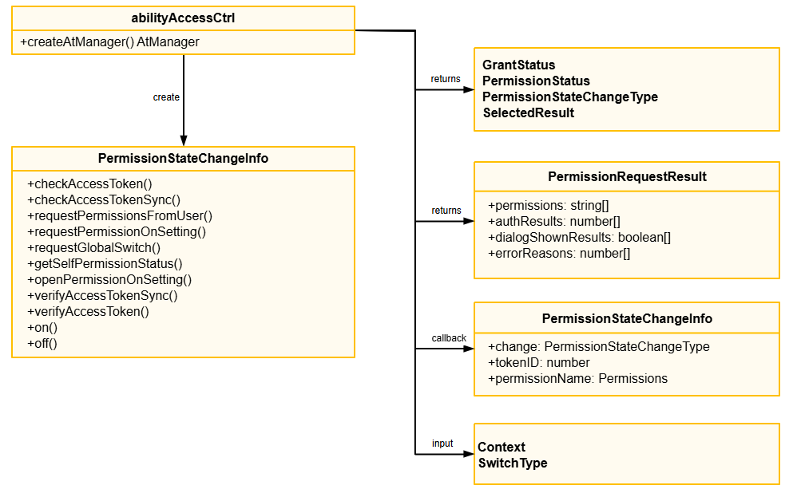

# @ohos.abilityAccessCtrl(Application Access Control)

Program access control provides permission verification and management capabilities for apps, supporting permission
 status checks before accessing protected resources, runtime authorization requests, settings page authorization
 guidance, and permission status change monitoring. Permissions are divided into three categories: system_grant
 (automatically granted by the system), user_grant (requires manual user authorization), and
 manual_settings (manual setting authorization). Apps must declare the required permissions in the configuration file.
 For details about the permission management mechanism, see
 [Application Permission Management Overview](../../../security/AccessToken/app-permission-mgmt-overview.md).

This module is mainly used in the following scenarios:

- Before executing a service, verify whether the current app has the permissions required to access protected
 resources.
 - When a permission is not granted, bring up the runtime permission dialog box or the permission settings page to
 request user authorization.
 - Subscribe to permission status change events of the current app, and adjust the service process in a timely manner
 after the permission status changes.

## Core Enum Types

- **[GrantStatus](arkts-ability-abilityaccessctrl-grantstatus-e.md):** Enum for permission authorization status, used to indicate  
 the authorization status of the current permission.  
 - **[SwitchType](arkts-ability-abilityaccessctrl-switchtype-e.md):** Enum for global switch types, used to indicate the type of  
 system global switch to request.  
 - **[PermissionStateChangeType](arkts-ability-abilityaccessctrl-permissionstatechangetype-e.md):** Enum for permission state  
 change types, used to indicate changes such as authorization and deauthorization.  
 - **[PermissionStatus](arkts-ability-abilityaccessctrl-permissionstatus-e.md):** Enum for permission status, used to indicate the  
 current permission status.  
 - **[SelectedResult](arkts-ability-abilityaccessctrl-selectedresult-e.md):** Enum for the selection result on the settings page  
 authorization, used to indicate the user's selection result in the permission settings dialog box.

## Core Interface Types

- **[PermissionStateChangeInfo](arkts-ability-abilityaccessctrl-permissionstatechangeinfo-i.md):** Permission state change event  
 object, used to return the change type, app identity, and permission name.  
 - **[PermissionRequestResult](arkts-ability-permissionrequestresult-t.md):** Permission request result object, used to return the  
 list of requested permission names, authorization results, and dialog box display results.  
 - **[Context](arkts-ability-context-t.md):** Context object, used to initiate a permission request or open the permission  
 settings dialog box.

## Core Class

- **[AtManager](arkts-ability-abilityaccessctrl-atmanager-i.md):** Program access control management class, providing  
 capabilities such as permission verification, permission dialog box request, settings page authorization guidance,and permission status monitoring.



## Modules to Import

```TypeScript
import { abilityAccessCtrl, Context, PermissionRequestResult, Permissions } from '@kit.AbilityKit';
```

## Summary

### Namespaces

| Name | Description |
| --- | --- |
| [abilityAccessCtrl](arkts-ability-abilityaccessctrl-n.md) |  |

### Types

| Name | Description |
| --- | --- |
| [Context](arkts-ability-context-t.md) | Provides the context for the ability or application, which can be used to access application resources. |
| [PermissionRequestResult](arkts-ability-permissionrequestresult-t.md) | Permission request result object, containing information such as the list of requested permission names, the authorization result of each permission, the dialog box display result, and the failure reason. |
