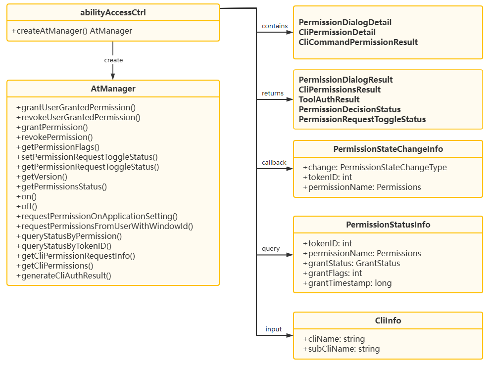

# @ohos.privacyManager(Privacy Management)

**Since:** 9

**System capability:** SystemCapability.Security.AccessToken

## Core Enum Types

- **[PermissionUsageFlag](arkts-ability-privacymanager-permissionusageflag-e-sys.md):** Enum for querying permission usage records,  
 used to specify querying summary data or detailed data.  
 - **[PermissionActiveStatus](arkts-ability-privacymanager-permissionactivestatus-e-sys.md):** Enum for permission usage status change  
 types, used to indicate unused, foreground use, or background use status.  
 - **[PermissionUsedType](arkts-ability-privacymanager-permissionusedtype-e-sys.md):** Enum for sensitive permission usage types, used  
 to indicate the use of sensitive permissions through normal authorization, Picker, or security components.

## Core Interface Types

- **[PermissionUsedRequest](arkts-ability-privacymanager-permissionusedrequest-i-sys.md):** Permission usage record query request  
 object, used to specify the query application, permission, time range, and query method.  
 - **[PermissionUsedResponse](arkts-ability-privacymanager-permissionusedresponse-i-sys.md):** Permission usage record query response  
 object, used to return the query time range and a collection of application-level records.  
 - **[BundleUsedRecord](arkts-ability-privacymanager-bundleusedrecord-i-sys.md):** Application or device-level permission usage record  
 object, used to return the permission access records of a specific application or remote device.  
 - **[PermissionUsedRecord](arkts-ability-privacymanager-permissionusedrecord-i-sys.md):** Access record object for a single  
 permission, used to return the number of accesses, number of denials, last access time, and detailed records.  
 - **[UsedRecordDetail](arkts-ability-privacymanager-usedrecorddetail-i-sys.md):** Single access record detail object, used to return  
 information such as access status, timestamp, access duration, and usage type.  
 - **[ActiveChangeResponse](arkts-ability-privacymanager-activechangeresponse-i-sys.md):** Permission usage status change event  
 object, to return details of permission active status changes.  
 - **[PermissionUsedTypeInfo](arkts-ability-privacymanager-permissionusedtypeinfo-i-sys.md):** Permission usage type information  
 object, used to return the usage type when an application accesses a sensitive permission.  
 - **[AddPermissionUsedRecordOptions](arkts-ability-privacymanager-addpermissionusedrecordoptions-i-sys.md):** Optional parameter  
 object for adding a permission usage record, used to specify the sensitive permission usage type and extension identity.  
 - **[PermissionUsingOptions](arkts-ability-privacymanager-permissionusingoptions-i-sys.md):** Optional parameter object for  
 permission usage, used to specify the extension identity.

## Core Function Types

- **[addPermissionUsedRecord](arkts-ability-privacymanager-addpermissionusedrecord-f-sys.md):** Adds a permission usage record.  
 - **[getPermissionUsedRecord](arkts-ability-privacymanager-getpermissionusedrecord-f-sys.md):** Queries permission usage records.  
 - **[setPermissionUsedRecordToggleStatus](arkts-ability-privacymanager-setpermissionusedrecordtogglestatus-f-sys.md):** Sets the  
 permission usage record toggle status.  
 - **[getPermissionUsedRecordToggleStatus](arkts-ability-privacymanager-getpermissionusedrecordtogglestatus-f-sys.md):** Queries the  
 permission usage record toggle status.  
 - **[startUsingPermission](arkts-ability-privacymanager-startusingpermission-f-sys.md):** Marks the start of using a sensitive  
 permission.  
 - **[stopUsingPermission](arkts-ability-privacymanager-stopusingpermission-f-sys.md):** Marks the stop of using a sensitive  
 permission.  
 - **[checkPermissionInUse](arkts-ability-privacymanager-checkpermissioninuse-f-sys.md):** Checks whether a specified permission is  
 currently being used.  
 - **[on](arkts-ability-privacymanager-on-f-sys.md):** Subscribes to permission usage status change events.  
 - **[off](arkts-ability-privacymanager-off-f-sys.md):** Unsubscribes from permission usage status change events.  
 - **[getPermissionUsedTypeInfos](arkts-ability-privacymanager-getpermissionusedtypeinfos-f-sys.md):** Queries sensitive permission  
 access type information.

## Core Class

- **privacyManager:** Provides the core class for privacy management.



## Modules to Import

```TypeScript
import { privacyManager } from '@kit.AbilityKit';
```

## Summary

<!--Del-->
### Functions(System API)

| Name | Description |
| --- | --- |
| [addPermissionUsedRecord](arkts-ability-privacymanager-addpermissionusedrecord-f-sys.md) | When an application protected by a permission is called by another service or application, this API can be used to add a permission usage record. It is recommended to call this API after accessing a sensitive permission, so that the system records the corresponding sensitive permission access event. This API uses a promise to return the result. |
| [addPermissionUsedRecord](arkts-ability-privacymanager-addpermissionusedrecord-f-sys.md) | When an application protected by a permission is called by another service or application, this API can be used to add a permission usage record. It is recommended to call this API after accessing a sensitive permission, so that the system records the corresponding sensitive permission access event. This API uses an asynchronous callback to return the result. |
| [checkPermissionInUse](arkts-ability-privacymanager-checkpermissioninuse-f-sys.md) | Queries whether a specified sensitive permission is currently being used. It can be used in scenarios such as displaying the real-time permission usage status on the permission management interface. The judgment is based on whether there is currently an active call that has been marked as started by [startUsingPermission](arkts-ability-privacymanager-startusingpermission-f-sys.md) and has not yet been marked as stopped by [stopUsingPermission](arkts-ability-privacymanager-stopusingpermission-f-sys.md). |
| [getPermissionUsedRecord](arkts-ability-privacymanager-getpermissionusedrecord-f-sys.md) | Obtains historical permission usage records, which can be used in permission auditing or security monitoring scenarios, such as checking an application's usage of sensitive permissions within a specified time period. This API uses a promise to return the result. |
| [getPermissionUsedRecord](arkts-ability-privacymanager-getpermissionusedrecord-f-sys.md) | Obtains historical permission usage records, which can be used in permission auditing or security monitoring scenarios, such as checking an application's usage of sensitive permissions within a specified time period. This API uses an asynchronous callback to return the result. |
| [getPermissionUsedRecordToggleStatus](arkts-ability-privacymanager-getpermissionusedrecordtogglestatus-f-sys.md) | A system application can call this API to obtain the current user's permission usage record toggle status, for example, to display the current toggle setting status on the permission management interface. This API uses a promise to return the result. |
| [getPermissionUsedRecordToggleStatus](arkts-ability-privacymanager-getpermissionusedrecordtogglestatus-f-sys.md) | A system application can call this API to obtain the permission usage record toggle status for a specified sub-profile, for example, to display the current toggle setting status on the permission management interface. This API uses a promise to return the result. |
| [getPermissionUsedTypeInfos](arkts-ability-privacymanager-getpermissionusedtypeinfos-f-sys.md) | Obtains information about how a sensitive permission is used by an application. |
| [off](arkts-ability-privacymanager-off-f-sys.md#offactivestatechange) | Unsubscribes from permission usage status change events for a specified permission list. After a successful unsubscription, status change notifications for the specified permission list will no longer be received. |
| [on](arkts-ability-privacymanager-on-f-sys.md#onactivestatechange) | Subscribes to permission usage status change events for a specified permission list. Permission usage status changes are triggered by calls to [startUsingPermission](arkts-ability-privacymanager-startusingpermission-f-sys.md) and [stopUsingPermission](arkts-ability-privacymanager-stopusingpermission-f-sys.md). After a successful subscription, when the permission usage status changes, the callback function is triggered, returning an [ActiveChangeResponse](arkts-ability-privacymanager-activechangeresponse-i-sys.md) object containing details of the permission usage status change. This API uses an asynchronous callback to return the result. |
| [setPermissionUsedRecordToggleStatus](arkts-ability-privacymanager-setpermissionusedrecordtogglestatus-f-sys.md) | Sets whether to record the permission usage of this user. Sets the permission usage record switch for this user. This API uses a promise to return the result. |
| [setPermissionUsedRecordToggleStatus](arkts-ability-privacymanager-setpermissionusedrecordtogglestatus-f-sys.md) | Sets whether permission usage records are collected for a specified sub-profile. A system application can call this API to set the permission usage record switch status for the specified sub-profile. This API uses a promise to return the result. |
| [startUsingPermission](arkts-ability-privacymanager-startusingpermission-f-sys.md) | A system application can call this API to report the application's permission usage status in the foreground or background to the system. The privacy service notifies all subscribers of this permission usage status change event (refer to [on](arkts-ability-privacymanager-on-f-sys.md) for the subscription method). This API uses a promise to return the result. |
| [startUsingPermission](arkts-ability-privacymanager-startusingpermission-f-sys.md) | A system application can call this API to report the application's permission usage status in the foreground or background to the system. The privacy service notifies all subscribers of this permission usage status change event (refer to [on](arkts-ability-privacymanager-on-f-sys.md) for the subscription method). This API uses a promise to return the result. |
| [startUsingPermission](arkts-ability-privacymanager-startusingpermission-f-sys.md) | A system application can call this API to report the application's permission usage status in the foreground or background to the system. The privacy service notifies all subscribers of this permission usage status change event (refer to [on](arkts-ability-privacymanager-on-f-sys.md) for the subscription method). This API uses a promise to return the result. |
| [startUsingPermission](arkts-ability-privacymanager-startusingpermission-f-sys.md) | A system application can call this API to report the application's permission usage status in the foreground or background to the system. The privacy service notifies all subscribers of this permission usage status change event (refer to [on](arkts-ability-privacymanager-on-f-sys.md) for the subscription method). This API uses an asynchronous callback to return the result. |
| [stopUsingPermission](arkts-ability-privacymanager-stopusingpermission-f-sys.md) | A system application calls this API to mark that the specified permission is no longer in use. After a successful call, the privacy service notifies all subscribers of this permission usage status change event of this status change. It is suitable for notifying the system that permission usage has ended when an application completes a sensitive operation or exits the foreground. This API uses a promise to return the result. |
| [stopUsingPermission](arkts-ability-privacymanager-stopusingpermission-f-sys.md) | A system application calls this API to mark that the specified permission is no longer in use. After a successful call, the privacy service notifies all subscribers of this permission usage status change event of this status change. It is suitable for notifying the system that permission usage has ended when an application completes a sensitive operation or exits the foreground. This API uses an asynchronous callback to return the result. |
| [stopUsingPermission](arkts-ability-privacymanager-stopusingpermission-f-sys.md) | A system application calls this API to mark that the specified permission is no longer in use. After a successful call, the privacy service notifies all subscribers of this permission usage status change event of this status change. It is suitable for notifying the system that permission usage has ended when an application completes a sensitive operation or exits the foreground. This API uses a promise to return the result. |
| [stopUsingPermission](arkts-ability-privacymanager-stopusingpermission-f-sys.md) | A system application calls this API to mark that the specified permission is no longer in use. After a successful call, the privacy service notifies all subscribers of this permission usage status change event of this status change. It is suitable for notifying the system that permission usage has ended when an application completes a sensitive operation or exits the foreground. This API uses a promise to return the result. |
<!--DelEnd-->

<!--Del-->
### Interfaces(System API)

| Name | Description |
| --- | --- |
| [ActiveChangeResponse](arkts-ability-privacymanager-activechangeresponse-i-sys.md) | Defines the detailed permission usage information. |
| [AddPermissionUsedRecordOptions](arkts-ability-privacymanager-addpermissionusedrecordoptions-i-sys.md) | Represents the options for adding a permission usage record. |
| [BundleUsedRecord](arkts-ability-privacymanager-bundleusedrecord-i-sys.md) | Represents the access records of an application or device. |
| [PermissionUsedRecord](arkts-ability-privacymanager-permissionusedrecord-i-sys.md) | Represents the access records of a permission. |
| [PermissionUsedRequest](arkts-ability-privacymanager-permissionusedrequest-i-sys.md) | Represents the request for querying permission usage records. |
| [PermissionUsedResponse](arkts-ability-privacymanager-permissionusedresponse-i-sys.md) | Represents the access records of all applications or devices. |
| [PermissionUsedTypeInfo](arkts-ability-privacymanager-permissionusedtypeinfo-i-sys.md) | Represents detailed information about the use of a permission. |
| [PermissionUsingOptions](arkts-ability-privacymanager-permissionusingoptions-i-sys.md) | Represents the optional parameter set for using a permission. |
| [UsedRecordDetail](arkts-ability-privacymanager-usedrecorddetail-i-sys.md) | Represents the details of a single access record. |
<!--DelEnd-->

<!--Del-->
### Enums(System API)

| Name | Description |
| --- | --- |
| [PermissionActiveStatus](arkts-ability-privacymanager-permissionactivestatus-e-sys.md) | Enumerates the types of permission usage status changes. It is used to describe the change type of permission usage status, returned in the callback of subscribing to permission usage status change events (via [on('activeStateChange')](arkts-ability-privacymanager-on-f-sys.md)), helping system applications sense the status switch of a permission from unused to foreground use and background use. |
| [PermissionUsageFlag](arkts-ability-privacymanager-permissionusageflag-e-sys.md) | Enumerates the modes for querying the permission usage records. |
| [PermissionUsedType](arkts-ability-privacymanager-permissionusedtype-e-sys.md) | Enumerates the means for using a sensitive permission. |
<!--DelEnd-->
